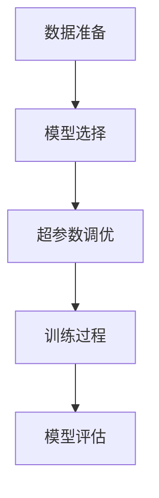

# 大语言模型应用指南：高效微调总结

## 1.背景介绍

大语言模型（Large Language Models, LLMs）近年来在自然语言处理（NLP）领域取得了显著的进展。诸如GPT-3、BERT等模型在各种任务中表现出色，从文本生成到情感分析，再到机器翻译。然而，这些模型的训练通常需要大量的数据和计算资源，这使得它们的应用和微调变得复杂且昂贵。本文旨在提供一份详尽的指南，帮助读者理解如何高效地微调大语言模型，以便在特定任务中获得最佳性能。

## 2.核心概念与联系

### 2.1 大语言模型简介

大语言模型是基于深度学习的模型，通常采用Transformer架构。它们通过大量的文本数据进行预训练，学习语言的统计特性和语义关系。预训练后的模型可以通过微调（Fine-tuning）适应特定任务。

### 2.2 微调的必要性

尽管预训练模型已经具备了强大的语言理解能力，但在特定任务中，直接使用预训练模型可能无法达到最佳效果。微调通过在特定任务的数据集上进一步训练模型，使其更好地适应该任务的需求。

### 2.3 微调的挑战

微调大语言模型面临的主要挑战包括计算资源的需求、过拟合风险、数据集的选择和处理等。理解这些挑战有助于制定有效的微调策略。

## 3.核心算法原理具体操作步骤

### 3.1 数据准备

数据准备是微调的第一步。需要确保数据集的质量和多样性，以便模型能够学习到任务相关的特征。

### 3.2 模型选择

选择合适的预训练模型是微调的关键。不同的预训练模型在不同任务中的表现可能有所不同，因此需要根据任务需求进行选择。

### 3.3 超参数调优

超参数调优是微调过程中不可或缺的一部分。常见的超参数包括学习率、批量大小、训练轮数等。合理的超参数设置可以显著提升模型性能。

### 3.4 训练过程

训练过程包括前向传播、损失计算、反向传播和参数更新。需要注意的是，微调过程中应采用适当的正则化方法，以防止过拟合。

### 3.5 模型评估

模型评估是微调的最后一步。通过在验证集上评估模型性能，可以判断微调的效果，并进行必要的调整。



## 4.数学模型和公式详细讲解举例说明

### 4.1 预训练模型的数学基础

预训练模型通常基于Transformer架构，其核心是自注意力机制。自注意力机制通过计算输入序列中每个位置的注意力权重，捕捉序列中的长距离依赖关系。

$$
Attention(Q, K, V) = \text{softmax}\left(\frac{QK^T}{\sqrt{d_k}}\right)V
$$

其中，$Q$、$K$、$V$分别表示查询、键和值矩阵，$d_k$是键的维度。

### 4.2 微调的损失函数

微调过程中常用的损失函数包括交叉熵损失、均方误差等。以分类任务为例，交叉熵损失函数定义如下：

$$
L = -\sum_{i=1}^{N} y_i \log(\hat{y}_i)
$$

其中，$y_i$是实际标签，$\hat{y}_i$是模型预测的概率。

### 4.3 优化算法

微调过程中常用的优化算法包括随机梯度下降（SGD）、Adam等。Adam优化算法的更新规则如下：

$$
m_t = \beta_1 m_{t-1} + (1 - \beta_1) g_t
$$

$$
v_t = \beta_2 v_{t-1} + (1 - \beta_2) g_t^2
$$

$$
\hat{m}_t = \frac{m_t}{1 - \beta_1^t}
$$

$$
\hat{v}_t = \frac{v_t}{1 - \beta_2^t}
$$

$$
\theta_{t+1} = \theta_t - \alpha \frac{\hat{m}_t}{\sqrt{\hat{v}_t} + \epsilon}
$$

其中，$g_t$是梯度，$\beta_1$和$\beta_2$是动量参数，$\alpha$是学习率，$\epsilon$是一个小常数。

## 5.项目实践：代码实例和详细解释说明

### 5.1 环境配置

首先，需要配置好开发环境。推荐使用Python和PyTorch框架。

```bash
pip install torch transformers
```

### 5.2 数据集加载

以情感分析任务为例，加载IMDB数据集：

```python
from datasets import load_dataset

dataset = load_dataset('imdb')
train_dataset = dataset['train']
test_dataset = dataset['test']
```

### 5.3 模型加载

加载预训练的BERT模型：

```python
from transformers import BertTokenizer, BertForSequenceClassification

tokenizer = BertTokenizer.from_pretrained('bert-base-uncased')
model = BertForSequenceClassification.from_pretrained('bert-base-uncased')
```

### 5.4 数据预处理

对数据进行预处理：

```python
def preprocess(data):
    return tokenizer(data['text'], padding=True, truncation=True)

train_dataset = train_dataset.map(preprocess, batched=True)
test_dataset = test_dataset.map(preprocess, batched=True)
```

### 5.5 训练模型

定义训练参数并进行训练：

```python
from transformers import Trainer, TrainingArguments

training_args = TrainingArguments(
    output_dir='./results',
    num_train_epochs=3,
    per_device_train_batch_size=8,
    per_device_eval_batch_size=8,
    warmup_steps=500,
    weight_decay=0.01,
    logging_dir='./logs',
)

trainer = Trainer(
    model=model,
    args=training_args,
    train_dataset=train_dataset,
    eval_dataset=test_dataset,
)

trainer.train()
```

### 5.6 模型评估

在测试集上评估模型性能：

```python
results = trainer.evaluate()
print(results)
```

## 6.实际应用场景

### 6.1 文本生成

大语言模型在文本生成任务中表现出色，可以用于自动写作、对话系统等应用。

### 6.2 情感分析

通过微调，大语言模型可以用于情感分析，帮助企业了解用户情感，改进产品和服务。

### 6.3 机器翻译

大语言模型在机器翻译任务中也有广泛应用，可以实现高质量的多语言翻译。

### 6.4 信息检索

大语言模型可以用于信息检索，提升搜索引擎的准确性和相关性。

## 7.工具和资源推荐

### 7.1 开发工具

- **PyTorch**：一个开源的深度学习框架，适用于大语言模型的训练和微调。
- **Transformers**：Hugging Face提供的库，包含了多种预训练模型和工具。

### 7.2 数据集

- **IMDB**：一个常用的情感分析数据集。
- **SQuAD**：一个用于问答系统的数据集。
- **GLUE**：一个用于评估NLP模型的基准数据集。

### 7.3 在线资源

- **Hugging Face Model Hub**：提供了多种预训练模型和数据集。
- **Kaggle**：一个数据科学竞赛平台，提供了丰富的数据集和代码示例。

## 8.总结：未来发展趋势与挑战

### 8.1 未来发展趋势

大语言模型的发展趋势包括模型规模的进一步扩大、多模态模型的研究、以及在更多实际应用中的落地。随着计算资源的增加和算法的改进，大语言模型的性能将不断提升。

### 8.2 面临的挑战

尽管大语言模型在许多任务中表现出色，但仍面临一些挑战，包括计算资源的需求、数据隐私问题、模型的可解释性等。解决这些挑战将是未来研究的重要方向。

## 9.附录：常见问题与解答

### 9.1 微调过程中如何防止过拟合？

可以采用正则化方法，如L2正则化、Dropout等。此外，适当的超参数调优和早停（Early Stopping）也有助于防止过拟合。

### 9.2 如何选择合适的预训练模型？

选择预训练模型时，应考虑任务的具体需求和模型的性能表现。可以参考相关的研究论文和基准测试结果。

### 9.3 微调过程中常见的错误有哪些？

常见的错误包括数据预处理不当、超参数设置不合理、训练过程中的过拟合等。需要仔细检查每个步骤，确保操作的正确性。

### 9.4 如何评估微调效果？

可以通过在验证集和测试集上评估模型的性能，使用准确率、F1分数等指标进行评估。

### 9.5 微调后的模型如何部署？

微调后的模型可以通过API、微服务等方式进行部署，方便在实际应用中调用。

---

作者：禅与计算机程序设计艺术 / Zen and the Art of Computer Programming