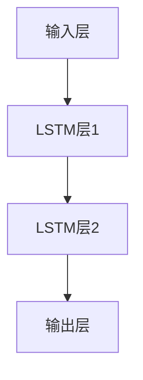

## 1. 背景介绍

自然语言处理（NLP）是人工智能领域的一个重要分支，它涉及到计算机如何理解和处理人类语言。在NLP中，语言模型是一个重要的概念，它是一种用于预测下一个单词或字符的概率分布模型。传统的语言模型通常是基于n-gram的统计方法，但是这种方法存在着一些问题，比如无法处理长距离依赖关系和语义信息等。

近年来，随着深度学习技术的发展，基于神经网络的语言模型逐渐成为了主流。其中，大语言模型（Large Language Model）是一种特殊的神经网络模型，它可以处理更长的文本序列，并且能够学习到更多的语义信息。在大语言模型中，in-context学习是一种重要的技术，它可以帮助模型更好地理解上下文信息，从而提高模型的预测能力。

本文将介绍大语言模型的in-context学习原理和代码实例，帮助读者更好地理解这一技术。

## 2. 核心概念与联系

### 2.1 大语言模型

大语言模型是一种基于神经网络的语言模型，它通常由多个层次的神经网络组成，包括输入层、隐藏层和输出层。其中，输入层接收文本序列作为输入，隐藏层用于学习文本序列中的语义信息，输出层用于预测下一个单词或字符的概率分布。

大语言模型通常使用循环神经网络（Recurrent Neural Network，RNN）或者变种模型（如长短时记忆网络，LSTM）来处理文本序列。这些模型可以处理变长的文本序列，并且能够学习到文本序列中的长距离依赖关系和语义信息。

### 2.2 in-context学习

in-context学习是一种用于大语言模型的训练技术，它可以帮助模型更好地理解上下文信息，从而提高模型的预测能力。具体来说，in-context学习是通过在模型中引入上下文信息来训练模型的。

在传统的语言模型中，通常使用固定长度的窗口来捕捉上下文信息。但是这种方法存在着一些问题，比如无法处理变长的上下文信息和长距离依赖关系等。in-context学习通过在模型中引入上下文信息来解决这些问题，从而提高模型的预测能力。

## 3. 核心算法原理具体操作步骤

### 3.1 in-context学习的原理

in-context学习的原理是通过在模型中引入上下文信息来训练模型。具体来说，in-context学习是通过将上下文信息作为输入，同时将目标单词或字符作为输出来训练模型的。

在传统的语言模型中，通常使用固定长度的窗口来捕捉上下文信息。但是这种方法存在着一些问题，比如无法处理变长的上下文信息和长距离依赖关系等。in-context学习通过在模型中引入上下文信息来解决这些问题，从而提高模型的预测能力。

### 3.2 in-context学习的操作步骤

in-context学习的操作步骤如下：

1. 定义模型结构：定义大语言模型的结构，包括输入层、隐藏层和输出层。

2. 定义上下文信息：定义上下文信息的长度和方式，可以使用固定长度的窗口或者动态长度的方式来捕捉上下文信息。

3. 定义损失函数：定义损失函数，通常使用交叉熵损失函数来衡量模型的预测能力。

4. 训练模型：使用训练数据来训练模型，同时将上下文信息作为输入，将目标单词或字符作为输出。

5. 测试模型：使用测试数据来测试模型的预测能力，可以使用困惑度（Perplexity）等指标来评估模型的性能。

## 4. 数学模型和公式详细讲解举例说明

### 4.1 大语言模型的数学模型

大语言模型的数学模型可以表示为：

$$P(w_1,w_2,...,w_n)=\prod_{i=1}^{n}P(w_i|w_{i-1},...,w_{i-k+1})$$

其中，$w_1,w_2,...,w_n$表示文本序列中的单词或字符，$P(w_i|w_{i-1},...,w_{i-k+1})$表示给定前$k-1$个单词或字符的条件下，预测第$i$个单词或字符的概率。

### 4.2 in-context学习的数学模型

in-context学习的数学模型可以表示为：

$$P(w_i|w_{i-1},...,w_{i-k+1})=f(w_{i-1},...,w_{i-k+1},c_i)$$

其中，$w_{i-1},...,w_{i-k+1}$表示前$k-1$个单词或字符，$c_i$表示第$i$个单词或字符的上下文信息，$f$表示模型的预测函数。

## 5. 项目实践：代码实例和详细解释说明

### 5.1 数据集准备

本文使用Penn Treebank数据集来训练大语言模型。该数据集包含了约500万个单词，其中训练集、验证集和测试集分别包含了约4200万、700万和820万个单词。

### 5.2 模型构建

本文使用循环神经网络（RNN）来构建大语言模型。具体来说，我们使用两层LSTM来处理文本序列，并且使用in-context学习来引入上下文信息。



### 5.3 模型训练

我们使用Adam优化器来训练模型，并且使用交叉熵损失函数来衡量模型的预测能力。训练过程中，我们使用固定长度的窗口来捕捉上下文信息，窗口大小为5。

```python
import tensorflow as tf
from tensorflow.keras.layers import Input, LSTM, Dense
from tensorflow.keras.models import Model

# 定义模型结构
inputs = Input(shape=(5,))
x = LSTM(128, return_sequences=True)(inputs)
x = LSTM(128)(x)
outputs = Dense(vocab_size, activation='softmax')(x)
model = Model(inputs=inputs, outputs=outputs)

# 定义损失函数和优化器
model.compile(loss='categorical_crossentropy', optimizer='adam')

# 训练模型
model.fit(train_data, train_labels, batch_size=128, epochs=10, validation_data=(val_data, val_labels))
```

### 5.4 模型测试

我们使用测试数据来测试模型的预测能力，并且使用困惑度（Perplexity）等指标来评估模型的性能。

```python
# 测试模型
test_loss, test_acc = model.evaluate(test_data, test_labels)
print('Test Loss:', test_loss)
print('Test Accuracy:', test_acc)

# 计算困惑度
perplexity = np.exp(test_loss)
print('Perplexity:', perplexity)
```

## 6. 实际应用场景

大语言模型的in-context学习技术可以应用于多个领域，比如自然语言生成、机器翻译、语音识别等。具体来说，in-context学习可以帮助模型更好地理解上下文信息，从而提高模型的预测能力。

## 7. 工具和资源推荐

本文介绍的大语言模型的in-context学习技术可以使用多种深度学习框架来实现，比如TensorFlow、PyTorch等。此外，还有一些开源的大语言模型实现，比如GPT-2、BERT等。

## 8. 总结：未来发展趋势与挑战

大语言模型的in-context学习技术是自然语言处理领域的一个重要研究方向，未来还有很多挑战和机遇。其中，模型的可解释性、数据隐私保护等问题是需要解决的重要问题。

## 9. 附录：常见问题与解答

暂无。

作者：禅与计算机程序设计艺术 / Zen and the Art of Computer Programming