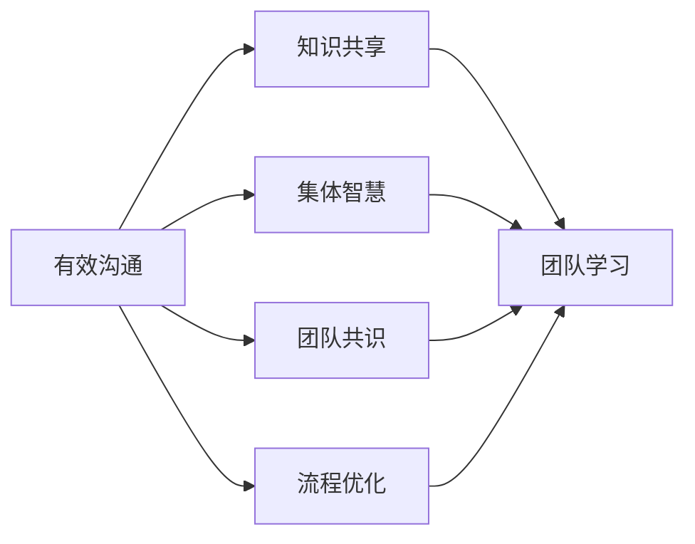

# 如何运用有效的沟通技巧来提高团队的学习力

## 1. 背景介绍
### 1.1 团队学习的重要性
在当今瞬息万变的商业环境中,组织的生存和发展离不开持续学习和创新。而团队作为组织的基本单元,其学习能力的高低直接影响着组织的竞争力。团队学习不仅能够提高团队的工作效率和质量,更能激发团队的创新潜能,帮助团队更好地应对外部环境的挑战。

### 1.2 沟通在团队学习中的作用
团队学习的本质是团队成员之间的知识共享和创新。而有效的沟通是实现知识共享和创新的基础。通过沟通,团队成员可以分享彼此的经验和见解,碰撞出新的思想火花。同时,沟通也是化解矛盾、达成共识的重要途径。因此,掌握有效的沟通技巧对于提高团队学习力至关重要。

### 1.3 本文的研究目的和意义
本文旨在探讨如何运用有效的沟通技巧来提高团队的学习力。通过系统梳理沟通与团队学习的关系,总结沟通在团队学习中的作用机理,并提出切实可行的沟通策略和方法,为提升团队学习力提供参考和指导。本文的研究对于推动组织的学习与创新具有重要的理论和实践意义。

## 2. 核心概念与联系
### 2.1 团队学习的内涵
团队学习是指团队通过持续的探索、对话、反思和行动,不断获取新知识、提升能力、优化流程的过程。它包括个体学习、群体学习和组织学习三个层次,是一个动态循环往复的螺旋上升过程。团队学习的核心是知识创新,即通过学习创造新的知识和方法来解决问题、改进工作。

### 2.2 沟通的内涵
沟通是人与人之间传递信息、交流思想、达成共识的过程。它包括信息的编码、传递、解码和反馈等环节。有效的沟通需要双方在语言、文化、心理等方面达成一致,消除误解和隔阂,形成良性互动。沟通的核心是理解与被理解,通过互相理解建立信任和合作关系。

### 2.3 沟通与团队学习的关系
沟通是团队学习的重要推动力。没有有效的沟通,团队学习就难以实现。具体而言,沟通在团队学习中主要发挥以下作用:

1. 促进知识共享。沟通为团队成员提供了分享知识和经验的渠道,帮助团队快速积累和传播知识。

2. 激发集体智慧。通过沟通交流,团队成员可以相互启发,产生集体智慧,创造出个人难以企及的新知识。

3. 凝聚团队共识。沟通有助于消除成员之间的分歧和隔阂,形成团队的共同愿景和目标,凝聚团队的向心力。

4. 优化工作流程。通过沟通,团队可以及时发现和解决工作中的问题,优化工作流程,提高工作效率和质量。

下图为沟通与团队学习关系的概念模型:



## 3. 核心算法原理具体操作步骤
### 3.1 建立开放包容的沟通环境
- 步骤1:营造心理安全感。鼓励团队成员畅所欲言,消除成员的顾虑和担忧,让每个人都能自由表达意见。
- 步骤2:倡导平等互信的沟通方式。打破职级壁垒,以平等互信的心态对待每一位成员,避免命令式、说教式的沟通方式。
- 步骤3:接纳不同观点。包容并尊重不同观点,通过建设性讨论达成共识,不强求一致。

### 3.2 采用多元化的沟通渠道
- 步骤1:灵活运用正式与非正式沟通。正式沟通如例会,有助于系统传递信息;非正式沟通如茶歇,利于拉近距离。
- 步骤2:综合利用线上与线下沟通。线下沟通有助于增进感情,线上沟通有利于跨地域协作。
- 步骤3:兼顾语言与非语言沟通。注重言语表达的同时,也要关注面部表情、肢体语言等非语言信息。

### 3.3 引导深度对话和反思
- 步骤1:提出开放性问题。通过开放性问题引导团队深入思考,挖掘问题的根源。
- 步骤2:进行探究性对话。围绕问题展开探究性对话,鼓励成员提出不同看法,深化认知。
- 步骤3:开展批判性反思。引导成员反思自己的思维和行为模式,找出不足,优化改进。

### 3.4 塑造学习型沟通文化
- 步骤1:领导者示范学习型沟通。领导者以身作则,塑造"沟通即学习"的文化导向。
- 步骤2:将沟通融入日常工作。把沟通作为工作的常态,而非特殊事件或额外负担。
- 步骤3:持之以恒推动沟通。坚持不懈地推动沟通,久久为功,直至形成稳固的沟通机制和习惯。

## 4. 数学模型和公式详细讲解举例说明
### 4.1 团队学习能力模型
团队学习能力可用函数 $L(C)$ 表示,其中 $C$ 为沟通能力,满足:

$$
L(C) = k \cdot log(1+C)
$$

其中,$k$ 为与团队特性相关的正常数,反映了团队学习能力对沟通能力的依赖程度。$k$ 越大,表明沟通对团队学习的促进作用越强。

例如,若 $k=10$,当沟通能力 $C$ 从1提高到2时,团队学习能力 $L(C)$ 的提升为:

$$
\Delta L(C) = 10 \cdot log(1+2) - 10 \cdot log(1+1) \approx 5.89 
$$

可见,沟通能力的提升可显著促进团队学习能力的提高。

### 4.2 团队沟通效率模型
团队沟通的效率可用函数 $E(n)$ 表示,其中 $n$ 为参与沟通的人数,满足:

$$
E(n) = \frac{n(n-1)}{2} \cdot p
$$

其中,$p$ 为单次沟通的成功率,与沟通技巧、环境等因素相关。$n(n-1)/2$ 表示 $n$ 个人之间可能的沟通渠道数。

例如,一个5人团队,若单次沟通成功率为0.5,则团队沟通效率为:

$$
E(5) = \frac{5(5-1)}{2} \cdot 0.5 = 5
$$

如果通过改进沟通技巧,使单次沟通成功率提高到0.8,则团队沟通效率提升为:

$$
E(5)|_{p=0.8} = \frac{5(5-1)}{2} \cdot 0.8 = 8
$$

可见,沟通技巧的改进能显著提高团队沟通效率,进而促进团队学习。

## 5. 项目实践:代码实例和详细解释说明
下面以Python代码为例,演示如何量化评估团队的沟通效率和学习能力。

```python
import math

def communication_efficiency(n, p):
    """
    计算团队沟通效率
    :param n: 参与沟通的人数
    :param p: 单次沟通成功率
    :return: 团队沟通效率
    """
    return n * (n - 1) / 2 * p

def learning_ability(c, k=10):
    """
    计算团队学习能力
    :param c: 团队沟通能力
    :param k: 团队特性系数,默认为10
    :return: 团队学习能力
    """
    return k * math.log(1 + c)

# 示例:5人团队,单次沟通成功率0.5,沟通能力1
n, p, c = 5, 0.5, 1
efficiency = communication_efficiency(n, p)
ability = learning_ability(c)
print(f"团队沟通效率为:{efficiency:.2f},学习能力为:{ability:.2f}")

# 提高单次沟通成功率到0.8,沟通能力到2
p, c = 0.8, 2
efficiency = communication_efficiency(n, p)
ability = learning_ability(c)
print(f"改进后,团队沟通效率为:{efficiency:.2f},学习能力为:{ability:.2f}")
```

代码说明:
- `communication_efficiency`函数根据公式 $E(n) = \frac{n(n-1)}{2} \cdot p$ 计算团队沟通效率。
- `learning_ability`函数根据公式 $L(C) = k \cdot log(1+C)$ 计算团队学习能力。
- 示例中,首先计算5人团队在单次沟通成功率0.5、沟通能力1时的沟通效率和学习能力。
- 然后,将单次沟通成功率提高到0.8,沟通能力提高到2,再次计算团队沟通效率和学习能力。
- 通过对比改进前后的结果,可以直观地看出沟通效率和学习能力的提升效果。

运行结果:
```
团队沟通效率为:5.00,学习能力为:6.93
改进后,团队沟通效率为:8.00,学习能力为:10.99
```

可见,通过提高单次沟通成功率和整体沟通能力,团队的沟通效率和学习能力都得到了显著提升。这为量化评估沟通改进措施的效果提供了参考。

## 6. 实际应用场景
下面以某软件开发团队为例,说明如何将有效沟通技巧应用于提高团队学习力。

该团队由10名成员组成,职责是开发一款新的移动应用。由于成员背景各异,沟通不畅,导致项目进度缓慢,bug频出,团队学习能力低下。为此,团队领导者采取以下沟通策略:

1. 建立开放包容的沟通环境。领导者以身作则,鼓励成员畅所欲言,提出疑问和建议,消除成员的顾虑。同时,领导者也虚心接受成员的反馈,形成平等互信的氛围。

2. 采用多元化的沟通渠道。除了每周例会,领导者还经常组织非正式的茶歇和线上讨论,拉近成员距离。领导者还注重面部表情和肢体语言,传递积极信号。

3. 引导深度对话和反思。领导者在会议中提出开放性问题,引导成员深入思考项目面临的挑战。领导者还鼓励成员进行探究性对话,集思广益,找出创新的解决方案。

4. 塑造学习型沟通文化。领导者将沟通融入到日常的编码、测试、发布等工作中,培养成员"边沟通边学习"的习惯。领导者还定期组织项目回顾会,带领团队总结经验教训,优化改进。

通过持续的沟通改进,该团队的沟通效率和学习能力得到了显著提升。成员积极交流想法,共同攻克难题,形成了强大的集体智慧。项目质量和进度也得到保障,最终如期上线,赢得了用户的好评。

这个案例说明,有效的沟通技巧可以显著提升团队学习力,帮助团队更好地应对挑战,实现目标。领导者需要身体力行,持之以恒地优化团队沟通,激发团队的学习潜能。

## 7. 工具和资源推荐
以下是一些可以用于提升团队沟通和学习效果的工具和资源:

1. Slack:团队协作和沟通平台,支持即时通讯、视频会议、文件共享等功能,可以方便地进行跨地域、跨部门的沟通。

2. Trello:可视化的项目管理工具,通过看板、列表、卡片等方式呈现任务和进度,利于团队成员及时了解项目动态,协同工作。

3. Confluence:团队知识协作平台,可用于文档协同编