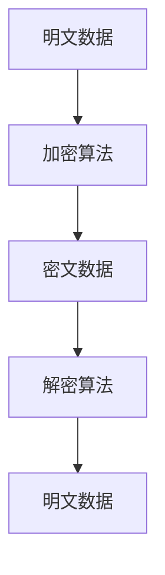
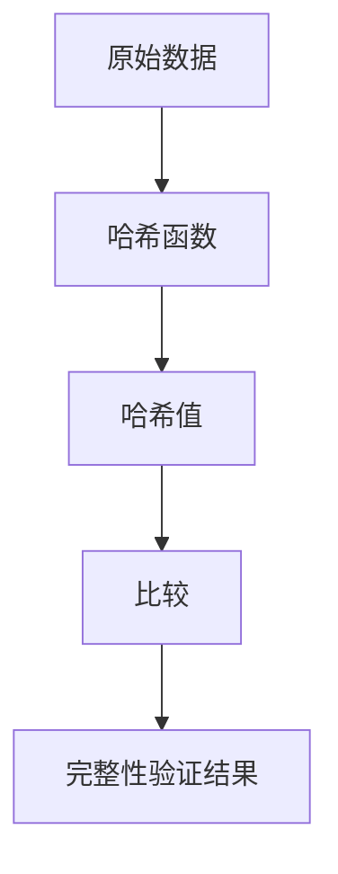
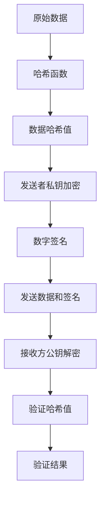
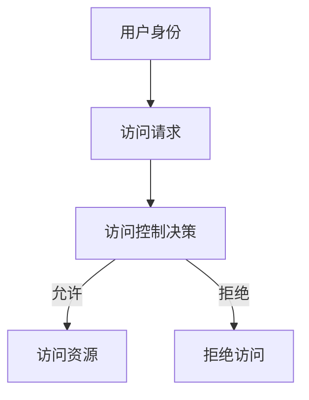

# 《安全性与鲁棒性：保护数据和系统》

## 1. 背景介绍

在当今的数字时代,信息安全和系统的鲁棒性已经成为了一个至关重要的话题。随着网络攻击和数据泄露事件的不断增加,确保数据和系统的安全性已经成为了企业和个人面临的一个巨大挑战。本文将探讨保护数据和系统的关键概念、技术和最佳实践,以帮助读者更好地理解和应对这一挑战。

### 1.1 安全性的重要性

数据安全对于个人、企业和政府机构都至关重要。泄露的敏感数据不仅可能导致财务损失,还可能危及个人隐私和国家安全。此外,系统中断或数据损坏可能会对业务运营产生严重影响。因此,采取适当的安全措施来保护数据和系统是必不可少的。

### 1.2 鲁棒性的重要性

系统的鲁棒性指的是系统在面临各种异常情况(如硬件故障、软件错误、网络攻击等)时仍能保持正常运行的能力。鲁棒性不仅可以提高系统的可靠性和可用性,还可以减少由于系统故障导致的数据损坏或泄露的风险。

### 1.3 挑战与机遇

随着技术的不断发展,新的安全威胁和漏洞也不断出现。保护数据和系统需要持续的努力和投资。然而,同时也出现了许多新的安全技术和解决方案,为构建更加安全和鲁棒的系统提供了机遇。

## 2. 核心概念与联系

### 2.1 信息安全的三大支柱

信息安全通常被认为包括三个核心方面:机密性(Confidentiality)、完整性(Integrity)和可用性(Availability),简称CIA三要素。

1. **机密性(Confidentiality)**:确保只有经过授权的个人或实体才能访问敏感信息。这通常通过加密、访问控制和身份验证等机制来实现。

2. **完整性(Integrity)**:确保数据在传输和存储过程中不被未经授权的修改、删除或篡改。常用的技术包括数字签名、哈希函数和访问控制列表等。

3. **可用性(Availability)**:确保授权用户能够在需要时访问信息和相关资源。这需要采取措施防止服务中断,如备份、冗余和负载均衡等。

这三个方面相互关联且同等重要,缺一不可。只有综合考虑并平衡这三个方面,才能真正实现信息系统的安全性。

### 2.2 鲁棒性与安全性的关系

鲁棒性和安全性虽然不完全等同,但两者之间存在密切的联系。一个鲁棒的系统通常也更加安全,因为它能够更好地抵御各种攻击和异常情况。相反,如果一个系统缺乏鲁棒性,就更容易受到攻击和故障的影响,从而导致安全漏洞和数据泄露。

因此,在设计和构建安全系统时,需要同时考虑鲁棒性和安全性。通过采用适当的架构、编码实践和测试方法,可以提高系统的鲁棒性和安全性。

## 3. 核心算法原理具体操作步骤

### 3.1 加密算法

加密是保护数据机密性的关键技术。它通过使用密钥将明文数据转换为无法直接理解的密文,从而防止未经授权的访问。常用的加密算法包括对称加密算法(如AES、DES)和非对称加密算法(如RSA、ECC)。

**加密流程**:



1. 选择合适的加密算法和密钥长度。
2. 使用密钥对明文数据进行加密,生成密文数据。
3. 传输或存储密文数据。
4. 在接收端使用相同的密钥对密文数据进行解密,获取原始明文数据。

需要注意的是,密钥的安全管理至关重要。密钥泄露会导致加密系统的完全失效。

### 3.2 哈希函数

哈希函数用于生成数据的固定长度的数字指纹或摘要,常用于验证数据的完整性。常见的哈希算法包括MD5、SHA系列等。

**哈希运算流程**:



1. 对原始数据使用哈希函数计算出一个固定长度的哈希值。
2. 将计算出的哈希值与已知的期望哈希值进行比较。
3. 如果两个哈希值相同,则说明数据在传输或存储过程中未被篡改,完整性得到保证;否则数据已被修改。

哈希函数具有单向性和抗冲突性,这使得它们在确保数据完整性方面非常有用。

### 3.3 数字签名

数字签名是一种密码学技术,用于验证数据的完整性和发送者的身份。它通常基于非对称加密算法(如RSA)和哈希函数的组合来实现。

**数字签名流程**:



1. 发送方对原始数据计算哈希值。
2. 使用发送方的私钥对哈希值进行加密,生成数字签名。
3. 将原始数据和数字签名一起发送给接收方。
4. 接收方使用发送方的公钥对数字签名进行解密,获取哈希值。
5. 接收方对收到的原始数据计算哈希值,并与解密后的哈希值进行比较。
6. 如果两个哈希值相同,则验证通过,说明数据未被篡改,且确实来自声称的发送方。

数字签名不仅能够确保数据的完整性,还能够验证发送者的身份,从而防止了否认和伪造攻击。

### 3.4 访问控制机制

访问控制机制用于管理和限制对系统资源的访问,是保护系统安全的重要手段。常见的访问控制模型包括自主访问控制(DAC)、强制访问控制(MAC)和基于角色的访问控制(RBAC)等。

**访问控制流程**:



1. 用户发出对系统资源的访问请求。
2. 访问控制系统根据预定义的策略和规则,评估用户的身份和权限。
3. 如果用户具有所需的权限,则允许访问请求;否则拒绝访问。

访问控制机制通常与身份验证(如密码、生物特征等)和授权机制(如访问控制列表、角色等)相结合,以实现对系统资源的全面保护。

## 4. 数学模型和公式详细讲解举例说明

### 4.1 对称加密算法

对称加密算法使用相同的密钥对数据进行加密和解密。其中,AES(Advanced Encryption Standard)是目前最广泛使用的对称加密算法之一。

AES算法基于替代-置换网络(Substitution-Permutation Network),它的核心是一系列的字节替代、行移位、列混淆和加密密钥加操作。

AES加密过程可以用下面的公式表示:

$$
C = E_k(P) = (U \circ S_\text{box} \circ \tau_r \circ \tau_c \circ S_\text{box} \circ \cdots \circ S_\text{box} \circ \tau_r \circ \tau_c \circ S_\text{box})(P \oplus k_0) \oplus k_r
$$

其中:
- $C$是密文
- $P$是明文
- $E_k$是使用密钥$k$的AES加密函数
- $S_\text{box}$是字节替代操作
- $\tau_r$是行移位操作
- $\tau_c$是列混淆操作
- $U$是最后一轮的行移位和字节替换操作
- $k_0$和$k_r$分别是初始密钥和最后一轮密钥

AES的安全性主要来自于其复杂的非线性字节替代操作、扩散效果良好的置换操作,以及密钥的合理使用。目前尚未发现针对AES的有效密码分析攻击方法。

### 4.2 非对称加密算法

非对称加密算法使用一对密钥:公钥用于加密,私钥用于解密。其中,RSA(Rivest-Shamir-Adleman)是最著名的非对称加密算法之一。

RSA算法的安全性基于大数的因数分解问题的困难性。加密和解密过程可以用以下公式表示:

**加密**:
$$
C = P^e \bmod N
$$

**解密**:
$$
P = C^d \bmod N
$$

其中:
- $P$是明文
- $C$是密文
- $N = p \times q$,其中$p$和$q$是两个大质数
- $e$是公钥指数
- $d$是私钥指数,满足$e \times d \equiv 1 \pmod{\phi(N)}$,$\phi$是欧拉totient函数

RSA的安全性取决于$N$的大小和$p$、$q$的随机选择。目前,对于足够长的密钥(如2048位或更长),暴力分解$N$获取$p$和$q$是非常困难的。

### 4.3 数字签名算法

数字签名广泛应用于确保数据完整性和身份验证。其中,RSA数字签名算法是最常用的数字签名算法之一。

RSA数字签名的过程如下:

**签名**:
1. 计算消息$M$的哈希值$H(M)$
2. 使用发送者的私钥$d$对哈希值进行加密,得到数字签名$S$:
$$
S = H(M)^d \bmod N
$$

**验证**:
1. 使用发送者的公钥$e$对签名$S$进行解密,得到哈希值$H'$:
$$
H' = S^e \bmod N
$$
2. 计算收到消息$M$的哈希值$H(M)$
3. 比较$H'$和$H(M)$,如果相等,则签名有效

RSA数字签名的安全性同样依赖于大数的因数分解问题的困难性。只要私钥$d$保密,就很难伪造有效的数字签名。

## 5. 项目实践:代码实例和详细解释说明

为了更好地理解上述算法和概念,我们将通过一个简单的Python示例来演示AES加密、SHA-256哈希和RSA数字签名的实现。

### 5.1 AES加密示例

```python
from Crypto.Cipher import AES

# 密钥长度必须为16、24或32字节,这里使用16字节密钥
key = b'0123456789abcdef'

# 初始化AES加密器
cipher = AES.new(key, AES.MODE_ECB)

# 明文数据
plaintext = b'This is a secret message!'

# 加密过程
ciphertext = cipher.encrypt(plaintext)
print(f"Encrypted text: {ciphertext.hex()}")

# 解密过程
decrypted = cipher.decrypt(ciphertext)
print(f"Decrypted text: {decrypted.decode()}")
```

在这个示例中,我们首先导入`pycryptodome`库中的AES模块。然后,我们定义了一个16字节的密钥,并使用它初始化AES加密器。接下来,我们定义了一个明文字符串,并使用`encrypt()`方法对其进行加密,得到密文。最后,我们使用`decrypt()`方法对密文进行解密,得到原始明文。

输出结果:

```
Encrypted text: 8c20c98c6ef8e7e0e4e7f0780de7e7e0
Decrypted text: This is a secret message!
```

### 5.2 SHA-256哈希示例

```python
import hashlib

# 原始数据
message =