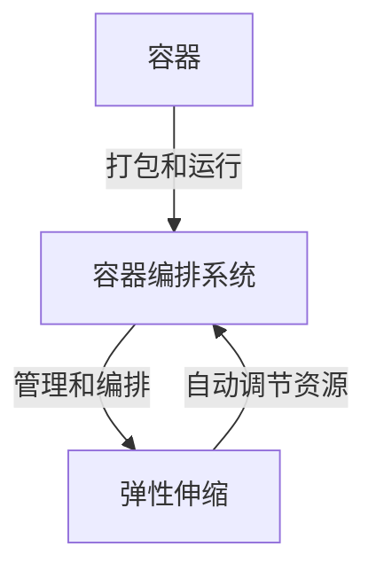

# 容器化部署与弹性伸缩原理与代码实战案例讲解

## 1.背景介绍

### 1.1 传统部署模式的挑战

在传统的应用程序部署模式中,应用程序通常是直接安装和运行在物理服务器或虚拟机上。这种部署方式存在以下几个主要挑战:

- **环境不一致**:不同的开发、测试和生产环境之间存在差异,可能会导致应用程序在不同环境下表现不一致。
- **资源利用率低**:应用程序通常是独占整个服务器运行,导致服务器资源利用率低下。
- **扩展性差**:随着业务需求的增长,扩展应用程序实例需要手动配置新的服务器,过程复杂且效率低下。
- **高昂的运维成本**:管理大量物理服务器或虚拟机需要大量的人力和资源投入。

### 1.2 容器化部署的兴起

为了解决传统部署模式带来的挑战,容器化技术应运而生。容器是一种轻量级、可移植的虚拟化技术,可以将应用程序及其依赖项打包在一个隔离的环境中运行。容器化部署具有以下优势:

- **一致的运行环境**:容器确保应用程序在不同环境下的运行环境完全一致。
- **高效的资源利用**:多个容器可以共享同一台主机的操作系统内核,从而提高资源利用率。
- **轻量级和快速**:容器比传统虚拟机更加轻量级,启动和停止速度更快。
- **可移植性强**:容器可以在不同的操作系统和云平台上运行,实现了"一次构建,到处运行"。
- **隔离性好**:容器之间相互隔离,提高了安全性和稳定性。

### 1.3 弹性伸缩的需求

随着业务需求的不断变化,应用程序需要能够根据实际负载自动扩展或缩减资源。传统的手动扩展方式已经无法满足敏捷性和自动化的需求。因此,弹性伸缩成为了容器化部署的一个重要补充。

弹性伸缩能够根据预定义的策略和规则,自动调节应用程序的资源分配,包括增加或减少容器实例数量、调整容器资源限制等。这不仅提高了资源利用效率,还能够确保应用程序的高可用性和响应能力。

## 2.核心概念与联系

### 2.1 容器

容器是一种轻量级、可移植的虚拟化技术,它可以将应用程序及其依赖项打包在一个隔离的环境中运行。容器共享主机操作系统内核,因此比传统虚拟机更加轻量级和高效。

常见的容器技术包括 Docker、containerd、CRI-O 等。其中,Docker 是最广为人知的容器技术,它提供了一套完整的容器生命周期管理工具。

### 2.2 容器编排

随着容器数量的增加,手动管理容器变得越来越困难。因此,需要一种自动化的方式来管理和编排容器,这就是容器编排系统的作用。

容器编排系统可以自动部署、扩展、维护和监控容器化应用程序。它们还提供了负载均衡、服务发现、自动恢复等功能,确保应用程序的高可用性和可靠性。

目前,Kubernetes 是最流行的容器编排系统,它提供了一套强大的编排功能,可以管理跨多个主机的容器集群。

### 2.3 弹性伸缩

弹性伸缩是指根据应用程序的实际负载,自动调节资源分配。在容器化环境中,弹性伸缩通常是通过增加或减少容器实例数量来实现的。

Kubernetes 提供了多种弹性伸缩机制,包括水平Pod自动伸缩(Horizontal Pod Autoscaler,HPA)、集群自动伸缩(Cluster Autoscaler)和垂直Pod自动伸缩(Vertical Pod Autoscaler,VPA)等。

这些机制可以根据预定义的指标(如CPU利用率、内存使用量等)自动调节容器实例数量或资源限制,从而确保应用程序的高可用性和响应能力。

### 2.4 核心概念关系

容器、容器编排和弹性伸缩是容器化部署的三个核心概念,它们之间存在着紧密的联系:

1. 容器是基础,它提供了一种轻量级、可移植的应用程序打包和运行方式。
2. 容器编排系统(如Kubernetes)管理和编排容器,实现自动化部署、扩展和维护。
3. 弹性伸缩机制依赖于容器编排系统,根据实际负载自动调节容器实例数量和资源分配。

这三个概念相互配合,共同实现了高效、可靠和弹性的容器化应用程序部署和管理。



## 3.核心算法原理具体操作步骤

### 3.1 容器编排算法

容器编排系统需要解决如何高效地调度和管理大量容器的问题。Kubernetes 采用了一种称为 kube-scheduler 的调度算法,它的工作原理如下:

1. **过滤节点**:首先,kube-scheduler 会根据一系列预定义的过滤器(如节点资源、标签、亲和性等)过滤掉不符合要求的节点。
2. **评分节点**:对于通过过滤的节点,kube-scheduler 会根据一系列优先级函数(如资源利用率、数据本地性等)对它们进行评分。
3. **选择节点**:最终,kube-scheduler 会选择评分最高的节点来运行 Pod。

这种算法可以确保 Pod 被调度到合适的节点上,从而实现高效的资源利用和负载均衡。

### 3.2 弹性伸缩算法

Kubernetes 中的弹性伸缩算法主要包括以下几种:

#### 3.2.1 水平Pod自动伸缩(HPA)

HPA 根据 CPU 利用率或其他自定义指标,自动增加或减少 Pod 的副本数量。它的工作流程如下:

1. **监控指标**:Kubernetes 会持续监控 Pod 的指标(如 CPU 利用率)。
2. **计算期望副本数**:根据预定义的目标值(如 CPU 利用率为 50%)和当前指标值,计算出期望的 Pod 副本数量。
3. **调整副本数**:如果期望副本数与当前副本数不同,则增加或减少 Pod 副本数量。

#### 3.2.2 集群自动伸缩(Cluster Autoscaler)

Cluster Autoscaler 根据集群的资源利用情况,自动添加或删除节点。它的工作流程如下:

1. **监控资源利用情况**:持续监控集群中节点的资源利用情况。
2. **检查 Pod 是否可调度**:如果有 Pod 无法调度,则尝试在现有节点上重新调度。
3. **添加或删除节点**:如果重新调度失败,则根据需求添加新节点或删除空闲节点。

#### 3.2.3 垂直Pod自动伸缩(VPA)

VPA 根据 Pod 的资源使用情况,自动调整 Pod 的资源请求和限制。它的工作流程如下:

1. **监控资源使用情况**:持续监控 Pod 的 CPU 和内存使用情况。
2. **计算建议值**:根据历史使用情况,计算出建议的资源请求和限制值。
3. **调整资源请求和限制**:如果建议值与当前值不同,则更新 Pod 的资源请求和限制。

这些算法可以根据实际需求自动调节资源分配,提高资源利用效率,同时确保应用程序的高可用性和响应能力。

## 4.数学模型和公式详细讲解举例说明

在容器化部署和弹性伸缩中,数学模型和公式扮演着重要的角色,用于描述和优化资源利用和调度决策。

### 4.1 资源利用率模型

资源利用率是评估资源分配效率的关键指标。对于单个容器,资源利用率可以表示为:

$$
资源利用率 = \frac{实际使用资源量}{分配资源量}
$$

对于整个集群,资源利用率可以计算为:

$$
集群资源利用率 = \frac{\sum_{i=1}^{n}实际使用资源量_i}{\sum_{i=1}^{n}分配资源量_i}
$$

其中 $n$ 是集群中容器的总数。

理想情况下,资源利用率应该尽可能接近 1,这意味着资源被充分利用,没有浪费。但是,过高的资源利用率可能会导致性能下降和稳定性问题。因此,需要在资源利用率和性能之间寻找一个平衡点。

### 4.2 队列模型

在高负载情况下,请求可能会被暂时排队等待处理。队列模型可以用来描述和优化这种情况。

假设请求到达服务器的速率为 $\lambda$,服务器处理请求的速率为 $\mu$,那么系统的利用率可以表示为:

$$
\rho = \frac{\lambda}{\mu}
$$

如果 $\rho < 1$,则队列长度的期望值为:

$$
L = \frac{\rho}{1 - \rho}
$$

如果 $\rho \geq 1$,则队列长度将无限增长,系统将变得不稳定。

通过监控队列长度和利用率,可以触发弹性伸缩机制,增加或减少容器实例数量,从而维持系统的稳定性和响应能力。

### 4.3 bin-packing 问题

容器调度可以看作是一个 bin-packing 问题,即如何将多个容器(物品)有效地打包到多个节点(箱子)中。这是一个 NP 难问题,需要使用启发式算法来近似求解。

一种常见的启发式算法是最佳匹配算法(Best Fit),它的工作原理如下:

1. 计算每个节点的剩余资源量。
2. 对于每个待调度的容器,选择剩余资源量最小但仍能容纳该容器的节点。
3. 如果没有节点能够容纳该容器,则创建一个新节点。

这种算法可以最大化节点的资源利用率,但也可能导致资源碎片化。因此,Kubernetes 采用了一种更复杂的调度算法,综合考虑多个因素,如资源利用率、数据本地性、节点亲和性等。

通过数学模型和公式,我们可以更好地理解和优化容器化部署和弹性伸缩的各个方面,从而提高资源利用效率和系统性能。

## 5.项目实践:代码实例和详细解释说明

在本节中,我们将通过一个实际的项目案例,展示如何使用 Kubernetes 实现容器化部署和弹性伸缩。

### 5.1 项目概述

我们将构建一个简单的 Web 应用程序,它由三个组件组成:

1. **Web 前端**:一个 React 应用程序,用于显示和提交表单数据。
2. **API 后端**:一个 Node.js 应用程序,提供 RESTful API 接口,用于处理表单数据。
3. **数据库**:一个 MongoDB 实例,用于存储表单数据。

我们将使用 Docker 构建应用程序镜像,并使用 Kubernetes 在集群中部署和管理这些容器化组件。同时,我们还将配置水平 Pod 自动伸缩(HPA),以根据 CPU 利用率自动调节 Web 前端和 API 后端的实例数量。

### 5.2 构建 Docker 镜像

首先,我们需要为每个应用程序组件创建 Dockerfile,用于构建 Docker 镜像。以 Web 前端为例,Dockerfile 可能如下所示:

```dockerfile
# 基础镜像
FROM node:14-alpine

# 设置工作目录
WORKDIR /app

# 复制源代码
COPY . .

# 安装依赖
RUN npm install

# 构建应用程序
RUN npm run build

# 暴露端口
EXPOSE 3000

# 启动命令
CMD ["npm", "start"]
```

我们可以使用 `docker build` 命令构建镜像,然后使用 `docker push` 命令将镜像推送到容器注册表中,以便 