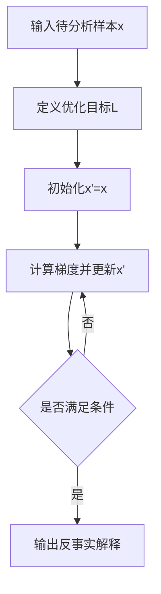

# 对比解释与反事实分析原理与代码实战案例讲解

## 1. 背景介绍
### 1.1 对比解释与反事实分析的定义
对比解释(Contrastive Explanation)和反事实分析(Counterfactual Analysis)是近年来在人工智能可解释性领域备受关注的两个重要概念。它们旨在通过生成人类可理解的解释,来阐明机器学习模型的决策过程,从而提高模型的透明度和可信度。

对比解释的核心思想是通过比较模型对不同输入的预测结果差异,来揭示模型关注的关键特征。而反事实分析则是通过构造反事实样本(即改变原始输入的某些特征),观察模型预测结果的变化,从而理解特征对模型决策的影响。

### 1.2 对比解释与反事实分析的重要性
在实际应用中,仅仅给出模型的预测结果往往是不够的,我们还需要知道模型为什么做出这样的预测。对比解释与反事实分析为理解模型内部机制提供了有力的工具。它们可以帮助我们:

1. 识别模型关注的关键特征,理解模型的决策过程
2. 发现模型可能存在的偏差和漏洞,提高模型的鲁棒性  
3. 生成人类可理解的解释,增强用户对模型的信任
4. 调试和优化模型,提高模型的性能和泛化能力

### 1.3 对比解释与反事实分析的应用领域
对比解释与反事实分析在许多领域都有广泛的应用,例如:

- 医疗诊断:解释模型为什么给出某种诊断结果,识别关键的病理特征
- 金融风控:分析模型判定风险的原因,优化授信策略
- 自然语言处理:理解模型对文本分类和情感分析的判断依据
- 计算机视觉:解释图像分类模型关注的区域和特征
- 推荐系统:分析用户兴趣偏好,优化推荐策略

## 2. 核心概念与联系
### 2.1 对比解释(Contrastive Explanation)
对比解释的目标是通过比较不同类别的样本,找出导致模型做出不同预测的关键特征。其基本思路可以概括为:

1. 选择一个待解释的样本A(如一张图片)
2. 从另一个类别中选择一个对比样本B 
3. 识别出A和B在特征上的主要差异
4. 将这些差异作为解释模型决策的依据

形式化地,可以将对比解释定义为一个三元组(x,x',δ),其中x是待解释样本,x'是对比样本,δ是两者的差异特征。

### 2.2 反事实分析(Counterfactual Analysis)
反事实分析的核心是构造反事实样本,即在原始样本的基础上做最小的改动,使得模型的预测发生改变。其基本步骤包括:

1. 选择一个待分析的样本x
2. 确定一个目标类别y' (与x的原始类别y不同)
3. 在x的特征空间中搜索一个x',使得模型将x'预测为y',且x'与x的差异最小
4. x'与x的差异即为模型关注的关键特征

反事实样本(x,x')可以看作是模型决策边界上的一对正负样本。通过分析它们的差异,我们可以洞察模型内部的判别机制。

### 2.3 两者的联系与区别 
对比解释和反事实分析都是通过构造一个参照物(对比样本或反事实样本),来揭示模型关注的特征。它们的主要区别在于:

- 对比解释关注不同类别样本间的差异,反事实分析关注同一样本在不同决策下的变化
- 对比解释的参照物(对比样本)是从数据集中选取的真实样本,而反事实样本是人为构造的虚拟样本
- 对比解释强调找出最能区分两个类别的特征,反事实分析强调找出最小的改动就能影响决策的特征

尽管有所区别,但两者在本质上都是通过比较和分析差异,来理解模型行为的一种方法。在实践中,它们常常是互补的,可以结合使用。

## 3. 核心算法原理具体操作步骤
### 3.1 对比解释算法流程
对比解释的一个经典算法是MMD-critic,其基本流程如下:

1. 输入待解释样本x,和一个背景数据集X(不包含x)
2. 从X中选择一批与x同类别的样本作为正例集P,一批与x不同类别的样本作为负例集N
3. 计算x与P和N的MMD距离,MMD(x,P)和MMD(x,N)。MMD衡量了两组数据分布之间的差异
4. 定义critic函数f(x)=MMD(x,P)-MMD(x,N),f(x)越大,表示x越接近P而远离N
5. 计算f(x)对x的梯度∇f(x),梯度方向指向能增大f(x)的特征维度
6. 将∇f(x)作为x的对比解释,突出显示梯度值较大的维度或区域

```mermaid
graph TD
A[输入待解释样本x] --> B[选择正例集P和负例集N]
B --> C[计算MMD距离]
C --> D[定义critic函数f(x)]
D --> E[计算梯度∇f(x)]
E --> F[生成对比解释]
```

### 3.2 反事实分析算法流程
反事实分析的经典算法包括Wachter方法和DiCE,它们分别基于梯度和遗传算法来搜索反事实样本。以Wachter方法为例:

1. 输入待分析样本x,和目标类别y'
2. 定义一个优化目标函数L(x')=λ·D(x,x')+L_pred(x',y'),其中D(x,x')衡量x'与x的差异,L_pred(x',y')衡量x'被预测为y'的置信度,λ是平衡两项的权重
3. 初始化x'=x
4. 对L(x')求梯度,并用梯度下降法更新x',使其逐步减小L(x')
5. 重复步骤4,直到找到一个满足条件的反事实样本x',即被模型预测为y',且与x的差异最小
6. 返回(x,x')作为反事实解释



## 4. 数学模型和公式详细讲解举例说明
### 4.1 MMD距离的定义与计算
MMD(Maximum Mean Discrepancy)是一种衡量两组数据分布差异的指标。给定两组数据P={x1,…,xm}和Q={y1,…,yn},它们的MMD距离定义为:

$$MMD(P,Q)=\sup_{f \in F} (\frac{1}{m}\sum_{i=1}^m f(x_i) - \frac{1}{n}\sum_{j=1}^n f(y_j))$$

其中F是一组函数的集合,称为再生核希尔伯特空间(RKHS)。直观地,MMD衡量了在RKHS空间中,P和Q的均值之差的最大值。

在实践中,MMD可以用核函数的形式估计:

$$MMD(P,Q) \approx \sqrt{\frac{1}{m^2}\sum_{i=1}^m\sum_{i'=1}^m k(x_i,x_{i'}) + \frac{1}{n^2}\sum_{j=1}^n\sum_{j'=1}^n k(y_j,y_{j'}) - \frac{2}{mn}\sum_{i=1}^m\sum_{j=1}^n k(x_i,y_j)}$$

其中k(·,·)是一个核函数,常用的有高斯核:

$$k(x,y)=\exp(-\frac{||x-y||^2}{2\sigma^2})$$

例如,假设我们有两组数据P和Q,每组各10个2维点,我们想计算它们的MMD距离:

```python
import numpy as np
from sklearn.metrics.pairwise import rbf_kernel

P = np.random.randn(10,2)
Q = np.random.randn(10,2) + 1

m = len(P)
n = len(Q)

K_PP = rbf_kernel(P)
K_QQ = rbf_kernel(Q)
K_PQ = rbf_kernel(P,Q)

mmd = np.sqrt(K_PP.mean() + K_QQ.mean() - 2*K_PQ.mean())
print(f"MMD distance between P and Q: {mmd:.3f}")
```

### 4.2 Wachter方法的优化目标函数 
Wachter方法定义的优化目标函数为:

$$L(x')=λ·D(x,x')+L_pred(x',y')$$

其中D(x,x')衡量x'与x的差异,常用的形式有L1范数、L2范数或它们的加权组合:

$$D(x,x')=\sum_i |x_i-x'_i| \quad or \quad D(x,x')=\sum_i (x_i-x'_i)^2$$

L_pred(x',y')衡量x'被预测为y'的置信度,一般基于模型对x'的预测概率p(y'|x'):

$$L_pred(x',y')=-\log p(y'|x')$$

λ是权重参数,控制了两项的平衡。λ越大,越强调x'与x的相似性;λ越小,越强调x'被预测为y'。

假设我们有一个二分类模型f(x),现在要为样本x=[1,2]找一个反事实样本x',使其被预测为类别1。我们可以这样构造优化目标:

```python
import torch

def D(x,x_): 
    return torch.sum(torch.abs(x-x_))

def L_pred(x_,y_):
    p = torch.softmax(f(x_),dim=0)
    return -torch.log(p[y_])

def L(x_,x,y_):
    return 0.1*D(x,x_) + L_pred(x_,y_) 

x = torch.tensor([1.0,2.0])
y_ = torch.tensor(1)
x_ = x.clone().detach().requires_grad_(True)

optimizer = torch.optim.Adam([x_],lr=0.1)
for i in range(100):
    loss = L(x_,x,y_)
    optimizer.zero_grad()
    loss.backward()
    optimizer.step()

print(f"Original x: {x}")    
print(f"Counterfactual x_: {x_}")
```

## 5. 项目实践：代码实例和详细解释说明
下面我们以一个简单的图像分类任务为例,演示如何用Python代码实现对比解释和反事实分析。

我们使用MNIST数据集,训练一个CNN模型来分类手写数字。然后,我们将选取一些测试样本,生成它们的对比解释和反事实解释。

### 5.1 模型训练
首先,我们定义一个简单的CNN模型,并在MNIST上训练:

```python
import torch
import torch.nn as nn
import torch.optim as optim
from torchvision import datasets, transforms

class Net(nn.Module):
    def __init__(self):
        super(Net, self).__init__()
        self.conv1 = nn.Conv2d(1, 32, 3, 1)
        self.conv2 = nn.Conv2d(32, 64, 3, 1)
        self.fc1 = nn.Linear(9216, 128)
        self.fc2 = nn.Linear(128, 10)

    def forward(self, x):
        x = self.conv1(x)
        x = F.relu(x)
        x = self.conv2(x)
        x = F.relu(x)
        x = F.max_pool2d(x, 2)
        x = torch.flatten(x, 1)
        x = self.fc1(x)
        x = F.relu(x)
        x = self.fc2(x)
        return x

train_loader = torch.utils.data.DataLoader(
        datasets.MNIST('../data', train=True, download=True,
                       transform=transforms.Compose([
                           transforms.ToTensor(),
                           transforms.Normalize((0.1307,), (0.3081,))
                       ])),
        batch_size=64, shuffle=True)

model = Net()
criterion = nn.CrossEntropyLoss()
optimizer = optim.Adam(model.parameters(), lr=0.001)

for epoch in range(5):
    for batch_idx, (data, target) in enumerate(train_loader):
        output = model(data)
        loss = criterion(output, target)
        optimizer.zero_grad()
        loss.backward()
        optimizer.step()
```

### 5.2 对比解释的生成
接下来,我们基于MMD-critic算法,为一个测试样本生成对比解释:

```python
from captum.attr import NeuronConductance

def mmd_critic(model