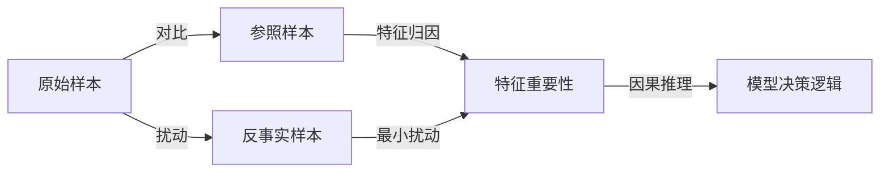

# 对比解释与反事实分析原理与代码实战案例讲解

## 1.背景介绍
### 1.1 对比解释的定义与意义
对比解释(Contrastive Explanation)是一种解释机器学习模型决策的方法,它通过比较模型对不同输入的预测结果,来揭示模型内部工作机制。对比解释可以帮助我们理解为什么模型对某个输入做出特定预测,而对另一个相似输入却给出不同预测。这种洞察力对于调试模型、提高模型可解释性、发现数据中的bias等都有重要意义。

### 1.2 反事实分析的定义与意义
反事实分析(Counterfactual Analysis)则是通过构造反事实样本,来探究模型的决策边界。所谓反事实样本,就是在原有样本的基础上做最小幅度修改,使得模型给出不同的预测结果。通过分析大量反事实样本与原始样本的差异,我们可以更好地理解模型的决策逻辑,找出模型关注的关键特征。反事实分析在提高模型鲁棒性、可解释性等方面有广泛应用。

### 1.3 二者的关系与区别
对比解释与反事实分析都是从不同角度来解释模型行为的方法。二者的关系可以概括为:
- 对比解释关注模型对不同真实样本的预测差异
- 反事实分析关注模型对虚构反事实样本的预测变化

虽然视角不同,但二者殊途同归,目的都是揭示模型内部工作机制,提高模型的可解释性和可信度。在实践中,对比解释和反事实分析常常是相辅相成、互为补充的。

## 2.核心概念与联系
### 2.1 对比解释的核心概念
- 参照样本(Reference Sample):用来与目标样本对比的另一个真实样本
- 特征归因(Feature Attribution):衡量每个特征对模型预测结果的贡献度
- 相似性度量(Similarity Metric):衡量两个样本在特征空间中的接近程度

### 2.2 反事实分析的核心概念
- 反事实样本(Counterfactual Sample):通过扰动原始样本得到的虚构样本,使得模型给出不同预测
- 最小扰动(Minimum Perturbation):在保证模型预测发生改变的前提下,对原始样本的最小修改
- 因果推理(Causal Reasoning):根据反事实推断因果关系,即特征的改变如何导致预测的改变

### 2.3 二者的联系
下图展示了对比解释与反事实分析的关系:



从图中可见,对比解释从参照样本出发,通过特征归因揭示特征重要性;而反事实分析从扰动样本出发,通过最小扰动揭示特征重要性。二者殊途同归,最终目的都是推理出模型内部的决策逻辑。

## 3.核心算法原理具体操作步骤
### 3.1 对比解释算法流程
1. 选择合适的参照样本,通常选择与目标样本预测结果不同的样本
2. 提取两个样本的特征向量,计算特征差异
3. 利用特征归因方法(如LIME、SHAP等),计算每个差异特征对预测结果的贡献度
4. 根据贡献度排序,选出最重要的差异特征,生成解释

### 3.2 反事实分析算法流程 
1. 以目标样本为基础,设定扰动范围和优化目标(如最小扰动)
2. 利用优化算法(如梯度下降)搜索扰动空间,生成一系列反事实样本
3. 筛选出能够改变模型预测结果的有效反事实样本
4. 计算反事实样本与原始样本的差异,提取关键特征
5. 分析关键特征的变化方向与幅度,推断因果关系,生成解释

### 3.3 二者的结合应用
在实践中,对比解释与反事实分析可以结合使用,形成更全面的解释:
1. 利用对比解释找出重要特征
2. 以这些特征为基础,利用反事实分析生成一系列反事实样本
3. 在反事实样本上再次应用对比解释,分析特征变化与预测变化的关系
4. 综合两种方法的结果,生成因果式的解释,并验证解释的可信度

这种结合方法可以兼顾真实样本和虚构样本,从不同角度揭示模型行为,提供更鲁棒、全面的解释。

## 4.数学模型和公式详细讲解举例说明
### 4.1 对比解释的数学建模
假设有两个样本 $x_1$ 和 $x_2$,模型 $f$ 对它们的预测结果分别为 $f(x_1)=y_1$ 和 $f(x_2)=y_2$。我们的目标是解释为什么 $y_1 \neq y_2$。

令 $x_1$ 和 $x_2$ 的特征向量分别为:
$$
x_1 = (x_{11}, x_{12}, \dots, x_{1n}) \\
x_2 = (x_{21}, x_{22}, \dots, x_{2n})
$$

特征差异向量为:
$$
\Delta x = x_1 - x_2 = (\Delta x_1, \Delta x_2, \dots, \Delta x_n)
$$

利用LIME等特征归因方法,可以估计出每个特征差异 $\Delta x_i$ 对预测差异 $\Delta y = y_1 - y_2$ 的贡献度 $w_i$,得到特征重要性向量:
$$
w = (w_1, w_2, \dots, w_n)
$$

最终,对比解释可以表示为一个线性模型:
$$
\Delta y = f(x_1) - f(x_2) \approx w^T \Delta x = \sum_{i=1}^n w_i \Delta x_i
$$

即预测差异可以近似分解为各个特征差异的加权求和,权重 $w_i$ 表示第 $i$ 个特征的重要性。

### 4.2 反事实分析的数学建模
假设目标样本为 $x$,模型 $f$ 对它的预测为 $f(x)=y$。我们希望找到一个反事实样本 $\tilde{x}$,使得 $f(\tilde{x})=\tilde{y}$,其中 $\tilde{y} \neq y$。

定义反事实样本 $\tilde{x}$ 与原始样本 $x$ 的差异为:
$$
\delta = \tilde{x} - x
$$

反事实分析的目标是在满足 $f(\tilde{x})=\tilde{y}$ 的约束下,找到 $\delta$ 的最小值,即最小扰动:
$$
\min_{\delta} \Vert \delta \Vert_p \\
\text{s.t.} \quad f(x+\delta)=\tilde{y}
$$

其中 $\Vert \cdot \Vert_p$ 表示 $L_p$ 范数,常用的有 $L_1$、$L_2$ 和 $L_\infty$ 范数。

这个优化问题可以用梯度下降等方法求解。求解得到的 $\delta^*$ 就是最小扰动,反事实样本为 $\tilde{x}^* = x + \delta^*$。

通过分析 $\delta^*$ 中非零元素的位置和大小,我们可以推断出哪些特征的改变对预测结果影响最大,从而生成反事实解释。

### 4.3 结合应用的数学建模
将对比解释得到的特征重要性向量 $w$ 作为先验知识,可以指导反事实样本的生成。具体地,我们可以在反事实分析的优化目标中引入 $w$ 作为正则项:
$$
\min_{\delta} \Vert \delta \Vert_p + \lambda \Vert w \odot \delta \Vert_q \\
\text{s.t.} \quad f(x+\delta)=\tilde{y}
$$

其中 $\odot$ 表示逐元素乘法,$\lambda$ 为平衡系数。这个正则项鼓励反事实样本在重要特征上产生更大的扰动,从而揭示出因果关系。

求解这个优化问题,可以得到一个同时考虑了特征重要性和最小扰动的反事实样本 $\tilde{x}^*$。将 $\tilde{x}^*$ 代入对比解释流程,可以进一步分析特征变化与预测变化之间的关系,生成因果式的解释。

## 5.项目实践：代码实例和详细解释说明
下面以一个简单的二分类任务为例,演示如何用Python实现对比解释和反事实分析。

### 5.1 生成示例数据与模型

```python
import numpy as np
from sklearn.datasets import make_classification
from sklearn.ensemble import RandomForestClassifier
from sklearn.model_selection import train_test_split

# 生成二分类数据
X, y = make_classification(n_samples=1000, n_features=10, n_informative=5, n_redundant=0, 
                           n_repeated=0, n_classes=2, random_state=0)

# 划分训练集和测试集                          
X_train, X_test, y_train, y_test = train_test_split(X, y, test_size=0.2, random_state=0)

# 训练随机森林分类器
clf = RandomForestClassifier(n_estimators=100, random_state=0)
clf.fit(X_train, y_train)
```

这段代码首先生成了一个包含1000个样本、10个特征的二分类数据集,其中5个特征是有信息量的。然后将数据划分为训练集和测试集,并训练了一个随机森林分类器。

### 5.2 对比解释的代码实现

```python
from sklearn.metrics.pairwise import euclidean_distances

def contrastive_explanation(model, x1, x2):
    """
    对比解释
    :param model: 已训练的分类器模型
    :param x1: 第一个样本
    :param x2: 第二个样本
    :return: 特征重要性向量
    """
    # 提取特征向量
    x1 = x1.reshape(1, -1)
    x2 = x2.reshape(1, -1)
    
    # 计算特征差异
    delta_x = x1 - x2
    
    # 计算预测差异
    y1 = model.predict_proba(x1)[0]
    y2 = model.predict_proba(x2)[0]
    delta_y = y1 - y2
    
    # 计算特征重要性
    importance = np.abs(delta_x * delta_y)
    importance = importance / np.sum(importance)
    
    return importance
```

这个`contrastive_explanation`函数实现了对比解释的主要步骤:
1. 提取两个样本的特征向量
2. 计算特征差异向量 $\Delta x$
3. 分别预测两个样本的概率输出,计算预测差异 $\Delta y$
4. 将 $\Delta x$ 和 $\Delta y$ 逐元素相乘,得到每个特征的重要性得分
5. 对重要性得分归一化,得到特征重要性向量

### 5.3 反事实分析的代码实现

```python
def counterfactual_explanation(model, x, target_class, lr=0.01, max_iter=1000, tol=1e-5):
    """
    反事实分析
    :param model: 已训练的分类器模型
    :param x: 目标样本
    :param target_class: 反事实样本的目标类别
    :param lr: 学习率
    :param max_iter: 最大迭代次数
    :param tol: 容差
    :return: 反事实样本
    """
    # 初始化反事实样本
    x_cf = x.copy().reshape(1, -1)
    
    # 梯度下降
    for i in range(max_iter):
        # 计算预测概率
        prob = model.predict_proba(x_cf)[0]
        
        # 计算损失函数
        loss = prob[target_class] - 1.0
        
        # 计算梯度
        grad = model.predict_proba(x_cf)[0, target_class] * (1 - model.predict_proba(x_cf)[0, target_class]) * model.coef_[0]
        
        # 更新反事实样本
        x_cf -= lr * grad.reshape(1, -1)
        
        # 检查收敛性
        if abs(loss) < tol:
            break
            
    return x_cf
```

这个`counterfactual_explanation`函数实现了反事实分析的主要步骤:
1. 初始化反事实样本 $\tilde{x}$