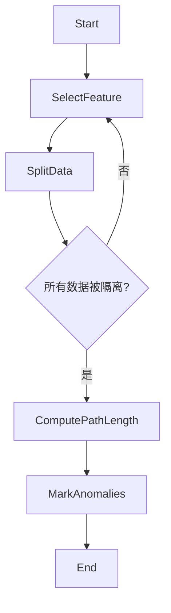

# 异常检测(Anomaly Detection)原理与代码实战案例讲解

## 1. 背景介绍

在现实世界中,异常数据的存在无处不在。无论是网络入侵检测、信用卡欺诈监控、制造业缺陷检测,还是医疗诊断等领域,及时发现异常情况都是至关重要的。异常检测(Anomaly Detection)就是指从大量数据中识别出那些与其他数据显著不同的"异常"数据点或数据模式的过程。

异常检测广泛应用于以下几个主要场景:

1. **故障检测**:在工业生产和机器运行过程中,异常检测可用于检测设备故障、部件异常等情况,从而及时采取预防措施,避免更大损失。

2. **系统健康监控**:通过监控系统各项指标数据,检测异常值有助于发现系统故障或性能问题。

3. **欺诈检测**:银行可利用异常检测技术识别出可疑的信用卡交易,保险公司可发现虚假理赔申请。

4. **网络入侵检测**:通过分析网络流量数据,发现异常的连接行为模式,从而检测潜在的网络攻击。

5. **医疗诊断**:异常检测可用于发现医疗影像、基因数据等中的异常模式,为疾病诊断提供线索。

总的来说,异常检测技术的核心目标是从大量看似正常的数据中发现"异常"的个体或模式,从而对其进行进一步分析和处理。

## 2. 核心概念与联系

### 2.1 什么是异常数据?

异常数据(Anomaly)指的是与大多数数据显著不同的数据点或数据模式。异常数据可分为以下三种类型:

1. **点异常(Point Anomaly)**: 单个数据实例本身就很特殊,与其他实例明显不同。

2. **上下文异常(Contextual Anomaly)**: 数据实例在特定上下文中会被视为异常,但在其他上下文中则是正常的。

3. **集群异常(Collective Anomaly)**: 一系列相关的数据实例作为一个整体看待时会被视为异常。

### 2.2 异常检测的挑战

异常检测面临以下几个主要挑战:

1. **异常数据稀缺**: 异常数据通常占整个数据集的极小部分,这使得检测异常变得更加困难。

2. **无标注数据**: 大多数情况下,我们无法获得已标注的异常样本数据,从而无法使用监督学习算法。

3. **数据高维度**: 现实世界的数据通常具有高维特征,这增加了异常检测的复杂性。

4. **异常定义模糊**: 异常的定义常常是主观的,不同场景下异常的判定标准也不尽相同。

5. **数据漂移**: 随着时间推移,数据分布可能发生变化,导致之前定义的异常模型失效。

### 2.3 异常检测技术分类

常见的异常检测技术可分为以下几大类:

1. **基于统计的方法**: 基于数据的统计分布特征(如均值、方差等)来检测异常数据。

2. **基于深度学习的方法**: 利用深度神经网络自动从数据中学习异常检测模型。  

3. **基于聚类的方法**: 将数据划分为多个簇,离群点或小簇被视为异常。

4. **基于最近邻的方法**: 通过计算数据点与其邻居的距离来判断是否为异常。

5. **基于信息理论的方法**: 利用信息论中的概念(如熵、信息量等)来量化异常程度。

6. **基于谱理论的方法**: 利用谱理论对数据进行分解,异常会在低维投影中显现出来。

7. **基于隔离的方法**: 通过将异常数据隔离到数据路径的终端节点来实现检测。

8. **基于规则的方法**: 根据预定义的规则来判断数据是否为异常。

上述各种技术各有优缺点,在实际应用中需要根据具体场景选择合适的方法。

## 3. 核心算法原理具体操作步骤

### 3.1 基于统计的异常检测

基于统计的异常检测方法通常假设数据服从某种概率分布(如高斯分布),异常数据点将偏离该分布的主体部分。常见的算法包括:

1. **高斯分布模型(Gaussian Model)**

   假设数据服从高斯(正态)分布,计算每个数据点到均值的马氏距离,距离超过阈值的即为异常。

   算法步骤:
   1) 计算数据集的均值向量$\mu$和协方差矩阵$\Sigma$
   2) 对于每个数据点$x$,计算其马氏距离:
      $$
      D(x) = \sqrt{(x-\mu)^T\Sigma^{-1}(x-\mu)}
      $$
   3) 如果$D(x)$超过预设阈值,则将$x$标记为异常

2. **核函数估计(Kernel Density Estimation)**

   通过核函数对数据分布进行非参数估计,异常数据点将位于估计分布的低密度区域。

   算法步骤:
   1) 选择合适的核函数$K(x)$(如高斯核)和带宽参数$h$
   2) 对于每个数据点$x$,估计其概率密度:
      $$
      \hat{f}(x) = \frac{1}{nh}\sum_{i=1}^{n}K\left(\frac{x-x_i}{h}\right)
      $$
   3) 如果$\hat{f}(x)$小于预设阈值,则将$x$标记为异常

### 3.2 基于深度学习的异常检测

深度学习方法可以自动从数据中学习特征表示,无需人工设计特征,在异常检测领域表现出色。典型的算法有:

1. **自编码器(AutoEncoder)** 

   自编码器是一种无监督神经网络模型,通过重构输入数据来学习数据的特征表示。对于正常数据,重构误差较小;对于异常数据,重构误差较大。

   算法步骤:
   1) 构建自编码器网络,包括编码器和解码器两部分
   2) 使用正常数据训练自编码器,最小化重构误差
   3) 对于新的数据点$x$,计算其重构误差:
      $$
      L(x) = \|x - \hat{x}\|
      $$
      其中$\hat{x}$为重构后的数据
   4) 如果$L(x)$超过预设阈值,则将$x$标记为异常

2. **生成对抗网络(GAN)**

   生成对抗网络包括生成器和判别器两部分。生成器学习生成与真实数据相似的样本,判别器则判断样本是真是假。通过对抗训练,判别器可以学习区分正常和异常数据。

   算法步骤:
   1) 构建生成对抗网络,包括生成器$G$和判别器$D$
   2) 使用正常数据训练GAN模型
   3) 对于新的数据点$x$,使用训练好的判别器$D$计算其异常分数:
      $$
      S(x) = 1 - D(x)
      $$
   4) 如果$S(x)$超过预设阈值,则将$x$标记为异常

### 3.3 基于隔离的异常检测

隔离森林(Isolation Forest)是一种基于隔离原理的有效异常检测算法,其核心思想是:异常数据点由于与其他数据点的特征值差异较大,因此很容易被隔离。

算法步骤:

1) 对于每个数据点,通过随机选择特征及其分割值,构建二叉树,直至所有训练数据被隔离(即每个叶节点只包含一个数据点)
2) 计算每个数据点的路径长度(从根节点到该数据点所在叶节点的路径长度)
3) 将路径长度较短的数据点标记为异常,因为它们很容易被隔离

隔离森林的优点是无需数据预处理,可以处理高维数据,且速度快、效果好。它的主要缺点是对于数据中存在的簇结构不太敏感。

## 4. 数学模型和公式详细讲解举例说明

异常检测中常用的数学模型和公式包括:

### 4.1 马氏距离(Mahalanobis Distance)

马氏距离是衡量数据点与分布中心的距离的一种方法,它考虑了数据的协方差结构。对于$d$维数据点$x$,其与均值向量$\mu$的马氏距离定义为:

$$
D(x) = \sqrt{(x-\mu)^T\Sigma^{-1}(x-\mu)}
$$

其中$\Sigma$为数据的协方差矩阵。当数据服从多元正态分布时,马氏距离服从卡方分布,因此可以设置阈值来检测异常。

**示例**:
假设有一个二维数据集,其均值为$\mu = (2, 3)$,协方差矩阵为$\Sigma = \begin{bmatrix}1&0.5\\0.5&1\end{bmatrix}$。对于数据点$x = (4, 5)$,计算其马氏距离:

$$
\begin{aligned}
D(x) &= \sqrt{(x-\mu)^T\Sigma^{-1}(x-\mu)}\\
     &= \sqrt{(2, 2)^T\begin{bmatrix}2&-1\\-1&2\end{bmatrix}(2, 2)}\\
     &= \sqrt{8} = 2.83
\end{aligned}
$$

如果我们设置异常阈值为$3$,则该数据点会被标记为异常。

### 4.2 重构误差(Reconstruction Error)

重构误差常用于基于自编码器的异常检测方法中。自编码器通过将输入数据编码为低维表示,再解码重构原始数据,从而学习数据的特征表示。对于正常数据,重构误差较小;对于异常数据,重构误差较大。

设$x$为输入数据,$\hat{x}$为重构后的数据,则重构误差可定义为:

$$
L(x) = \|x - \hat{x}\|
$$

其中$\|\cdot\|$可以是任意范数,如$L_1$范数或$L_2$范数。

**示例**:
假设我们有一个简单的自编码器,输入为二维向量,编码为一维隐藏层,解码为二维输出。设输入为$x = (1, 2)$,经过编码得到隐藏层向量$h = 2$,解码后输出为$\hat{x} = (1.9, 2.1)$。则重构误差为:

$$
L(x) = \|(1, 2) - (1.9, 2.1)\| = \sqrt{(1-1.9)^2 + (2-2.1)^2} = 0.14
$$

如果该重构误差超过预设阈值,我们就可以将输入$x$标记为异常。

### 4.3 异常分数(Anomaly Score)

异常分数用于量化数据点异常的程度,通常取值范围为$[0, 1]$,分数越高表示越可能是异常。一些常见的异常分数计算方法包括:

1. **基于密度的方法**:使用核函数估计或最近邻方法估计数据点的概率密度,将密度值作为异常分数的反函数。

2. **基于距离的方法**:计算数据点到其$k$个最近邻的平均距离,距离越大,异常分数越高。

3. **基于隔离的方法**:使用隔离森林算法计算数据点被隔离所需的平均路径长度,路径越短,异常分数越高。

4. **基于重构误差的方法**:使用自编码器或其他重构模型计算数据点的重构误差,误差越大,异常分数越高。

设$x$为数据点,$S(x)$为其异常分数,则通常有:

$$
S(x) = \begin{cases}
0, &\text{如果 }x\text{ 是正常数据}\\
1, &\text{如果 }x\text{ 是异常数据}\\
(0, 1), &\text{其他情况}
\end{cases}
$$

通过设置合适的阈值,我们可以根据异常分数对数据点进行二值化,从而