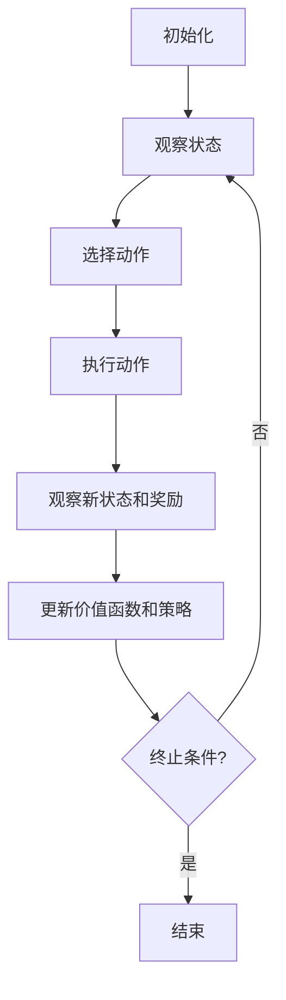

# 强化学习Reinforcement Learning与传统机器学习方法对比

## 1. 背景介绍

机器学习是人工智能领域的一个重要分支,旨在赋予计算机系统自主学习和改进的能力。传统的机器学习方法包括监督学习和无监督学习,而强化学习则是一种全新的范式,它让智能体通过与环境的互动来学习如何采取最优行为策略。

### 1.1 传统机器学习简介

#### 1.1.1 监督学习

监督学习是最常见的机器学习形式,其中模型会从标记的训练数据中学习,并在此基础上对新的输入数据进行预测或分类。典型的监督学习任务包括图像分类、语音识别和预测分析等。

#### 1.1.2 无监督学习 

无监督学习则是从未标记的原始数据中发现内在模式和结构。常见的无监督学习算法包括聚类分析和关联规则挖掘。无监督学习在客户细分、异常检测和维数约减等领域有广泛应用。

### 1.2 强化学习的兴起

尽管传统机器学习取得了巨大成功,但它们都是基于事先给定的训练数据。强化学习则是一种全新的范式,智能体(agent)通过与环境(environment)的互动来学习,旨在最大化长期累积奖励。

强化学习的主要优势在于,它不需要提前标注的训练数据,而是通过探索和试错来学习最优策略。这使得强化学习在很多复杂的决策过程和控制问题中具有独特的优势,如机器人控制、游戏AI和自动驾驶等。

## 2. 核心概念与联系

为了更好地理解强化学习与传统机器学习的区别,我们需要了解它们的核心概念。

### 2.1 监督学习核心概念

监督学习的核心概念包括:

- 训练数据(Training Data):包含输入特征和相应的标签
- 模型(Model):根据训练数据学习模式,用于对新数据进行预测或分类
- 损失函数(Loss Function):衡量模型预测与真实标签之间的差异
- 优化算法(Optimization Algorithm):调整模型参数以最小化损失函数


### 2.2 无监督学习核心概念  

无监督学习的核心概念包括:

- 原始数据(Raw Data):未标记的数据集
- 相似性度量(Similarity Measure):衡量数据点之间的相似程度
- 聚类算法(Clustering Algorithm):根据相似性将数据划分为不同的簇
- 模式发现(Pattern Discovery):从数据中发现有趣的关联模式或异常


### 2.3 强化学习核心概念

强化学习的核心概念包括:

- 智能体(Agent):做出决策并与环境交互的主体
- 环境(Environment):智能体所处的外部世界
- 状态(State):环境的当前情况
- 动作(Action):智能体可以采取的行为
- 奖励(Reward):对智能体行为的反馈信号
- 策略(Policy):智能体在每个状态下采取行动的策略
- 价值函数(Value Function):评估某个状态或状态-动作对的长期累积奖励


强化学习的目标是找到一个最优策略,使得智能体在与环境交互的过程中获得最大化的长期累积奖励。

## 3. 核心算法原理具体操作步骤

### 3.1 强化学习算法框架

尽管存在多种不同的强化学习算法,但它们都遵循一个通用的框架:

1. 初始化智能体和环境
2. 观察当前状态
3. 根据策略选择动作
4. 执行动作,观察新状态和奖励
5. 更新价值函数和策略
6. 重复步骤2-5,直到达到终止条件



### 3.2 基于价值的强化学习算法

基于价值的强化学习算法旨在估计每个状态或状态-动作对的价值函数,然后选择具有最大预期价值的动作。常见的算法包括:

#### 3.2.1 Q-Learning

Q-Learning是一种基于价值的强化学习算法,它直接学习状态-动作对的价值函数Q(s,a),而无需学习状态价值函数。Q-Learning的更新规则为:

$$Q(s_t, a_t) \leftarrow Q(s_t, a_t) + \alpha \left[ r_t + \gamma \max_{a} Q(s_{t+1}, a) - Q(s_t, a_t) \right]$$

其中:
- $\alpha$ 是学习率
- $\gamma$ 是折现因子
- $r_t$ 是在时间 t 获得的奖励
- $\max_{a} Q(s_{t+1}, a)$ 是在下一状态采取最优动作时的预期价值

#### 3.2.2 Sarsa

Sarsa是另一种基于价值的强化学习算法,它直接学习状态-动作对的价值函数Q(s,a)。与Q-Learning不同的是,Sarsa使用实际采取的下一个动作来更新Q值,而不是使用最大Q值。Sarsa的更新规则为:

$$Q(s_t, a_t) \leftarrow Q(s_t, a_t) + \alpha \left[ r_t + \gamma Q(s_{t+1}, a_{t+1}) - Q(s_t, a_t) \right]$$

其中 $a_{t+1}$ 是根据策略在状态 $s_{t+1}$ 下选择的动作。

### 3.3 基于策略的强化学习算法

基于策略的强化学习算法直接学习最优策略,而不是通过估计价值函数来间接获得策略。常见的算法包括:

#### 3.3.1 策略梯度算法

策略梯度算法通过梯度上升方法直接优化策略参数,使得期望的累积奖励最大化。策略梯度的更新规则为:

$$\theta \leftarrow \theta + \alpha \nabla_\theta J(\theta)$$

其中:
- $\theta$ 是策略参数
- $J(\theta)$ 是期望的累积奖励
- $\nabla_\theta J(\theta)$ 是期望累积奖励关于策略参数的梯度

#### 3.3.2 Actor-Critic算法

Actor-Critic算法将策略和价值函数的学习分开,Actor负责学习策略,而Critic负责估计价值函数。Actor根据Critic提供的价值函数信息来更新策略参数,而Critic则根据Actor采取的行为来更新价值函数估计。

## 4. 数学模型和公式详细讲解举例说明

在强化学习中,我们需要使用数学模型来形式化问题和算法。下面我们将详细讲解一些核心的数学模型和公式。

### 4.1 马尔可夫决策过程(MDP)

马尔可夫决策过程(Markov Decision Process, MDP)是强化学习的数学基础。MDP由以下五元组组成:

$$\langle \mathcal{S}, \mathcal{A}, \mathcal{P}, \mathcal{R}, \gamma \rangle$$

其中:
- $\mathcal{S}$ 是状态集合
- $\mathcal{A}$ 是动作集合
- $\mathcal{P}$ 是状态转移概率函数,定义为 $\mathcal{P}_{ss'}^a = \mathbb{P}(s_{t+1}=s'|s_t=s, a_t=a)$
- $\mathcal{R}$ 是奖励函数,定义为 $\mathcal{R}_s^a = \mathbb{E}[r_{t+1}|s_t=s, a_t=a]$
- $\gamma \in [0, 1)$ 是折现因子,用于权衡当前奖励和未来奖励的重要性

在 MDP 中,智能体的目标是找到一个最优策略 $\pi^*$,使得期望的累积折现奖励最大化:

$$\pi^* = \arg\max_\pi \mathbb{E}_\pi \left[ \sum_{t=0}^\infty \gamma^t r_{t+1} \right]$$

### 4.2 贝尔曼方程

贝尔曼方程是强化学习中的一个关键概念,它描述了状态价值函数和动作价值函数之间的关系。

对于状态价值函数 $V^\pi(s)$,贝尔曼方程为:

$$V^\pi(s) = \sum_{a \in \mathcal{A}} \pi(a|s) \left( \mathcal{R}_s^a + \gamma \sum_{s' \in \mathcal{S}} \mathcal{P}_{ss'}^a V^\pi(s') \right)$$

对于动作价值函数 $Q^\pi(s, a)$,贝尔曼方程为:

$$Q^\pi(s, a) = \mathcal{R}_s^a + \gamma \sum_{s' \in \mathcal{S}} \mathcal{P}_{ss'}^a \sum_{a' \in \mathcal{A}} \pi(a'|s') Q^\pi(s', a')$$

贝尔曼方程为我们提供了一种计算价值函数的方法,并且可以用于基于价值的强化学习算法,如Q-Learning和Sarsa。

### 4.3 策略梯度定理

策略梯度定理是基于策略的强化学习算法的理论基础。它给出了期望累积奖励关于策略参数的梯度表达式:

$$\nabla_\theta J(\theta) = \mathbb{E}_{\pi_\theta} \left[ \sum_{t=0}^\infty \nabla_\theta \log \pi_\theta(a_t|s_t) Q^{\pi_\theta}(s_t, a_t) \right]$$

其中:
- $J(\theta)$ 是期望的累积奖励
- $\pi_\theta$ 是参数化的策略
- $Q^{\pi_\theta}(s_t, a_t)$ 是在策略 $\pi_\theta$ 下,状态 $s_t$ 和动作 $a_t$ 的动作价值函数

策略梯度定理为我们提供了一种直接优化策略参数的方法,从而可以应用于基于策略的强化学习算法,如策略梯度算法和Actor-Critic算法。

## 5. 项目实践:代码实例和详细解释说明

为了更好地理解强化学习算法,我们将通过一个简单的示例来实现Q-Learning算法。我们将使用Python和OpenAI Gym环境进行实现。

### 5.1 环境设置

我们将使用OpenAI Gym提供的"FrozenLake-v1"环境,这是一个简单的格子世界,智能体需要从起点到达终点。

```python
import gym
import numpy as np

env = gym.make('FrozenLake-v1')
```

### 5.2 Q-Learning实现

我们将实现一个基本的Q-Learning算法,用于学习最优策略。

```python
# 初始化Q表
Q = np.zeros((env.observation_space.n, env.action_space.n))

# 超参数设置
alpha = 0.1  # 学习率
gamma = 0.99  # 折现因子
epsilon = 0.1  # 探索率
num_episodes = 10000  # 训练回合数

# 训练循环
for episode in range(num_episodes):
    state = env.reset()  # 重置环境
    done = False
    
    while not done:
        # 选择动作
        if np.random.uniform() < epsilon:
            action = env.action_space.sample()  # 探索
        else:
            action = np.argmax(Q[state])  # 利用
        
        # 执行动作
        next_state, reward, done, _ = env.step(action)
        
        # 更新Q值
        Q[state, action] += alpha * (reward + gamma * np.max(Q[next_state]) - Q[state, action])
        
        state = next_state

# 测试
state = env.reset()
done = False
while not done:
    action = np.argmax(Q[state])
    state, _, done, _ = env.step(action)
    env.render()
```

在上面的代码中,我们首先初始化Q表和超参数。然后,我们进入训练循环