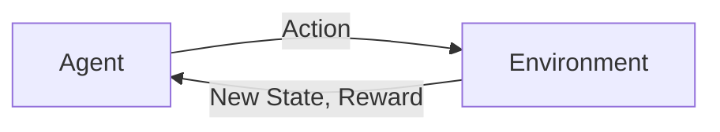

# 强化学习Reinforcement Learning在自然语言处理的前沿进展

## 1.背景介绍

### 1.1 自然语言处理概述

自然语言处理(Natural Language Processing, NLP)是人工智能领域的一个重要分支,旨在使计算机能够理解和生成人类语言。它涉及多个领域,包括计算机科学、语言学和认知科学等。自然语言处理的应用领域非常广泛,包括机器翻译、问答系统、文本摘要、情感分析、语音识别等。

### 1.2 强化学习简介  

强化学习(Reinforcement Learning, RL)是机器学习的一个重要分支,它通过与环境的交互来学习如何采取最优策略以maximizepayoff。与监督学习和无监督学习不同,强化学习没有提供标记的训练数据,而是通过试错来学习。

### 1.3 强化学习在NLP中的应用动机

传统的NLP任务通常被建模为监督学习问题,需要大量标注的训练数据。然而,获取高质量的标注数据往往是一项耗时且昂贵的工作。相比之下,强化学习可以通过与环境交互来学习,无需人工标注的数据,因此在一些NLP任务中具有潜在的优势。

## 2.核心概念与联系

### 2.1 强化学习的核心要素

强化学习包含四个核心要素:

1. **Agent(智能体)**: 执行动作并与环境交互的决策实体。
2. **Environment(环境)**: 智能体所处的外部世界,智能体的动作会影响环境的状态。
3. **State(状态)**: 环境在某个时间点的具体情况。
4. **Reward(奖励)**: 智能体获得的反馈信号,用于评估动作的好坏。

智能体的目标是通过与环境交互,学习一个策略(policy),使得在给定状态下采取的行动能够maximizepayoff。

### 2.2 强化学习在NLP中的应用

在NLP任务中,我们可以将智能体视为一个语言模型或对话系统,环境则是输入的文本或对话场景。智能体根据当前状态(如已生成的文本)采取动作(如生成新单词),并从环境获得奖励(如语言模型的对数似然)。通过不断与环境交互并优化策略,智能体可以学习生成高质量的文本或进行自然的对话交互。

一些典型的应用包括:

- 机器翻译
- 文本生成
- 对话系统
- 文本摘要
- 问答系统

## 3.核心算法原理具体操作步骤

强化学习在NLP中的应用通常采用以下步骤:

1. **建模环境**: 将NLP任务形式化为强化学习问题,定义状态、动作和奖励。
2. **初始化策略**: 初始化一个策略网络,如序列到序列模型。
3. **与环境交互**: 智能体根据当前策略与环境交互,获取奖励。
4. **策略优化**: 根据获得的奖励,使用强化学习算法(如策略梯度)优化策略网络的参数。
5. **重复交互和优化**: 重复步骤3和4,直到策略收敛。

一些常用的强化学习算法包括:

- **策略梯度(Policy Gradient)**: 直接优化策略网络的参数,使期望奖励最大化。
- **Actor-Critic**: 将策略网络(Actor)和价值网络(Critic)结合,利用价值网络的估计来减少策略梯度的方差。
- **Q-Learning**: 直接学习状态-动作值函数,选择具有最大Q值的动作。

### 3.1 策略梯度算法

策略梯度算法是强化学习中一种常用的算法,它直接优化策略网络的参数,使期望奖励最大化。算法步骤如下:

1. 初始化策略网络参数 $\theta$
2. 对于每个episode:
    - 初始化状态 $s_0$
    - 对于每个时间步 $t$:
        - 根据当前策略 $\pi_\theta(a_t|s_t)$ 采样动作 $a_t$
        - 执行动作 $a_t$,获取奖励 $r_t$ 和新状态 $s_{t+1}$
        - 计算回报 $R_t = \sum_{t'=t}^{T} \gamma^{t'-t} r_{t'}$ 
    - 计算策略梯度 $\nabla_\theta J(\theta) = \mathbb{E}_{\pi_\theta}[\sum_t \nabla_\theta \log \pi_\theta(a_t|s_t)R_t]$
    - 使用梯度上升法更新策略网络参数 $\theta \leftarrow \theta + \alpha \nabla_\theta J(\theta)$

其中 $\gamma$ 是折现因子,用于权衡当前奖励和未来奖励的重要性。

### 3.2 Actor-Critic算法

Actor-Critic算法将策略网络(Actor)和价值网络(Critic)结合,利用价值网络的估计来减少策略梯度的方差。算法步骤如下:

1. 初始化Actor网络参数 $\theta$ 和Critic网络参数 $\phi$
2. 对于每个episode:
    - 初始化状态 $s_0$
    - 对于每个时间步 $t$:
        - 根据Actor网络 $\pi_\theta(a_t|s_t)$ 采样动作 $a_t$
        - 执行动作 $a_t$,获取奖励 $r_t$ 和新状态 $s_{t+1}$
        - 计算TD误差 $\delta_t = r_t + \gamma V_\phi(s_{t+1}) - V_\phi(s_t)$
        - 计算Actor梯度 $\nabla_\theta J(\theta) = \mathbb{E}_{\pi_\theta}[\nabla_\theta \log \pi_\theta(a_t|s_t)\delta_t]$
        - 计算Critic梯度 $\nabla_\phi J(\phi) = \mathbb{E}[(\delta_t)^2]$
    - 使用梯度上升法更新Actor网络参数 $\theta \leftarrow \theta + \alpha_\theta \nabla_\theta J(\theta)$
    - 使用梯度下降法更新Critic网络参数 $\phi \leftarrow \phi - \alpha_\phi \nabla_\phi J(\phi)$

其中 $V_\phi(s)$ 是Critic网络对状态 $s$ 的价值估计。Actor网络根据Critic网络的估计来更新策略,而Critic网络则根据TD误差来更新价值估计。

## 4.数学模型和公式详细讲解举例说明

### 4.1 马尔可夫决策过程(MDP)

强化学习问题通常被形式化为马尔可夫决策过程(Markov Decision Process, MDP)。MDP由一个五元组 $(\mathcal{S}, \mathcal{A}, \mathcal{P}, \mathcal{R}, \gamma)$ 定义:

- $\mathcal{S}$: 状态空间
- $\mathcal{A}$: 动作空间
- $\mathcal{P}(s'|s,a)$: 转移概率,表示在状态 $s$ 下执行动作 $a$ 后转移到状态 $s'$ 的概率
- $\mathcal{R}(s,a)$: 奖励函数,表示在状态 $s$ 下执行动作 $a$ 获得的即时奖励
- $\gamma \in [0,1)$: 折现因子,用于权衡当前奖励和未来奖励的重要性

在NLP任务中,状态通常表示当前的文本或对话历史,动作表示生成新单词或回复,奖励可以是语言模型的对数似然或其他任务相关的指标。

### 4.2 价值函数和Q函数

在强化学习中,我们定义了两个重要的函数:价值函数(Value Function)和Q函数(Q-Function)。

**价值函数** $V^\pi(s)$ 表示在策略 $\pi$ 下,从状态 $s$ 开始执行后的期望回报:

$$V^\pi(s) = \mathbb{E}_\pi\left[\sum_{t=0}^\infty \gamma^t r_{t+1} \mid s_0 = s\right]$$

**Q函数** $Q^\pi(s,a)$ 表示在策略 $\pi$ 下,从状态 $s$ 执行动作 $a$ 后的期望回报:

$$Q^\pi(s,a) = \mathbb{E}_\pi\left[\sum_{t=0}^\infty \gamma^t r_{t+1} \mid s_0 = s, a_0 = a\right]$$

价值函数和Q函数可以通过贝尔曼方程(Bellman Equations)来计算:

$$V^\pi(s) = \sum_{a \in \mathcal{A}} \pi(a|s) \left(\mathcal{R}(s,a) + \gamma \sum_{s' \in \mathcal{S}} \mathcal{P}(s'|s,a) V^\pi(s')\right)$$

$$Q^\pi(s,a) = \mathcal{R}(s,a) + \gamma \sum_{s' \in \mathcal{S}} \mathcal{P}(s'|s,a) \sum_{a' \in \mathcal{A}} \pi(a'|s') Q^\pi(s',a')$$

在实践中,我们通常使用神经网络来近似价值函数和Q函数,并通过强化学习算法来优化网络参数。

### 4.3 策略梯度定理

策略梯度定理(Policy Gradient Theorem)为我们提供了直接优化策略的方法。定理表明,对于任意策略 $\pi_\theta$,其期望回报的梯度可以表示为:

$$\nabla_\theta J(\theta) = \mathbb{E}_{\pi_\theta}\left[\sum_{t=0}^\infty \nabla_\theta \log \pi_\theta(a_t|s_t) Q^{\pi_\theta}(s_t,a_t)\right]$$

其中 $J(\theta) = \mathbb{E}_{\pi_\theta}\left[\sum_{t=0}^\infty \gamma^t r_{t+1}\right]$ 是期望回报。

策略梯度定理为我们提供了一种基于Q函数的策略优化方法,即通过估计Q函数值,并在此基础上计算策略梯度,从而优化策略网络的参数。

### 4.4 Actor-Critic算法的数学原理

Actor-Critic算法将策略网络(Actor)和价值网络(Critic)结合,利用Critic网络的估计来减少策略梯度的方差。

Actor网络的目标是最大化期望回报:

$$\max_\theta J(\theta) = \mathbb{E}_{\pi_\theta}\left[\sum_{t=0}^\infty \gamma^t r_{t+1}\right]$$

根据策略梯度定理,我们可以计算Actor网络的梯度:

$$\nabla_\theta J(\theta) = \mathbb{E}_{\pi_\theta}\left[\sum_{t=0}^\infty \nabla_\theta \log \pi_\theta(a_t|s_t) Q^{\pi_\theta}(s_t,a_t)\right]$$

但是,直接计算 $Q^{\pi_\theta}(s_t,a_t)$ 是困难的,因此我们使用Critic网络 $V_\phi(s)$ 来近似价值函数,并定义TD误差(Temporal Difference Error)为:

$$\delta_t = r_t + \gamma V_\phi(s_{t+1}) - V_\phi(s_t)$$

TD误差可以看作是对 $Q^{\pi_\theta}(s_t,a_t)$ 的无偏估计。因此,我们可以使用TD误差来代替Q函数,得到Actor网络的梯度估计:

$$\nabla_\theta J(\theta) \approx \mathbb{E}_{\pi_\theta}\left[\sum_{t=0}^\infty \nabla_\theta \log \pi_\theta(a_t|s_t) \delta_t\right]$$

同时,我们可以通过最小化均方TD误差来优化Critic网络的参数:

$$\min_\phi J(\phi) = \mathbb{E}\left[\left(r_t + \gamma V_\phi(s_{t+1}) - V_\phi(s_t)\right)^2\right]$$

通过交替优化Actor网络和Critic网络,我们可以同时学习一个好的策略和价值函数估计。

## 5.项目实践：代码实例和详细解释说明

为了更好地理解强化学习在NLP中的应用,我们以文本生成任务为例,展示如何使用PyTorch实现一个基于Actor-Critic算法的文本生成模型。

### 5.1 环境建模

我们将文本生成任务建模为一个强化学习环境。智能体的目标是根据给定的起始文本,生成一段连贯、流畅的文本。

- 状态 $s_t$: 当前已生成的文本
- 动作 $a_t$: 生成下一个单词