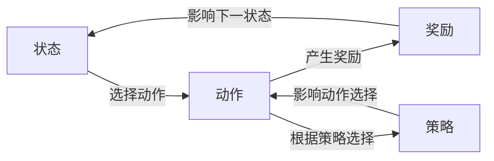

## 1.背景介绍

强化学习作为机器学习的一个重要分支，近年来在人工智能领域引起了广泛的关注。它的核心思想是通过学习和试错，找到在特定环境中实现预定目标的最佳行动策略。这种学习方式在许多实时动态决策制定的场景中有着广泛的应用，如自动驾驶、游戏AI、机器人控制等。

## 2.核心概念与联系

强化学习的核心概念包括状态(state)、动作(action)、奖励(reward)和策略(policy)。状态是描述环境的信息，动作是在给定状态下可以执行的决策，奖励是对动作的评估，策略则是在给定状态下选择动作的规则。这些概念之间的联系可以用下面的Mermaid流程图表示：



## 3.核心算法原理具体操作步骤

强化学习的核心算法主要包括值迭代(Value Iteration)、策略迭代(Policy Iteration)和Q学习(Q-Learning)。这些算法的共同目标是找到最优策略，即使得累积奖励最大的策略。

以值迭代为例，其具体操作步骤如下：

1. 初始化状态值函数
2. 对每一个状态，计算在所有可能动作下可能获得的奖励和下一状态的值，选择最大的一个作为当前状态的值
3. 重复步骤2，直到状态值函数收敛
4. 根据状态值函数，选择在每个状态下使得奖励加上下一状态值最大的动作，作为最优策略

## 4.数学模型和公式详细讲解举例说明

强化学习的数学模型主要基于马尔科夫决策过程(Markov Decision Process, MDP)，其核心是状态转移概率和奖励函数。

状态转移概率定义为$P_{ss'}^a = P[S_{t+1}=s'|S_t=s, A_t=a]$，表示在状态$s$下执行动作$a$后转移到状态$s'$的概率。

奖励函数定义为$R_s^a = E[R_{t+1}|S_t=s, A_t=a]$，表示在状态$s$下执行动作$a$后获得的期望奖励。

值迭代的更新公式为$V_{k+1}(s) = \max_a \sum_{s'} P_{ss'}^a (R_s^a + \gamma V_k(s'))$，其中$\gamma$是折扣因子，$V_k(s)$是在第$k$轮迭代后状态$s$的值。

## 5.项目实践：代码实例和详细解释说明

下面是一个使用Python和强化学习库Gym实现值迭代的简单示例：

```python
import numpy as np
import gym

def value_iteration(env, gamma=0.9, epsilon=1e-3):
    V = np.zeros(env.nS)
    while True:
        delta = 0
        for s in range(env.nS):
            v = V[s]
            V[s] = max(sum(p * (r + gamma * V[s_]) for p, s_, r, _ in env.P[s][a]) for a in range(env.nA))
            delta = max(delta, abs(v - V[s]))
        if delta < epsilon:
            break
    policy = np.zeros(env.nS, dtype=np.int)
    for s in range(env.nS):
        policy[s] = np.argmax([sum(p * (r + gamma * V[s_]) for p, s_, r, _ in env.P[s][a]) for a in range(env.nA)])
    return policy, V

env = gym.make('FrozenLake-v0')
policy, V = value_iteration(env)
print('Policy:', policy)
print('Value:', V)
```

## 6.实际应用场景

强化学习在许多实际应用场景中都有着广泛的应用，例如：

- 游戏AI：如AlphaGo就是通过强化学习算法学习围棋策略，并最终战胜了世界冠军。
- 自动驾驶：自动驾驶车辆可以通过强化学习学习驾驶策略，以实现安全且高效的驾驶。
- 机器人控制：机器人可以通过强化学习学习各种复杂的控制策略，如行走、跑步、跳跃等。

## 7.工具和资源推荐

- Gym：OpenAI开源的强化学习环境库，提供了许多预定义的环境，如倒立摆、山车等。
- RLlib：基于Ray的强化学习库，支持多种强化学习算法，并且可以方便地进行分布式训练。
- Stable Baselines：一套高质量的强化学习算法实现，包括A2C、PPO、DQN等。

## 8.总结：未来发展趋势与挑战

强化学习作为人工智能的重要研究方向，未来有着广阔的发展前景。但同时也面临着许多挑战，如样本效率低、需要大量的计算资源、难以处理部分可观察环境等。

## 9.附录：常见问题与解答

Q: 强化学习和监督学习有什么区别？

A: 强化学习和监督学习的主要区别在于，强化学习是通过与环境的交互进行学习，而监督学习则是通过已知的输入输出对进行学习。

Q: 强化学习适用于哪些问题？

A: 强化学习主要适用于需要通过连续的决策来达到某个目标的问题，如游戏、机器人控制等。

Q: 强化学习的主要挑战是什么？

A: 强化学习的主要挑战包括样本效率低、需要大量的计算资源、难以处理部分可观察环境等。

作者：禅与计算机程序设计艺术 / Zen and the Art of Computer Programming