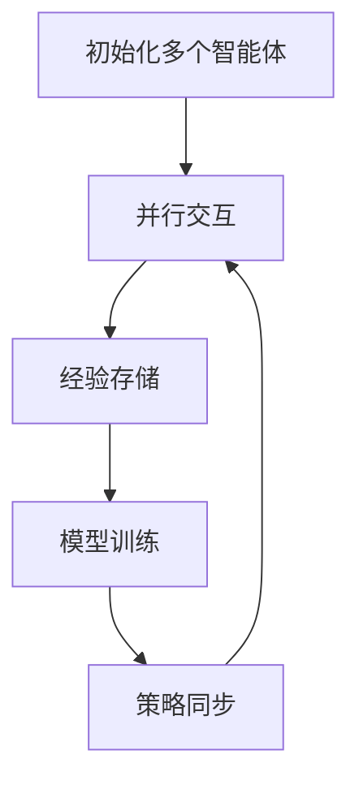
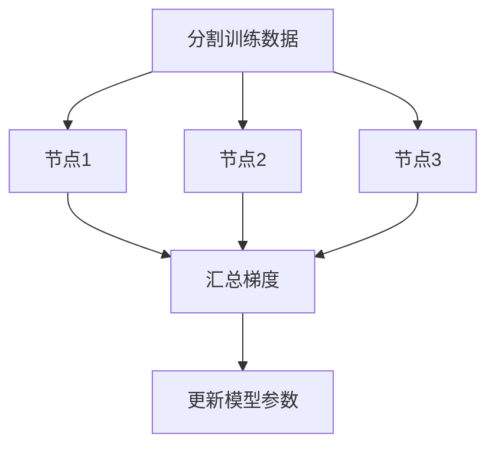
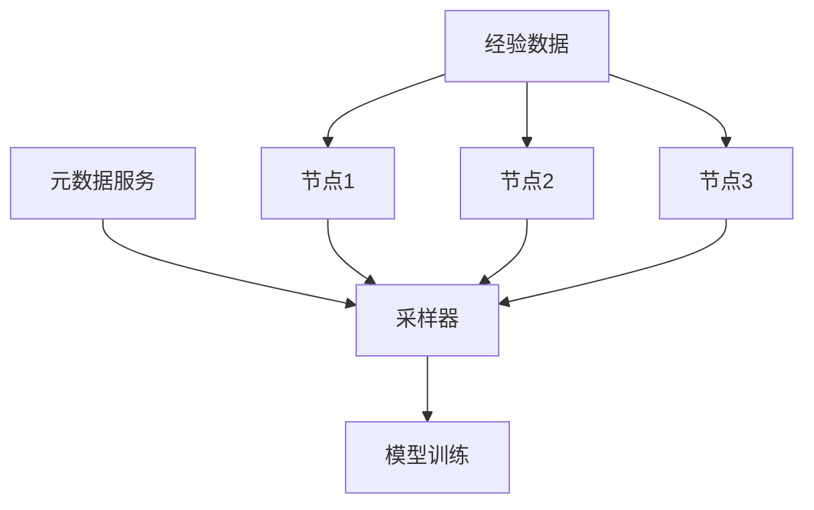
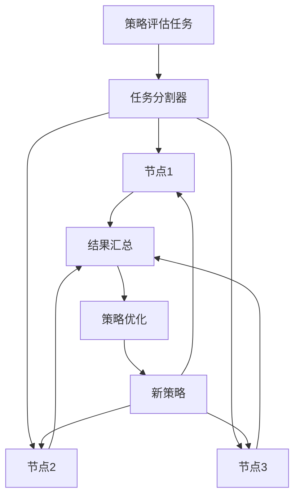

# 强化学习Reinforcement Learning的并行与分布式实现方案

## 1.背景介绍

### 1.1 强化学习概述

强化学习(Reinforcement Learning, RL)是机器学习的一个重要分支,旨在让智能体(Agent)通过与环境(Environment)的持续交互来学习如何采取最优策略,从而获得最大的累积奖励。与监督学习不同,强化学习没有给定的输入-输出样本对,而是通过试错和奖惩机制来学习。

强化学习的核心思想是基于马尔可夫决策过程(Markov Decision Process, MDP),通过状态、动作和奖励三个要素来描述环境。智能体根据当前状态选择动作,环境会根据这个动作转移到新的状态并给出相应的奖励。智能体的目标是学习一个策略(Policy),使得在给定状态下采取的动作序列能够最大化预期的累积奖励。

### 1.2 并行与分布式实现的必要性

随着强化学习算法和应用场景的复杂度不断增加,单机训练已经无法满足实际需求。引入并行与分布式实现可以显著提高训练效率,加快收敛速度,并支持大规模的环境和模型。主要原因包括:

1. **计算资源需求增加**:复杂环境和大型神经网络模型需要更多的计算资源,单机无法提供足够的计算能力。
2. **数据并行**:通过多个智能体并行探索环境,可以收集更多的经验数据,加速学习过程。
3. **模型并行**:将大型神经网络模型分布在多个计算节点上,可以加速模型训练和推理。
4. **异构计算**:利用CPU、GPU等异构硬件资源,可以更好地利用计算能力。

因此,并行与分布式实现对于强化学习的发展至关重要,可以突破单机计算能力的限制,实现更高效、更快速的训练。

## 2.核心概念与联系

### 2.1 并行与分布式计算概念

- **并行计算**(Parallel Computing):同时利用多个计算资源(如CPU核心、GPU等)来解决一个问题的计算方式。
- **分布式计算**(Distributed Computing):将一个大型计算问题分解为多个小任务,分布到多个计算节点上执行,最后将结果合并。

并行计算和分布式计算虽然有所区别,但在实现上往往是相辅相成的。分布式系统中的每个节点通常也会利用并行计算来充分利用本地资源。

### 2.2 并行与分布式强化学习

在强化学习中,并行与分布式实现主要体现在以下几个方面:

1. **并行环境交互**:多个智能体同时与环境进行交互,收集更多的经验数据。
2. **并行模型训练**:将神经网络模型分布在多个计算节点上,并行训练模型参数。
3. **分布式经验存储**:将收集到的经验数据分布存储在多个节点上,供模型训练使用。
4. **分布式策略评估**:将策略评估任务分布到多个节点上,加速策略优化过程。

这些并行与分布式技术的应用,可以显著提高强化学习算法的计算效率和扩展性,使其能够应对更复杂的环境和更大规模的模型。

## 3.核心算法原理具体操作步骤

### 3.1 并行环境交互

并行环境交互是强化学习中最常见的并行方式,其核心思想是使用多个智能体同时与环境进行交互,收集更多的经验数据。具体操作步骤如下:

1. **初始化多个智能体**:根据需求创建多个智能体实例,每个智能体都有自己的策略网络。
2. **并行交互**:多个智能体同时与环境进行交互,每个智能体根据当前状态选择动作,环境返回下一个状态和奖励。
3. **经验存储**:将每个智能体收集到的经验数据(状态、动作、奖励、下一状态)存储到经验池(Experience Replay Buffer)中。
4. **模型训练**:从经验池中采样批次数据,并行更新每个智能体的策略网络参数。
5. **策略同步**:定期将所有智能体的策略网络参数同步到一个全局网络中,确保策略的一致性。

这种并行方式可以显著加快探索过程,收集更多的经验数据,从而加速模型的训练和收敛。但也需要注意智能体之间的策略同步问题,以及经验池的管理和采样策略。

### 3.2 并行模型训练

对于大型神经网络模型,单机训练往往无法满足计算资源需求。并行模型训练通过将模型分布在多个计算节点上,利用多个GPU或TPU等加速器进行并行训练,可以显著提高训练效率。常见的并行训练方式包括:

1. **数据并行**(Data Parallelism):将训练数据分割到多个节点上,每个节点计算模型梯度的一部分,然后汇总梯度并更新模型参数。
2. **模型并行**(Model Parallelism):将神经网络模型分割到多个节点上,每个节点计算模型的一部分,最后将结果合并。
3. **混合并行**(Hybrid Parallelism):结合数据并行和模型并行,将模型和数据同时分布到多个节点上进行并行计算。

并行模型训练需要解决一些关键问题,如梯度同步、通信开销、负载均衡等。常见的实现框架包括TensorFlow分布式策略、PyTorch分布式数据并行等。

### 3.3 分布式经验存储

在强化学习中,智能体与环境的交互会产生大量的经验数据,需要存储这些数据供模型训练使用。当数据量很大时,单机存储就会成为瓶颈。分布式经验存储通过将经验数据分布存储在多个节点上,可以解决单机存储容量有限的问题。

具体操作步骤如下:

1. **分片存储**:将经验数据按照某种策略(如时间片、环境ID等)分片存储到多个节点上。
2. **元数据管理**:维护一个元数据服务,记录每个节点存储的数据范围和位置信息。
3. **数据采样**:根据元数据信息,从多个节点并行采样经验数据,组成一个批次用于模型训练。
4. **数据一致性**:确保经验数据在多个节点之间的一致性,避免数据丢失或重复。

常见的分布式经验存储方案包括基于文件系统(如HDFS)的存储、基于数据库(如Redis)的存储等。选择合适的存储方案需要考虑数据量、访问模式、一致性要求等因素。

### 3.4 分布式策略评估

在强化学习中,策略评估是一个计算密集型任务,需要对每个状态-动作对进行价值估计。当环境和策略规模很大时,单机评估就会成为瓶颈。分布式策略评估通过将评估任务分布到多个节点上,可以加速评估过程。

具体操作步骤如下:

1. **任务分割**:将策略评估任务按照状态空间或动作空间进行分割,分配给多个计算节点。
2. **并行评估**:多个节点并行对分配的状态-动作对进行价值估计。
3. **结果汇总**:将各个节点的评估结果汇总,得到完整的策略评估结果。
4. **策略优化**:根据评估结果,优化策略参数,并将新策略分发到各个节点。

分布式策略评估可以充分利用集群资源,显著提高评估效率。但也需要注意任务分割的均衡性、结果汇总的一致性等问题。常见的实现框架包括Apache Spark、Dask等。

## 4.数学模型和公式详细讲解举例说明

### 4.1 马尔可夫决策过程(MDP)

强化学习的数学基础是马尔可夫决策过程(Markov Decision Process, MDP)。MDP是一种用于描述序列决策问题的数学框架,由以下几个要素组成:

- 状态集合 $\mathcal{S}$
- 动作集合 $\mathcal{A}$
- 转移概率 $\mathcal{P}_{ss'}^a = \mathbb{P}[S_{t+1}=s'|S_t=s, A_t=a]$
- 奖励函数 $\mathcal{R}_s^a = \mathbb{E}[R_{t+1}|S_t=s, A_t=a]$
- 折扣因子 $\gamma \in [0, 1)$

其中,转移概率 $\mathcal{P}_{ss'}^a$ 表示在状态 $s$ 执行动作 $a$ 后,转移到状态 $s'$ 的概率。奖励函数 $\mathcal{R}_s^a$ 表示在状态 $s$ 执行动作 $a$ 后,期望获得的即时奖励。折扣因子 $\gamma$ 用于权衡即时奖励和长期累积奖励的重要性。

在 MDP 中,智能体的目标是找到一个策略 $\pi: \mathcal{S} \rightarrow \mathcal{A}$,使得在任意初始状态 $s_0$ 下,期望的累积折扣奖励最大化:

$$
\max_\pi \mathbb{E}_\pi \left[ \sum_{t=0}^\infty \gamma^t R_{t+1} \right]
$$

这个目标可以通过值函数 $V^\pi(s)$ 或者动作值函数 $Q^\pi(s, a)$ 来表示,它们分别定义为:

$$
V^\pi(s) = \mathbb{E}_\pi \left[ \sum_{t=0}^\infty \gamma^t R_{t+1} | S_0=s \right]
$$

$$
Q^\pi(s, a) = \mathbb{E}_\pi \left[ \sum_{t=0}^\infty \gamma^t R_{t+1} | S_0=s, A_0=a \right]
$$

强化学习算法通过估计值函数或动作值函数,并基于这些估计值来优化策略,从而解决 MDP 问题。

### 4.2 策略梯度算法

策略梯度(Policy Gradient)算法是强化学习中一种常用的基于策略优化的方法,它直接对策略进行参数化,并通过梯度上升的方式优化策略参数,使累积奖励最大化。

假设策略 $\pi_\theta$ 由参数 $\theta$ 参数化,我们希望找到一组参数 $\theta^*$,使得期望的累积奖励最大化:

$$
\theta^* = \arg\max_\theta \mathbb{E}_{\tau \sim \pi_\theta} \left[ \sum_{t=0}^\infty \gamma^t R(\tau) \right]
$$

其中,$ \tau = (s_0, a_0, s_1, a_1, \dots)$ 表示一个由状态和动作组成的轨迹序列,$ R(\tau) = \sum_{t=0}^\infty \gamma^t r_t$ 是该轨迹的累积奖励。

根据策略梯度定理,我们可以计算目标函数关于策略参数 $\theta$ 的梯度:

$$
\nabla_\theta \mathbb{E}_{\tau \sim \pi_\theta} \left[ R(\tau) \right] = \mathbb{E}_{\tau \sim \pi_\theta} \left[ \sum_{t=0}^\infty \nabla_\theta \log \pi_\theta