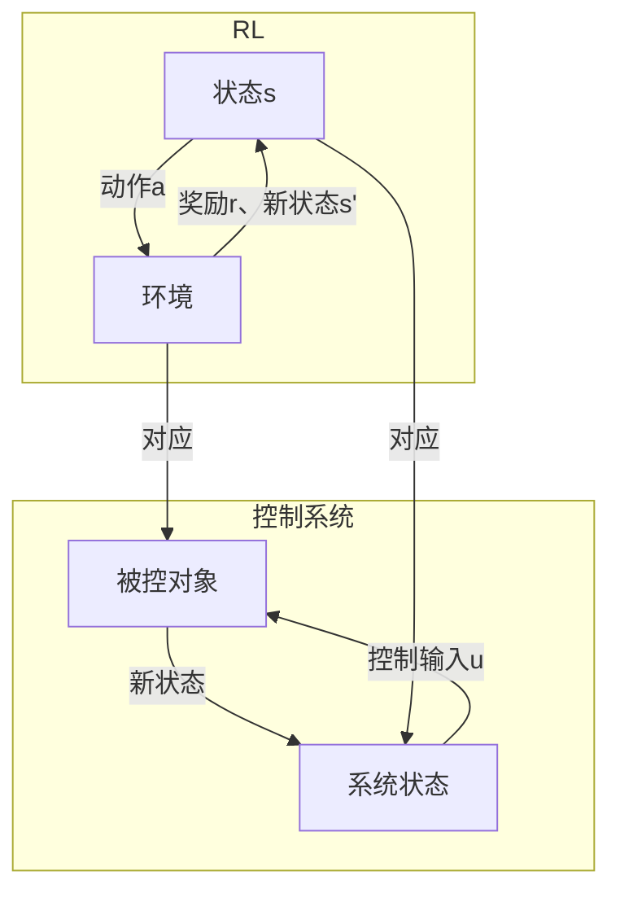

# 强化学习与自适应控制原理与代码实战案例讲解

## 1.背景介绍

### 1.1 什么是强化学习

强化学习(Reinforcement Learning, RL)是机器学习的一个重要分支,它研究如何基于环境反馈来学习行为策略,以最大化长期累积奖励。不同于监督学习需要提供正确答案的标注数据,强化学习通过与环境的交互来学习,agent根据当前状态采取行动,环境会给出相应的反馈(奖励或惩罚),agent的目标是学习一个策略,使长期累积奖励最大化。

### 1.2 强化学习在控制领域的应用

控制理论是自动化和人工智能领域的基础,传统控制理论主要关注如何设计控制器使系统稳定并达到理想状态。而强化学习为控制系统的设计提供了新的思路,通过与环境交互来学习最优控制策略,无需精确建模,具有很强的适应性和鲁棒性。

近年来,强化学习在自适应控制、机器人控制、过程控制等领域取得了重大进展,展现出巨大的应用潜力。本文将介绍强化学习与自适应控制的原理及实战案例,帮助读者全面掌握这一前沿技术。

## 2.核心概念与联系  

### 2.1 强化学习基本概念

强化学习问题通常建模为马尔可夫决策过程(MDP):

- 状态(State) $s \in \mathcal{S}$
- 动作(Action) $a \in \mathcal{A}(s)$  
- 转移概率(Transition Probability) $\mathcal{P}_{ss'}^a = \Pr(s' | s, a)$
- 奖励函数(Reward Function) $\mathcal{R}_s^a = \mathbb{E}[R|s, a]$

目标是找到一个策略(Policy) $\pi: \mathcal{S} \rightarrow \mathcal{A}$,使得期望的长期累积奖励最大:

$$
\max_\pi \mathbb{E}_\pi \left[ \sum_{t=0}^\infty \gamma^t R_{t+1} \right]
$$

其中$\gamma \in [0, 1)$是折现因子,用于权衡当前奖励和未来奖励的重要性。

### 2.2 自适应控制与强化学习

自适应控制(Adaptive Control)是一种针对时变系统或存在参数不确定性的控制方法,通过在线估计系统参数并调整控制器参数来实现优化性能。传统自适应控制方法需要显式建模和参数估计,而强化学习通过与环境交互直接学习最优控制策略,无需精确模型,具有更强的适应性和鲁棒性。

将强化学习应用于自适应控制系统时,可将控制系统视为一个MDP:

- 状态 $s$: 系统状态变量
- 动作 $a$: 控制输入
- 转移概率 $\mathcal{P}_{ss'}^a$: 由系统动力学方程确定
- 奖励函数 $\mathcal{R}_s^a$: 根据控制目标设计,如能耗、跟踪误差等

通过与系统交互,强化学习算法可学习到一个最优控制策略 $\pi^*(s)$,使得在满足约束条件下,长期累积奖励最大化。

上图展示了强化学习与自适应控制系统之间的对应关系,强化学习agent与控制系统的交互过程类似,只是被控对象的动力学无需显式建模。

## 3.核心算法原理具体操作步骤

### 3.1 价值函数和Bellman方程

在强化学习中,我们通常使用价值函数(Value Function)来评估一个策略的好坏。状态价值函数 $V^\pi(s)$ 表示在策略 $\pi$ 下,从状态 $s$ 开始,期望的长期累积奖励:

$$
V^\pi(s) = \mathbb{E}_\pi \left[ \sum_{t=0}^\infty \gamma^t R_{t+1} | s_0 = s \right]
$$

类似地,状态-动作价值函数 $Q^\pi(s, a)$ 表示在策略 $\pi$ 下,从状态 $s$ 执行动作 $a$,期望的长期累积奖励。

价值函数满足著名的Bellman方程:

$$
\begin{aligned}
V^\pi(s) &= \sum_{a} \pi(a|s) \left( \mathcal{R}_s^a + \gamma \sum_{s'} \mathcal{P}_{ss'}^a V^\pi(s') \right) \\
Q^\pi(s, a) &= \mathcal{R}_s^a + \gamma \sum_{s'} \mathcal{P}_{ss'}^a \sum_{a'} \pi(a'|s') Q^\pi(s', a')
\end{aligned}
$$

Bellman方程为求解价值函数提供了理论基础,也是许多强化学习算法的核心。

### 3.2 动态规划算法

如果已知MDP的完整模型(转移概率和奖励函数),我们可以使用动态规划算法来求解最优策略和价值函数。

- 价值迭代(Value Iteration): 通过不断更新Bellman方程来计算最优价值函数 $V^*(s)$,最优策略为 $\pi^*(s) = \arg\max_a Q^*(s, a)$。
- 策略迭代(Policy Iteration): 先初始化一个策略 $\pi_0$,然后交替执行策略评估(计算 $V^{\pi_k}$)和策略改进(令 $\pi_{k+1}(s) = \arg\max_a Q^{\pi_k}(s, a)$),直至收敛到最优策略 $\pi^*$。

动态规划算法虽然有理论保证,但需要已知MDP的完整模型,并且在状态空间很大时计算代价高昂,因此在实际应用中受到一定限制。

### 3.3 时序差分学习算法

如果无法获得MDP的完整模型,我们可以使用时序差分(Temporal Difference, TD)学习算法,通过与环境交互采样数据来估计价值函数。

- SARSA: 基于 $Q(s, a)$ 的在线TD控制算法,使用实际采样的转移来更新 $Q$ 值。
- Q-Learning: 另一种基于 $Q(s, a)$ 的TD控制算法,使用最大化的 $Q$ 值来更新,更新规则为:

$$
Q(s_t, a_t) \leftarrow Q(s_t, a_t) + \alpha \left[ r_{t+1} + \gamma \max_{a'} Q(s_{t+1}, a') - Q(s_t, a_t) \right]
$$

时序差分算法无需事先知道MDP的完整模型,通过在线采样数据来逐步更新价值函数估计,具有很强的适应性。但在状态空间很大时,依然存在维数灾难问题。

### 3.4 函数逼近与深度强化学习

为了应对高维状态空间,我们可以使用函数逼近的方法来估计价值函数或策略,如线性函数逼近、核方法、决策树等。近年来,结合深度神经网络的深度强化学习(Deep RL)取得了突破性进展,能够在高维连续空间中高效学习,显著提高了强化学习的能力。

深度Q网络(DQN)是第一个成功的深度强化学习算法,使用深度神经网络来逼近 $Q(s, a)$ 函数。随后,各种新算法如策略梯度、Actor-Critic、深度确定性策略梯度等不断问世,极大推动了强化学习的发展。

## 4.数学模型和公式详细讲解举例说明  

### 4.1 马尔可夫决策过程

马尔可夫决策过程(Markov Decision Process, MDP)是强化学习问题的数学模型,由一个五元组 $(\mathcal{S}, \mathcal{A}, \mathcal{P}, \mathcal{R}, \gamma)$ 表示:

- $\mathcal{S}$: 有限状态集合
- $\mathcal{A}$: 有限动作集合
- $\mathcal{P}_{ss'}^a = \Pr(s'|s, a)$: 状态转移概率
- $\mathcal{R}_s^a = \mathbb{E}[R|s, a]$: 奖励函数
- $\gamma \in [0, 1)$: 折现因子

MDP的目标是找到一个策略 $\pi: \mathcal{S} \rightarrow \mathcal{A}$,使得期望的长期累积奖励最大化:

$$
\max_\pi \mathbb{E}_\pi \left[ \sum_{t=0}^\infty \gamma^t R_{t+1} \right]
$$

对于有限MDP,我们可以证明存在一个确定性的最优策略 $\pi^*$,它对应的价值函数 $V^*(s)$ 和 $Q^*(s, a)$ 满足Bellman最优性方程:

$$
\begin{aligned}
V^*(s) &= \max_a \left( \mathcal{R}_s^a + \gamma \sum_{s'} \mathcal{P}_{ss'}^a V^*(s') \right) \\
Q^*(s, a) &= \mathcal{R}_s^a + \gamma \sum_{s'} \mathcal{P}_{ss'}^a \max_{a'} Q^*(s', a')
\end{aligned}
$$

### 4.2 时序差分学习

时序差分(Temporal Difference, TD)学习是一种基于采样数据的强化学习算法,用于估计价值函数。

考虑一个状态-动作对 $(s_t, a_t)$,执行动作后获得奖励 $r_{t+1}$ 并转移到新状态 $s_{t+1}$。TD误差定义为:

$$
\delta_t = r_{t+1} + \gamma V(s_{t+1}) - V(s_t)
$$

我们可以用TD误差来更新价值函数估计:

$$
V(s_t) \leftarrow V(s_t) + \alpha \delta_t
$$

其中 $\alpha$ 是学习率。这种基于采样数据的在线更新方式,使TD学习算法无需事先知道MDP的完整模型,具有很强的适应性。

Q-Learning是一种基于TD的算法,通过估计 $Q(s, a)$ 函数来学习最优策略。更新规则为:

$$
Q(s_t, a_t) \leftarrow Q(s_t, a_t) + \alpha \left[ r_{t+1} + \gamma \max_{a'} Q(s_{t+1}, a') - Q(s_t, a_t) \right]
$$

### 4.3 策略梯度算法

策略梯度(Policy Gradient)算法直接对策略 $\pi_\theta(s, a)$ (由参数 $\theta$ 确定)进行优化,目标是最大化期望的长期累积奖励:

$$
J(\theta) = \mathbb{E}_{\pi_\theta} \left[ \sum_{t=0}^\infty \gamma^t R_{t+1} \right]
$$

根据策略梯度定理,我们可以计算梯度:

$$
\nabla_\theta J(\theta) = \mathbb{E}_{\pi_\theta} \left[ \sum_{t=0}^\infty \nabla_\theta \log \pi_\theta(a_t|s_t) Q^{\pi_\theta}(s_t, a_t) \right]
$$

然后使用梯度上升法更新策略参数 $\theta$。

REINFORCE算法是一种基于采样数据估计策略梯度的蒙特卡罗方法。为了减小方差,我们可以使用基线函数 $b(s)$ 对梯度进行减偏:

$$
\nabla_\theta J(\theta) \approx \sum_{t=0}^T \nabla_\theta \log \pi_\theta(a_t|s_t) \left( \sum_{k=t}^T \gamma^{k-t} r_k - b(s_t) \right)
$$

Actor-Critic算法将策略梯度与时序差分学习相结合,使用一个critic网络来估计价值函数,作为策略梯度的基线,从而进一步减小方差。

## 5.项目实践:代码实例和详细解释说明

### 5.1 Q-Learning实例:小车上山

我们以一个经典的小车上山(Mountain Car)问题为例,演示Q-Learning算法的实现。

问题描述:一辆无力小车停在一个山谷中,它的目标是到达山顶。由于发动机力量很小,每次只能获得有限的速度增量。我们需要控制车辆的推力方向