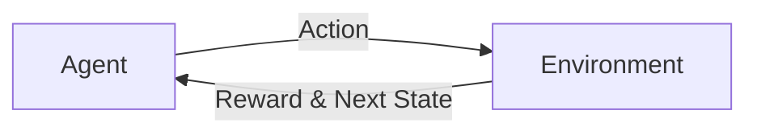
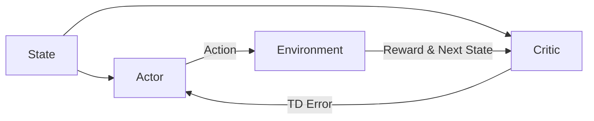

非常感谢您的任务要求!作为一位世界级人工智能专家,我很荣幸能为您撰写这篇关于强化学习算法Actor-Critic的技术博客文章。下面我将严格按照您的要求,以专业、清晰、易懂的方式,对Actor-Critic算法的原理和代码实现进行深入讲解。

# 强化学习算法：Actor-Critic 原理与代码实例讲解

## 1. 背景介绍
### 1.1 强化学习概述
强化学习(Reinforcement Learning,RL)是机器学习的一个重要分支,它研究如何让智能体(Agent)通过与环境的交互来学习最优策略,以获得最大的累积奖励。与监督学习和非监督学习不同,强化学习并不需要预先准备好训练数据,而是通过探索(Exploration)和利用(Exploitation)来不断试错,从而逐步提升智能体的决策能力。

强化学习的基本框架包括:
- 智能体(Agent):负责与环境交互并做出决策的主体
- 环境(Environment):智能体所处的环境,提供观察(Observation)和奖励(Reward)
- 状态(State):环境的内部状态
- 动作(Action):智能体根据当前状态采取的行为
- 策略(Policy):将状态映射到动作的函数,决定了智能体的行为模式
- 值函数(Value Function):评估状态的好坏,即在某个状态下能获得的期望累积奖励
- 奖励函数(Reward Function):量化智能体行为的好坏,是优化目标

智能体与环境不断交互的过程可以用如下的 Mermaid 流程图表示:

### 1.2 Actor-Critic 算法产生背景
传统的强化学习算法大致可以分为两类:
1. 基于值函数(Value-based)的方法,如 Q-learning,通过学习值函数来选择动作。这类方法的优点是收敛性好,但对连续动作空间难以处理。
2. 基于策略(Policy-based)的方法,如 REINFORCE,直接对策略函数进行优化。这类方法适用于连续动作空间,但通常收敛速度慢,方差大。

Actor-Critic 算法正是结合了这两类方法的优点,同时学习值函数和策略函数,互相配合,相得益彰。Actor 负责生成动作,Critic 负责评估动作的好坏,指导 Actor 进行策略改进。Actor-Critic 框架如下图所示:

## 2. 核心概念与联系
### 2.1 马尔可夫决策过程(MDP)
要理解 Actor-Critic,首先需要引入马尔可夫决策过程(Markov Decision Process,MDP)的概念。MDP 是一个五元组 $\langle \mathcal{S}, \mathcal{A}, \mathcal{P}, \mathcal{R}, \gamma \rangle$,其中:
- $\mathcal{S}$ 是有限的状态集
- $\mathcal{A}$ 是有限的动作集  
- $\mathcal{P}$ 是状态转移概率矩阵,$\mathcal{P}_{ss'}^a=P(S_{t+1}=s'|S_t=s,A_t=a)$
- $\mathcal{R}$ 是奖励函数,$\mathcal{R}_s^a=\mathbb{E}[R_{t+1}|S_t=s,A_t=a]$
- $\gamma\in[0,1]$ 是折扣因子,表示对未来奖励的重视程度

MDP 的目标是寻找一个最优策略 $\pi^*$,使得智能体能获得最大的期望累积奖励:

$$\pi^*=\arg\max_\pi \mathbb{E}[\sum_{t=0}^\infty \gamma^t R_t | \pi] $$

### 2.2 策略、值函数与优势函数
- 策略 $\pi(a|s)=P(A_t=a|S_t=s)$ 定义了在状态 $s$ 下选择动作 $a$ 的概率。
- 状态值函数 $V^\pi(s)=\mathbb{E}[\sum_{k=0}^\infty \gamma^k R_{t+k} | S_t=s,\pi]$ 表示从状态 $s$ 开始,遵循策略 $\pi$ 能获得的期望回报。 
- 动作值函数 $Q^\pi(s,a)=\mathbb{E}[\sum_{k=0}^\infty \gamma^k R_{t+k} | S_t=s,A_t=a,\pi]$ 表示在状态 $s$ 下采取动作 $a$,然后遵循策略 $\pi$ 能获得的期望回报。
- 优势函数 $A^\pi(s,a)=Q^\pi(s,a)-V^\pi(s)$ 表示在状态 $s$ 下采取动作 $a$ 相对于遵循策略 $\pi$ 的优势。

值函数和策略函数满足如下的 Bellman 方程:

$$V^\pi(s)=\sum_a \pi(a|s)Q^\pi(s,a)$$

$$Q^\pi(s,a)=\mathcal{R}_s^a+\gamma \sum_{s'}\mathcal{P}_{ss'}^a V^\pi(s')$$

策略的性能可以用策略梯度定理(Policy Gradient Theorem)来衡量:

$$\nabla_\theta J(\pi_\theta)=\mathbb{E}_{s\sim d^\pi,a\sim\pi_\theta}[\nabla_\theta \log\pi_\theta(a|s)Q^\pi(s,a)]$$

其中 $J(\pi_\theta)$ 表示策略 $\pi_\theta$ 的期望累积奖励,$d^\pi$ 是遵循策略 $\pi$ 的状态分布。

### 2.3 Actor-Critic 算法思想
Actor-Critic 算法借鉴了策略梯度和值函数估计的思想:
- Actor 即策略网络 $\pi_\theta(a|s)$,用于生成动作。Actor 的目标是最大化期望回报 $J(\theta)$。
- Critic 即值函数网络 $V^{\pi_\theta}(s)$ 或 $Q^{\pi_\theta}(s,a)$,用于评估状态或动作的价值,为 Actor 的优化提供引导。Critic 的目标是最小化值函数估计误差。

Actor 根据 Critic 的反馈不断更新策略,使得能够生成高价值的动作。Critic 根据 Actor 与环境交互的轨迹数据不断更新值函数,使得能够准确评估策略的性能。二者相互促进,最终收敛到最优策略。

## 3. 核心算法原理与具体步骤
### 3.1 策略梯度定理推导
为了优化 Actor 的策略网络参数 $\theta$,需要计算目标函数 $J(\theta)$ 对 $\theta$ 的梯度。根据策略梯度定理:

$$\nabla_\theta J(\pi_\theta) =\int_\mathcal{S} d^\pi(s)\int_\mathcal{A} \nabla_\theta\pi_\theta(a|s)Q^\pi(s,a) \,da\,ds$$

$$=\int_\mathcal{S} d^\pi(s)\int_\mathcal{A} \pi_\theta(a|s)\nabla_\theta\log\pi_\theta(a|s)Q^\pi(s,a) \,da\,ds$$

$$=\mathbb{E}_{s\sim d^\pi,a\sim\pi_\theta}[\nabla_\theta \log\pi_\theta(a|s)Q^\pi(s,a)]$$

上式的推导用到了对数导数技巧: $\nabla_\theta\pi_\theta(a|s)=\pi_\theta(a|s)\nabla_\theta\log\pi_\theta(a|s)$。

实际应用中,我们通过采样轨迹的方式来估计梯度:

$$\nabla_\theta J(\theta) \approx \frac{1}{N} \sum_{i=1}^N \sum_{t=0}^{T-1} \nabla_\theta \log \pi_\theta(a_{i,t}|s_{i,t}) \hat{Q}(s_{i,t},a_{i,t})$$

其中 $N$ 是采样轨迹的数量,$T$ 是每条轨迹的长度,$\hat{Q}$ 是对动作值函数的无偏估计。

### 3.2 Critic 更新
Critic 的作用是估计值函数,为 Actor 提供更新方向。常见的 Critic 更新方法有:

#### 3.2.1 蒙特卡洛估计
使用蒙特卡洛方法,根据采样轨迹计算累积回报作为值函数的无偏估计:

$$\hat{Q}(s_t,a_t)=\sum_{k=0}^{T-t-1} \gamma^k r_{t+k+1}$$

优点是估计准确,缺点是方差大。

#### 3.2.2 时序差分学习
使用时序差分(Temporal Difference,TD)方法,根据 Bellman 方程更新值函数:

$$\hat{Q}(s_t,a_t)=r_{t+1}+\gamma V(s_{t+1})$$

其中 $V$ 是当前值函数网络的输出。TD 方法能够在线学习,方差小,但可能有偏。

#### 3.2.3 优势函数估计
使用优势函数 $A(s,a)=Q(s,a)-V(s)$ 替代 $Q(s,a)$ 用于策略梯度估计,能够减小方差:

$$\nabla_\theta J(\theta) \approx \frac{1}{N} \sum_{i=1}^N \sum_{t=0}^{T-1} \nabla_\theta \log \pi_\theta(a_{i,t}|s_{i,t}) \hat{A}(s_{i,t},a_{i,t})$$

其中 $\hat{A}$ 是优势函数的估计,例如:

$$\hat{A}(s_t,a_t)=r_{t+1}+\gamma V(s_{t+1})-V(s_t)$$

这种做法结合了 Actor-Critic 和 TD 误差,被称为 Advantage Actor-Critic(A2C)。

### 3.3 Actor-Critic 算法流程
结合上述思想,Actor-Critic 算法的具体流程如下:
1. 随机初始化 Actor 网络 $\pi_\theta$ 和 Critic 网络 $V_\phi$ 的参数 $\theta,\phi$
2. for iteration=1,2,...,max_iterations do
3.    采样 N 条轨迹 $\{s_{i,0},a_{i,0},r_{i,1},s_{i,1},a_{i,1},\dots,r_{i,T},s_{i,T} \}_{i=1}^N$
4.    for i=1,2,...,N do
5.        for t=0,1,...,T-1 do
6.            计算优势函数估计 $\hat{A}(s_{i,t},a_{i,t})$
7.        end for
8.    end for
9.    计算策略梯度 $\hat{g} \leftarrow \frac{1}{N} \sum_{i=1}^N \sum_{t=0}^{T-1} \nabla_\theta \log \pi_\theta(a_{i,t}|s_{i,t}) \hat{A}(s_{i,t},a_{i,t})$
10.   更新 Actor 参数 $\theta \leftarrow \theta + \alpha \hat{g}$
11.   计算值函数损失 $\mathcal{L}(\phi)=\frac{1}{NT}\sum_{i=1}^N\sum_{t=0}^{T-1}(V_\phi(s_{i,t})-\hat{V}(s_{i,t}))^2$
12.   更新 Critic 参数 $\phi \leftarrow \phi - \beta \nabla_\phi \mathcal{L}(\phi)$
13. end for

其中 $\alpha,\beta$ 是学习率,$\hat{V}$ 是值函数的蒙特卡洛估计。

## 4. 数学模型与公式详解
本节我们详细解释 Actor-Critic 涉及的几个关键公式。

### 4.1 策略梯度公式
$$\nabla_\theta J(\pi_\theta) =\mathbb{E}_{s\sim d^\pi,a\sim\pi_\theta}[\nabla_\theta \log\pi_\theta(a|s)Q^\pi(s,a)]$$

这个公式表示,策略 $\pi_\theta$ 的梯度等于在策略 $\pi_\theta$ 采样的轨迹上,每个状态-动作对 $(s,a)$ 的对数概率 $\log\pi_\theta(a|s)$ 乘以它的动作值函数 $Q^\pi(s,a)$ 的均值。

直观理解是,如果某个动作 $a$ 的 $Q$ 值越大,我们就越想要提高它的概率 $\pi_\theta(a|s)$,反之亦然。而 $\log\pi_\theta(a|