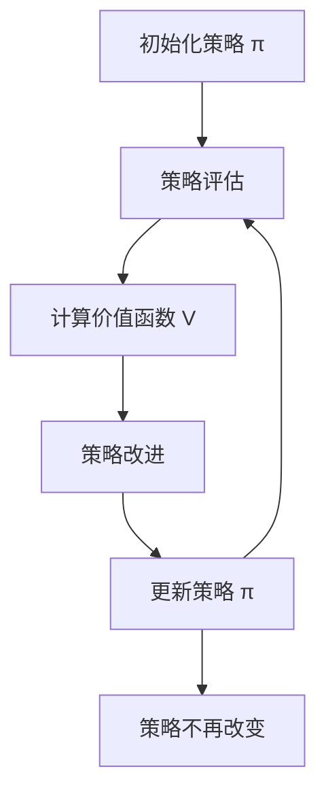

# 强化学习算法：动态规划 原理与代码实例讲解

## 1.背景介绍

强化学习（Reinforcement Learning, RL）是机器学习的一个重要分支，旨在通过与环境的交互来学习最优策略。动态规划（Dynamic Programming, DP）是解决强化学习问题的核心方法之一。动态规划通过分解问题，将复杂的决策过程转化为一系列简单的子问题，从而有效地找到最优解。

在这篇文章中，我们将深入探讨动态规划在强化学习中的应用，详细讲解其核心概念、算法原理、数学模型和公式，并通过代码实例展示其实际操作。我们还将讨论动态规划在实际应用中的场景、推荐的工具和资源，以及未来的发展趋势和挑战。

## 2.核心概念与联系

### 2.1 强化学习基本概念

- **状态（State, S）**：表示环境的某一特定时刻的情况。
- **动作（Action, A）**：表示智能体在某一状态下可以采取的行为。
- **奖励（Reward, R）**：表示智能体在某一状态下采取某一动作后获得的反馈。
- **策略（Policy, π）**：表示智能体在每一状态下选择动作的规则。
- **价值函数（Value Function, V）**：表示在某一状态下，智能体在未来获得的期望奖励。
- **Q函数（Q-Function, Q）**：表示在某一状态下采取某一动作后，智能体在未来获得的期望奖励。

### 2.2 动态规划基本概念

- **贝尔曼方程（Bellman Equation）**：动态规划的核心公式，用于递归地计算价值函数和Q函数。
- **策略评估（Policy Evaluation）**：计算给定策略的价值函数。
- **策略改进（Policy Improvement）**：通过更新策略来提高价值函数。
- **策略迭代（Policy Iteration）**：交替进行策略评估和策略改进，直到收敛到最优策略。
- **价值迭代（Value Iteration）**：通过更新价值函数来直接找到最优策略。

### 2.3 强化学习与动态规划的联系

强化学习中的许多算法，如Q学习和SARSA，都可以看作是动态规划的扩展和应用。动态规划为这些算法提供了理论基础和计算方法，使得智能体能够在复杂环境中找到最优策略。

## 3.核心算法原理具体操作步骤

### 3.1 策略评估

策略评估的目标是计算给定策略的价值函数。其基本步骤如下：

1. 初始化价值函数 $V(s)$ 为任意值（通常为0）。
2. 对于每一个状态 $s$，计算新的价值函数：
   $$
   V(s) = \sum_{a} \pi(a|s) \sum_{s'} P(s'|s,a) [R(s,a,s') + \gamma V(s')]
   $$
3. 重复步骤2，直到价值函数收敛。

### 3.2 策略改进

策略改进的目标是通过更新策略来提高价值函数。其基本步骤如下：

1. 对于每一个状态 $s$，选择使得价值函数最大的动作 $a$：
   $$
   \pi'(s) = \arg\max_{a} \sum_{s'} P(s'|s,a) [R(s,a,s') + \gamma V(s')]
   $$
2. 更新策略 $\pi$ 为 $\pi'$。

### 3.3 策略迭代

策略迭代交替进行策略评估和策略改进，直到收敛到最优策略。其基本步骤如下：

1. 初始化策略 $\pi$。
2. 重复以下步骤，直到策略不再改变：
   - 策略评估：计算当前策略的价值函数 $V$。
   - 策略改进：更新策略 $\pi$。

### 3.4 价值迭代

价值迭代通过更新价值函数来直接找到最优策略。其基本步骤如下：

1. 初始化价值函数 $V(s)$ 为任意值（通常为0）。
2. 对于每一个状态 $s$，更新价值函数：
   $$
   V(s) = \max_{a} \sum_{s'} P(s'|s,a) [R(s,a,s') + \gamma V(s')]
   $$
3. 重复步骤2，直到价值函数收敛。

### 3.5 Mermaid 流程图

以下是策略迭代的Mermaid流程图：



## 4.数学模型和公式详细讲解举例说明

### 4.1 贝尔曼方程

贝尔曼方程是动态规划的核心公式，用于递归地计算价值函数和Q函数。其基本形式如下：

- 价值函数的贝尔曼方程：
  $$
  V(s) = \max_{a} \sum_{s'} P(s'|s,a) [R(s,a,s') + \gamma V(s')]
  $$

- Q函数的贝尔曼方程：
  $$
  Q(s,a) = \sum_{s'} P(s'|s,a) [R(s,a,s') + \gamma \max_{a'} Q(s',a')]
  $$

### 4.2 策略评估的数学模型

策略评估的目标是计算给定策略的价值函数。其数学模型如下：

- 给定策略 $\pi$，价值函数 $V$ 满足以下方程：
  $$
  V(s) = \sum_{a} \pi(a|s) \sum_{s'} P(s'|s,a) [R(s,a,s') + \gamma V(s')]
  $$

### 4.3 策略改进的数学模型

策略改进的目标是通过更新策略来提高价值函数。其数学模型如下：

- 新策略 $\pi'$ 满足以下方程：
  $$
  \pi'(s) = \arg\max_{a} \sum_{s'} P(s'|s,a) [R(s,a,s') + \gamma V(s')]
  $$

### 4.4 策略迭代的数学模型

策略迭代交替进行策略评估和策略改进，直到收敛到最优策略。其数学模型如下：

- 初始化策略 $\pi$。
- 重复以下步骤，直到策略不再改变：
  - 策略评估：计算当前策略的价值函数 $V$。
  - 策略改进：更新策略 $\pi$。

### 4.5 价值迭代的数学模型

价值迭代通过更新价值函数来直接找到最优策略。其数学模型如下：

- 初始化价值函数 $V(s)$ 为任意值（通常为0）。
- 对于每一个状态 $s$，更新价值函数：
  $$
  V(s) = \max_{a} \sum_{s'} P(s'|s,a) [R(s,a,s') + \gamma V(s')]
  $$
- 重复步骤2，直到价值函数收敛。

## 5.项目实践：代码实例和详细解释说明

### 5.1 策略评估的代码实例

以下是策略评估的Python代码实例：

```python
import numpy as np

def policy_evaluation(policy, env, discount_factor=1.0, theta=0.00001):
    V = np.zeros(env.nS)
    while True:
        delta = 0
        for s in range(env.nS):
            v = 0
            for a, action_prob in enumerate(policy[s]):
                for prob, next_state, reward, done in env.P[s][a]:
                    v += action_prob * prob * (reward + discount_factor * V[next_state])
            delta = max(delta, np.abs(v - V[s]))
            V[s] = v
        if delta < theta:
            break
    return np.array(V)
```

### 5.2 策略改进的代码实例

以下是策略改进的Python代码实例：

```python
def policy_improvement(env, V, discount_factor=1.0):
    policy = np.zeros([env.nS, env.nA])
    for s in range(env.nS):
        q = np.zeros(env.nA)
        for a in range(env.nA):
            for prob, next_state, reward, done in env.P[s][a]:
                q[a] += prob * (reward + discount_factor * V[next_state])
        best_action = np.argmax(q)
        policy[s, best_action] = 1.0
    return policy
```

### 5.3 策略迭代的代码实例

以下是策略迭代的Python代码实例：

```python
def policy_iteration(env, discount_factor=1.0, max_iterations=1000):
    policy = np.ones([env.nS, env.nA]) / env.nA
    for i in range(max_iterations):
        V = policy_evaluation(policy, env, discount_factor)
        new_policy = policy_improvement(env, V, discount_factor)
        if (new_policy == policy).all():
            break
        policy = new_policy
    return policy, V
```

### 5.4 价值迭代的代码实例

以下是价值迭代的Python代码实例：

```python
def value_iteration(env, discount_factor=1.0, theta=0.00001):
    V = np.zeros(env.nS)
    while True:
        delta = 0
        for s in range(env.nS):
            q = np.zeros(env.nA)
            for a in range(env.nA):
                for prob, next_state, reward, done in env.P[s][a]:
                    q[a] += prob * (reward + discount_factor * V[next_state])
            max_q = np.max(q)
            delta = max(delta, np.abs(max_q - V[s]))
            V[s] = max_q
        if delta < theta:
            break
    policy = np.zeros([env.nS, env.nA])
    for s in range(env.nS):
        q = np.zeros(env.nA)
        for a in range(env.nA):
            for prob, next_state, reward, done in env.P[s][a]:
                q[a] += prob * (reward + discount_factor * V[next_state])
        best_action = np.argmax(q)
        policy[s, best_action] = 1.0
    return policy, V
```

### 5.5 代码解释说明

- **策略评估**：通过反复迭代，计算给定策略的价值函数，直到价值函数收敛。
- **策略改进**：通过计算每个状态下的Q值，选择使得价值函数最大的动作，更新策略。
- **策略迭代**：交替进行策略评估和策略改进，直到策略不再改变。
- **价值迭代**：通过反复迭代，直接更新价值函数，直到价值函数收敛，然后根据价值函数计算最优策略。

## 6.实际应用场景

### 6.1 游戏AI

动态规划在游戏AI中有广泛应用。例如，在棋类游戏中，动态规划可以用于计算最优策略，使得AI能够在复杂的棋局中找到最佳走法。

### 6.2 机器人路径规划

在机器人路径规划中，动态规划可以用于计算最优路径，使得机器人能够在复杂的环境中找到最短路径。

### 6.3 资源分配

在资源分配问题中，动态规划可以用于计算最优分配策略，使得资源能够得到最有效的利用。

### 6.4 金融投资

在金融投资中，动态规划可以用于计算最优投资策略，使得投资者能够在复杂的市场环境中获得最大收益。

## 7.工具和资源推荐

### 7.1 开源库

- **OpenAI Gym**：一个用于开发和比较强化学习算法的工具包，提供了多种环境和接口。
- **TensorFlow**：一个用于机器学习和深度学习的开源库，支持强化学习算法的实现。
- **PyTorch**：一个用于机器学习和深度学习的开源库，支持强化学习算法的实现。

### 7.2 在线课程

- **Coursera**：提供多种强化学习和动态规划的在线课程，如“Reinforcement Learning Specialization”。
- **Udacity**：提供强化学习的纳米学位课程，如“Deep Reinforcement Learning Nanodegree”。

### 7.3 书籍推荐

- **《Reinforcement Learning: An Introduction》**：Richard S. Sutton 和 Andrew G. Barto 所著，是强化学习领域的经典教材。
- **《Dynamic Programming and Optimal Control》**：Dimitri P. Bertsekas 所著，是动态规划领域的经典教材。

## 8.总结：未来发展趋势与挑战

### 8.1 未来发展趋势

- **深度强化学习**：结合深度学习和强化学习，能够处理更复杂的环境和更高维度的数据。
- **多智能体系统**：研究多个智能体之间的协作和竞争，解决更复杂的任务。
- **自适应学习**：研究智能体在动态环境中的自适应能力，提高算法的鲁棒性和泛化能力。

### 8.2 挑战

- **计算复杂度**：动态规划的计算复杂度较高，在高维度和大规模问题中难以应用。
- **样本效率**：强化学习算法通常需要大量的样本，如何提高样本效率是一个重要挑战。
- **稳定性和收敛性**：在复杂环境中，强化学习算法的稳定性和收敛性是一个重要问题。

## 9.附录：常见问题与解答

### 9.1 动态规划和强化学习的区别是什么？

动态规划是一种求解最优决策问题的方法，通常需要已知的环境模型。强化学习是一种通过与环境交互来学习最优策略的方法，通常不需要已知的环境模型。

### 9.2 动态规划在强化学习中的作用是什么？

动态规划为强化学习提供了理论基础和计算方法，使得智能体能够在复杂环境中找到最优策略。许多强化学习算法，如Q学习和SARSA，都可以看作是动态规划的扩展和应用。

### 9.3 如何选择合适的强化学习算法？

选择合适的强化学习算法取决于具体问题的特点和需求。一般来说，可以根据问题的状态空间和动作空间的大小、环境的复杂性、计算资源等因素来选择合适的算法。

### 9.4 强化学习算法的收敛性如何保证？

强化学习算法的收敛性通常依赖于算法的设计和参数的选择。通过合理的参数调优和算法改进，可以提高算法的收敛性。

### 9.5 动态规划的计算复杂度如何降低？

动态规划的计算复杂度较高，可以通过状态压缩、近似方法、并行计算等技术来降低计算复杂度。

---

作者：禅与计算机程序设计艺术 / Zen and the Art of Computer Programming