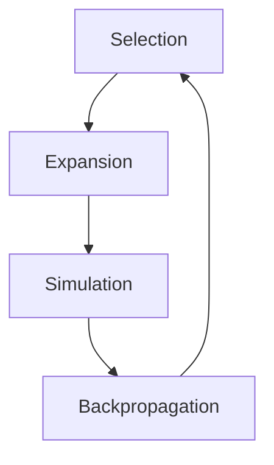

# 强化学习算法：蒙特卡洛树搜索 (Monte Carlo Tree Search) 原理与代码实例讲解

## 1. 背景介绍

### 1.1 强化学习概述
强化学习(Reinforcement Learning, RL)是机器学习的一个重要分支,它研究如何让智能体(Agent)通过与环境的交互来学习最优策略,以获得最大化的累积奖励。与监督学习和无监督学习不同,强化学习不需要预先准备好标注数据,而是通过探索(Exploration)和利用(Exploitation)的平衡来不断优化策略。

### 1.2 蒙特卡洛树搜索简介
蒙特卡洛树搜索(Monte Carlo Tree Search, MCTS)是一种启发式搜索算法,常用于博弈类问题的决策过程。它通过大量的随机模拟来估计不同行动的期望收益,并逐步构建一棵搜索树来指导决策。MCTS算法结合了蒙特卡洛方法的随机性和树搜索的系统性,在围棋、国际象棋等领域取得了巨大成功。

### 1.3 MCTS在强化学习中的应用
MCTS作为一种基于采样的搜索算法,可以很好地解决状态空间和行动空间较大的问题。将MCTS与深度神经网络相结合,可以实现更高效、更智能的决策。近年来,基于MCTS的强化学习算法,如AlphaGo系列,在围棋、星际争霸等复杂游戏中展现出了超越人类的表现,引发了广泛关注。

## 2. 核心概念与联系

### 2.1 马尔可夫决策过程
马尔可夫决策过程(Markov Decision Process, MDP)是强化学习的理论基础。MDP由状态集合S、行动集合A、转移概率P、奖励函数R和折扣因子γ组成。智能体与环境交互的过程可以用MDP来建模,目标是学习一个最优策略π,使得期望累积奖励最大化。

### 2.2 探索与利用
探索(Exploration)是指智能体尝试新的行动以发现潜在的高回报,利用(Exploitation)是指智能体根据已有经验选择当前最优的行动。探索与利用是一对矛盾,需要权衡平衡。过度探索会降低学习效率,过度利用则可能陷入局部最优。MCTS通过Upper Confidence Bound (UCB)公式来平衡探索与利用。

### 2.3 策略与价值函数
策略(Policy)是指智能体在给定状态下选择行动的概率分布。最优策略能够最大化期望累积奖励。价值函数(Value Function)是对未来累积奖励的估计,分为状态价值函数V(s)和动作价值函数Q(s,a)。策略和价值函数的准确估计对强化学习至关重要,MCTS通过仿真统计来逼近真实的价值函数。

### 2.4 MCTS四个阶段
MCTS主要由Selection、Expansion、Simulation和Backpropagation四个阶段组成,通过迭代这四个步骤来不断优化搜索树和策略。



- Selection:从根节点出发,依据UCB公式递归选择最优子节点,直到叶节点
- Expansion:如果叶节点不是终止状态,则扩展一个或多个子节点
- Simulation:从新扩展的节点开始,进行随机模拟直到终止状态,得到模拟回报
- Backpropagation:将模拟回报反向传播更新路径上的节点统计信息

## 3. 核心算法原理具体操作步骤

### 3.1 构建搜索树
MCTS维护一棵搜索树,每个节点代表一个状态,边代表行动。树节点存储访问次数N(s)、期望价值Q(s)等统计信息。
初始时树只有一个根节点,代表初始状态。随着搜索的进行,树不断生长扩展。

### 3.2 Selection阶段
从根节点出发,递归选择最优子节点,直到叶节点。选择过程使用改进的UCB公式:
$$UCB1(s,a) = Q(s,a) + c \sqrt{\frac{\ln N(s)}{N(s,a)}}$$
其中Q(s,a)是行动价值,N(s)是状态s的访问次数,N(s,a)是边(s,a)的访问次数,c是控制探索的参数。
UCB公式权衡了对高价值节点的利用和对少访问节点的探索。

### 3.3 Expansion阶段
当选择到叶节点时,如果该节点不是终止状态,则扩展一个或多个子节点。扩展策略可以是均匀随机,或启发式的。
新扩展的节点初始化统计信息:N(s)=0, Q(s)=0。

### 3.4 Simulation阶段  
从新扩展的节点开始,进行快速的随机模拟,直到到达终止状态。模拟过程中的决策可以使用随机策略或简单的启发式规则。
模拟结束后,得到一个模拟回报值R。R可以是累积奖励,也可以是根据终止状态估计的期望回报。

### 3.5 Backpropagation阶段
将模拟回报R反向传播更新搜索路径上的节点统计信息。对每个节点s:
$$N(s) = N(s) + 1$$
$$Q(s) = Q(s) + \frac{R - Q(s)}{N(s)}$$
即访问次数加1,期望价值向模拟回报方向更新。传播直到根节点。

### 3.6 决策与迭代
经过预设的迭代次数后,根据根节点的统计信息,选择访问次数最多的行动作为最终决策。
之后重复上述四个阶段,不断迭代优化搜索树和策略,直到满足某个终止条件。

## 4. 数学模型和公式详细讲解举例说明

### 4.1 Multi-armed Bandit问题与UCB公式
Multi-armed Bandit(多臂老虎机)问题是探索与利用平衡的经典案例。假设有K个老虎机,每个老虎机有一个未知的奖励分布。目标是通过有限次的尝试,以最大化累积奖励。
解决Bandit问题的一个有效算法是UCB(Upper Confidence Bound):
$$A_t = \arg\max_{a} \left[ Q(a) + c \sqrt{\frac{\ln t}{N_t(a)}} \right]$$
其中$A_t$是第t次要选择的行动,$Q(a)$是行动a的期望奖励,$N_t(a)$是a被选择的次数,c是控制探索的参数。
UCB公式平衡了对高奖励行动的利用($Q(a)$项)和对低尝试次数行动的探索($\sqrt{\frac{\ln t}{N_t(a)}}$项)。随着t的增加,探索项权重降低,逐渐趋向利用。

MCTS将Bandit问题扩展到树形结构,UCB公式应用到树节点的选择过程中,引导探索与利用的平衡。

### 4.2 策略评估与策略提升
策略评估是指在给定策略$\pi$下,估计状态价值函数$V^{\pi}(s)$或动作价值函数$Q^{\pi}(s,a)$。一种估计方法是Monte Carlo方法,通过大量的采样轨迹来逼近期望回报:
$$V^{\pi}(s) \approx \frac{1}{N} \sum_{i=1}^{N} G_i(s)$$
$$Q^{\pi}(s,a) \approx \frac{1}{N} \sum_{i=1}^{N} G_i(s,a)$$
其中$G_i$是第i条轨迹的累积回报。

策略提升是指在估计的价值函数基础上,生成一个更优的策略$\pi'$:
$$\pi'(s) = \arg\max_{a} Q^{\pi}(s,a)$$
即在每个状态下选择具有最大动作价值的行动作为新策略。

MCTS中的Simulation和Backpropagation阶段可以看作是策略评估和提升的过程。随机模拟相当于采样轨迹,反向传播相当于更新价值估计,最终在根节点选择最优行动相当于生成新策略。

### 4.3 博弈树与MinMax搜索
在二人零和博弈(如围棋、国际象棋)中,博弈树是一种重要的数据结构。博弈树交替表示双方的决策,一方的目标是最大化自己的收益,另一方的目标是最小化对手的收益。

MinMax搜索是一种在博弈树上进行决策的算法。它通过递归地计算每个节点的MinMax值来选择最优行动:
$$V_{minmax}(s) = \begin{cases} 
R(s) & \text{if } s \text{ is terminal} \\
\max_{a} V_{minmax}(s,a) & \text{if } s \text{ is Max node} \\ 
\min_{a} V_{minmax}(s,a) & \text{if } s \text{ is Min node}
\end{cases}$$
其中$R(s)$是终止状态的收益,$V_{minmax}(s,a)$是在s下采取行动a后到达的子状态的MinMax值。
MinMax搜索通过递归展开博弈树,在Max节点选择最大值行动,在Min节点选择最小值行动,回溯得到根节点的最优决策。

传统的MinMax搜索需要遍历完整的博弈树,计算量随深度指数增长。MCTS通过采样近似MinMax值,大幅减少了搜索复杂度,并引入随机性增强了博弈的不可预测性。

## 5. 项目实践：代码实例和详细解释说明

下面给出一个使用Python实现的MCTS的简单示例,以井字棋(Tic-Tac-Toe)游戏为例。代码主要包括以下几个部分:

- 游戏环境:定义棋盘状态、游戏规则、奖励函数等
- 蒙特卡洛树节点:定义树节点的数据结构和更新方法
- MCTS算法:实现Selection、Expansion、Simulation、Backpropagation四个阶段
- 主程序:实例化游戏环境和MCTS算法,执行对弈

```python
import numpy as np
import math

# 游戏环境
class TicTacToe:
    def __init__(self):
        self.board = np.zeros((3,3))
        self.player = 1
        
    def get_state(self):
        return str(self.board.reshape(9))
    
    def get_actions(self):
        actions = []
        for i in range(3):
            for j in range(3):
                if self.board[i,j] == 0:
                    actions.append((i,j))
        return actions
    
    def is_terminal(self):
        for i in range(3):
            if np.sum(self.board[i,:]) == 3 or np.sum(self.board[:,i]) == 3:
                return True
        if np.sum(np.diag(self.board)) == 3 or np.sum(np.diag(np.fliplr(self.board))) == 3:
            return True
        if np.count_nonzero(self.board) == 9:
            return True
        return False
    
    def get_reward(self):
        for i in range(3):
            if np.sum(self.board[i,:]) == 3 or np.sum(self.board[:,i]) == 3:
                return 1 if self.player == 1 else -1
        if np.sum(np.diag(self.board)) == 3 or np.sum(np.diag(np.fliplr(self.board))) == 3:
            return 1 if self.player == 1 else -1
        return 0
    
    def take_action(self, action):
        i,j = action
        self.board[i,j] = self.player
        self.player = 3 - self.player
        
    def reset(self):
        self.board = np.zeros((3,3))
        self.player = 1

# 蒙特卡洛树节点        
class MCTSNode:
    def __init__(self, state, parent=None, action=None):
        self.state = state
        self.parent = parent
        self.action = action
        self.children = []
        self.visits = 0
        self.value = 0
        
    def update(self, value):
        self.visits += 1
        self.value += (value - self.value) / self.visits
        
    def ucb_score(self, c=1.0):
        if self.visits == 0:
            return float('inf')
        else:
            return self.value + c * math.sqrt(math.log(self.parent.visits) / self.visits)
        
    def expand(self, env):
        for action in env.get_actions():
            env.take_action(action)
            child_state = env.get_state()
            child_node = MCTSNode(child_state, self, action)
            self.children.append(child_node)