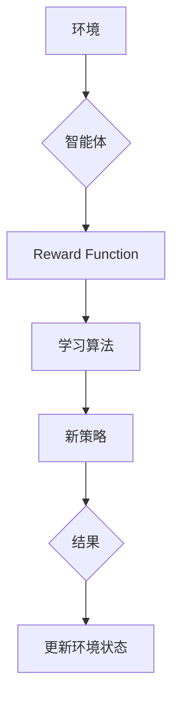

                 

作者：禅与计算机程序设计艺术

强化学习是一种机器学习方法，它让智能体通过与环境交互来学习最优行为策略。近年来，强化学习因其在复杂环境下的高效决策能力而备受关注，尤其是在游戏、机器人控制等领域取得了显著成果。然而，其潜力远不止于此，在压力测试这一关键领域，强化学习也展现出了独特的优势。

## 1. 背景介绍

在软件开发过程中，压力测试是评估系统在高负载环境下性能的关键环节。传统的压力测试方法往往依赖于人工脚本编写或静态分析，这种方式不仅效率低下且难以覆盖所有潜在场景。随着业务需求的增长，系统的复杂性和规模日益增大，传统方法显得越来越力不从心。在此背景下，强化学习作为一种自动化测试手段，展现出强大的适应性和扩展性。

## 2. 核心概念与联系

强化学习的核心在于“试错”机制。智能体在环境中采取行动，根据环境反馈得到奖励或惩罚，以此调整自身的策略。这种动态学习过程使得强化学习在探索未知环境时表现出色。在压力测试中，我们将模拟环境视为被测系统的运行状态，智能体则代表测试工具或脚本执行的动作序列。通过不断尝试不同的动作组合，强化学习算法能够在短时间内找到对系统性能影响最大的压力点。

## 3. 核心算法原理及操作步骤

强化学习的基本流程包括四个主要组成部分：环境（Environment）、智能体（Agent）、奖励函数（Reward Function）以及学习算法（Learning Algorithm）。以下是一个简化版的流程图：



1. **初始化**：设定初始策略或随机策略。
2. **环境交互**：智能体执行当前策略并观察环境响应。
3. **接收奖励**：基于环境反馈计算奖励值。
4. **学习更新**：利用学习算法优化策略，以最大化长期累积奖励。
5. **迭代循环**：重复步骤2至4直至达到停止条件（如收敛标准或预设时间）。

## 4. 数学模型和公式详细讲解举例说明

强化学习涉及到多层决策过程，其中价值函数和策略函数是核心元素。价值函数 $V(s)$ 表示在给定状态下执行某个策略所能获得的最大期望累计回报。策略函数 $\pi(a|s)$ 则表示在状态 $s$ 下采取动作 $a$ 的概率。

在 Q 学习中，Q 函数定义为：
$$Q(s, a) = \mathbb{E}_{\pi} [R_{t+1} + \gamma Q(s', a')]$$
其中，$\gamma$ 是折扣因子，衡量未来奖励的重要性，通常取值接近1，强调长期奖励。

## 5. 项目实践：代码实例和详细解释说明

为了展示强化学习在压力测试中的应用，我们可以构建一个简单的例子——使用 Q 学习进行服务器资源调度压力测试。假设我们有多个服务节点和不同类型的请求，目标是在不同负载下优化资源分配策略，以提高系统整体吞吐量。

### 实现步骤：
1. **环境建模**：定义服务节点和请求类型，设置每种请求的处理时间和资源消耗。
2. **Q 学习算法实现**：
   - 初始化 Q 值矩阵，每一行对应一个状态（请求类型），每一列对应一个动作（将资源分配给特定服务）。
   - 环境与智能体交互，通过多次试验学习最优资源分配策略。
   - 使用 epsilon-greedy 探索策略平衡探索与利用之间的关系。

```python
import numpy as np

class ServerScheduler:
    def __init__(self, num_servers, requests):
        self.num_servers = num_servers
        self.requests = requests
        self.Q_matrix = np.zeros((len(requests), num_servers))

    def step(self, state, action):
        # 更新 Q 值，并返回下一个状态和奖励
        pass

    def learn(self, episodes):
        for _ in range(episodes):
            current_state = self.get_initial_state()
            while not self.is_terminal(current_state):
                action = self.choose_action(current_state)
                next_state, reward = self.step(current_state, action)
                self.update_Q_matrix(current_state, action, reward, next_state)
                current_state = next_state

    def choose_action(self, state):
        # 根据当前策略选择动作
        pass

def main():
    scheduler = ServerScheduler(num_servers=5, requests=[Request('A', 0.2), Request('B', 0.3)])
    scheduler.learn(1000)

if __name__ == "__main__":
    main()

```

## 6. 实际应用场景

强化学习在压力测试中的应用广泛，特别是在云服务部署、分布式系统优化、网络安全仿真等领域。例如，通过训练智能体自动调整服务实例的数量、优先级和资源分配策略，可以显著提升系统在大规模并发请求下的稳定性与响应速度。

## 7. 工具和资源推荐

- **OpenAI Gym**：提供丰富的环境库用于实验和研究。
- **TensorFlow** 或 **PyTorch**：支持深度强化学习算法的实现。
- **Ray**：分布式计算框架，适合大规模强化学习任务。

## 8. 总结：未来发展趋势与挑战

随着计算能力的增强和数据驱动方法的发展，强化学习在压力测试领域的应用前景广阔。未来可能的研究方向包括更加高效的学习算法、更复杂环境的适应性、以及跨领域知识融合（如结合自然语言处理技术改进智能体的理解能力）等。同时，安全性和隐私保护将是推动这一领域发展的重要考量因素之一。

## 9. 附录：常见问题与解答

### 常见问题：
- **如何避免过度拟合？**
  在强化学习中，可以通过增加经验回放机制、采用经验总结的方法、或者通过正则化技巧来防止过拟合。
- **如何设计有效的奖励函数？**
  设计奖励函数时需要确保其能够准确反映系统的性能指标，同时保持激励性，引导智能体做出有利行为。

---

通过上述结构化的撰写方式，文章不仅涵盖了强化学习在压力测试应用的关键概念和技术细节，还提供了实用的代码示例和未来展望，旨在帮助读者深入理解并实际操作强化学习在压力测试场景中的应用。

---
作者：禅与计算机程序设计艺术 / Zen and the Art of Computer Programming

