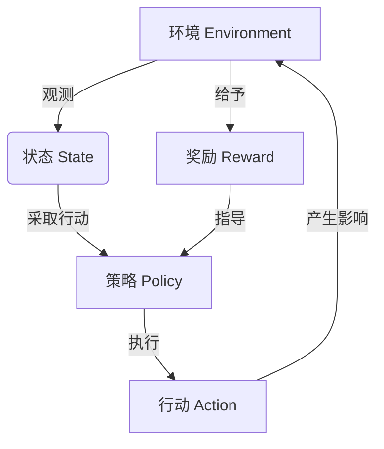

# 强化学习：在无人仓库中的应用

## 1. 背景介绍

在当今快节奏的供应链环境中,仓储自动化已成为提高效率和降低成本的关键因素。无人仓库(Autonomous Warehouse)通过将人工智能、机器人技术与物联网相结合,实现了仓储运营的智能化和自动化。在这种背景下,强化学习(Reinforcement Learning)作为一种先进的机器学习技术,为优化无人仓库的决策和控制策略提供了有力支持。

### 1.1 无人仓库的优势

传统仓库作业依赖人工操作,存在效率低下、错误率高等问题。无人仓库通过自动化和智能化,可以显著提高工作效率、降低人工成本,并减少操作错误。同时,无人仓库还具有以下优势:

- 24/7连续运营
- 提高存储空间利用率
- 实现精确库存管理
- 改善工作环境安全性

### 1.2 强化学习在无人仓库中的作用

强化学习是一种基于奖惩机制的机器学习范式,旨在训练智能体(Agent)通过与环境(Environment)的互动来学习最优策略。在无人仓库中,强化学习可以应用于以下场景:

- 机器人路径规划和导航
- 库存优化和补货策略
- 订单拣选和装载优化
- 故障检测和预防维护

通过强化学习,无人仓库系统可以自主学习并优化决策,从而提高整体运营效率和资源利用率。

## 2. 核心概念与联系 

### 2.1 强化学习基本概念

强化学习系统通常由以下四个核心组件构成:

- **环境(Environment)**:智能体与之交互的外部世界,如无人仓库的物理环境。
- **状态(State)**:描述环境当前状态的数据集合,如机器人位置、库存水平等。
- **策略(Policy)**:智能体在给定状态下采取行动的规则或策略函数。
- **奖励(Reward)**:环境对智能体行为的反馈,用于指导智能体学习最优策略。

强化学习的目标是找到一个最优策略,使得在给定的环境中,智能体可以最大化其预期的累积奖励。



### 2.2 强化学习与其他机器学习范式的关系

强化学习与监督学习和无监督学习有着明显的区别:

- **监督学习**:通过训练数据集学习映射函数,如分类和回归任务。
- **无监督学习**:在没有标签数据的情况下发现数据内在模式,如聚类分析。
- **强化学习**:通过与环境交互来学习最优策略,没有提前给定的训练数据集。

强化学习更加注重探索与利用的平衡,以及长期累积奖励的最大化。它在无人仓库等复杂环境中具有独特的优势。

## 3. 核心算法原理具体操作步骤

强化学习算法通常采用价值函数迭代或策略迭代的方式来求解最优策略。以下是两种核心算法的工作原理和具体步骤。

### 3.1 Q-Learning算法

Q-Learning是一种基于价值函数迭代的强化学习算法,它通过估计状态-行动对的价值函数Q(s,a)来学习最优策略。算法步骤如下:

1. 初始化Q(s,a)值,如全部设为0。
2. 对于每个episode:
    a. 初始化起始状态s
    b. 对于每个时间步:
        i. 根据当前策略选择行动a
        ii. 执行行动a,观测新状态s'和奖励r
        iii. 更新Q(s,a)值:
            $Q(s,a) \leftarrow Q(s,a) + \alpha [r + \gamma \max_{a'}Q(s',a') - Q(s,a)]$
        iv. 将s更新为s'
3. 直到达到终止条件

其中,$\alpha$是学习率,$\gamma$是折扣因子。Q-Learning通过不断更新Q值,最终可以收敛到最优Q函数,从而导出最优策略$\pi^*(s) = \arg\max_aQ^*(s,a)$。

### 3.2 策略梯度算法

策略梯度算法是一种基于策略迭代的强化学习算法,它直接对策略函数$\pi_\theta(s,a)$进行参数化,并通过梯度上升的方式优化策略参数$\theta$。算法步骤如下:

1. 初始化策略参数$\theta$
2. 对于每个episode:
    a. 生成一个episode的轨迹$\tau = (s_0,a_0,r_0,s_1,a_1,r_1,...,s_T)$
    b. 计算该轨迹的回报$R(\tau) = \sum_{t=0}^T\gamma^tr_t$
    c. 更新策略参数:
        $\theta \leftarrow \theta + \alpha\nabla_\theta\log\pi_\theta(\tau)R(\tau)$
3. 直到收敛

其中,$\alpha$是学习率,$\gamma$是折扣因子。策略梯度算法通过最大化期望回报来直接优化策略参数,适用于连续动作空间和高维观测空间。

## 4. 数学模型和公式详细讲解举例说明

### 4.1 马尔可夫决策过程(MDP)

强化学习问题通常被建模为马尔可夫决策过程(Markov Decision Process, MDP),它是一个离散时间的随机控制过程,由以下五元组表示:

$$\langle \mathcal{S}, \mathcal{A}, \mathcal{P}, \mathcal{R}, \gamma \rangle$$

- $\mathcal{S}$是状态空间的集合
- $\mathcal{A}$是行动空间的集合
- $\mathcal{P}$是状态转移概率函数,定义为$\mathcal{P}_{ss'}^a = \mathbb{P}(s_{t+1}=s'|s_t=s,a_t=a)$
- $\mathcal{R}$是奖励函数,定义为$\mathcal{R}_s^a = \mathbb{E}[r_{t+1}|s_t=s,a_t=a]$
- $\gamma \in [0,1)$是折扣因子,用于权衡即时奖励和长期奖励

在无人仓库场景中,状态可以表示机器人位置、库存水平等;行动可以表示机器人移动方向、补货操作等;奖励可以根据任务完成情况、效率等指标设计。

### 4.2 价值函数和Bellman方程

价值函数是强化学习中一个关键概念,它表示在给定策略$\pi$下,从状态s开始执行后的预期累积奖励。状态价值函数$V^\pi(s)$和状态-行动价值函数$Q^\pi(s,a)$分别定义为:

$$V^\pi(s) = \mathbb{E}_\pi\left[\sum_{t=0}^\infty \gamma^t r_{t+1} | s_0 = s\right]$$

$$Q^\pi(s,a) = \mathbb{E}_\pi\left[\sum_{t=0}^\infty \gamma^t r_{t+1} | s_0 = s, a_0 = a\right]$$

价值函数满足Bellman方程:

$$V^\pi(s) = \sum_{a}\pi(a|s)\left(\mathcal{R}_s^a + \gamma\sum_{s'}\mathcal{P}_{ss'}^aV^\pi(s')\right)$$

$$Q^\pi(s,a) = \mathcal{R}_s^a + \gamma\sum_{s'}\mathcal{P}_{ss'}^a\sum_{a'}\pi(a'|s')Q^\pi(s',a')$$

通过求解Bellman方程,我们可以得到最优价值函数$V^*(s)$和$Q^*(s,a)$,从而导出最优策略$\pi^*(s) = \arg\max_aQ^*(s,a)$。

### 4.3 举例说明

考虑一个简化的无人仓库场景,机器人需要在一个$5\times5$的网格环境中导航,从起点(0,0)移动到终点(4,4)。每移动一步,机器人会获得-1的奖励,到达终点后获得+100的奖励。

我们可以使用Q-Learning算法来学习最优策略。设状态s为机器人当前位置,行动a为移动方向(上下左右)。初始时,所有Q(s,a)值设为0。在每个episode中,机器人从(0,0)出发,根据$\epsilon$-贪婪策略选择行动,执行后更新相应的Q(s,a)值。

假设在某个状态(2,1)下,机器人选择向右移动,转移到(3,1)状态,获得-1的奖励。设$\alpha=0.1,\gamma=0.9$,则Q(2,1,右)的更新过程为:

$$Q(2,1,\text{右}) \leftarrow Q(2,1,\text{右}) + \alpha\left[-1 + \gamma\max_{a'}Q(3,1,a') - Q(2,1,\text{右})\right]$$

通过不断探索和更新,最终Q值会收敛,机器人可以根据$\max_aQ(s,a)$选择最优行动,找到从起点到终点的最短路径。

## 5. 项目实践:代码实例和详细解释说明

以下是使用Python和OpenAI Gym库实现Q-Learning算法的示例代码,用于解决一个简单的网格世界导航问题。

```python
import numpy as np
import gym
import random

# 创建网格世界环境
env = gym.make("FrozenLake-v1")

# 初始化Q表
Q = np.zeros([env.observation_space.n, env.action_space.n])

# 超参数设置
alpha = 0.85  # 学习率
gamma = 0.99  # 折扣因子
eps = 0.9     # 探索率

# Q-Learning算法
for episode in range(10000):
    state = env.reset()  # 重置环境
    done = False
    
    while not done:
        # 选择行动(探索与利用)
        if random.uniform(0, 1) < eps:
            action = env.action_space.sample()  # 探索
        else:
            action = np.argmax(Q[state])  # 利用
        
        # 执行行动
        next_state, reward, done, _ = env.step(action)
        
        # 更新Q值
        Q[state, action] += alpha * (reward + gamma * np.max(Q[next_state]) - Q[state, action])
        
        state = next_state
    
    # 衰减探索率
    eps = max(eps * 0.995, 0.01)

# 测试最优策略
state = env.reset()
done = False
while not done:
    action = np.argmax(Q[state])
    state, _, done, _ = env.step(action)
    env.render()  # 渲染环境
```

代码解释:

1. 导入必要的库,创建OpenAI Gym的FrozenLake环境(一个4x4的网格世界)。
2. 初始化Q表,维度为(状态数,行动数)。
3. 设置超参数:学习率alpha、折扣因子gamma和探索率eps。
4. 进入Q-Learning算法主循环:
    a. 重置环境,获取初始状态。
    b. 在每个时间步:
        i. 根据探索率eps,选择探索(随机行动)或利用(根据Q值选择最优行动)。
        ii. 执行选择的行动,获取下一个状态、奖励和是否终止的信息。
        iii. 根据Bellman方程更新Q(state,action)值。
        iv. 更新状态。
    c. 每个episode结束后,衰减探索率eps。
5. 训练完成后,测试最优策略:从初始状态开始,根据最大Q值选择行动,直到终止。渲染环境以可视化展示。

通过上述代码,我们可以训练智能体在网格世界中找到从起点到终点的最优路径。这个简单示例展示了Q-Learning算法的基本原理和实现方式。在实际的无人仓库场景中,我们需要设计合适的状态、行动和奖励函数,并根据具体任务选择合适的强化学习算法。

## 6. 实际应用场景

### 6.1 机器人路径规划和导航

在无人仓库中,机器人需要在复杂的环境中高效导航,从一个位置移动到另一个位置执行任务,如搬运货物、补货等。强化学习可以帮助机器人学习最优的路径规划策略,避免障碍物、缩短行驶距离、节省