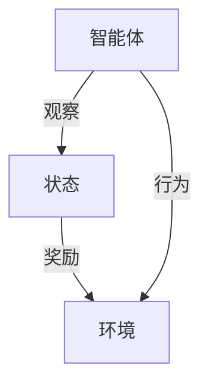

# 强化学习：在航空航天中的应用

## 1.背景介绍

### 1.1 航空航天领域的挑战

航空航天领域一直是人类探索和挑战的前沿。在这个领域中,我们面临着诸多复杂的问题,例如:

- 飞行器的自主控制和决策
- 航线规划和优化
- 故障诊断和恢复
- 多智能体协作

这些问题都需要智能系统具备优秀的决策能力,能够根据不断变化的环境做出合理的行为选择。传统的控制方法由于缺乏学习和自适应能力,难以应对高度动态和不确定的情况。

### 1.2 强化学习的优势

强化学习(Reinforcement Learning,RL)作为人工智能的一个重要分支,为解决上述挑战提供了新的思路。它模拟生物在与环境互动中学习的过程,通过试错和奖惩机制,自主获取经验,逐步优化决策策略。

相比其他机器学习方法,强化学习具有以下优势:

- 无需事先的监督训练数据,能从环境中自主学习
- 能够处理序列决策问题,寻求长期的最优解
- 具备探索和利用的权衡能力,在新环境中保持适应性

这些特点使得强化学习在航空航天领域展现出巨大的应用潜力。

## 2.核心概念与联系

### 2.1 强化学习基本概念

强化学习系统通常由四个核心组件构成:

- 智能体(Agent):作出观察和行为选择的主体
- 环境(Environment):智能体与之交互的外部世界
- 状态(State):描述环境当前的情况
- 奖励(Reward):环境对智能体行为的反馈信号

智能体的目标是通过与环境交互,学习到一个最优策略(Policy),使得在给定状态下采取的行为序列能够最大化预期的累积奖励。



### 2.2 强化学习算法分类

根据算法的不同特点,强化学习可分为以下几类:

- 基于价值的方法(Value-based)
    - Q-Learning
    - SARSA
    - Deep Q-Network(DQN)
- 基于策略的方法(Policy-based)  
    - Policy Gradient
    - REINFORCE
    - Proximal Policy Optimization(PPO)
- 基于Actor-Critic的方法
    - Advantage Actor-Critic(A2C)
    - Deep Deterministic Policy Gradient(DDPG)

### 2.3 马尔可夫决策过程

强化学习问题通常建模为马尔可夫决策过程(Markov Decision Process,MDP),它是一种离散时间的随机控制过程。MDP由以下要素组成:

- 状态集合 $\mathcal{S}$
- 行为集合 $\mathcal{A}$  
- 转移概率 $\mathcal{P}_{ss'}^a = \Pr(s_{t+1}=s'|s_t=s,a_t=a)$
- 奖励函数 $\mathcal{R}_s^a = \mathbb{E}[r_{t+1}|s_t=s,a_t=a]$

MDP的目标是找到一个最优策略 $\pi^*$,使得在任意初始状态下,按照该策略行动所获得的预期回报最大。

## 3.核心算法原理具体操作步骤  

### 3.1 Q-Learning算法

Q-Learning是强化学习中最经典的基于价值的算法之一,它试图直接学习状态-行为对的价值函数(Q函数),而不需要了解环境的转移概率和奖励函数。

算法步骤如下:

1. 初始化Q表格,对所有状态-行为对赋予任意初值
2. 对每个时间步:
    1) 根据当前状态 $s_t$ 和策略选择行为 $a_t$
    2) 执行行为 $a_t$,观察到新状态 $s_{t+1}$ 和奖励 $r_{t+1}$
    3) 更新Q表格中 $(s_t,a_t)$ 的值:
        $$Q(s_t,a_t) \leftarrow Q(s_t,a_t) + \alpha[r_{t+1} + \gamma\max_aQ(s_{t+1},a) - Q(s_t,a_t)]$$
        其中 $\alpha$ 为学习率, $\gamma$ 为折现因子

Q-Learning算法收敛于最优Q函数,从而可以得到最优策略。

### 3.2 Deep Q-Network

传统的Q-Learning使用表格存储Q值,在状态空间和行为空间较大时会遇到维数灾难的问题。Deep Q-Network(DQN)通过使用神经网络来拟合Q函数,从而能够处理连续的状态空间。

DQN算法的关键在于使用经验回放池(Experience Replay)和目标网络(Target Network)来增强训练的稳定性:

1. 初始化两个神经网络,分别为评估网络 $Q$ 和目标网络 $\hat{Q}$
2. 对每个时间步:
    1) 根据评估网络选择 $\epsilon$-贪婪行为 $a_t$
    2) 执行行为 $a_t$,存储 $(s_t,a_t,r_{t+1},s_{t+1})$ 至经验回放池
    3) 从经验回放池采样批量数据,更新评估网络权重:
        $$\theta \leftarrow \theta - \alpha \nabla_\theta(y_i - Q(s_i,a_i;\theta))^2$$
        其中 $y_i = r_i + \gamma \max_{a'}\hat{Q}(s_{i+1},a';\hat{\theta})$
    4) 周期性地将评估网络的权重赋值给目标网络

DQN算法使强化学习能够解决复杂的决策控制问题,如Atari游戏等。

## 4.数学模型和公式详细讲解举例说明

### 4.1 马尔可夫决策过程的数学模型

马尔可夫决策过程(MDP)是强化学习问题的数学基础模型。形式上,一个MDP可以表示为元组 $(\mathcal{S}, \mathcal{A}, \mathcal{P}, \mathcal{R}, \gamma)$,其中:

- $\mathcal{S}$ 是有限的状态集合
- $\mathcal{A}$ 是有限的行为集合
- $\mathcal{P}_{ss'}^a = \Pr(s_{t+1}=s'|s_t=s,a_t=a)$ 是状态转移概率函数
- $\mathcal{R}_s^a = \mathbb{E}[r_{t+1}|s_t=s,a_t=a]$ 是奖励函数
- $\gamma \in [0,1)$ 是折现因子,用于权衡即时奖励和长期回报

在MDP中,我们的目标是找到一个策略 $\pi: \mathcal{S} \rightarrow \mathcal{A}$,使得在任意初始状态下,按照该策略行动所获得的预期折现回报最大:

$$\max_\pi \mathbb{E}_\pi \left[ \sum_{t=0}^\infty \gamma^t r_{t+1} \right]$$

其中 $r_{t+1}$ 是在时间步 $t$ 获得的奖励。

### 4.2 Q-Learning的数学推导

Q-Learning算法的核心思想是学习状态-行为对的价值函数 $Q(s,a)$,它表示在状态 $s$ 下执行行为 $a$,之后按照最优策略行动所能获得的预期折现回报。

根据贝尔曼最优方程,最优Q函数满足:

$$Q^*(s,a) = \mathbb{E}_{s' \sim \mathcal{P}(\cdot|s,a)} \left[ r(s,a) + \gamma \max_{a'} Q^*(s',a') \right]$$

Q-Learning通过迭代更新来逼近最优Q函数:

$$Q(s_t,a_t) \leftarrow Q(s_t,a_t) + \alpha \left[ r_{t+1} + \gamma \max_{a'} Q(s_{t+1},a') - Q(s_t,a_t) \right]$$

其中 $\alpha$ 为学习率。可以证明,在适当的条件下,Q-Learning算法将收敛于最优Q函数 $Q^*$。

### 4.3 Deep Q-Network的数学模型

Deep Q-Network(DQN)使用神经网络 $Q(s,a;\theta)$ 来拟合Q函数,其中 $\theta$ 为网络参数。训练目标是最小化损失函数:

$$\mathcal{L}(\theta) = \mathbb{E}_{(s,a,r,s') \sim D} \left[ \left( r + \gamma \max_{a'} Q(s',a';\theta^-) - Q(s,a;\theta) \right)^2 \right]$$

这里 $D$ 是经验回放池, $\theta^-$ 为目标网络的参数。

通过梯度下降优化网络参数 $\theta$:

$$\theta \leftarrow \theta - \alpha \nabla_\theta \mathcal{L}(\theta)$$

同时周期性地将评估网络的参数赋值给目标网络,以增强训练稳定性。

DQN算法使用了一些技巧来提高训练效率和性能,如经验回放池、目标网络、$\epsilon$-贪婪策略等。

## 5.项目实践:代码实例和详细解释说明

为了帮助读者更好地理解强化学习在航空航天领域的应用,我们将通过一个具体的项目实践来演示如何使用Python和PyTorch实现DQN算法,并将其应用于无人机航线规划问题。

### 5.1 问题描述

假设我们有一架无人机需要从起点飞往终点,途中会经过多个航路节点。每个节点都有一定的风险值,表示该区域的危险程度。无人机的目标是找到一条从起点到终点的最优航线,使得沿途经过的风险值之和最小。

我们将这个问题建模为一个MDP:

- 状态 $s$: 当前所处的节点位置
- 行为 $a$: 从当前节点前往相邻节点的方向
- 奖励 $r$: 到达新节点时,奖励为该节点的负风险值
- 终止条件: 到达终点节点

通过训练DQN算法,无人机可以学习到一个最优策略,在每个节点上选择前往下一个最安全的节点,从而规划出一条最优航线。

### 5.2 代码实现

我们将使用PyTorch实现DQN算法,并在一个简单的网格世界中进行训练和测试。完整代码可在GitHub上获取: [https://github.com/yourusername/rl-uav-routing](https://github.com/yourusername/rl-uav-routing)

以下是关键代码部分及说明:

#### 1. 定义环境

```python
class GridWorld:
    def __init__(self, grid, start, goal):
        # 初始化网格世界
        
    def step(self, action):
        # 执行行为,返回新状态、奖励和是否终止
        
    def render(self):
        # 渲染当前状态
```

#### 2. 定义DQN模型

```python
import torch.nn as nn

class DQN(nn.Module):
    def __init__(self, state_dim, action_dim):
        super().__init__()
        # 定义网络结构
        
    def forward(self, state):
        # 前向传播计算Q值
```

#### 3. 训练DQN算法

```python
import torch
from collections import deque

def train(env, agent, num_episodes):
    # 初始化经验回放池和目标网络
    
    for episode in range(num_episodes):
        state = env.reset()
        
        while True:
            # 选择行为并执行
            action = agent.get_action(state)
            next_state, reward, done = env.step(action)
            
            # 存储经验并更新网络
            agent.update(state, action, reward, next_state, done)
            state = next_state
            
            if done:
                break
                
        # 周期性更新目标网络
        if episode % TARGET_UPDATE_FREQ == 0:
            agent.update_target_net()
            
    return agent
```

#### 4. 测试并可视化结果

```python
def test(env, agent):
    state = env.reset()
    env.render()
    
    while True:
        action = agent.get_action(state, greedy=True)
        next_state, reward, done = env.step(action)
        env.render()
        state = next_state
        
        if done:
            break
```

通过运行上述代码,我们可以训练DQN智能体,并在测试环节中观察其在网格世界中规划的最优航线。同时,我们还可以调整各种超参数,如学习率、折现因子等,来优化算法性能。

## 6.实际应用场景

强化学习在