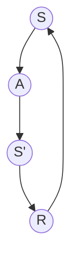

## 1. 背景介绍

强化学习是一种机器学习的方法，它通过试错的方式来学习如何在一个环境中采取行动以获得最大的奖励。在强化学习中，智能体通过与环境的交互来学习如何做出最优的决策。强化学习已经在许多领域得到了广泛的应用，例如游戏、机器人控制、自然语言处理等。

在强化学习中，环境模型是非常重要的一部分。环境模型是指智能体对环境的理解，包括环境的状态、动作和奖励等。环境模型的建立和利用对于智能体的学习效果有着至关重要的影响。

本文将介绍强化学习中环境模型的建立和利用方法，包括核心概念、算法原理、数学模型和公式、项目实践、实际应用场景、工具和资源推荐、未来发展趋势和挑战以及常见问题和解答等方面。

## 2. 核心概念与联系

在强化学习中，智能体通过与环境的交互来学习如何做出最优的决策。智能体在每个时间步骤$t$会观察到环境的状态$s_t$，然后根据当前的策略$\pi$选择一个动作$a_t$，并且会得到一个奖励$r_t$。智能体的目标是最大化累计奖励$R_t=\sum_{i=t}^{T}\gamma^{i-t}r_i$，其中$\gamma$是折扣因子，用于平衡当前奖励和未来奖励的重要性。

强化学习中的环境模型包括状态空间、动作空间、状态转移概率和奖励函数。状态空间是指智能体可能遇到的所有状态的集合，动作空间是指智能体可以采取的所有动作的集合。状态转移概率是指在某个状态下采取某个动作后，智能体会转移到下一个状态的概率。奖励函数是指智能体在某个状态下采取某个动作后会得到的奖励。

环境模型的建立和利用是强化学习中的一个重要问题。环境模型的建立可以通过观察环境的反馈来实现，例如通过人工标注或者自动化的方式来获取状态和奖励信息。环境模型的利用可以通过模拟环境来进行，例如使用蒙特卡罗模拟或者基于模型的强化学习方法来进行。

## 3. 核心算法原理具体操作步骤

强化学习中的环境模型建立和利用可以通过多种算法来实现。下面介绍两种常用的算法：蒙特卡罗模拟和基于模型的强化学习方法。

### 3.1 蒙特卡罗模拟

蒙特卡罗模拟是一种基于样本的方法，它通过模拟环境来学习环境模型。具体来说，蒙特卡罗模拟通过与环境的交互来生成一系列的状态、动作和奖励序列，然后利用这些序列来估计环境模型。

蒙特卡罗模拟的具体操作步骤如下：

1. 初始化环境模型，包括状态空间、动作空间、状态转移概率和奖励函数。
2. 采用某种策略$\pi$与环境进行交互，生成一系列的状态、动作和奖励序列。
3. 根据生成的序列，估计状态转移概率和奖励函数。
4. 根据估计的环境模型，采用某种强化学习算法进行学习。

蒙特卡罗模拟的优点是可以直接从环境中学习，不需要事先知道环境模型。缺点是需要大量的交互数据来进行学习，计算复杂度较高。

### 3.2 基于模型的强化学习方法

基于模型的强化学习方法是一种利用环境模型进行学习的方法。具体来说，基于模型的强化学习方法通过建立环境模型来进行规划，然后根据规划结果来更新策略。

基于模型的强化学习方法的具体操作步骤如下：

1. 建立环境模型，包括状态空间、动作空间、状态转移概率和奖励函数。
2. 利用环境模型进行规划，得到最优策略。
3. 根据最优策略更新环境模型。
4. 根据更新后的环境模型，采用某种强化学习算法进行学习。

基于模型的强化学习方法的优点是可以利用环境模型进行规划，计算复杂度较低。缺点是需要事先知道环境模型，对环境模型的准确性要求较高。

## 4. 数学模型和公式详细讲解举例说明

在强化学习中，环境模型可以用马尔可夫决策过程（Markov Decision Process，MDP）来描述。MDP是一种用于描述序列决策问题的数学模型，它包括状态空间、动作空间、状态转移概率和奖励函数。

MDP的数学模型可以用五元组$(S,A,P,R,\gamma)$来表示，其中：

- $S$是状态空间，$s\in S$表示一个状态。
- $A$是动作空间，$a\in A$表示一个动作。
- $P$是状态转移概率，$P(s'|s,a)$表示在状态$s$下采取动作$a$后转移到状态$s'$的概率。
- $R$是奖励函数，$R(s,a,s')$表示在状态$s$下采取动作$a$后转移到状态$s'$时得到的奖励。
- $\gamma$是折扣因子，用于平衡当前奖励和未来奖励的重要性。

MDP的数学模型可以用下图表示：



其中，$S$表示当前状态，$A$表示采取的动作，$S'$表示转移到的下一个状态，$R$表示得到的奖励。

在MDP中，智能体的目标是最大化累计奖励$R_t=\sum_{i=t}^{T}\gamma^{i-t}r_i$。为了实现这个目标，智能体需要采取最优策略$\pi^*$，使得期望累计奖励最大化：

$$\pi^*=\arg\max_{\pi}\mathbb{E}_{\pi}\left[\sum_{t=0}^{\infty}\gamma^tr_t|s_0=s\right]$$

其中，$\mathbb{E}_{\pi}$表示在策略$\pi$下的期望值。

## 5. 项目实践：代码实例和详细解释说明

在本节中，我们将介绍如何使用Python实现强化学习中的环境模型建立和利用。我们将以蒙特卡罗模拟为例，介绍如何使用Python实现环境模型的建立和利用。

### 5.1 环境模型的建立

在蒙特卡罗模拟中，环境模型的建立可以通过观察环境的反馈来实现。具体来说，我们可以通过人工标注或者自动化的方式来获取状态和奖励信息。

在本例中，我们将使用OpenAI Gym中的CartPole环境来演示环境模型的建立。CartPole是一个经典的强化学习问题，目标是通过控制杆子的运动来保持平衡。

首先，我们需要安装OpenAI Gym：

```python
!pip install gym
```

然后，我们可以使用以下代码来创建CartPole环境：

```python
import gym

env = gym.make('CartPole-v0')
```

接下来，我们可以使用以下代码来观察CartPole环境的状态和奖励信息：

```python
state = env.reset()
done = False

while not done:
    action = env.action_space.sample()
    next_state, reward, done, info = env.step(action)
    print('state:', state)
    print('action:', action)
    print('next_state:', next_state)
    print('reward:', reward)
    state = next_state
```

在上面的代码中，我们使用env.reset()函数来初始化环境，然后使用env.step()函数来执行一个动作，并且观察环境的反馈。在每个时间步骤中，我们都会输出当前状态、采取的动作、下一个状态和得到的奖励。

### 5.2 环境模型的利用

在蒙特卡罗模拟中，环境模型的利用可以通过模拟环境来进行。具体来说，我们可以使用蒙特卡罗模拟来生成一系列的状态、动作和奖励序列，然后利用这些序列来估计环境模型。

在本例中，我们将使用蒙特卡罗模拟来生成状态、动作和奖励序列，并且利用这些序列来估计环境模型。具体来说，我们将使用以下代码来生成状态、动作和奖励序列：

```python
import numpy as np

def generate_episode(env):
    episode = []
    state = env.reset()
    done = False
    
    while not done:
        action = env.action_space.sample()
        next_state, reward, done, info = env.step(action)
        episode.append((state, action, reward))
        state = next_state
    
    return episode

episodes = [generate_episode(env) for _ in range(100)]
```

在上面的代码中，我们使用generate_episode()函数来生成一个状态、动作和奖励序列。具体来说，我们使用env.reset()函数来初始化环境，然后使用env.step()函数来执行一个动作，并且将状态、动作和奖励信息添加到序列中。在每个时间步骤中，我们都会采取随机动作。

接下来，我们可以使用以下代码来估计状态转移概率和奖励函数：

```python
def estimate_model(episodes):
    P = np.zeros((env.observation_space.n, env.action_space.n, env.observation_space.n))
    R = np.zeros((env.observation_space.n, env.action_space.n, env.observation_space.n))
    N = np.zeros((env.observation_space.n, env.action_space.n))
    
    for episode in episodes:
        for i in range(len(episode) - 1):
            state, action, reward = episode[i]
            next_state, _, _ = episode[i + 1]
            P[state][action][next_state] += 1
            R[state][action][next_state] += reward
            N[state][action] += 1
    
    for s in range(env.observation_space.n):
        for a in range(env.action_space.n):
            if N[s][a] > 0:
                P[s][a] /= N[s][a]
                R[s][a] /= N[s][a]
    
    return P, R

P, R = estimate_model(episodes)
```

在上面的代码中，我们使用estimate_model()函数来估计状态转移概率和奖励函数。具体来说，我们首先初始化一个三维数组P和R，用于存储状态转移概率和奖励函数。然后，我们遍历所有的状态、动作和奖励序列，统计每个状态、动作和下一个状态的出现次数，并且将它们添加到P和R中。最后，我们将P和R除以出现次数，得到状态转移概率和奖励函数的估计值。

## 6. 实际应用场景

强化学习中的环境模型建立和利用已经在许多领域得到了广泛的应用，例如游戏、机器人控制、自然语言处理等。

在游戏领域，强化学习中的环境模型建立和利用已经被应用于许多游戏中，例如围棋、扑克等。通过建立环境模型，智能体可以学习如何在游戏中做出最优的决策，从而获得更高的胜率。

在机器人控制领域，强化学习中的环境模型建立和利用已经被应用于许多机器人控制问题中，例如机器人导航、机器人抓取等。通过建立环境模型，智能体可以学习如何在复杂的环境中做出最优的决策，从而实现更高效的机器人控制。

在自然语言处理领域，强化学习中的环境模型建立和利用已经被应用于许多自然语言处理问题中，例如机器翻译、对话系统等。通过建立环境模型，智能体可以学习如何在自然语言环境中做出最优的决策，从而实现更高效的自然语言处理。

## 7. 工具和资源推荐

在强化学习中，有许多工具和资源可以帮助我们进行环境模型的建立和利用。下面是一些常用的工具和资源：

- OpenAI Gym：一个用于开发和比较强化学习算法的工具包。
- TensorFlow：一个用于构建和训练机器学习模型的框架。
- PyTorch：一个用于构建和训练深度学习模型的框架。
- Reinforcement Learning: An Introduction：一本经典的强化学习教材，详细介绍了强化学习的基本概念和算法。
- Deep Reinforcement Learning：一本介绍深度强化学习的教材，详细介绍了深度强化学习的基本概念和算法。

## 8. 总结：未来发展趋势与挑战

强化学习中的环境模型建立和利用是一个非常重要的问题，它对于智能体的学习效果有着至关重要的影响。随着强化学习的