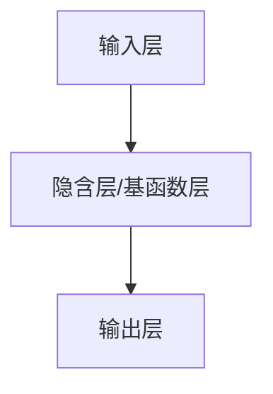

# 径向基函数网络:RBFN的原理与应用

## 1.背景介绍

在机器学习和神经网络领域,径向基函数网络(Radial Basis Function Network,RBFN)是一种强大的人工神经网络模型。它结合了人工神经网络的优点和传统的高斯核函数的优点,在函数逼近、模式分类、数据预测等领域有着广泛的应用。

RBFN最初由Broomhead和Lowe于1988年提出,它是一种前馈神经网络,具有良好的逼近性能、简单结构、快速训练等优点。与反向传播神经网络(Back Propagation Neural Network,BPNN)相比,RBFN避免了"陷入局部极小值"的问题,收敛速度更快,对输入数据的微小变化也不太敏感。

## 2.核心概念与联系

### 2.1 径向基函数(Radial Basis Function)

径向基函数是一种以向量范数为自变量的实值函数,其函数值只与向量的范数有关,与向量的方向无关。常用的径向基函数包括高斯函数、多项式函数、逻辑函数等。

### 2.2 RBFN网络结构

RBFN通常由三层结构组成:输入层、隐含层(也称基函数层)和输出层。



- 输入层: 接收输入数据,并将其传递给隐含层。
- 隐含层/基函数层: 由若干个基函数节点组成,每个节点代表一个径向基函数。输入向量与每个基函数节点的中心向量之间的距离经过基函数计算后,得到对应的激活值。
- 输出层: 对隐含层的输出进行加权线性组合,得到最终的输出结果。

### 2.3 RBFN网络训练

RBFN网络的训练过程分为两个阶段:

1. 确定隐含层节点的中心向量和基函数宽度。常用的方法有K-均值聚类算法、随机抽样等。
2. 确定隐含层到输出层的权值。通常采用最小二乘法或者梯度下降法等优化算法。

## 3.核心算法原理具体操作步骤

RBFN的核心算法原理可以分为以下几个步骤:

### 3.1 确定隐含层节点数目

隐含层节点的数目直接影响着RBFN的性能。一般来说,节点数目越多,网络的逼近能力越强,但计算复杂度也会增加。通常可以根据经验或者交叉验证的方式来确定合适的节点数目。

### 3.2 确定隐含层节点的中心向量

中心向量的选择直接影响着RBFN的性能。常用的方法有K-均值聚类算法和随机抽样法。

**K-均值聚类算法**

K-均值聚类算法是一种无监督学习算法,它将输入数据划分为K个簇,每个簇的中心作为隐含层节点的中心向量。算法步骤如下:

1. 随机选择K个初始中心向量
2. 对于每个输入样本,计算它与每个中心向量的距离,将其归类到最近的簇
3. 重新计算每个簇的中心向量
4. 重复步骤2和3,直到中心向量不再发生变化

**随机抽样法**

随机从输入数据中抽取K个样本作为隐含层节点的中心向量。这种方法简单快速,但可能导致中心向量分布不均匀,影响网络的性能。

### 3.3 确定基函数宽度

基函数宽度决定了基函数的平滑程度,进而影响着RBFN的性能。常用的方法有:

- 经验法: 根据先验知识和经验设置合适的宽度值。
- 交叉验证法: 通过交叉验证,选择使得验证误差最小的宽度值。

### 3.4 计算隐含层输出

对于每个输入样本 $\mathbf{x}$,计算它与每个隐含层节点中心向量 $\mathbf{c}_i$ 的距离,并通过基函数 $\phi(\cdot)$ 计算激活值 $h_i$:

$$h_i = \phi(\|\mathbf{x} - \mathbf{c}_i\|)$$

常用的基函数有高斯函数:

$$\phi(r) = \exp(-\frac{r^2}{2\sigma^2})$$

其中 $\sigma$ 为基函数宽度。

### 3.5 计算输出层输出

输出层对隐含层的输出进行加权线性组合:

$$y = \sum_{i=1}^{M} w_i h_i + b$$

其中 $M$ 为隐含层节点数目, $w_i$ 为权值, $b$ 为偏置项。

### 3.6 训练权值

通过最小二乘法或梯度下降法等优化算法,求解使得训练误差最小的权值 $\mathbf{w}$ 和偏置项 $b$。

## 4.数学模型和公式详细讲解举例说明

### 4.1 高斯基函数

高斯基函数是RBFN中最常用的径向基函数,其数学表达式为:

$$\phi(r) = \exp(-\frac{r^2}{2\sigma^2})$$

其中 $r = \|\mathbf{x} - \mathbf{c}\|$ 表示输入向量 $\mathbf{x}$ 与中心向量 $\mathbf{c}$ 的欧氏距离, $\sigma$ 为基函数宽度。

高斯基函数具有以下性质:

- 非负性: $\phi(r) \geq 0$
- 径向对称性: 函数值只与 $r$ 的大小有关,与方向无关
- 单峰性: 在中心 $\mathbf{c}$ 处取得最大值 1,随着距离 $r$ 的增大,函数值单调递减
- 平滑性: 函数曲线光滑,无间断点

下图展示了一维高斯基函数的形状:

```mermaid
graph TD
    A[高斯基函数] ==> |y = exp(-x^2/2)| B[函数曲线图]
```

### 4.2 隐含层输出计算

对于输入样本 $\mathbf{x}$,隐含层第 $i$ 个节点的输出 $h_i$ 由以下公式计算:

$$h_i = \phi(\|\mathbf{x} - \mathbf{c}_i\|)$$

其中 $\mathbf{c}_i$ 为第 $i$ 个节点的中心向量。

以高斯基函数为例,有:

$$h_i = \exp(-\frac{\|\mathbf{x} - \mathbf{c}_i\|^2}{2\sigma^2})$$

### 4.3 输出层输出计算

输出层对隐含层的输出进行加权线性组合,得到最终的网络输出 $y$:

$$y = \sum_{i=1}^{M} w_i h_i + b$$

其中 $M$ 为隐含层节点数目, $w_i$ 为第 $i$ 个隐含层节点到输出层的权值, $b$ 为偏置项。

### 4.4 训练误差

在训练过程中,我们需要最小化训练误差,即网络输出与期望输出之间的差异。常用的误差函数有均方误差(Mean Squared Error, MSE):

$$E = \frac{1}{2N}\sum_{n=1}^{N}(y_n - t_n)^2$$

其中 $N$ 为训练样本数, $y_n$ 为网络对第 $n$ 个样本的输出, $t_n$ 为第 $n$ 个样本的期望输出。

通过最小化训练误差 $E$,我们可以得到最优的权值 $\mathbf{w}$ 和偏置项 $b$。

## 5.项目实践:代码实例和详细解释说明

下面是一个使用Python和scikit-learn库实现RBFN的示例代码:

```python
from sklearn.cluster import KMeans
from sklearn.linear_model import Ridge
from sklearn.pipeline import Pipeline
from sklearn.preprocessing import StandardScaler
import numpy as np

class RBFNetwork(object):
    def __init__(self, n_clusters=10, gamma=1.0, alpha=0.1):
        self.n_clusters = n_clusters
        self.gamma = gamma
        self.alpha = alpha
        self.kmeans = KMeans(n_clusters=self.n_clusters)
        self.ridge = Ridge(alpha=self.alpha)
        self.pipeline = Pipeline([
            ('scaler', StandardScaler()),
            ('rbf', RBF(gamma=self.gamma)),
            ('ridge', self.ridge)
        ])

    def fit(self, X, y):
        self.kmeans.fit(X)
        self.pipeline.fit(X, y)

    def predict(self, X):
        return self.pipeline.predict(X)

class RBF(object):
    def __init__(self, gamma=1.0):
        self.gamma = gamma
        self.centers = None

    def fit(self, X, y=None):
        self.centers = self.kmeans.cluster_centers_
        return self

    def transform(self, X):
        distances = []
        for center in self.centers:
            distances.append(np.linalg.norm(X - center, axis=1) ** 2)
        return np.exp(-np.array(distances).T / (2 * self.gamma ** 2))
```

代码解释:

1. 首先定义了一个 `RBFNetwork` 类,用于构建和训练RBFN模型。
2. 在 `__init__` 方法中,初始化了 K-均值聚类器 `KMeans` 和岭回归器 `Ridge`,并将它们与标准化器 `StandardScaler` 和自定义的 `RBF` 转换器组合成一个 `Pipeline`。
3. `fit` 方法用于训练模型,它首先使用 K-均值聚类算法确定隐含层节点的中心向量,然后使用 `Pipeline` 拟合训练数据。
4. `predict` 方法用于对新的输入数据进行预测。
5. `RBF` 类是一个自定义的转换器,用于计算输入数据与每个中心向量之间的距离,并将距离转换为高斯基函数的输出。
6. `RBF` 的 `fit` 方法将中心向量存储在 `self.centers` 中。
7. `RBF` 的 `transform` 方法计算输入数据与每个中心向量的距离,并通过高斯基函数转换为隐含层的输出。

使用示例:

```python
from sklearn.datasets import make_regression
from sklearn.model_selection import train_test_split

# 生成样本数据
X, y = make_regression(n_samples=1000, n_features=10, noise=0.1)
X_train, X_test, y_train, y_test = train_test_split(X, y, test_size=0.2)

# 创建RBFN模型
rbfn = RBFNetwork(n_clusters=20, gamma=0.5, alpha=0.01)

# 训练模型
rbfn.fit(X_train, y_train)

# 预测
y_pred = rbfn.predict(X_test)

# 评估模型
from sklearn.metrics import mean_squared_error
mse = mean_squared_error(y_test, y_pred)
print(f'Mean Squared Error: {mse:.2f}')
```

在这个示例中,我们首先使用 `make_regression` 函数生成了一个包含 1000 个样本、10 个特征的回归数据集。然后,我们创建了一个 `RBFNetwork` 对象,并使用训练数据进行训练。最后,我们使用测试数据进行预测,并计算了均方误差(MSE)来评估模型的性能。

## 6.实际应用场景

RBFN由于其优良的性能和简单的结构,在许多领域都有广泛的应用,包括但不限于:

1. **函数逼近**: RBFN具有良好的函数逼近能力,可以用于逼近任意连续函数。在工程领域,它可以用于建模和控制系统。

2. **模式分类**: RBFN可以用作分类器,对输入模式进行分类。它在图像识别、语音识别、文本分类等领域有着广泛的应用。

3. **数据预测**: RBFN可以用于时间序列预测、金融数据预测等领域。

4. **信号处理**: RBFN在信号滤波、噪声消除等信号处理任务中表现出色。

5. **控制系统**: RBFN可以用于建模和控制非线性系统,在机器人控制、航天航空等领域有应用。

6. **生物医学**: RBFN在基因表达数据分析、医学图像处理等生物医学领域也有应用。

总的来说,RBFN在需要进行函数逼近、模式分类、数据预测等任务的领域都有潜在的应用前景。

## 7.工具和资源推荐

如果你想进一步了解和使用RBFN,以下是