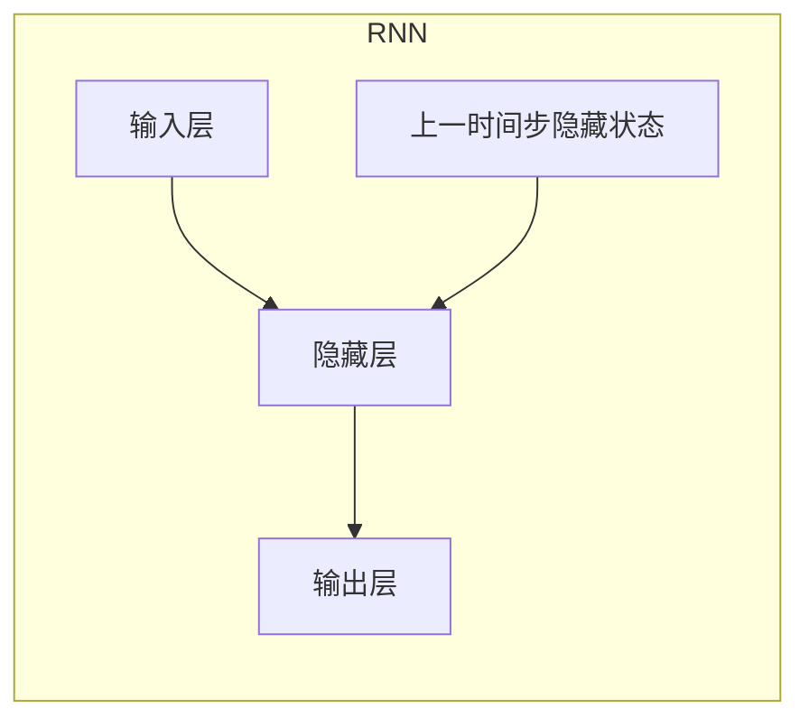

# 循环神经网络 (RNN) 原理与代码实例讲解

## 1. 背景介绍

循环神经网络(Recurrent Neural Network, RNN)是一种用于处理序列数据的强大神经网络架构。与传统的前馈神经网络不同,RNN能够捕捉序列数据中的时间动态行为,从而在自然语言处理、语音识别、时间序列预测等领域表现出色。

### 1.1 序列数据的挑战

在许多现实应用中,我们需要处理的数据通常以序列的形式出现,例如文本、语音和视频等。这些序列数据具有一个共同的特点:当前的输出不仅取决于当前的输入,还取决于之前的输入。传统的前馈神经网络无法有效地处理这种依赖关系,因为它们将每个输入独立地进行处理,忽视了输入之间的时间相关性。

### 1.2 RNN的出现

为了解决序列数据的挑战,RNN被提出。与前馈神经网络不同,RNN在隐藏层中引入了一种循环机制,使得网络能够记住先前的输入,并将其与当前输入相结合,从而捕捉序列数据中的动态行为。这种循环结构使得RNN能够在处理序列数据时表现出色,成为自然语言处理、语音识别等领域的关键技术。

## 2. 核心概念与联系

### 2.1 RNN的基本结构

RNN的基本结构由一个输入层、一个隐藏层和一个输出层组成。隐藏层中的神经元不仅接收来自当前输入和上一层的信息,还接收来自上一时间步的隐藏状态的信息。这种循环连接使得RNN能够捕捉序列数据中的时间动态行为。

### 2.2 RNN的前向传播

在RNN的前向传播过程中,每个时间步的隐藏状态不仅取决于当前输入,还取决于上一时间步的隐藏状态。这种递归关系可以用以下公式表示:

$$h_t = f(W_{xh}x_t + W_{hh}h_{t-1} + b_h)$$
$$o_t = g(W_{ho}h_t + b_o)$$

其中:
- $x_t$是时间步t的输入
- $h_t$是时间步t的隐藏状态
- $o_t$是时间步t的输出
- $W_{xh}$、$W_{hh}$、$W_{ho}$分别是输入到隐藏层、隐藏层到隐藏层、隐藏层到输出层的权重矩阵
- $b_h$和$b_o$分别是隐藏层和输出层的偏置项
- $f$和$g$分别是隐藏层和输出层的激活函数,通常使用tanh或ReLU

这种递归关系使得RNN能够捕捉序列数据中的长期依赖关系,但也容易导致梯度消失或梯度爆炸问题。

### 2.3 RNN的反向传播

在RNN的反向传播过程中,我们需要计算每个时间步的误差梯度,并通过反向传播算法更新网络的权重。由于RNN的循环结构,每个时间步的误差梯度不仅取决于当前时间步的误差,还取决于后续时间步的误差梯度。这种递归关系可以用以下公式表示:

$$\frac{\partial E}{\partial W_{xh}} = \sum_t \frac{\partial E}{\partial h_t} \frac{\partial h_t}{\partial W_{xh}}$$
$$\frac{\partial E}{\partial W_{hh}} = \sum_t \frac{\partial E}{\partial h_t} \frac{\partial h_t}{\partial W_{hh}}$$
$$\frac{\partial E}{\partial b_h} = \sum_t \frac{\partial E}{\partial h_t} \frac{\partial h_t}{\partial b_h}$$

其中,误差梯度$\frac{\partial E}{\partial h_t}$可以通过动态规划的方式进行计算,具体过程如下:

1. 初始化$\frac{\partial E}{\partial h_T} = \frac{\partial E}{\partial o_T} \frac{\partial o_T}{\partial h_T}$,其中T是序列的长度
2. 对于$t = T-1, T-2, \ldots, 1$,计算:
$$\frac{\partial E}{\partial h_t} = \frac{\partial E}{\partial o_t} \frac{\partial o_t}{\partial h_t} + \frac{\partial E}{\partial h_{t+1}} \frac{\partial h_{t+1}}{\partial h_t}$$

这种反向传播算法被称为"反向传播through time"(BPTT),它能够有效地计算RNN中每个权重的梯度,从而使用梯度下降法进行网络参数的更新。

## 3. 核心算法原理具体操作步骤

RNN的核心算法原理可以分为以下几个步骤:

### 3.1 初始化

1. 初始化RNN的权重矩阵$W_{xh}$、$W_{hh}$和$W_{ho}$,以及偏置项$b_h$和$b_o$。
2. 初始化隐藏状态$h_0$,通常设置为全0向量。

### 3.2 前向传播

对于每个时间步t:

1. 计算当前时间步的隐藏状态:
$$h_t = f(W_{xh}x_t + W_{hh}h_{t-1} + b_h)$$
2. 计算当前时间步的输出:
$$o_t = g(W_{ho}h_t + b_o)$$

### 3.3 计算损失函数

根据任务的不同,选择合适的损失函数,例如对于序列分类任务,可以使用交叉熵损失函数。

### 3.4 反向传播

1. 初始化$\frac{\partial E}{\partial h_T} = \frac{\partial E}{\partial o_T} \frac{\partial o_T}{\partial h_T}$,其中T是序列的长度。
2. 对于$t = T-1, T-2, \ldots, 1$,计算:
$$\frac{\partial E}{\partial h_t} = \frac{\partial E}{\partial o_t} \frac{\partial o_t}{\partial h_t} + \frac{\partial E}{\partial h_{t+1}} \frac{\partial h_{t+1}}{\partial h_t}$$
3. 计算权重矩阵和偏置项的梯度:
$$\frac{\partial E}{\partial W_{xh}} = \sum_t \frac{\partial E}{\partial h_t} \frac{\partial h_t}{\partial W_{xh}}$$
$$\frac{\partial E}{\partial W_{hh}} = \sum_t \frac{\partial E}{\partial h_t} \frac{\partial h_t}{\partial W_{hh}}$$
$$\frac{\partial E}{\partial b_h} = \sum_t \frac{\partial E}{\partial h_t} \frac{\partial h_t}{\partial b_h}$$

### 3.5 更新参数

使用梯度下降法或其他优化算法,根据计算得到的梯度更新RNN的权重矩阵和偏置项。

### 3.6 重复步骤3.2-3.5

对于每个训练样本,重复步骤3.2-3.5,直到模型收敛或达到预设的迭代次数。

## 4. 数学模型和公式详细讲解举例说明

在RNN的数学模型中,有几个关键公式需要详细讲解和举例说明。

### 4.1 隐藏状态的计算

RNN的核心在于隐藏状态的计算,它将当前输入和上一时间步的隐藏状态相结合,通过激活函数进行非线性转换。数学表达式如下:

$$h_t = f(W_{xh}x_t + W_{hh}h_{t-1} + b_h)$$

其中:
- $x_t$是时间步t的输入
- $h_t$是时间步t的隐藏状态
- $h_{t-1}$是上一时间步的隐藏状态
- $W_{xh}$和$W_{hh}$分别是输入到隐藏层和隐藏层到隐藏层的权重矩阵
- $b_h$是隐藏层的偏置项
- $f$是隐藏层的激活函数,通常使用tanh或ReLU

举例说明:
假设我们有一个简单的RNN,输入维度为2,隐藏层维度为3。在时间步t,输入为$x_t = [0.5, 1.0]$,上一时间步的隐藏状态为$h_{t-1} = [-0.2, 0.3, 0.1]$。权重矩阵和偏置项如下:

$$W_{xh} = \begin{bmatrix}
0.1 & 0.2 \\
0.3 & 0.4 \\
0.5 & 0.6
\end{bmatrix}, \quad W_{hh} = \begin{bmatrix}
0.2 & 0.1 & 0.3 \\
0.4 & 0.5 & 0.6 \\
0.7 & 0.8 & 0.9
\end{bmatrix}, \quad b_h = \begin{bmatrix}
0.1 \\
0.2 \\
0.3
\end{bmatrix}$$

使用tanh作为激活函数,我们可以计算当前时间步的隐藏状态:

$$\begin{align*}
h_t &= \tanh(W_{xh}x_t + W_{hh}h_{t-1} + b_h) \\
    &= \tanh\left(\begin{bmatrix}
0.1 & 0.2 \\
0.3 & 0.4 \\
0.5 & 0.6
\end{bmatrix} \begin{bmatrix}
0.5 \\
1.0
\end{bmatrix} + \begin{bmatrix}
0.2 & 0.1 & 0.3 \\
0.4 & 0.5 & 0.6 \\
0.7 & 0.8 & 0.9
\end{bmatrix} \begin{bmatrix}
-0.2 \\
0.3 \\
0.1
\end{bmatrix} + \begin{bmatrix}
0.1 \\
0.2 \\
0.3
\end{bmatrix}\right) \\
    &= \tanh\left(\begin{bmatrix}
0.37 \\
0.82 \\
1.27
\end{bmatrix}\right) \\
    &= \begin{bmatrix}
0.34 \\
0.64 \\
0.87
\end{bmatrix}
\end{align*}$$

可以看出,当前时间步的隐藏状态$h_t$不仅取决于当前输入$x_t$,还取决于上一时间步的隐藏状态$h_{t-1}$,这就是RNN能够捕捉序列数据时间动态行为的关键所在。

### 4.2 输出的计算

在计算隐藏状态后,RNN会将隐藏状态映射到输出,数学表达式如下:

$$o_t = g(W_{ho}h_t + b_o)$$

其中:
- $o_t$是时间步t的输出
- $h_t$是时间步t的隐藏状态
- $W_{ho}$是隐藏层到输出层的权重矩阵
- $b_o$是输出层的偏置项
- $g$是输出层的激活函数,根据任务的不同而选择,例如对于分类任务可以使用softmax函数

继续上面的例子,假设我们有一个三分类任务,输出层维度为3,权重矩阵和偏置项如下:

$$W_{ho} = \begin{bmatrix}
0.1 & 0.2 & 0.3 \\
0.4 & 0.5 & 0.6 \\
0.7 & 0.8 & 0.9
\end{bmatrix}, \quad b_o = \begin{bmatrix}
0.1 \\
0.2 \\
0.3
\end{bmatrix}$$

使用softmax作为激活函数,我们可以计算当前时间步的输出:

$$\begin{align*}
o_t &= \text{softmax}(W_{ho}h_t + b_o) \\
    &= \text{softmax}\left(\begin{bmatrix}
0.1 & 0.2 & 0.3 \\
0.4 & 0.5 & 0.6 \\
0.7 & 0.8 & 0.9
\end{bmatrix} \begin{bmatrix}
0.34 \\
0.64 \\
0.87
\end{bmatrix} + \begin{bmatrix}
0.1 \\
0.2 \\
0.3
\end{bmatrix}\right) \\
    &= \text{softmax}\left(\begin{bmatrix}
0.74 \\
1.36 \\
1.98
\end{bmatrix}\right) \\
    &= \begin{bmatrix}
0.16 \\
0.31 \\
0.53
\