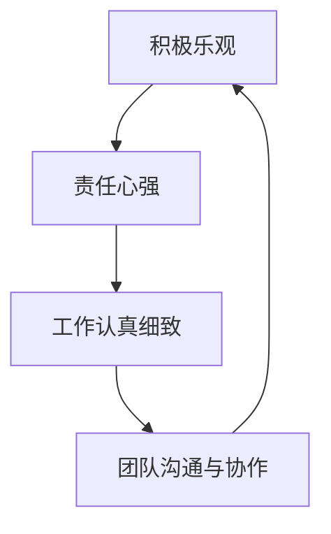

# 怎样培养积极乐观,责任心强,工作认真细致和良好的团队沟通与协作能力

## 1. 背景介绍

在当今快速发展的IT行业中,个人素质和团队合作能力对于一个人的职业发展至关重要。作为IT从业者,我们不仅需要扎实的专业技能,更需要积极乐观的心态、强烈的责任心、认真细致的工作态度以及良好的团队沟通与协作能力。这些软实力不仅能够帮助我们更好地应对工作中的挑战,也能让我们在职业发展的道路上走得更远。

### 1.1 软实力的重要性

软实力是除了专业技能之外的一些个人素质和能力,例如:
- 积极乐观的心态
- 强烈的责任心  
- 认真细致的工作态度
- 良好的团队沟通与协作能力

这些软实力往往能够决定一个人在职场中的发展潜力和上升空间。一个拥有优秀软实力的人,不仅能够出色地完成本职工作,还能在团队中起到积极的作用,成为团队的中坚力量。

### 1.2 软实力对IT从业者的意义

对于IT从业者来说,软实力的培养尤为重要。这是因为:

1. IT行业瞬息万变,需要我们时刻保持积极乐观的心态来应对变化和挑战。
2. IT项目往往涉及到多个部门和岗位的协作,需要强烈的责任心来确保自己的工作质量。  
3. IT工作需要处理大量复杂的技术细节,需要认真细致的态度来避免错误。
4. 现代IT项目多采用敏捷开发等协作模式,需要团队成员之间的高效沟通和默契配合。

因此,对于每一位IT从业者来说,在不断提升专业技能的同时,更应该重视自身软实力的培养。唯有如此,才能在激烈的行业竞争中脱颖而出,实现更大的职业发展。

## 2. 核心概念与联系

要培养积极乐观、责任心强、工作认真细致以及良好的团队沟通与协作能力,我们首先要深入理解这些品质的内涵,以及它们之间的关联。

### 2.1 积极乐观

积极乐观是一种正面的生活和工作态度。它意味着:
- 在面对困难和挫折时,相信自己有能力去克服它们
- 在面对变化和不确定性时,能够保持开放和创新的心态
- 在日常工作中,能够发现并欣赏美好的事物,传递正能量

积极乐观的心态能够帮助我们更从容地应对压力,激发创造力,提升工作绩效。

### 2.2 责任心强

责任心是一种强烈的使命感和主人翁意识。表现为:
- 对自己的工作高度负责,力求尽善尽美
- 主动承担责任,不推诿、不找借口
- 勇于面对问题和困难,积极寻求解决方案

责任心使我们成为值得信赖的团队成员,在关键时刻能够挺身而出,扛起重任。

### 2.3 工作认真细致  

认真细致是一种严谨、一丝不苟的工作态度。它要求我们:
- 对技术细节有深入的理解和把控
- 做事有条理、有计划,不放过每一个环节
- 精益求精,力求完美

认真细致的工作态度能够最大限度地减少错误和疏漏,提升工作质量和效率。

### 2.4 良好的团队沟通与协作能力

团队沟通与协作能力意味着:  
- 善于倾听,尊重他人的观点和想法
- 能够清晰、有逻辑地表达自己的想法
- 以开放、友善的态度与人交流
- 重视团队利益,能够为了共同目标而努力

良好的沟通与协作能力能够增进团队成员之间的了解和信任,提升团队的凝聚力和战斗力。

### 2.5 四者之间的关系

积极乐观、责任心强、工作认真细致以及良好的团队沟通与协作能力这四者之间是相辅相成、密不可分的:



- 积极乐观的心态是责任心的基础,使我们能够主动承担责任
- 责任心驱动我们在工作中力求认真细致 
- 认真细致的工作态度赢得他人的信任,增进沟通与协作
- 良好的沟通与协作营造积极向上的团队氛围,反过来促进个人积极乐观心态的形成

因此,这四种品质是相互促进、相得益彰的。作为IT从业者,我们要全面发展,在这四个方面共同发力,才能真正提升自己的软实力,在职业发展的道路上走得更高更远。

## 3. 核心算法原理具体操作步骤

对于如何培养这些软实力,我总结了一套切实可行的"STAR"算法:

- S (Scenario): 设定目标场景
- T (Target): 明确培养目标 
- A (Action): 采取行动措施
- R (Reflection): 反思总结提升

下面我们来详细看看每一步的操作要点。

### 3.1 设定目标场景 (Scenario)

首先,我们要给自己设定一个清晰、具体的目标场景。比如:
- 希望在未来的一个大型项目中担任核心开发人员
- 力争在年底的绩效评估中获得优秀等级
- 争取在明年升职加薪,担任团队leader的角色

目标场景要符合SMART原则:
- Specific: 具体明确,不能笼统
- Measurable: 可衡量,有明确的评判标准
- Attainable: 可达成,有一定挑战但不是遥不可及
- Relevant: 与自身职业发展相关 
- Time-based: 有明确的时间期限

设定好目标场景,我们才能有的放矢地开展后续的行动。

### 3.2 明确培养目标 (Target)  

接下来,我们要明确在这个目标场景下,需要重点培养的软实力。通常,我们要关注:
- 积极乐观: 保持正面心态,主动迎接挑战
- 责任心强: 勇于担当,不推诿不找借口
- 工作认真细致: 精益求精,一丝不苟
- 团队沟通与协作能力: 善于沟通,乐于分享,重视协作

根据具体的目标场景,我们要有针对性地确定1-2个重点培养目标。避免面面俱到,导致最后什么都没有提升。

### 3.3 采取行动措施 (Action)

确定了培养目标后,就要采取切实的行动措施。可以从以下几个方面入手:

1. 学习:
   - 阅读相关书籍,如《高效能人士的七个习惯》、《非暴力沟通》等
   - 参加相关培训,如职业软实力培训、团队建设训练等
   - 向优秀同事学习,观察他们的工作方法和处事态度

2. 实践:
   - 在日常工作中刻意练习,如主动请缨承担有挑战的任务,练习倾听和换位思考等
   - 参与或组织团建活动,增进彼此了解,提升协作默契
   - 适当参与跨部门项目,拓宽视野,锻炼沟通协调能力

3. 反馈:
   - 主动寻求上级和同事的反馈,了解自己的优缺点
   - 参与360度评估,全面审视自己
   - 定期自我评估,客观认识自己的进步和不足

### 3.4 反思总结提升 (Reflection)

行动之后,还要及时反思总结,巩固提升。具体来说:

1. 反思:
   - 每周或每月对自己的言行举止进行回顾
   - 思考在实践中遇到的困难和挑战,寻求改进方法
   - 反思自己的优缺点,明确后续改进方向

2. 总结:
   - 将反思的结果形成书面总结,以便日后复盘
   - 与他人分享自己的心得体会,吸收他人的意见建议
   - 定期对照目标场景,评估自己的进步情况

3. 提升:  
   - 针对反思中发现的问题,制定切实可行的改进计划
   - 将新的行动措施落实到日常工作中
   - 形成持续改进、螺旋上升的良性循环

通过"STAR"算法的循环迭代,我们就能在积极乐观、责任心强、工作认真细致以及良好的团队沟通与协作能力上取得实质性的进步,不断提升自己的职场软实力。

## 4. 数学模型和公式详细讲解举例说明

在培养软实力的过程中,我们可以借鉴一些数学模型和公式,使其更加科学系统。下面我举几个例子:

### 4.1 责任心模型

我们可以用一个简单的数学模型来衡量一个人的责任心:

$$
Responsibility = \frac{Completed Tasks}{Committed Tasks} \times 100\%
$$

其中:
- Completed Tasks: 在承诺时间内完成的任务数
- Committed Tasks: 承诺完成的任务总数

这个模型可以量化地评估一个人的责任心。比如,如果一个人承诺完成10个任务,最后在承诺时间内完成了9个,那么他的责任心指数就是90%。我们可以设定一个目标值,如95%,然后通过行动措施来不断提升这个指数。

### 4.2 沟通效率公式

在团队沟通中,我们可以用下面的公式来衡量沟通效率:

$$
Communication Efficiency = \frac{Information Transferred}{Time Spent}
$$

其中:
- Information Transferred: 传递的有效信息量
- Time Spent: 花费的时间

这个公式告诉我们,提升沟通效率的关键是在尽可能短的时间内,传递尽可能多的有效信息。我们可以通过一些技巧来提升这个指标,比如:
- 事先准备,理清思路,避免冗长
- 使用简洁明了的语言,避免模棱两可
- 善用图表、数据等辅助工具,提升信息密度
- 控制会议时长,避免跑题扯远

### 4.3 协作默契度量

在团队协作中,我们可以用下面的公式来量化协作的默契程度:

$$
Tacit Understanding = \frac{Successful Cooperations}{Total Cooperations} \times 100\%
$$

其中:
- Successful Cooperations: 不需要明确沟通,就能默契配合完成的次数
- Total Cooperations: 总的协作次数

这个公式反映了团队成员之间的默契程度。默契度越高,沟通成本就越低,协作效率就越高。我们可以通过一些方法来提升默契度,比如:
- 加强日常交流,增进彼此了解
- 建立统一的规范和流程,形成默契 
- 通过团建活动,提升感情和信任
- 在协作中多观察,多体谅,站在对方角度思考问题

当然,以上只是一些简单的示例。在实际工作中,我们还可以根据具体情况,设计出更加贴切的数学模型和公式,来指导我们的行动和评估。

## 5. 项目实践：代码实例和详细解释说明

下面我用一个简单的Python项目来演示如何将软实力的培养落实到代码开发中。

这个项目是一个简单的待办事项管理工具。通过这个项目,我们可以练习责任心、工作细致性以及团队协作。

### 5.1 代码实例

```python
class Task:
    def __init__(self, name, due_date):
        self.name = name
        self.due_date = due_date
        self.completed = False
        
    def complete(self):
        self.completed = True
        
    def __str__(self):
        return f"{self.name} - {'Completed' if self.completed else 'Incomplete'} - Due: {self.due_date}"
        
class TodoList:
    def __init__(self):
        self.tasks = []
        
    def add_task(self, task):
        self.tasks.append(task)
        
    def remove_task(self, task):
        self.tasks.remove(task)
        
    def get_incomplete_tasks(self):
        return [task for task in self.tasks if not