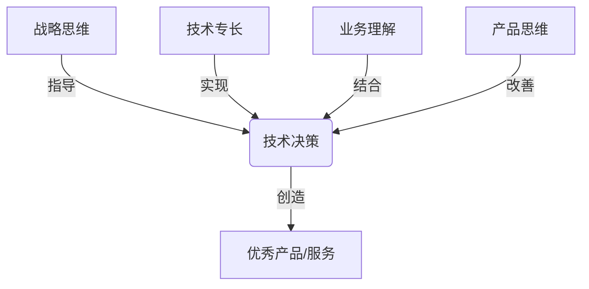
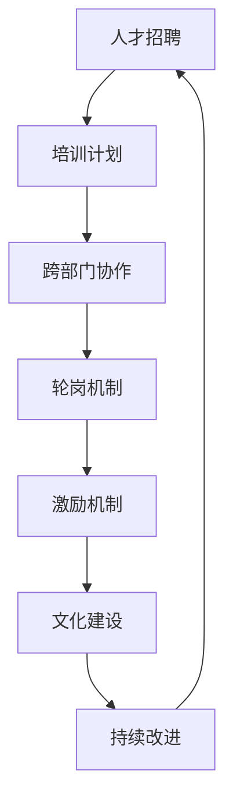

# 怎样建设和培养懂战略、懂技术、懂业务、懂产品的技术团队

## 1. 背景介绍

在当今快节奏的商业环境中，技术已经成为推动创新和增长的关键驱动力。然而，仅仅拥有出色的技术人才是远远不够的。为了真正释放技术的力量,我们需要建立一支全面发展的技术团队,他们不仅精通技术,还对业务、产品和战略有深刻的理解。

这种"全方位"的技术团队可以更好地将技术与业务目标相结合,提高效率,缩短上市时间,并为客户创造更大的价值。然而,培养这样的团队绝非易事。它需要明智的人才策略、持续的培训投资以及营造一种包容和协作的文化氛围。

在本文中,我们将探讨如何建设和培养一支"全能"的技术团队,他们不仅精通技术,还对业务、产品和战略有深刻的理解。我们将分享实践经验和见解,帮助您的组织走上这条成功之路。

## 2. 核心概念与联系

要建设一支"全能"的技术团队,我们需要了解几个关键概念及其相互关系:

### 2.1 战略思维

战略思维是指能够从更高的层面看问题,预见未来趋势,制定长期计划,并做出符合组织利益的决策。对于技术团队来说,拥有战略思维意味着能够将技术决策与公司的总体战略相结合,而不是简单地解决眼前的技术问题。

### 2.2 技术专长

这是技术团队的基础。技术专长包括编程能力、架构设计、工具使用、最佳实践等。拥有扎实的技术功底是实现其他目标的前提。

### 2.3 业务理解

业务理解是指对公司所处行业、商业模式、客户需求、竞争格局等方面的深入了解。有了这种理解,技术团队就能更好地将技术与业务目标相结合,提供更有价值的解决方案。

### 2.4 产品思维

产品思维是指从用户角度出发,理解和预见用户需求,并提供优秀的用户体验。对于技术团队来说,拥有产品思维意味着能够更好地将技术与产品设计相结合,创造出真正为用户所需的产品和服务。

这四个概念相互关联、相辅相成。一个"全能"的技术团队需要在这四个方面都有出色的表现。



## 3. 核心算法原理具体操作步骤

培养一支"全能"的技术团队并非一蹴而就,需要采取系统的方法,遵循一定的步骤:

### 3.1 人才招聘

在招聘过程中,不仅要评估应聘者的技术能力,还要关注他们的战略思维、业务理解和产品思维。可以通过情景面试、案例分析等方式来评估这些方面的能力。

### 3.2 培训计划

为现有团队制定全面的培训计划,包括技术培训、业务培训、产品培训和战略培训。可以采取内部培训、外部培训、导师制度、项目实践等多种形式。

### 3.3 跨部门协作

鼓励技术团队与其他部门(如业务部门、产品部门、市场部门等)进行跨部门协作,互相了解对方的工作,增进理解和沟通。

### 3.4 轮岗机制

建立技术人员与其他部门之间的轮岗机制,让技术人员有机会深入了解业务、产品和战略,培养全面的视野。

### 3.5 激励机制

建立合理的激励机制,对表现出色的"全能"技术人员给予肯定和奖励,激发他们的积极性。

### 3.6 文化建设

营造一种包容、协作、学习的企业文化,鼓励技术人员主动学习新知识,拓展视野,培养全面的能力。

### 3.7 持续改进

定期评估团队的发展情况,收集反馈,并根据评估结果不断优化和改进培养方法。



## 4. 数学模型和公式详细讲解举例说明

在培养"全能"技术团队的过程中,我们可以借助一些数学模型和公式来量化和优化培养效果。

### 4.1 技能矩阵模型

我们可以将技术团队所需的各项技能(包括战略思维、技术专长、业务理解和产品思维)构建成一个技能矩阵,每个团队成员在每项技能上都有一个分数。我们的目标是使整个团队的技能矩阵达到最优化。

设有 $n$ 个团队成员,每个成员在 $m$ 项技能上都有一个分数 $s_{ij}$ ($1 \leq i \leq n$, $1 \leq j \leq m$)。我们可以定义一个目标函数:

$$
\max \sum_{j=1}^{m} \left( \max_{1 \leq i \leq n} s_{ij} \right)
$$

也就是maximaize所有技能的最高分数之和。通过培训、轮岗等方式,我们希望使这个目标函数达到最大值,从而使整个团队在各项技能上都有出色的表现。

### 4.2 马尔可夫决策过程模型

在制定培训计划时,我们可以将它看作一个马尔可夫决策过程(Markov Decision Process, MDP)。假设有 $n$ 个团队成员,每个成员在 $m$ 项技能上都有一个当前的熟练程度 $s_i$ ($1 \leq i \leq m$)。我们的目标是通过一系列的培训行动 $a_t$,使所有技能的熟练程度达到一个理想的水平 $g_i$ ($1 \leq i \leq m$)。

在每个时间步 $t$,我们的状态是所有技能的当前熟练程度 $s_t = (s_1, s_2, \ldots, s_m)$。我们需要选择一个行动 $a_t$,例如对某项技能进行培训。这个行动会使状态转移到下一个状态 $s_{t+1}$,并产生一个即时奖励 $r_t$,表示这个行动对于达成目标的贡献程度。

我们的目标是找到一个最优策略 $\pi^*$,使得沿着这个策略执行的行动序列能够maximaize累积奖励:

$$
\pi^* = \arg\max_\pi \mathbb{E} \left[ \sum_{t=0}^{\infty} \gamma^t r_t \right]
$$

其中 $\gamma$ 是一个折现因子,表示我们对未来奖励的权重。通过求解这个MDP问题,我们可以得到一个最优的培训计划,有效地提高团队在各项技能上的熟练程度。

这只是一个简单的例子,在实践中,我们可以根据具体情况构建更复杂的数学模型,以更好地指导和优化培养过程。

## 5. 项目实践:代码实例和详细解释说明

为了更好地理解如何培养"全能"技术团队,我们来看一个实际的项目案例。假设我们有一个电子商务网站,需要开发一个新的个性化推荐系统。这个项目需要技术团队与业务部门、产品部门、数据科学部门等多个部门密切合作。

### 5.1 项目需求分析

在项目的初始阶段,技术团队需要与业务部门和产品部门紧密合作,了解项目的商业目标、用户需求和产品设计理念。他们需要思考如何将推荐系统与公司的整体战略相结合,如何为用户带来更好的体验。

```python
# 伪代码示例
business_goals = analyze_business_requirements()
user_needs = collect_user_feedback()
product_design = collaborate_with_product_team()

recommendation_system_requirements = combine(business_goals, user_needs, product_design)
```

### 5.2 系统架构设计

在了解需求后,技术团队需要设计出一个合理的系统架构。这需要考虑系统的可扩展性、性能、容错性等因素。同时,他们还需要与数据科学部门合作,集成机器学习算法,实现个性化推荐功能。

```python
# 伪代码示例
system_architecture = design_scalable_architecture(recommendation_system_requirements)
recommendation_algorithm = collaborate_with_data_science_team()
integrate_algorithm(system_architecture, recommendation_algorithm)
```

### 5.3 系统实现和测试

在实现和测试阶段,技术团队需要与产品部门保持紧密沟通,确保系统符合预期的用户体验。同时,他们还需要与运维团队合作,准备好系统的部署和监控方案。

```python
# 伪代码示例
develop_recommendation_system(system_architecture)
user_testing = collaborate_with_product_team()
system_optimization = incorporate_user_feedback(user_testing)
deployment_plan = work_with_ops_team()
```

### 5.4 系统上线和持续改进

在系统上线后,技术团队需要持续监控系统的运行情况,收集用户反馈,并与相关部门合作进行系统优化和功能迭代。这是一个持续的过程,需要技术团队与其他部门保持紧密的协作。

```python
# 伪代码示例
monitor_system_performance()
user_feedback = collect_user_data()
collaborate_with_teams(user_feedback)
system_optimization_and_new_features()
```

通过这个案例,我们可以看到,培养"全能"技术团队不仅需要技术能力,还需要与其他部门紧密合作,了解业务目标、用户需求和产品设计理念,将技术与其他领域有机结合,从而创造出真正有价值的产品和服务。

## 6. 实际应用场景

"全能"技术团队在各行各业都有广泛的应用场景,以下是一些典型的例子:

### 6.1 金融科技

在金融科技领域,技术团队需要深入了解金融行业的法规、风险管理和合规要求,同时还需要具备出色的产品思维,为用户提供优秀的金融服务体验。

### 6.2 智能制造

在智能制造领域,技术团队需要熟悉制造业的流程、设备和标准,同时还需要具备战略眼光,规划智能制造的发展路线图。

### 6.3 医疗健康

在医疗健康领域,技术团队需要深入了解医学知识、法规要求和患者需求,并将这些知识融入到技术解决方案中,为患者提供更好的医疗服务。

### 6.4 电子商务

在电子商务领域,技术团队需要紧密结合业务目标和用户需求,开发出优秀的购物体验和个性化推荐系统,帮助企业获得竞争优势。

### 6.5 教育科技

在教育科技领域,技术团队需要深入了解教育理论和教学方法,同时还需要具备产品思维,为学生和教师提供有效的学习和教学工具。

无论是哪个行业,拥有"全能"的技术团队都可以帮助企业更好地将技术与业务目标相结合,提高效率,缩短上市时间,并为客户创造更大的价值。

## 7. 工具和资源推荐

在培养"全能"技术团队的过程中,我们可以利用一些有用的工具和资源:

### 7.1 在线课程和培训平台

像 Coursera、Udacity 和 Pluralsight 这样的在线课程平台提供了丰富的技术、业务和产品相关的课程,可以帮助技术人员扩展知识面。

### 7.2 行业会议和活动

参加相关行业的会议和活动,可以了解最新的技术趋势、业务动向和用户需求,拓展视野。

### 7.3 导师制度

为技术人员匹配来自不同领域的导师,可以帮助他们更好地了解其他领域的知识和实践。

### 7.4 跨部门协作工具

像 Slack、Trello 和 