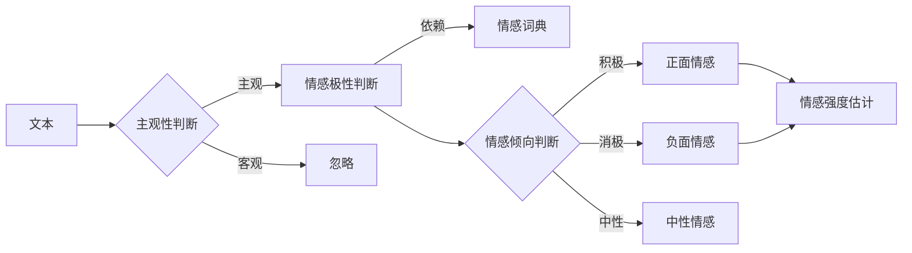

# 情感分析(Sentiment Analysis)原理与代码实战案例讲解

## 1. 背景介绍
### 1.1 情感分析的定义
情感分析（Sentiment Analysis），也称为意见挖掘（Opinion Mining），是自然语言处理（NLP）领域的一个重要分支。它旨在分析文本中表达的情感、观点、态度、情绪等主观信息，以确定说话者或作者对特定主题的看法是正面、负面还是中性的。

### 1.2 情感分析的应用场景
情感分析在许多领域都有广泛的应用，例如：
- 社交媒体监测：分析社交媒体上用户对品牌、产品、服务的评论，了解用户的满意度和口碑。
- 客户服务：自动分析客户反馈，识别负面情绪，及时处理客户投诉。
- 市场调研：分析消费者对产品的评价，发现产品优缺点，改进产品设计。
- 金融领域：分析财经新闻和社交媒体信息，预测股票走势。
- 政治选举：分析民众对候选人的看法，预测选举结果。

### 1.3 情感分析的挑战
尽管情感分析取得了长足进展，但仍面临许多挑战：
- 语义理解：理解文本的真正含义，特别是处理讽刺、反语等修辞手法。
- 上下文依赖：情感表达常常依赖于上下文，需要考虑语境。
- 主客观交织：文本中可能同时包含客观事实和主观情感。
- 领域特异性：不同领域的情感表达方式差异较大，需要领域自适应。

## 2. 核心概念与联系
### 2.1 情感极性
情感极性（Sentiment Polarity）是指文本表达的情感是积极、消极还是中性的。通常使用数值来表示，如1表示积极，-1表示消极，0表示中性。

### 2.2 主观性与客观性
主观性（Subjectivity）指文本包含个人感受、观点、评价等主观成分的程度。
客观性（Objectivity）指文本陈述事实、现象等客观信息的程度。
情感分析主要关注主观文本。

### 2.3 情感词典
情感词典（Sentiment Lexicon）是带有情感标注的单词或短语的集合。
常见的情感词典有：
- MPQA Subjectivity Lexicon
- Bing Liu's Opinion Lexicon
- AFINN Lexicon
- SentiWordNet

### 2.4 情感倾向与强度
情感倾向（Sentiment Orientation）表示一个情感词的积极或消极性质。
情感强度（Sentiment Intensity）表示情感表达的程度或强弱。

### 2.5 核心概念联系
下图展示了情感分析的核心概念之间的关系：

## 3. 核心算法原理具体操作步骤
情感分析的主要方法可分为三类：
1. 基于词典的方法
2. 基于机器学习的方法  
3. 基于深度学习的方法

### 3.1 基于词典的方法
#### 3.1.1 原理
基于词典的方法通过匹配文本中的词语和情感词典，根据词语的情感倾向和强度，综合计算文本的情感得分。

#### 3.1.2 步骤
1. 文本预处理：分词、去停用词、词性标注等。
2. 情感词匹配：在情感词典中查找文本中的情感词。
3. 情感得分计算：根据情感词的倾向和强度，综合计算文本的情感得分。可采用求和、加权平均等方法。
4. 情感极性判断：根据情感得分的正负和大小，判断文本的情感极性。

#### 3.1.3 优缺点
- 优点：实现简单，可解释性强，领域适应性好。
- 缺点：依赖词典质量，无法处理词典未覆盖的情感表达。

### 3.2 基于机器学习的方法
#### 3.2.1 原理
基于机器学习的方法将情感分析看作一个分类问题，通过带标签的训练数据训练分类器，再用分类器预测新文本的情感极性。

#### 3.2.2 步骤
1. 数据准备：收集带情感标签的文本数据。
2. 文本表示：将文本转换为机器学习算法可处理的形式，如词袋模型、TF-IDF等。
3. 特征选择（可选）：选择最有区分度的特征，如信息增益、卡方检验等。
4. 分类器训练：使用训练数据训练分类器，如朴素贝叶斯、支持向量机、逻辑回归等。
5. 模型评估：在测试集上评估模型性能，如准确率、召回率、F1值等。
6. 模型应用：用训练好的分类器预测新文本的情感极性。

#### 3.2.3 优缺点
- 优点：可自动学习文本的情感表示，适应领域特点。
- 缺点：需要大量标注数据，模型可解释性差。

### 3.3 基于深度学习的方法
#### 3.3.1 原理
基于深度学习的方法利用神经网络自动学习文本的层次化特征表示，无需人工设计特征。

#### 3.3.2 常见模型
- CNN：卷积神经网络，擅长提取局部特征。
- RNN：循环神经网络，擅长处理序列数据，如LSTM、GRU等。
- Attention：注意力机制，可以自动聚焦到关键信息上。
- BERT：预训练的双向Transformer编码器，可生成强大的文本表示。

#### 3.3.3 步骤
1. 数据准备：收集带情感标签的文本数据。
2. 文本表示：将文本转换为词向量或字符向量。
3. 模型构建：设计神经网络结构，如CNN、RNN等。
4. 模型训练：使用训练数据训练模型，优化模型参数。
5. 模型评估：在测试集上评估模型性能。
6. 模型应用：用训练好的模型预测新文本的情感极性。

#### 3.3.4 优缺点
- 优点：自动学习高级特征，性能领先，适应语言复杂性。
- 缺点：需要大量训练数据和计算资源，模型可解释性差。

## 4. 数学模型和公式详细讲解举例说明
### 4.1 基于词典的情感得分计算
设文本 $d$ 包含 $n$ 个情感词 $w_1, w_2, ..., w_n$，每个情感词的情感得分为 $s_1, s_2, ..., s_n$，则文本 $d$ 的情感得分 $S(d)$ 可表示为：

$$S(d) = \frac{1}{n}\sum_{i=1}^{n} s_i$$

其中，$s_i$ 可根据情感词典定义，如AFINN词典中，"good"的情感得分为3，"bad"的情感得分为-3。

举例：对于文本"The movie is good, but the acting is bad."，匹配到情感词"good"和"bad"，对应得分为3和-3，则文本的情感得分为：

$$S(d) = \frac{1}{2}(3+(-3)) = 0$$

可见，该文本的情感极性为中性。

### 4.2 朴素贝叶斯情感分类
朴素贝叶斯是常用的机器学习分类算法，它基于贝叶斯定理和特征独立性假设。对于情感分类，我们通常采用多项式朴素贝叶斯模型。

设文本 $d$ 的特征向量为 $\mathbf{x} = (x_1, x_2, ..., x_m)$，其中 $x_i$ 表示第 $i$ 个特征的取值，如第 $i$ 个词的出现次数。设情感类别集合为 $C = \{c_1, c_2, ..., c_k\}$，如 $C = \{positive, negative, neutral\}$。则文本 $d$ 属于类别 $c$ 的后验概率为：

$$P(c|\mathbf{x}) = \frac{P(c)P(\mathbf{x}|c)}{P(\mathbf{x})} \propto P(c)\prod_{i=1}^{m}P(x_i|c)$$

其中，$P(c)$ 为类别 $c$ 的先验概率，$P(x_i|c)$ 为给定类别 $c$ 下特征 $x_i$ 的条件概率，可通过最大似然估计计算：

$$P(c) = \frac{N_c}{N}, \quad P(x_i|c) = \frac{N_{ic}+\alpha}{N_c+\alpha m}$$

其中，$N$ 为训练集样本总数，$N_c$ 为类别 $c$ 的样本数，$N_{ic}$ 为类别 $c$ 下特征 $x_i$ 的出现次数，$\alpha$ 为平滑参数（通常取1，即拉普拉斯平滑）。

分类时，选择后验概率最大的类别作为文本的情感极性：

$$c^* = \arg\max_{c \in C} P(c|\mathbf{x})$$

举例：假设训练集中有10个正面文本和10个负面文本，其中正面文本中"good"出现5次，负面文本中"good"出现1次。则对于包含"good"的新文本，其属于正面情感的后验概率为：

$$P(positive|good) \propto P(positive)P(good|positive) = \frac{10}{20} \cdot \frac{5+1}{10+1\cdot2} = \frac{1}{4}$$

类似地，可计算出其属于负面情感的后验概率，比较两个后验概率大小，即可判断该文本的情感极性。

### 4.3 CNN情感分类
卷积神经网络（CNN）常用于文本分类任务。一种典型的CNN情感分类模型结构如下：

1. 输入层：将文本转换为词向量或字符向量表示。
2. 卷积层：使用多个不同尺寸的卷积核对输入进行卷积操作，提取局部特征。
3. 池化层：对卷积结果进行最大池化或平均池化，压缩特征维度。
4. 全连接层：将池化结果展平，并通过全连接层生成分类概率。
5. 输出层：使用softmax函数输出各个情感类别的概率。

设输入文本的词向量表示为 $\mathbf{x} \in \mathbb{R}^{n \times d}$，其中 $n$ 为文本长度，$d$ 为词向量维度。卷积核 $\mathbf{w} \in \mathbb{R}^{h \times d}$ 在位置 $i$ 的卷积结果为：

$$c_i = f(\mathbf{w} \cdot \mathbf{x}_{i:i+h-1} + b)$$

其中，$\mathbf{x}_{i:i+h-1}$ 表示第 $i$ 到第 $i+h-1$ 个词向量构成的矩阵，$b$ 为偏置项，$f$ 为激活函数（如ReLU）。

对卷积结果 $\mathbf{c} = (c_1, c_2, ..., c_{n-h+1})$ 进行最大池化，得到该卷积核提取的特征 $\hat{c} = \max(\mathbf{c})$。

使用多个不同尺寸的卷积核，得到一组特征 $\hat{\mathbf{c}} = (\hat{c}_1, \hat{c}_2, ..., \hat{c}_m)$，再通过全连接层和softmax函数得到情感类别概率：

$$\mathbf{p} = \text{softmax}(\mathbf{W}\hat{\mathbf{c}} + \mathbf{b})$$

其中，$\mathbf{W}$ 和 $\mathbf{b}$ 为全连接层的权重和偏置。

模型训练时，使用交叉熵损失函数，并通过反向传播算法优化模型参数。

举例：假设有一个3类情感分类任务（正面、负面、中性），输入文本为"The movie is good"，转换为词向量后的维度为 $4 \times 10$。使用3个尺寸为 $2 \times 10$、$3 \times 10$、$4 \times 10$ 的卷积核，分别得到特征 $\hat{c}_