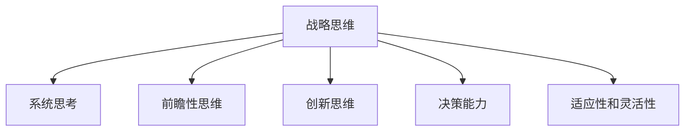
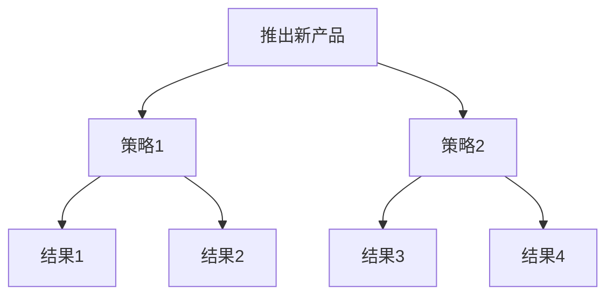

# 战略思维能力培养：具有战略思维、解决问题能力和持续适应变化的能力

## 1.背景介绍

### 1.1 战略思维的重要性

在当今瞬息万变的商业环境中，拥有战略思维能力对于个人和组织的成功至关重要。战略思维能够帮助我们洞察未来的趋势和机遇,制定明智的决策,并有效地分配资源。它是一种宝贵的技能,可以帮助我们应对不确定性,解决复杂的问题,并保持竞争优势。

### 1.2 挑战与机遇

然而,培养战略思维能力并非一蹴而就。它需要持续的学习、实践和反思。我们面临着诸多挑战,例如固有思维模式的束缚、短视行为和对变革的抗拒。但与此同时,新兴技术、全球化和不断变化的市场动态也为我们提供了机遇,推动我们发展战略思维能力。

## 2.核心概念与联系

### 2.1 战略思维的核心要素

战略思维包括以下几个核心要素:

1. 系统思考
2. 前瞻性思维
3. 创新思维
4. 决策能力
5. 适应性和灵活性

这些要素相互关联,共同构建了战略思维的框架。



### 2.2 与其他能力的关系

战略思维与其他关键能力密切相关,例如:

- 解决问题能力
- 沟通能力
- 领导力
- 情商

它们相辅相成,共同促进个人和组织的发展。

## 3.核心算法原理具体操作步骤

培养战略思维能力是一个持续的过程,需要采取系统的方法。以下是一些核心步骤:

### 3.1 扩展视野

1. 主动学习新知识
2. 关注行业动态和趋势
3. 倾听不同观点和反馈

### 3.2 培养系统思考习惯

1. 识别系统的各个组成部分
2. 分析部分之间的相互关系
3. 考虑系统的整体行为和影响

### 3.3 练习创新思维

1. 提出富有洞察力的问题
2. 尝试不同的思维方式
3. 鼓励创新和实验

### 3.4 提高决策能力

1. 收集相关数据和信息
2. 分析利弊和潜在风险
3. 制定明智的行动计划

### 3.5 保持适应性和灵活性

1. 持开放态度,接受变革
2. 快速应对新情况
3. 不断学习和调整策略

## 4.数学模型和公式详细讲解举例说明

在战略思维中,数学模型和公式可以帮助我们量化和优化决策过程。以下是一些常见的模型和公式:

### 4.1 决策树模型

决策树是一种图形化的决策支持工具,可以帮助我们评估不同选择的结果。它的基本公式如下:

$$
\text{Expected Value} = \sum_{i=1}^{n} p_i \times v_i
$$

其中,$ p_i $是每个结果发生的概率,$ v_i $是每个结果的价值。

例如,假设一家公司正在考虑推出新产品。他们可以使用决策树来评估不同营销策略的预期收益,从而做出明智的决策。



### 4.2 游戏理论模型

游戏理论是一种研究策略行为的数学模型,常用于分析竞争对手的行为和制定对策。著名的囚徒困境模型就是游戏理论的一个经典案例。

$$
\begin{array}{c|cc}
& \text{合作} & \text{背叛} \\
\hline
\text{合作} & (-1,-1) & (-3,0) \\
\text{背叛} & (0,-3) & (-2,-2)
\end{array}
$$

在这个模型中,每个参与者都需要决定是合作还是背叛。如果双方都合作,他们将获得较小的惩罚;如果一方背叛而另一方合作,背叛者将获得最大利益;如果双方都背叛,他们将承受较大的惩罚。

通过分析这种博弈情况,我们可以更好地预测竞争对手的行为,并制定相应的战略。

### 4.3 优化模型

在资源有限的情况下,优化模型可以帮助我们最大化目标函数。线性规划是一种常见的优化技术,其基本模型如下:

$$
\begin{aligned}
\text{maximize} \quad & \sum_{j=1}^{n} c_j x_j \\
\text{subject to} \quad & \sum_{j=1}^{n} a_{ij} x_j \leq b_i, \quad i=1,\ldots,m \\
& x_j \geq 0, \quad j=1,\ldots,n
\end{aligned}
$$

其中,$ c_j $是每个决策变量$ x_j $的系数,$ a_{ij} $和$ b_i $分别表示资源约束条件的系数和常数项。

例如,一家制造商可以使用线性规划来确定生产不同产品的最佳组合,从而最大化利润并满足原材料和劳动力的限制。

通过将数学模型与战略思维相结合,我们可以更好地量化和优化决策过程,从而做出更明智的选择。

## 5.项目实践:代码实例和详细解释说明

为了更好地理解战略思维的应用,我们来看一个实际项目的案例。假设我们正在开发一个电子商务网站,需要制定营销策略来吸引新客户并保持现有客户的忠诚度。

### 5.1 定义目标和约束条件

首先,我们需要明确项目的目标和约束条件。在这个案例中,我们的目标是最大化网站的收入,同时控制营销成本在一定范围内。我们还需要考虑客户群体的差异化需求和竞争对手的行为。

```python
# 定义目标函数
def objective_function(x):
    revenue = 1000 * x[0] + 800 * x[1] + 500 * x[2]
    cost = 200 * x[0] + 150 * x[1] + 100 * x[2]
    return revenue - cost

# 定义约束条件
constraints = [
    lambda x: x[0] + x[1] + x[2] <= 1000,  # 营销预算限制
    lambda x: x[0] >= 0, lambda x: x[1] >= 0, lambda x: x[2] >= 0  # 非负性约束
]
```

在这个示例中,我们定义了一个目标函数,它考虑了不同营销活动带来的收入和成本。我们还设置了营销预算和非负性的约束条件。

### 5.2 分析数据和市场趋势

接下来,我们需要收集和分析相关数据,包括客户行为数据、市场趋势和竞争对手的策略。这些数据将为我们的决策提供依据。

```python
import pandas as pd

# 加载客户数据
customer_data = pd.read_csv('customer_data.csv')

# 分析客户行为和偏好
customer_segments = customer_data.groupby('segment')
segment_preferences = customer_segments['preference'].value_counts()

# 分析市场趋势
market_trends = pd.read_csv('market_trends.csv')
trend_analysis = market_trends.corr()
```

在这个例子中,我们使用 Pandas 库加载并分析客户数据和市场趋势数据。我们可以根据客户分组和偏好来制定差异化的营销策略,并考虑市场趋势的相关性来预测未来的发展方向。

### 5.3 制定和优化策略

根据我们收集的数据和分析结果,我们可以制定初步的营销策略,然后使用优化算法来优化策略组合,从而达到最大化收益的目标。

```python
from scipy.optimize import minimize

# 初始策略
initial_strategy = [300, 400, 300]  # [社交媒体营销, 搜索引擎营销, 电子邮件营销]

# 优化策略
res = minimize(objective_function, initial_strategy, constraints=constraints)
optimized_strategy = res.x
```

在这个例子中,我们使用 SciPy 库中的优化算法来优化营销策略组合。我们定义了一个初始策略,然后使用 `minimize` 函数来寻找最优解,同时考虑了约束条件。

### 5.4 实施和监控

最后,我们需要实施优化后的营销策略,并持续监控其效果。根据实际情况,我们可能需要调整策略以适应市场的变化。

```python
# 实施优化策略
print(f"优化后的营销策略: 社交媒体营销 = {optimized_strategy[0]}, 搜索引擎营销 = {optimized_strategy[1]}, 电子邮件营销 = {optimized_strategy[2]}")

# 监控效果
def monitor_performance(data):
    # 计算关键绩效指标
    revenue = data['revenue'].sum()
    cost = data['cost'].sum()
    roi = (revenue - cost) / cost
    
    # 输出结果
    print(f"总收入: {revenue}, 总成本: {cost}, 投资回报率: {roi}")
    
    # 根据需要调整策略
    ...
```

在这个示例中,我们打印出优化后的营销策略,并定义了一个 `monitor_performance` 函数来计算关键绩效指标,如总收入、总成本和投资回报率。根据这些指标,我们可以评估策略的效果,并根据需要进行调整。

通过将战略思维与实际项目相结合,我们可以更好地理解如何应用战略思维的原则和技术,从而做出明智的决策并实现预期目标。

## 6.实际应用场景

战略思维能力在各个领域都有广泛的应用,以下是一些典型的应用场景:

### 6.1 商业战略制定

在商业领域,战略思维对于制定有效的商业战略至关重要。企业需要预测市场趋势,分析竞争格局,识别机遇和风险,并制定相应的战略计划。战略思维可以帮助企业做出明智的决策,实现长期的可持续发展。

### 6.2 产品开发和创新

在产品开发和创新领域,战略思维可以帮助我们预测客户需求,洞察未来趋势,并设计出具有竞争力的产品和服务。它可以促进创新思维,鼓励我们挑战现有的做法,探索新的解决方案。

### 6.3 项目管理

在项目管理领域,战略思维可以帮助我们制定明确的目标,识别潜在的风险,并优化资源分配。它可以提高项目的成功率,确保项目按时、按质、按预算完成。

### 6.4 个人发展

战略思维不仅对组织有益,对个人发展也至关重要。它可以帮助我们规划职业生涯,设定长期目标,并制定实现这些目标的策略。它还可以提高我们的适应能力和决策能力,使我们能够更好地应对不确定性和变革。

## 7.工具和资源推荐

培养战略思维能力需要持续的学习和实践。以下是一些推荐的工具和资源:

### 7.1 书籍和课程

- 《好策略,坏策略》(Good Strategy, Bad Strategy) by Richard Rumelt
- 《战略思维》(Strategic Thinking) by Huggy Rao and Robert Nason
- 《系统思考》(Thinking in Systems) by Donella H. Meadows
- 《创新者的解答》(The Innovator's Solution) by Clayton M. Christensen and Michael E. Raynor
- Coursera 和 edX 上的相关在线课程

### 7.2 实践和案例分析

- 参与企业战略制定和决策过程
- 分析成功和失败的案例,总结经验教训
- 参加战略思维培训和模拟游戏

### 7.3 社区和网络资源

- 加入专业社区和论坛,与同行交流经验
- 关注行业领袖和思想家的博客和社交媒体
- 参与线上研讨会和网络研习班

通过利用这些工具和资源,我们可以不断提高战略思维能力,为个人和组织的成功做好准