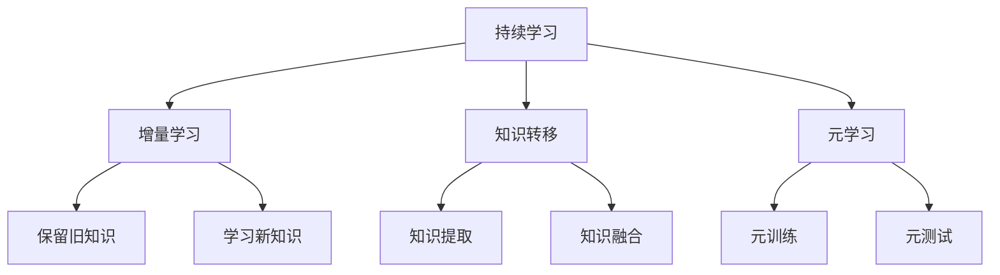
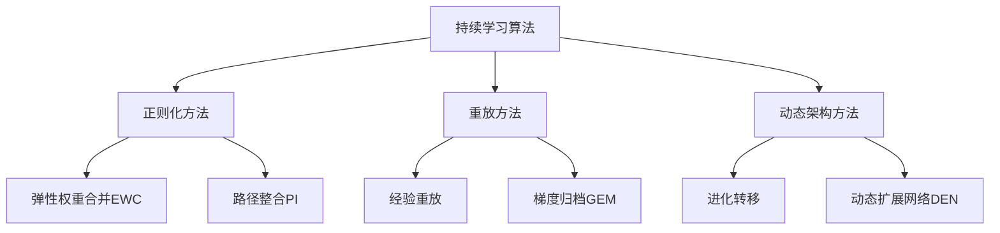

# 持续学习 Continual Learning 原理与代码实例讲解

## 1. 背景介绍

在传统的机器学习范式中,模型通常在固定的数据集上进行训练,并在部署后保持静态不变。然而,在现实世界中,数据通常是动态变化的,新的数据样本会不断出现。为了适应这种动态环境,机器学习模型需要具备持续学习的能力,即在不破坏之前学习的知识的情况下,逐步学习新出现的数据。

持续学习(Continual Learning)旨在解决这一挑战,它使机器学习模型能够在遇到新数据时进行增量学习,而不会遗忘之前学习到的知识。这种能力对于许多应用场景都是至关重要的,例如机器人技术、自然语言处理、计算机视觉等领域。

### 1.1 遗忘现象 (Catastrophic Forgetting)

在传统的机器学习模型中,当模型在新数据上进行训练时,它往往会遗忘之前学习到的知识,这种现象被称为"遗忘现象"(Catastrophic Forgetting)。遗忘现象的根源在于神经网络在学习新知识时,会过度调整参数,从而破坏之前学习到的知识表示。

### 1.2 持续学习的重要性

持续学习的能力对于以下场景尤为重要:

- **动态环境**: 在动态变化的环境中,新的数据会不断出现,模型需要持续学习以适应新的情况。
- **资源受限**: 在资源受限的情况下(如嵌入式系统或移动设备),重新训练整个模型可能是不可行的,因此需要增量学习新知识。
- **在线学习**: 对于需要在线学习的应用(如对话系统或推荐系统),模型必须能够持续学习新的数据,而不会遗忘之前的知识。
- **个性化**: 在个性化应用中,模型需要持续学习每个用户的偏好和行为,以提供更好的个性化体验。

## 2. 核心概念与联系

### 2.1 增量学习 (Incremental Learning)

增量学习是持续学习的核心概念之一。它指的是机器学习模型在遇到新数据时,能够逐步学习新知识,而不会完全遗忘之前学习到的知识。增量学习通常包括以下两个步骤:

1. **保留旧知识**: 在学习新数据之前,模型需要保留之前学习到的知识表示。
2. **学习新知识**: 模型在新数据上进行训练,并将新学习到的知识与之前的知识合并。

增量学习的关键挑战在于如何在这两个步骤之间达成平衡,即在学习新知识的同时,尽可能地保留旧知识。

### 2.2 知识转移 (Knowledge Transfer)

知识转移是另一个与持续学习密切相关的概念。它指的是将之前学习到的知识有效地转移到新任务或新域中。通过知识转移,模型可以利用之前学习到的知识,加速新任务的学习过程。

知识转移通常包括以下两个步骤:

1. **知识提取**: 从之前训练好的模型中提取出可转移的知识表示。
2. **知识融合**: 将提取出的知识与新任务或新域的数据相结合,进行模型训练。

知识转移可以帮助模型更好地利用之前学习到的知识,从而提高持续学习的效率和性能。

### 2.3 元学习 (Meta-Learning)

元学习是一种旨在提高机器学习模型泛化能力的方法。它通过学习如何快速适应新任务或新域,从而提高模型的持续学习能力。

元学习通常包括以下两个步骤:

1. **元训练**: 在多个不同的任务或域上进行训练,学习如何快速适应新任务或新域。
2. **元测试**: 在全新的任务或域上测试模型的适应能力。

通过元学习,模型可以学习到一种通用的学习策略,从而更好地应对未见过的新任务或新域,提高持续学习的能力。

### 2.4 Mermaid 流程图

以下是持续学习的核心概念及其关系的 Mermaid 流程图:

## 3. 核心算法原理具体操作步骤

持续学习算法旨在解决遗忘现象,同时保持模型在新数据上的学习能力。以下是一些常见的持续学习算法及其原理:

### 3.1 正则化方法

正则化方法通过在损失函数中引入额外的正则项,来约束模型参数的变化,从而减轻遗忘现象。

#### 3.1.1 弹性权重合并 (Elastic Weight Consolidation, EWC)

EWC算法通过在损失函数中引入一个正则项,来惩罚与之前任务相关的重要参数的变化。具体步骤如下:

1. 在第一个任务上训练模型,获得参数 $\theta^*$。
2. 计算每个参数对第一个任务的重要性,即 Fisher 信息矩阵 $F$。
3. 在新任务上训练时,将 EWC 正则项 $\frac{1}{2} \sum_{i} F_i (\theta_i - \theta_i^*)^2$ 加入损失函数中,惩罚重要参数的变化。

其中,损失函数为:

$$\mathcal{L}(\theta) = \mathcal{L}_{\text{new}}(\theta) + \frac{\lambda}{2} \sum_{i} F_i (\theta_i - \theta_i^*)^2$$

其中 $\lambda$ 是一个超参数,用于平衡新任务损失和正则项的权重。

#### 3.1.2 路径整合 (Path Integral, PI)

PI 算法与 EWC 类似,但它使用了一种更精确的方法来估计参数对之前任务的重要性。具体步骤如下:

1. 在第一个任务上训练模型,获得参数 $\theta^*$。
2. 计算每个参数对第一个任务的重要性,即 Path Integral 矩阵 $\Omega$。
3. 在新任务上训练时,将 PI 正则项 $\frac{1}{2} (\theta - \theta^*)^T \Omega (\theta - \theta^*)$ 加入损失函数中,惩罚重要参数的变化。

其中,损失函数为:

$$\mathcal{L}(\theta) = \mathcal{L}_{\text{new}}(\theta) + \frac{\lambda}{2} (\theta - \theta^*)^T \Omega (\theta - \theta^*)$$

其中 $\lambda$ 是一个超参数,用于平衡新任务损失和正则项的权重。

### 3.2 重放方法

重放方法通过在新任务的训练过程中,不断重放之前任务的数据样本,来减轻遗忘现象。

#### 3.2.1 经验重放 (Experience Replay)

经验重放算法在训练新任务时,会随机从之前任务的数据样本中采样,并将这些样本与新任务的数据一起用于训练。具体步骤如下:

1. 在第一个任务上训练模型,并保存训练数据。
2. 在新任务上训练时,从之前任务的数据样本中随机采样一部分,与新任务的数据一起构成小批量数据。
3. 使用小批量数据对模型进行训练,同时保留之前任务的知识。

经验重放的关键在于如何有效地从之前任务的数据中采样,以及如何平衡新旧任务数据的权重。

#### 3.2.2 梯度归档 (Gradient Episodic Memory, GEM)

GEM 算法是经验重放的一种变体,它通过约束梯度方向来避免遗忘之前任务的知识。具体步骤如下:

1. 在第一个任务上训练模型,并保存训练数据。
2. 在新任务上训练时,从之前任务的数据样本中随机采样一部分,与新任务的数据一起构成小批量数据。
3. 计算小批量数据的梯度,并将其投影到一个不会增加之前任务损失的子空间中。
4. 使用投影后的梯度对模型进行更新,同时保留之前任务的知识。

GEM 算法通过约束梯度方向,确保模型在学习新知识的同时,不会遗忘之前任务的知识。

### 3.3 动态架构方法

动态架构方法通过在神经网络中动态增加或修改神经元和连接,来适应新任务的需求,从而实现持续学习。

#### 3.3.1 进化转移 (Progressive Neural Networks)

进化转移算法在遇到新任务时,会为该任务创建一个专门的子网络,并将其与之前任务的子网络连接起来。具体步骤如下:

1. 在第一个任务上训练一个子网络。
2. 在新任务到来时,创建一个新的子网络,并将其与之前任务的子网络连接起来。
3. 在新任务的数据上训练新的子网络,同时保留之前子网络的参数不变。

通过这种方式,进化转移算法可以逐步扩展神经网络的结构,适应新任务的需求,同时保留之前任务的知识。

#### 3.3.2 动态扩展网络 (Dynamically Expandable Networks, DEN)

DEN 算法与进化转移类似,但它使用了一种更加灵活的方式来扩展神经网络结构。具体步骤如下:

1. 在第一个任务上训练一个初始网络。
2. 在新任务到来时,根据需要动态增加新的神经元和连接。
3. 在新任务的数据上训练扩展后的网络,同时保留之前任务的知识。

DEN 算法通过动态扩展网络结构,可以更好地适应新任务的需求,同时保留之前任务的知识。

### 3.4 Mermaid 流程图

以下是持续学习核心算法原理的 Mermaid 流程图:

## 4. 数学模型和公式详细讲解举例说明

在持续学习算法中,通常需要量化参数对之前任务的重要性,以便在学习新任务时,尽可能保留重要参数不变。下面将详细介绍两种常见的重要性量化方法:Fisher信息矩阵和Path Integral矩阵。

### 4.1 Fisher 信息矩阵

Fisher 信息矩阵是一种衡量参数对模型输出的敏感程度的矩阵。在持续学习中,它被用于量化参数对之前任务的重要性。

对于一个参数化模型 $p(y|\mathbf{x}, \theta)$,其 Fisher 信息矩阵 $F$ 定义为:

$$F(\theta) = \mathbb{E}_{p(y|\mathbf{x}, \theta)}\left[\nabla_\theta \log p(y|\mathbf{x}, \theta) \nabla_\theta \log p(y|\mathbf{x}, \theta)^T\right]$$

其中,期望是关于模型输出 $y$ 和输入 $\mathbf{x}$ 的联合分布 $p(y|\mathbf{x}, \theta)$ 计算的。

在实践中,我们通常使用经验 Fisher 信息矩阵的近似:

$$\hat{F}(\theta) = \frac{1}{N} \sum_{n=1}^N \nabla_\theta \log p(y_n|\mathbf{x}_n, \theta) \nabla_\theta \log p(y_n|\mathbf{x}_n, \theta)^T$$

其中 $\{(\mathbf{x}_n, y_n)\}_{n=1}^N$ 是训练数据集。

Fisher 信息矩阵的对角线元素 $F_{ii}$ 反映了第 $i$ 个参数对模型输出的敏感程度。在持续学习算法中,我们可以使用这些对角线元素作为参数重要性的度量。

### 4.2 Path Integral 矩阵

Path Integral 矩阵是另