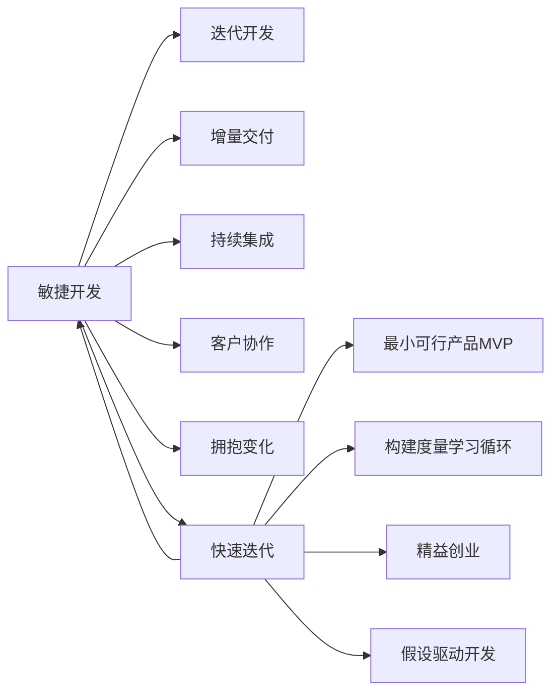

# 敏捷开发与快速迭代原理与代码实战案例讲解

## 1.背景介绍

### 1.1 软件开发面临的挑战
#### 1.1.1 需求变更频繁
#### 1.1.2 技术迭代加速
#### 1.1.3 市场竞争激烈

### 1.2 传统开发模式的局限性
#### 1.2.1 瀑布式开发模型
#### 1.2.2 缺乏灵活性和适应性
#### 1.2.3 风险积累到后期

### 1.3 敏捷开发的兴起
#### 1.3.1 敏捷宣言
#### 1.3.2 敏捷价值观
#### 1.3.3 敏捷方法论

## 2.核心概念与联系

### 2.1 敏捷开发核心概念
#### 2.1.1 迭代开发
#### 2.1.2 增量交付
#### 2.1.3 持续集成
#### 2.1.4 客户协作
#### 2.1.5 拥抱变化

### 2.2 快速迭代核心概念
#### 2.2.1 最小可行产品(MVP)
#### 2.2.2 构建-度量-学习循环
#### 2.2.3 精益创业
#### 2.2.4 假设驱动开发

### 2.3 敏捷开发与快速迭代的关系
#### 2.3.1 共同追求快速反馈和适应变化
#### 2.3.2 相辅相成，相互促进
#### 2.3.3 敏捷为快速迭代提供方法论基础

### 2.4 核心概念关系图



## 3.核心算法原理具体操作步骤

### 3.1 Scrum敏捷开发流程
#### 3.1.1 产品Backlog管理
#### 3.1.2 Sprint计划会议
#### 3.1.3 每日站会
#### 3.1.4 Sprint评审会议
#### 3.1.5 Sprint回顾会议

### 3.2 看板方法
#### 3.2.1 可视化工作流
#### 3.2.2 在制品限制(WIP)
#### 3.2.3 管理流动
#### 3.2.4 明确过程政策
#### 3.2.5 实施反馈循环
#### 3.2.6 持续改进协作

### 3.3 极限编程(XP)
#### 3.3.1 用户故事
#### 3.3.2 结对编程
#### 3.3.3 测试驱动开发(TDD)
#### 3.3.4 重构
#### 3.3.5 持续集成
#### 3.3.6 小版本发布

### 3.4 精益创业循环
#### 3.4.1 构建最小可行产品
#### 3.4.2 度量关键指标
#### 3.4.3 学习用户反馈
#### 3.4.4 决策是否继续当前方向
#### 3.4.5 快速迭代下一个版本

## 4.数学模型和公式详细讲解举例说明

### 4.1 Little's Law(利特尔法则)
#### 4.1.1 公式：$L=λW$
- $L$：平均在制品数量
- $λ$：平均到达率
- $W$：平均周期时间

#### 4.1.2 公式含义解释
利特尔法则描述了在制品数量、到达率和周期时间之间的关系。它指出，平均在制品数量等于平均到达率与平均周期时间的乘积。

#### 4.1.3 在敏捷开发中的应用
利特尔法则可以用于预测和优化软件开发流程。通过控制在制品数量和优化周期时间，可以提高开发效率和交付速度。

### 4.2 投资回报率(ROI)
#### 4.2.1 公式：$ROI = \frac{收益 - 成本}{成本} \times 100\%$

#### 4.2.2 公式含义解释
投资回报率衡量了投资的收益与成本之间的关系。它表示每单位成本所产生的收益百分比。

#### 4.2.3 在快速迭代中的应用
在快速迭代过程中，需要评估每次迭代的投资回报率，以确保资源的有效利用。通过计算ROI，可以判断迭代是否物有所值，并做出相应的决策。

### 4.3 累积流图(Cumulative Flow Diagram)
#### 4.3.1 构建方法
1. 定义工作流状态
2. 记录每个时间点的在制品数量
3. 绘制状态累积曲线

#### 4.3.2 图形含义解释
累积流图直观地展示了工作在各个状态之间的流动情况。通过观察累积曲线的变化，可以发现瓶颈、预测完成时间、评估流程效率等。

#### 4.3.3 在敏捷开发中的应用
累积流图是敏捷开发中常用的可视化工具，用于监控和优化开发流程。通过分析累积流图，团队可以发现问题、改进流程、提高交付效率。

## 5.项目实践：代码实例和详细解释说明

### 5.1 自动化构建和部署
#### 5.1.1 使用Jenkins实现持续集成
```groovy
// Jenkinsfile
pipeline {
    agent any
    
    stages {
        stage('Build') {
            steps {
                sh 'mvn clean package'
            }
        }
        
        stage('Test') {
            steps {
                sh 'mvn test'
            }
        }
        
        stage('Deploy') {
            steps {
                sh 'docker build -t my-app .'
                sh 'docker run -d -p 8080:8080 my-app'
            }
        }
    }
}
```
上述代码定义了一个Jenkins流水线，包括构建、测试和部署三个阶段。通过自动化构建和部署，可以减少手动操作，提高交付效率。

#### 5.1.2 使用Docker实现环境一致性
```dockerfile
# Dockerfile
FROM openjdk:8-jdk-alpine
COPY target/my-app.jar app.jar
ENTRYPOINT ["java","-jar","/app.jar"]
```
使用Docker可以创建一致的应用运行环境，避免环境差异导致的问题。通过Dockerfile定义应用的运行环境和依赖，实现跨环境的一致性。

### 5.2 测试驱动开发(TDD)
#### 5.2.1 编写测试用例
```java
// Calculator.java
public class Calculator {
    public int add(int a, int b) {
        return a + b;
    }
}

// CalculatorTest.java
import org.junit.Test;
import static org.junit.Assert.*;

public class CalculatorTest {
    @Test
    public void testAdd() {
        Calculator calculator = new Calculator();
        int result = calculator.add(2, 3);
        assertEquals(5, result);
    }
}
```
测试驱动开发强调先编写测试用例，再编写实现代码。通过测试用例定义期望行为，并驱动代码实现。

#### 5.2.2 重构代码
```java
// Calculator.java
public class Calculator {
    public int add(int a, int b) {
        if (a < 0 || b < 0) {
            throw new IllegalArgumentException("Negative numbers not allowed");
        }
        return a + b;
    }
}

// CalculatorTest.java
import org.junit.Test;
import static org.junit.Assert.*;

public class CalculatorTest {
    @Test
    public void testAdd() {
        Calculator calculator = new Calculator();
        int result = calculator.add(2, 3);
        assertEquals(5, result);
    }
    
    @Test(expected = IllegalArgumentException.class)
    public void testAddNegative() {
        Calculator calculator = new Calculator();
        calculator.add(-1, 2);
    }
}
```
在保证测试通过的前提下，可以安全地重构代码。通过重构，提高代码质量、可读性和可维护性。

### 5.3 最小可行产品(MVP)
#### 5.3.1 识别核心功能
假设我们要开发一个在线订餐应用，核心功能可能包括：
- 用户注册和登录
- 浏览餐厅和菜品
- 添加菜品到购物车
- 提交订单
- 支付订单

#### 5.3.2 快速构建MVP
```python
# app.py
from flask import Flask, render_template, request, redirect, session

app = Flask(__name__)
app.secret_key = 'secret_key'

restaurants = [
    {'id': 1, 'name': 'Restaurant A'},
    {'id': 2, 'name': 'Restaurant B'},
]

dishes = [
    {'id': 1, 'name': 'Dish 1', 'price': 10},
    {'id': 2, 'name': 'Dish 2', 'price': 15},
]

@app.route('/')
def home():
    return render_template('home.html', restaurants=restaurants)

@app.route('/restaurant/<int:restaurant_id>')
def restaurant_detail(restaurant_id):
    return render_template('restaurant_detail.html', dishes=dishes)

@app.route('/cart', methods=['GET', 'POST'])
def cart():
    if request.method == 'POST':
        dish_id = request.form['dish_id']
        # 添加菜品到购物车
        session['cart'] = session.get('cart', []) + [dish_id]
        return redirect('/cart')
    else:
        cart_items = [dish for dish in dishes if str(dish['id']) in session.get('cart', [])]
        return render_template('cart.html', cart_items=cart_items)

@app.route('/checkout')
def checkout():
    # 处理支付和订单提交
    session['cart'] = []
    return redirect('/')

if __name__ == '__main__':
    app.run()
```
使用Python和Flask快速构建一个MVP，实现核心功能。通过MVP，可以尽早获得用户反馈，验证产品假设。

## 6.实际应用场景

### 6.1 电商网站
- 敏捷开发：使用Scrum进行迭代开发，快速响应市场变化和用户需求。
- 快速迭代：通过A/B测试和用户反馈不断优化和改进产品功能。

### 6.2 移动应用
- 敏捷开发：采用极限编程(XP)实践，如结对编程、测试驱动开发等，提高代码质量和开发效率。
- 快速迭代：通过最小可行产品(MVP)快速上线，并根据用户反馈迭代更新版本。

### 6.3 SaaS服务
- 敏捷开发：使用看板方法可视化工作流，限制在制品数量，优化交付流程。
- 快速迭代：采用精益创业方法，小批量发布新功能，通过数据分析和用户反馈验证假设。

## 7.工具和资源推荐

### 7.1 敏捷开发工具
- JIRA：敏捷项目管理和问题跟踪工具
- Trello：基于看板的可视化协作工具
- Pivotal Tracker：敏捷项目管理和用户故事跟踪工具

### 7.2 持续集成/持续交付工具
- Jenkins：自动化构建、测试和部署工具
- Travis CI：基于云的持续集成服务
- CircleCI：持续集成和持续交付平台

### 7.3 测试自动化工具
- Selenium：Web应用自动化测试工具
- Appium：移动应用自动化测试工具
- JUnit：Java单元测试框架

### 7.4 代码质量管理工具
- SonarQube：代码质量管理平台
- ESLint：JavaScript代码质量检查工具
- CheckStyle：Java代码风格检查工具

### 7.5 学习资源
- 《敏捷软件开发：原则、模式与实践》- Robert C. Martin
- 《精益创业》- Eric Ries
- 《Scrum指南》- Ken Schwaber和Jeff Sutherland
- 敏捷联盟(Agile Alliance)：https://www.agilealliance.org/
- 极限编程(XP)：http://www.extremeprogramming.org/

## 8.总结：未来发展趋势与挑战

### 8.1 敏捷开发与快速迭代的未来趋势
- 大规模敏捷：将敏捷实践扩展到组织级别，实现全面敏捷转型。
- 敏捷与DevOps融合：将敏捷开发与DevOps实践相结合，实现端到端的快速交付。
- 人工智能和机器学习的应用：利用AI和ML技术辅助敏捷开发，如自动化测试、代码质量分析等。

### 8.2 面临的挑战
- 组织文化转变：从传统的命令控制式管理转向敏捷的自组织协作。
- 跨职能团队协作：打破部门壁垒，促进开发、测试、