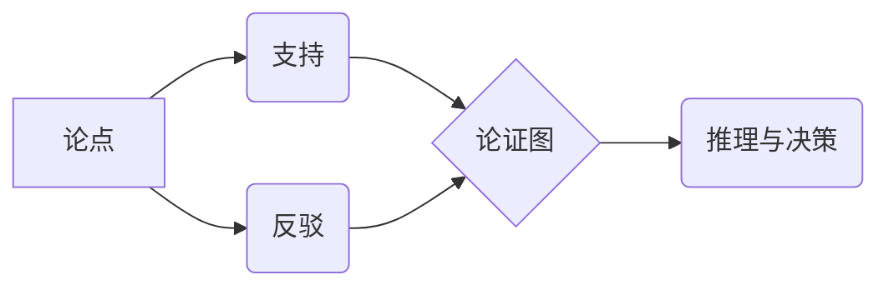

# 数据争论 (Data Argumentation) 原理与代码实例讲解

## 1. 背景介绍
### 1.1 数据争论的起源与发展
#### 1.1.1 数据争论的诞生背景
#### 1.1.2 数据争论技术的发展历程
#### 1.1.3 数据争论在人工智能领域的重要性

### 1.2 数据争论的定义与特点
#### 1.2.1 数据争论的定义
#### 1.2.2 数据争论的主要特点
#### 1.2.3 数据争论与传统机器学习的区别

## 2. 核心概念与联系
### 2.1 数据争论的核心概念
#### 2.1.1 论点(Argument)
#### 2.1.2 支持(Support)
#### 2.1.3 反驳(Rebuttal)
#### 2.1.4 论证图(Argumentation Graph)

### 2.2 数据争论中的关键技术
#### 2.2.1 自然语言处理(NLP)
#### 2.2.2 知识表示与推理
#### 2.2.3 对抗学习(Adversarial Learning)

### 2.3 数据争论与其他AI技术的联系
#### 2.3.1 数据争论与深度学习的结合
#### 2.3.2 数据争论在知识图谱中的应用
#### 2.3.3 数据争论与强化学习的融合

## 3. 核心算法原理具体操作步骤
### 3.1 基于图的数据争论算法
#### 3.1.1 论证图的构建
#### 3.1.2 论证图的推理与决策
#### 3.1.3 基于图的数据争论算法的优缺点

### 3.2 基于逻辑的数据争论算法 
#### 3.2.1 一阶逻辑表示论点与支持
#### 3.2.2 基于逻辑的推理与冲突检测
#### 3.2.3 基于逻辑的数据争论算法的优缺点

### 3.3 基于概率的数据争论算法
#### 3.3.1 贝叶斯网络表示论点关系
#### 3.3.2 基于概率图模型的推理
#### 3.3.3 基于概率的数据争论算法的优缺点

## 4. 数学模型和公式详细讲解举例说明
### 4.1 论证图的数学表示
#### 4.1.1 有向图的定义与性质
#### 4.1.2 论证图的矩阵表示
#### 4.1.3 论证图的数学性质分析

### 4.2 一阶逻辑的形式化定义
#### 4.2.1 一阶逻辑的语法与语义
#### 4.2.2 基于一阶逻辑的论点表示
#### 4.2.3 一阶逻辑的推理规则

### 4.3 概率图模型的数学基础
#### 4.3.1 概率论基础知识回顾
#### 4.3.2 贝叶斯网络的定义与性质
#### 4.3.3 马尔可夫逻辑网络(MLN)介绍

## 5. 项目实践：代码实例和详细解释说明
### 5.1 基于PyTorch实现的神经论证网络
#### 5.1.1 数据集准备与预处理
#### 5.1.2 模型结构设计与实现
#### 5.1.3 训练过程与结果分析

### 5.2 使用Prolog实现基于逻辑的数据争论系统
#### 5.2.1 知识库的构建
#### 5.2.2 基于Prolog的推理引擎设计
#### 5.2.3 系统演示与结果分析

### 5.3 基于PGM的数据争论模型实现
#### 5.3.1 使用pgmpy构建贝叶斯论证网络
#### 5.3.2 利用MLN进行权重学习与推理判断
#### 5.3.3 实验结果对比与分析

## 6. 实际应用场景
### 6.1 法律领域的论辩辅助
#### 6.1.1 案件事实论点的提取与组织
#### 6.1.2 论据支持与反驳关系的分析
#### 6.1.3 裁判决策的辅助与解释

### 6.2 医疗领域的临床决策支持
#### 6.2.1 医学证据的论点化表示
#### 6.2.2 诊断论证图谱的自动构建
#### 6.2.3 辅助医生进行临床诊断与治疗决策

### 6.3 舆情分析与辟谣
#### 6.3.1 社交媒体观点的论点挖掘
#### 6.3.2 谣言传播论证图谱的构建
#### 6.3.3 基于数据争论的谣言检测与辟谣

## 7. 工具和资源推荐
### 7.1 数据争论的研究数据集
#### 7.1.1 Wikipedia论辩数据集
#### 7.1.2 Debatepedia数据集
#### 7.1.3 其他常用的数据争论数据集

### 7.2 数据争论的开源工具与库
#### 7.2.1 Argumentation Library (ArgLib) 
#### 7.2.2 Tweety - 一个知识表示与推理的库
#### 7.2.3 PyTorch Geometric (PyG) - 图神经网络库

### 7.3 相关学习资源推荐
#### 7.3.1 相关书籍推荐
#### 7.3.2 优秀论文与综述推荐
#### 7.3.3 在线课程与教程推荐

## 8. 总结：未来发展趋势与挑战
### 8.1 数据争论技术的发展趋势
#### 8.1.1 多模态数据争论
#### 8.1.2 人机混合型论辩系统
#### 8.1.3 可解释性数据争论

### 8.2 面临的挑战与未来研究方向
#### 8.2.1 论点质量与相关性评估
#### 8.2.2 论证知识的自动获取与扩充
#### 8.2.3 论辩过程的策略优化

## 9. 附录：常见问题与解答
### 9.1 数据争论与辩论有什么区别？
### 9.2 数据争论需要哪些背景知识？
### 9.3 数据争论技术的局限性有哪些？
### 9.4 如何评估一个数据争论系统的性能？
### 9.5 数据争论在人工智能伦理方面有何应用前景？

数据争论(Data Argumentation)是人工智能领域一个新兴的研究方向，它旨在赋予机器从大规模数据中提取论点、分析论点关系、构建论证知识图谱并基于论证进行推理决策的能力。与传统的机器学习范式不同，数据争论更加注重从数据中挖掘支持与反驳关系，建立论点之间的逻辑联系，形成结构化的论证知识。这种范式使得机器能够像人一样，通过论证的方式来解释其判断和决策，增强了人工智能系统的可解释性和可信度。

数据争论的核心概念包括论点(Argument)、支持(Support)、反驳(Rebuttal)以及由它们构成的论证图(Argumentation Graph)。一个完整的数据争论过程通常包括论点挖掘、论证图构建、基于论证图的推理决策等步骤。其中涉及的关键技术有自然语言处理、知识表示与推理、对抗学习等。数据争论与深度学习、知识图谱、强化学习等其他人工智能技术也有着密切的结合。

目前主流的数据争论算法可分为基于图的方法、基于逻辑的方法以及基于概率的方法。基于图的方法通过构建论证图并在图上进行推理，如Abstract Argumentation Framework (AAF)；基于逻辑的方法使用一阶逻辑等形式化工具表示论点并基于逻辑规则进行推理，如Assumption-based Argumentation (ABA)；而基于概率的方法则使用贝叶斯网络等概率图模型来表示论点关系并进行不确定性推理，如Probabilistic Argumentation Framework (PAF)。

在实际应用中，数据争论技术已经在法律、医疗、舆情分析等领域展现出广阔的应用前景。例如，在法律领域，数据争论可以用于论点挖掘、案件分析、裁判决策解释等任务；在医疗领域，数据争论可以辅助医生进行诊断论证、治疗方案选择等；在舆情分析中，数据争论可以用于论点提取、谣言检测与辟谣等。

尽管数据争论取得了长足的进展，但其仍然面临着诸多挑战，如论点质量与相关性评估、论证知识的自动获取与扩充、论辩策略优化等。未来，数据争论技术向着多模态化、人机混合、可解释性更强的方向发展，必将在人工智能的可信性、透明性、伦理性等方面发挥重要作用。

作者：禅与计算机程序设计艺术 / Zen and the Art of Computer Programming