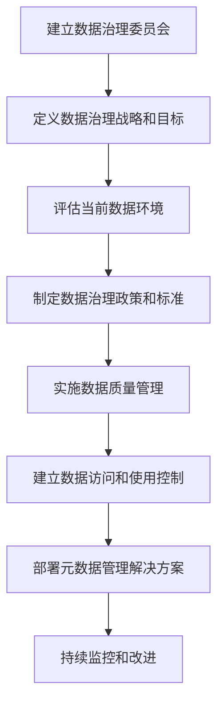

# 数据治理的企业级战略与实施

## 1. 背景介绍

### 1.1 数据的战略价值

在当今数字化时代,数据被视为企业的关键资产和竞争优势来源。随着数据量的快速增长和多样化,企业面临着如何高效管理和利用数据的挑战。有效的数据治理战略对于确保数据质量、合规性、安全性和可访问性至关重要。

### 1.2 数据治理的重要性

数据治理是一种战略性方法,旨在确保数据在整个企业中的一致性、完整性、准确性和可用性。它涉及制定政策、标准、流程和技术,以确保数据资产得到适当的管理和控制。良好的数据治理有助于提高数据质量,降低风险,促进数据驱动的决策,并支持业务创新。

## 2. 核心概念与联系

### 2.1 数据治理的定义

数据治理是一个跨职能的框架,旨在确保数据资产在整个企业中得到有效管理和控制。它包括以下关键要素:

- **数据质量管理**: 确保数据的准确性、完整性、一致性和及时性。
- **数据安全性和隐私保护**: 保护敏感数据免受未经授权的访问、修改或泄露。
- **数据访问和使用控制**: 管理谁可以访问和使用特定数据集。
- **数据生命周期管理**: 从数据创建到归档或删除,管理数据的整个生命周期。
- **元数据管理**: 捕获和维护有关数据的信息(元数据),以支持数据发现、理解和使用。
- **数据架构和标准化**: 制定数据模型、标准和命名约定,以促进数据一致性和互操作性。

### 2.2 数据治理与其他数据管理实践的关系

数据治理与其他数据管理实践密切相关,包括:

- **数据管理**: 数据治理为数据管理提供战略指导和政策框架。
- **主数据管理(MDM)**: MDM确保关键业务实体(如客户、产品)的数据一致性和准确性。
- **数据质量管理**: 数据质量管理是数据治理的核心组成部分。
- **数据架构**: 数据架构为数据治理提供技术基础。

这些实践相互补充,共同构建了一个全面的数据管理框架。

## 3. 核心算法原理具体操作步骤

数据治理不是一个单一的算法或技术,而是一个战略性框架,涉及多个流程和最佳实践。然而,有几个关键步骤可以帮助企业实施有效的数据治理:



1. **建立数据治理委员会**: 由来自不同部门的利益相关者组成,负责制定数据治理战略、政策和标准。
2. **定义数据治理战略和目标**: 根据企业的业务目标和数据需求,制定数据治理的愿景、目标和优先事项。
3. **评估当前数据环境**: 审查现有的数据资产、流程、技术和挑战,以确定差距和改进机会。
4. **制定数据治理政策和标准**: 制定数据治理政策、标准和流程,涵盖数据质量、安全性、访问控制、元数据管理等方面。
5. **实施数据质量管理**: 建立数据质量规则、指标和流程,以监控和改进数据质量。
6. **建立数据访问和使用控制**: 实施访问控制机制,确保只有经过授权的人员才能访问和使用特定数据集。
7. **部署元数据管理解决方案**: 实施元数据管理工具,捕获和维护有关数据的信息,支持数据发现、理解和使用。
8. **持续监控和改进**: 持续监控数据治理计划的执行情况,并根据需要进行调整和改进。

## 4. 数学模型和公式详细讲解举例说明

虽然数据治理主要是一个战略性和流程性的框架,但在某些特定领域(如数据质量管理)中,可能需要使用数学模型和公式。以下是一些常见的数学模型和公式示例:

### 4.1 数据质量评分模型

数据质量评分模型用于量化数据质量水平。一种常见的方法是使用加权平均模型,将不同质量维度(如完整性、准确性、一致性等)的分数组合起来,计算总体数据质量分数。

$$
\text{数据质量分数} = \sum_{i=1}^{n} w_i \times s_i
$$

其中:
- $n$ 是质量维度的数量
- $w_i$ 是第 $i$ 个质量维度的权重
- $s_i$ 是第 $i$ 个质量维度的分数

例如,如果我们有三个质量维度(完整性、准确性和一致性),权重分别为 0.4、0.3 和 0.3,分数分别为 80、90 和 75,则总体数据质量分数为:

$$
\text{数据质量分数} = 0.4 \times 80 + 0.3 \times 90 + 0.3 \times 75 = 82
$$

### 4.2 数据重复检测算法

在数据质量管理中,识别和消除重复数据是一个常见任务。一种常用的算法是基于字符串相似性的重复检测算法,例如编辑距离算法。

编辑距离是指将一个字符串转换为另一个字符串所需的最小编辑操作次数(插入、删除或替换)。两个字符串的编辑距离越小,它们就越相似。

$$
\text{编辑距离}(s_1, s_2) = \min\left\{
\begin{array}{ll}
\text{编辑距离}(s_1[:-1], s_2) + 1 & \text{(删除操作)} \\
\text{编辑距离}(s_1, s_2[:-1]) + 1 & \text{(插入操作)} \\
\text{编辑距离}(s_1[:-1], s_2[:-1]) + \delta(s_1[-1], s_2[-1]) & \text{(替换操作)}
\end{array}
\right.
$$

其中:
- $s_1$ 和 $s_2$ 是两个字符串
- $\delta(a, b)$ 是一个指示函数,当 $a \neq b$ 时返回 1,否则返回 0

如果两个字符串的编辑距离小于某个阈值,则可以将它们视为重复记录。

## 5. 项目实践: 代码实例和详细解释说明

为了更好地理解数据治理的实施,我们将通过一个示例项目来演示如何应用数据治理原则。在这个示例中,我们将关注数据质量管理,并使用 Python 编程语言实现一些常见的数据质量检查和清理任务。

### 5.1 项目概述

假设我们有一个包含客户信息的数据集,其中可能存在一些数据质量问题,如缺失值、重复记录、格式不一致等。我们的目标是通过编写 Python 脚本来识别和解决这些问题,从而提高数据质量。

### 5.2 数据准备

首先,我们需要导入所需的 Python 库并加载示例数据集:

```python
import pandas as pd
import re

# 加载示例数据集
customer_data = pd.read_csv('customer_data.csv')
```

### 5.3 缺失值处理

缺失值是一个常见的数据质量问题。我们可以使用 Pandas 库提供的函数来检测和处理缺失值:

```python
# 检测缺失值
missing_values = customer_data.isnull().sum()
print(f"缺失值计数:\n{missing_values}")

# 删除包含缺失值的行
customer_data = customer_data.dropna()

# 或者使用特定值填充缺失值
customer_data = customer_data.fillna('未知')
```

### 5.4 重复记录检测和删除

重复记录会导致数据冗余和不一致性。我们可以使用 Pandas 的 `duplicated` 函数来检测重复记录,然后使用 `drop_duplicates` 函数删除它们:

```python
# 检测重复记录
duplicates = customer_data.duplicated()
print(f"重复记录计数: {duplicates.sum()}")

# 删除重复记录
customer_data = customer_data.drop_duplicates()
```

### 5.5 数据格式标准化

为了确保数据一致性,我们需要标准化数据格式。以下是一个示例,展示如何使用正则表达式来标准化电子邮件地址格式:

```python
# 标准化电子邮件地址格式
def standardize_email(email):
    pattern = r'^([a-zA-Z0-9_\-\.]+)@([a-zA-Z0-9_\-\.]+)\.([a-zA-Z]{2,5})$'
    match = re.match(pattern, email)
    if match:
        return email.lower()
    else:
        return 'invalid_email'

customer_data['email'] = customer_data['email'].apply(standardize_email)
```

### 5.6 数据质量报告

最后,我们可以生成一份数据质量报告,总结数据质量问题及其解决方案:

```python
# 生成数据质量报告
report = {
    '原始记录数': len(customer_data_original),
    '缺失值处理': f'删除了 {len(customer_data_original) - len(customer_data)} 条包含缺失值的记录',
    '重复记录处理': f'删除了 {duplicates.sum()} 条重复记录',
    '格式标准化': '标准化了电子邮件地址格式',
    '最终记录数': len(customer_data)
}

for key, value in report.items():
    print(f"{key}: {value}")
```

通过这个示例项目,我们展示了如何使用 Python 实现一些常见的数据质量检查和清理任务,从而提高数据质量。在实际项目中,您可以根据具体需求扩展和定制这些功能。

## 6. 实际应用场景

数据治理在各个行业和领域都有广泛的应用,以下是一些典型的应用场景:

### 6.1 金融服务

在金融服务行业,数据治理对于确保数据的准确性、完整性和合规性至关重要。它有助于降低风险,提高客户信任度,并支持数据驱动的决策,如信贷风险评估、反洗钱监控和投资组合管理。

### 6.2 医疗保健

在医疗保健领域,数据治理有助于确保患者数据的隐私、安全性和完整性。它支持电子健康记录的管理,促进不同医疗系统之间的数据共享和互操作性,从而提高医疗服务的质量和效率。

### 6.3 零售和电子商务

在零售和电子商务领域,数据治理有助于整合来自多个渠道的客户数据,提供360度客户视图。它支持个性化营销、库存管理和供应链优化,从而提高客户满意度和运营效率。

### 6.4 制造业

在制造业,数据治理有助于管理产品数据、质量数据和运营数据。它支持产品生命周期管理、质量控制和预测性维护,从而提高产品质量、降低成本和提高运营效率。

### 6.5 政府和公共部门

在政府和公共部门,数据治理有助于确保公共数据的可访问性、透明度和隐私保护。它支持数据共享和协作,促进政府部门之间的协调和公众参与。

## 7. 工具和资源推荐

实施数据治理需要多种工具和资源的支持,包括:

### 7.1 数据治理平台

数据治理平台是一种综合性解决方案,提供数据质量管理、元数据管理、数据安全性和访问控制等功能。一些流行的数据治理平台包括:

- Collibra Data Governance Center
- Informatica Axon Data Governance
- IBM InfoSphere Information Governance Catalog

### 7.2 数据质量工具

数据质量工具用于监控、分析和改进数据质量。一些常用的数据质量工具包括:

- Talend Data Quality
- SAS Data Quality
- Microsoft SQL Server Data Quality Services

### 7.3 元数据管理工具

元数据管理工具用于捕获、存储和管理有关数据的信息。一些流行的元数据管