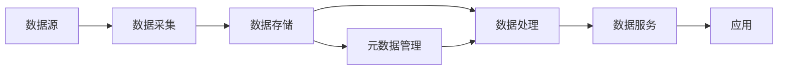

# 数据湖 原理与代码实例讲解

## 1.背景介绍

### 1.1 大数据时代的数据管理挑战

在当今大数据时代,企业面临着海量、多样化的数据,传统的数据仓库架构已经难以应对快速增长的数据量和多样性。数据来源的多样性、数据格式的异构性以及数据处理的实时性都对传统的数据管理方式提出了挑战。企业迫切需要一种新的数据架构来应对这些挑战,而数据湖(Data Lake)正是在这样的背景下应运而生。

### 1.2 数据湖的诞生

数据湖这一概念最早由Pentaho公司的首席技术官James Dixon在2010年提出。他将数据比作水,认为传统的数据仓库就像一个装满净化水的水瓶,而数据湖则像一个天然的湖泊,湖里的水是未经处理的原始之水。这一比喻生动地说明了数据湖的本质特征。

### 1.3 数据湖的优势

与传统的数据仓库相比,数据湖具有以下优势:

1. 支持海量数据的存储和处理
2. 接纳任何格式和来源的数据
3. 数据处理方式灵活多样
4. 成本低,可扩展性强

正是由于这些优势,越来越多的企业开始建设自己的数据湖,以期从海量数据中挖掘出更多的商业价值。

## 2.核心概念与联系

### 2.1 数据湖的定义

数据湖是一种数据架构,旨在解决大数据时代海量异构数据的存储和分析问题。它以原始格式存储结构化、半结构化和非结构化数据,支持多种数据处理方式,可以灵活地满足不同业务场景下的数据分析需求。

### 2.2 数据湖与数据仓库的区别

数据湖与传统数据仓库的主要区别如下:

| 维度 | 数据湖 | 数据仓库 |
|--|--|--|
| 数据存储 | 原始格式存储 | 高度结构化存储 |  
| 数据来源 | 任意来源 | 特定来源 |
| 数据处理 | Schema on read | Schema on write |
| 数据质量 | 未经清洗 | 经过清洗 |
| 成本 | 低 | 高 |
| 灵活性 | 高 | 低 |

### 2.3 数据湖的核心组件

一个典型的数据湖通常包括以下核心组件:

1. 数据采集:负责从各种数据源采集原始数据到数据湖
2. 数据存储:以原始格式存储采集到的各类数据
3. 元数据管理:管理数据湖中数据的元数据信息
4. 数据处理:对数据湖中的数据进行处理和分析
5. 数据服务:为上层应用提供数据服务接口

下图展示了数据湖的核心组件以及它们之间的关系:



## 3.核心算法原理具体操作步骤

### 3.1 数据采集

数据湖的第一步是要将各种来源的原始数据采集到数据湖中。常见的数据采集方式包括:

1. 批量导入:定期从数据源批量导入数据到数据湖
2. 实时采集:通过日志收集、消息队列等方式实时采集数据到数据湖
3. 爬虫采集:通过网络爬虫采集互联网数据到数据湖

以Flume为例,数据实时采集的基本步骤如下:

1. 安装配置Flume
2. 配置数据源,指定数据采集位置
3. 配置Channel,指定数据传输参数
4. 配置Sink,指定数据存储位置
5. 启动Flume Agent,开始数据采集

### 3.2 数据存储

数据湖采用廉价的分布式存储系统来存储海量数据,常用的存储系统包括:

1. HDFS:Hadoop分布式文件系统
2. 对象存储:如Amazon S3、阿里云OSS等
3. NoSQL数据库:如HBase、MongoDB等

以HDFS为例,在数据湖中存储数据的基本步骤如下:

1. 搭建Hadoop集群环境
2. 启动HDFS
3. 创建数据存储目录
4. 上传数据文件到HDFS
5. 查看数据文件

### 3.3 元数据管理

在数据湖中,由于数据格式和来源的多样性,需要采用元数据来描述和管理数据。常用的元数据管理工具包括:

1. Apache Atlas:Hadoop生态系统中用于元数据治理的框架
2. Cloudera Navigator:Cloudera公司的元数据管理工具
3. 自研元数据管理系统

以Atlas为例,元数据管理的基本步骤如下:

1. 安装配置Atlas服务
2. 采集Hadoop组件的元数据信息
3. 对采集到的元数据进行分类和注释
4. 将元数据信息同步到Atlas
5. 通过Atlas查询和管理元数据

### 3.4 数据处理

数据湖中的数据处理通常采用大数据处理框架和工具,常用的包括:

1. Hadoop MapReduce:基于MapReduce编程模型的批处理框架
2. Apache Spark:基于内存的分布式计算框架
3. Apache Flink:支持流处理和批处理的计算框架
4. Apache Hive:基于Hadoop的数据仓库工具
5. Presto:基于内存的分布式SQL查询引擎

以Spark为例,在数据湖上进行数据处理的基本步骤如下:

1. 在数据湖上安装Spark
2. 启动Spark集群
3. 加载数据湖中的数据到Spark
4. 使用Spark SQL、DataFrame等API处理数据
5. 将处理结果回写到数据湖或导出到外部系统

## 4.数学模型和公式详细讲解举例说明

### 4.1 推荐系统中的ALS算法

在数据湖的应用场景中,推荐系统是一个典型的例子。其中,ALS(Alternating Least Squares)是一种常用的协同过滤算法。

ALS算法的核心思想是通过最小化损失函数来学习用户和物品的隐向量。假设有$m$个用户、$n$个物品,我们要学习的是:

- 用户隐向量矩阵 $U\in \mathbb{R}^{m\times k}$
- 物品隐向量矩阵 $V\in \mathbb{R}^{n\times k}$

其中$k$是隐向量的维度。

定义用户$i$对物品$j$的评分为$r_{ij}$,用户$i$对物品$j$的预测评分为$\hat{r}_{ij}$,则预测评分的计算公式为:

$$\hat{r}_{ij} = u_i^Tv_j$$

其中$u_i$是用户$i$的隐向量,$v_j$是物品$j$的隐向量。

ALS的目标是最小化预测评分与实际评分之间的平方误差,即最小化损失函数:

$$\min_{U,V} \sum_{(i,j)\in K} (r_{ij} - u_i^Tv_j)^2 + \lambda(\|U\|_F^2 + \|V\|_F^2)$$

其中$K$是已知的评分集合,$\lambda$是正则化系数。

ALS算法通过交替固定$U$和$V$来最小化损失函数:

1. 固定$V$,求解$U$:

$$\min_{U} \sum_{i=1}^m \sum_{j:(i,j)\in K} (r_{ij} - u_i^Tv_j)^2 + \lambda\|u_i\|^2$$

2. 固定$U$,求解$V$:

$$\min_{V} \sum_{j=1}^n \sum_{i:(i,j)\in K} (r_{ij} - u_i^Tv_j)^2 + \lambda\|v_j\|^2$$

通过迭代上述两个步骤,直到算法收敛,就可以得到用户隐向量矩阵$U$和物品隐向量矩阵$V$。

在数据湖上应用ALS算法的基本步骤如下:

1. 从数据湖加载用户评分数据
2. 初始化$U$和$V$
3. 迭代执行以下步骤直到收敛:
   - 固定$V$,并行计算$U$的每一行
   - 固定$U$,并行计算$V$的每一行
4. 将学习到的$U$和$V$存储到数据湖

### 4.2 金融风控中的XGBoost算法

另一个数据湖的典型应用是金融风险控制,其中XGBoost是一种常用的梯度提升树算法。

XGBoost的核心是学习一系列的CART回归树,每棵树学习前面树的残差,从而不断逼近真实的函数。

假设样本为$(x_i,y_i),i=1,2,...,n$,第$t$棵树学习的是前$t-1$棵树的残差:

$$r_{ti} = y_i - \sum_{k=1}^{t-1} f_k(x_i)$$

其中$f_k$是第$k$棵树。

目标是最小化损失函数:

$$\min_f \sum_{i=1}^n l(y_i, \hat{y}_i^{(t-1)} + f(x_i)) + \Omega(f)$$

其中$\hat{y}_i^{(t-1)}$是前$t-1$棵树的预测值,$\Omega(f)$是正则化项。

XGBoost在每一轮迭代中,对每个叶子节点计算损失函数的一阶和二阶导数:

$$g_i = \partial_{\hat{y}_i^{(t-1)}} l(y_i, \hat{y}_i^{(t-1)})$$

$$h_i = \partial_{\hat{y}_i^{(t-1)}}^2 l(y_i, \hat{y}_i^{(t-1)})$$

然后利用导数信息寻找最优的分裂点,生成新的树$f_t$。

在数据湖上应用XGBoost算法的基本步骤如下:

1. 从数据湖加载训练数据和测试数据
2. 将数据转换为XGBoost需要的DMatrix格式 
3. 设置XGBoost的参数,如树的数量、最大深度等
4. 训练XGBoost模型
5. 在测试集上评估模型性能
6. 将训练好的模型存储到数据湖

## 5.项目实践：代码实例和详细解释说明

下面以Spark为例,演示如何在数据湖上进行数据处理和机器学习。

### 5.1 环境准备

首先需要搭建Spark和HDFS环境,可以使用Hadoop发行版,如CDH、HDP等,也可以自行搭建。

### 5.2 数据准备

假设我们在HDFS上有一份数据文件`data.txt`,内容如下:

```
1,0.5,1.0
0,1.5,2.0
1,2.5,3.0
0,3.5,4.0
1,4.5,5.0
```

其中第一列是标签,后两列是特征。

### 5.3 数据加载

使用Spark SQL读取HDFS上的数据文件:

```scala
val spark = SparkSession.builder().appName("DataLakeExample").getOrCreate()
val dataDF = spark.read.format("csv")
  .option("header", "false")
  .option("inferSchema", "true")
  .load("hdfs://path/to/data.txt")
```

### 5.4 数据处理

对加载的数据进行处理,如特征缩放:

```scala
import org.apache.spark.ml.feature.StandardScaler

val scaler = new StandardScaler()
  .setInputCol("features")
  .setOutputCol("scaledFeatures")
  .setWithStd(true)
  .setWithMean(false)

val scalerModel = scaler.fit(dataDF)
val scaledDF = scalerModel.transform(dataDF)
```

### 5.5 模型训练

使用处理后的数据训练逻辑回归模型:

```scala
import org.apache.spark.ml.classification.LogisticRegression

val lr = new LogisticRegression()
  .setMaxIter(10)
  .setRegParam(0.3)
  .setElasticNetParam(0.8)

val lrModel = lr.fit(scaledDF)
```

### 5.6 模型评估

在测试集上评估模型的性能:

```scala
val predictions = lrModel.transform(testDF)
val evaluator = new BinaryClassificationEvaluator()
val accuracy = evaluator.evaluate(predictions)
println(s"Test Accuracy = $accuracy")
```

### 5.