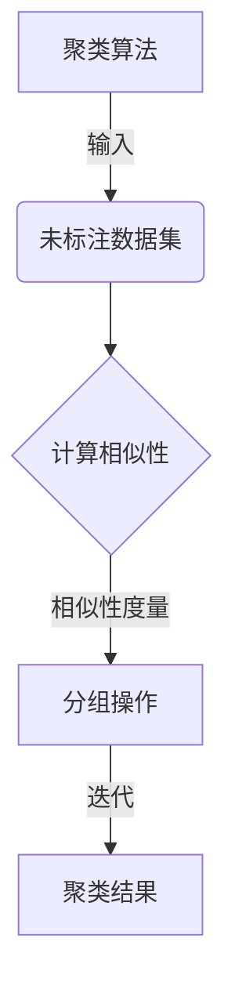
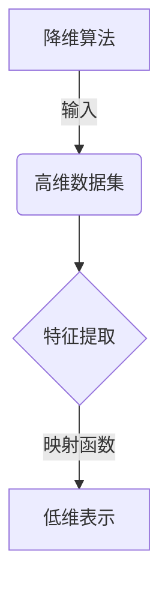
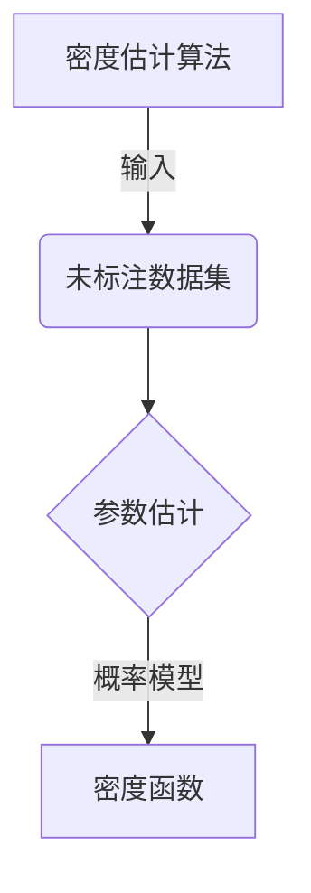
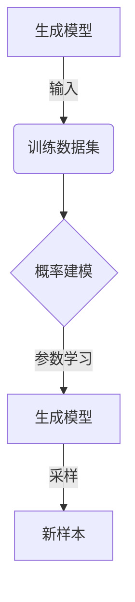
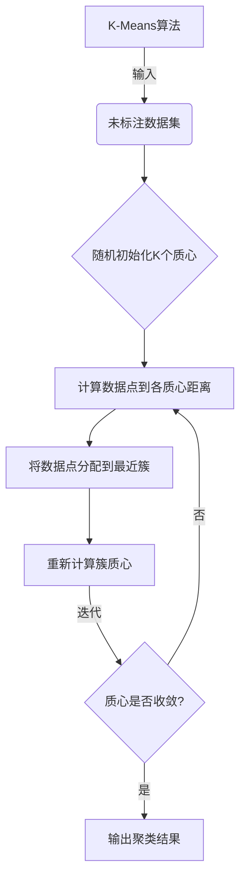
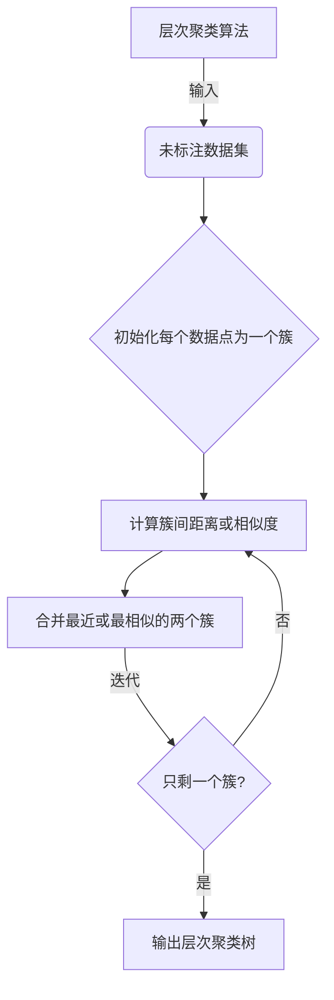
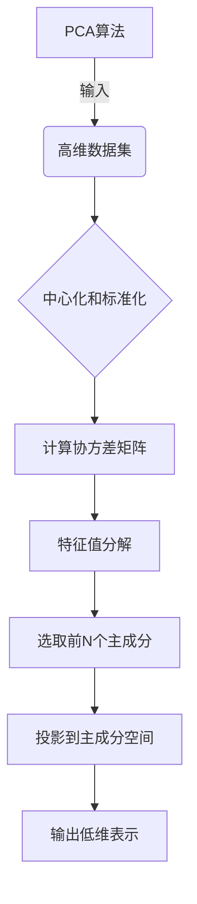
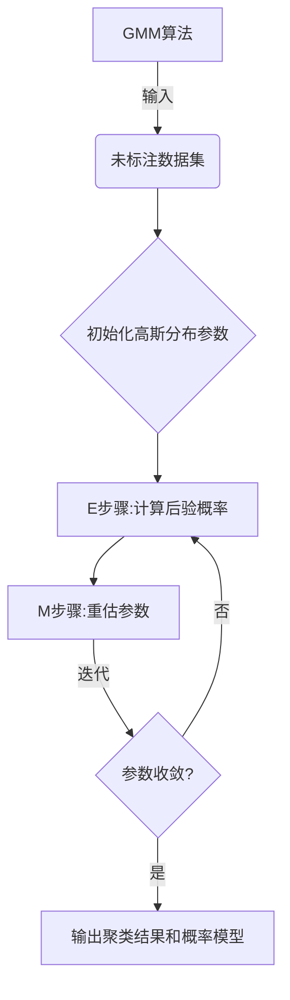

# 无监督学习 (Unsupervised Learning) 原理与代码实例讲解

## 1.背景介绍

### 1.1 什么是无监督学习?

无监督学习(Unsupervised Learning)是机器学习中一种重要的范式,它不同于有监督学习(Supervised Learning)需要大量标注好的训练数据。无监督学习算法从未标注的原始数据中自主发现隐藏的模式和结构,这种方式更贴近人类学习的本质。

无监督学习的目标是从数据中发现内在的统计规律性和数据结构,而不需要事先标注的训练数据。它可以用于聚类、降维、异常检测、生成模型等广泛任务。

### 1.2 无监督学习的重要性

在现实世界中,大量数据是未标注的原始数据,如图像、视频、语音等。人工标注耗费大量人力物力,而无监督学习可从海量原始数据中自动挖掘知识。无监督学习在数据挖掘、模式识别、信息检索等领域扮演着关键角色。

随着大数据时代的到来,无监督学习的重要性日益凸显。通过无监督技术,我们可以从庞大的数据集中获取有价值的见解,这对商业智能、科学发现等领域具有革命性影响。

## 2.核心概念与联系

无监督学习包含了多种不同的任务和算法,但它们都遵循一些共同的核心概念。理解这些概念对于掌握无监督学习至关重要。

### 2.1 相似性度量

相似性度量(Similarity Measure)用于量化数据点之间的相似程度。常用的相似性度量包括欧几里得距离、余弦相似度、Jaccard相似系数等。选择合适的相似性度量对无监督学习的效果有很大影响。

### 2.2 聚类

聚类(Clustering)是无监督学习中最典型的任务之一。它将相似的数据点分组到同一个簇中,使得簇内数据点相似度高,簇间相似度低。常见的聚类算法有K-Means、层次聚类、DBSCAN等。

### 2.3 降维

高维数据可能存在"维数灾难"问题,降维(Dimensionality Reduction)可将高维数据映射到低维空间,保留数据的主要结构特征。常用的降维算法包括主成分分析(PCA)、t-SNE、自编码器等。

### 2.4 密度估计

密度估计(Density Estimation)旨在从数据中估计概率密度函数,常用于异常检测、生成模型等任务。常见的密度估计方法有高斯混合模型(GMM)、核密度估计(KDE)等。

### 2.5 生成模型

生成模型(Generative Models)是一种基于概率模型的无监督学习方法,它们通过学习数据的潜在分布,从而生成新的数据样本。常见的生成模型包括变分自编码器(VAE)、生成对抗网络(GAN)等。

## 3.核心算法原理具体操作步骤

在这一部分,我们将深入探讨几种核心的无监督学习算法的原理和具体操作步骤。

### 3.1 K-Means聚类

K-Means是一种经典的聚类算法,具有简单高效的特点。它的目标是将数据划分为K个簇,使得簇内数据点相似度最大化,簇间相似度最小化。算法步骤如下:

1. 随机选取K个初始质心
2. 对每个数据点,计算到K个质心的距离,将其分配到最近的簇
3. 重新计算每个簇的质心,作为新的簇中心
4. 重复步骤2和3,直到质心不再发生变化或达到最大迭代次数

### 3.2 层次聚类

层次聚类(Hierarchical Clustering)将数据点构建成一个层次聚类树。有两种主要策略:自底向上(Agglomerative)和自顶向下(Divisive)。自底向上策略步骤如下:

1. 将每个数据点视为一个独立的簇
2. 计算每对簇之间的距离或相似度
3. 合并距离最近(或相似度最高)的两个簇
4. 重复步骤2和3,直到所有数据点聚为一个簇

### 3.3 主成分分析 (PCA)

主成分分析(Principal Component Analysis, PCA)是一种常用的线性降维技术。它通过正交变换将原始特征映射到一组线性无关的主成分上,并保留最大方差的前N个主成分作为低维表示。算法步骤如下:

1. 对数据进行中心化和标准化预处理
2. 计算数据的协方差矩阵
3. 对协方差矩阵进行特征值分解,得到特征向量
4. 选取对应最大N个特征值的特征向量作为主成分
5. 将原始数据投影到主成分空间,得到低维表示

### 3.4 高斯混合模型 (GMM)

高斯混合模型(Gaussian Mixture Model, GMM)是一种常用的概率密度估计和聚类方法。它假设数据由多个高斯分布的混合而成,并通过期望最大化(EM)算法估计每个高斯分布的参数。算法步骤如下:

1. 初始化高斯分布的参数(均值、协方差矩阵、混合系数)
2. E步骤:计算每个数据点属于每个高斯分布的后验概率
3. M步骤:根据后验概率,重新估计每个高斯分布的参数
4. 重复步骤2和3,直至收敛或达到最大迭代次数
5. 根据最大后验概率将数据点分配到对应的高斯分布

## 4.数学模型和公式详细讲解举例说明

无监督学习中涉及了许多数学概念和模型,理解这些公式和模型对于掌握算法原理至关重要。在这一部分,我们将详细讲解一些核心的数学模型和公式。

### 4.1 欧几里得距离

欧几里得距离(Euclidean Distance)是一种常用的相似性度量,它衡量两个向量之间的直线距离。对于两个n维向量 $\vec{x}$ 和 $\vec{y}$,欧几里得距离定义为:

$$
d(\vec{x}, \vec{y}) = \sqrt{\sum_{i=1}^{n}(x_i - y_i)^2}
$$

例如,在二维平面上,两点 $(x_1, y_1)$ 和 $(x_2, y_2)$ 之间的欧几里得距离为:

$$
d((x_1, y_1), (x_2, y_2)) = \sqrt{(x_1 - x_2)^2 + (y_1 - y_2)^2}
$$

### 4.2 K-Means目标函数

K-Means算法的目标是最小化所有数据点到其所属簇质心的平方距离之和,这个目标函数可以表示为:

$$
J = \sum_{i=1}^{K}\sum_{\vec{x} \in C_i}\|\vec{x} - \vec{\mu}_i\|^2
$$

其中 $K$ 是簇的个数, $C_i$ 表示第 $i$ 个簇, $\vec{\mu}_i$ 是第 $i$ 个簇的质心。算法通过迭代优化这个目标函数,直到收敛。

### 4.3 主成分分析 (PCA)

主成分分析的核心步骤是对协方差矩阵进行特征值分解。设数据矩阵为 $X$,协方差矩阵为 $\Sigma$,则有:

$$
\Sigma = \frac{1}{m}X^TX
$$

其中 $m$ 是样本数量。对 $\Sigma$ 进行特征值分解:

$$
\Sigma = U\Lambda U^T
$$

$\Lambda$ 是一个对角矩阵,对角线元素为特征值 $\lambda_1, \lambda_2, \ldots, \lambda_n$,其对应的特征向量为 $U$ 的列向量。

我们选取前 $k$ 个最大特征值对应的特征向量 $u_1, u_2, \ldots, u_k$,将原始数据 $X$ 投影到这些特征向量上,得到低维表示:

$$
X' = XU_k
$$

其中 $U_k$ 是由前 $k$ 个特征向量构成的矩阵。

### 4.4 高斯混合模型 (GMM)

高斯混合模型假设数据由 $K$ 个高斯分布的混合而成,概率密度函数为:

$$
p(\vec{x}) = \sum_{k=1}^{K}\pi_k\mathcal{N}(\vec{x}|\vec{\mu}_k, \Sigma_k)
$$

其中 $\pi_k$ 是第 $k$ 个高斯分布的混合系数, $\mathcal{N}(\vec{x}|\vec{\mu}_k, \Sigma_k)$ 是第 $k$ 个高斯分布的概率密度函数,它的均值为 $\vec{\mu}_k$,协方差矩阵为 $\Sigma_k$。

在 EM 算法的 E 步骤中,我们计算每个数据点 $\vec{x}_n$ 属于第 $k$ 个高斯分布的后验概率:

$$
\gamma(z_{nk}) = \frac{\pi_k\mathcal{N}(\vec{x}_n|\vec{\mu}_k, \Sigma_k)}{\sum_{j=1}^{K}\pi_j\mathcal{N}(\vec{x}_n|\vec{\mu}_j, \Sigma_j)}
$$

在 M 步骤中,根据后验概率重新估计每个高斯分布的参数:

$$
\begin{aligned}
\pi_k &= \frac{1}{m}\sum_{n=1}^{m}\gamma(z_{nk}) \\
\vec{\mu}_k &= \frac{1}{m_k}\sum_{n=1}^{m}\gamma(z_{nk})\vec{x}_n \\
\Sigma_k &= \frac{1}{m_k}\sum_{n=1}^{m}\gamma(z_{nk})(\vec{x}_n - \vec{\mu}_k)(\vec{x}_n - \vec{\mu}_k)^T
\end{aligned}
$$

其中 $m_k = \sum_{n=1}^{m}\gamma(z_{n