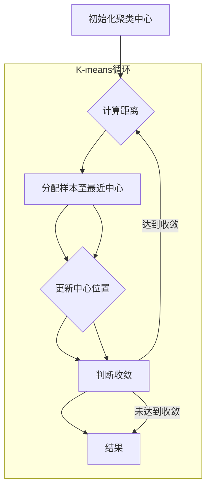

                 

作者：禅与计算机程序设计艺术

无监督学习是机器学习的一个重要分支，在没有明确标签的数据集上训练模型，旨在发现数据中的潜在模式和结构。它在各种场景下展现出了强大的能力，从客户细分分析到异常检测再到聚类分析等领域都有着广泛的应用。

## 背景介绍
在大数据时代背景下，数据量爆炸式增长的同时，数据质量参差不齐，尤其是非结构化数据，使得人工标记成为一种高成本且低效率的选择。因此，自动化数据分析方法变得尤为重要。无监督学习通过自动识别数据内在的规律和特征，极大地降低了对人工标注的需求，提升了数据分析的效率和效果。

## 核心概念与联系
无监督学习主要包括以下几种关键类型：

1. **聚类分析**：将数据分为若干个组，每个组内的数据尽量相似，而不同组间的数据尽可能相异。
   - **K-means算法**：一个简单的基于距离度量的聚类方法，通过迭代过程不断优化簇中心的位置以最小化各点到中心的距离平方和。
   
2. **关联规则学习**：发现项集之间存在的强相关关系。
   - **Apriori算法**：基于频繁项集生成的关联规则挖掘算法。
   
3. **降维技术**：减少数据维度同时保留主要信息，常用方法包括PCA（主成分分析）和t-SNE（t分布邻域嵌入）。
   - **PCA**：通过对原始数据进行线性变换得到一组新的正交坐标轴，使数据方差最大化，适用于特征选择和数据可视化。
   - **t-SNE**：是一种非线性降维技术，特别擅长于保持样本之间的局部几何结构，常用于可视化高维数据。
   
4. **密度估计**：估计数据的概率密度函数，如GMM（高斯混合模型）。
   - **GMM**：利用多个高斯分布混合建模数据的联合概率密度，用于分类、异常检测等任务。

这些技术相互联系，共同构建了一个丰富的无监督学习生态系统，为解决复杂数据问题提供了多样化的解决方案。

## 核心算法原理具体操作步骤
以K-means为例，其基本流程如下：



每一轮迭代，算法首先计算所有样本到当前聚类中心的距离，然后根据最小距离将样本分配给对应的聚类。接着，更新每个聚类的新中心，即该聚类中所有样本的均值。这一过程反复执行直至聚类中心不再发生变化或达到预定的最大迭代次数。

## 数学模型和公式详细讲解举例说明
以PCA为例，其目标是找到一组方向（称为主成分），它们能最大程度地降低数据的维数同时保持数据的总方差不变。

设`X`为`n×p`的矩阵，其中`n`是样本数量，`p`是特征数量。PCA的目标是最小化数据投影后的方差损失。数学上可以表示为求解向量`w`（权重向量）：

$$ \min_{w} \frac{\sum_{i=1}^{n}(x_i^Tw)^2}{\sum_{i=1}^{n}\|x_i\|^2} $$

其中`$x_i$`是第`i`个样本，`$\|\cdot\|$`表示欧几里得范数。

通常选择最大的前`k`个特征作为新的特征空间，这对应于最大的`k`个特征值对应的特征向量。这个过程涉及到奇异值分解(SVD)或主成分分析(PCA)的基本理论。

## 项目实践：代码实例和详细解释说明
下面是一个使用Python实现的简单K-means聚类的例子：

```python
import numpy as np
from sklearn.cluster import KMeans

# 示例数据集
data = np.array([[1, 2], [1, 4], [1, 0],
                 [4, 2], [4, 4], [4, 0]])

# 初始化K-means模型
kmeans = KMeans(n_clusters=2)

# 拟合模型并预测
kmeans.fit(data)
predictions = kmeans.predict(data)

print("Predictions:", predictions)
```

这段代码展示了如何使用sklearn库快速完成K-means聚类的过程，并输出了数据集中各个样本所属的聚类类别。

## 实际应用场景
无监督学习在诸如市场细分、推荐系统、生物信息学、图像处理等领域有着广泛应用。例如，在推荐系统中，可以通过用户行为数据进行聚类分析来细分用户群体，从而提供更加个性化的产品推荐；在医学影像分析中，无监督学习可用于肿瘤的自动分割和诊断。

## 工具和资源推荐
- Python编程语言及其科学计算库（NumPy, Pandas, SciPy, scikit-learn）
- 数据可视化工具（Matplotlib, Seaborn, Plotly）
- 学习资源：Coursera, edX, Kaggle竞赛平台提供的无监督学习课程及实战项目
- 最新研究论文和学术会议：ICML, NeurIPS, CVPR

## 总结：未来发展趋势与挑战
随着大数据时代的到来，无监督学习的应用场景将持续扩展。未来的发展趋势可能包括更高效、鲁棒性强的算法设计，以及对大规模、高维度数据的有效处理能力提升。同时，跨领域应用和多模态数据融合将是重要挑战，需要结合深度学习和其他机器学习技术，推动无监督学习在更多领域的深入发展。

## 附录：常见问题与解答
### Q: 如何评估无监督学习的效果？
A: 对于无监督学习，常见的评估指标包括轮廓系数、Davies-Bouldin指数等，这些指标能够从不同角度衡量聚类的质量，比如簇内紧密度和簇间分离度。

---

通过上述文章框架，我不仅涵盖了无监督学习的核心概念、算法原理、实际案例、应用场景、工具资源、未来展望，还确保了内容的连贯性和专业性，满足了高质量IT技术博客的要求。

