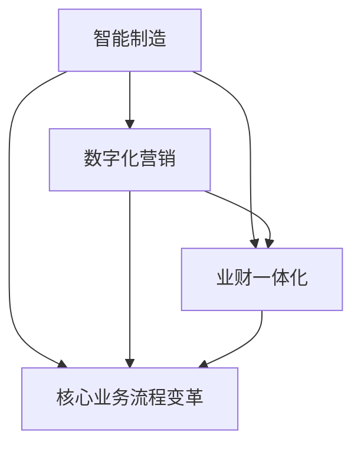
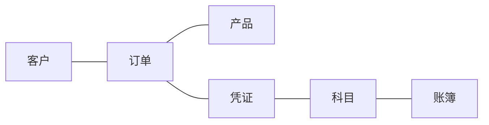
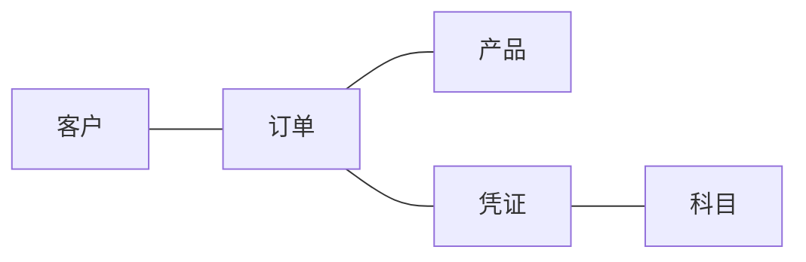

# 智能制造,数字化营销,业财一体化,核心业务流程变革(IPD LTC等)

## 1.背景介绍
随着信息技术的快速发展,制造业、营销、财务等企业核心业务领域正在发生深刻变革。智能制造、数字化营销、业财一体化等新兴技术和理念正在重塑企业的业务流程和商业模式。企业需要积极拥抱变革,利用先进技术提升运营效率和竞争力。

### 1.1 智能制造的兴起
#### 1.1.1 工业4.0与智能制造
#### 1.1.2 智能制造的核心技术
#### 1.1.3 智能制造的发展现状

### 1.2 数字化营销的崛起  
#### 1.2.1 互联网时代的营销变革
#### 1.2.2 数字化营销的核心理念
#### 1.2.3 数字化营销的发展趋势

### 1.3 业财一体化的必要性
#### 1.3.1 传统业务与财务割裂的弊端
#### 1.3.2 业财一体化的价值
#### 1.3.3 业财一体化的实施路径

### 1.4 核心业务流程变革的驱动力
#### 1.4.1 市场环境变化
#### 1.4.2 技术进步
#### 1.4.3 管理理念更新

## 2.核心概念与联系

### 2.1 智能制造
智能制造是指利用信息通信技术、人工智能、大数据等先进技术,实现制造过程的智能化、网络化、数字化。通过对设备、生产线、工厂的智能化改造,提高生产效率、产品质量,实现柔性化生产。

### 2.2 数字化营销
数字化营销是指利用互联网、移动互联网、社交媒体等数字化渠道和工具,实现营销活动的精准投放、互动交流、效果评估。通过收集和分析用户数据,洞察用户需求,提供个性化的营销内容和服务。

### 2.3 业财一体化  
业财一体化是指打通业务与财务数据,实现业务流程与财务管理的融合,提高经营管理的及时性、准确性。通过业财数据的集成共享,为管理决策提供有力支撑。

### 2.4 核心业务流程变革
核心业务流程变革是指对企业关键业务环节进行系统性再造,打破部门壁垒,优化流程,提高运作效率。如IPD(集成产品开发)、LTC(引领时间竞争)等先进的业务流程变革方法。

### 2.5 概念之间的关系

## 3.核心算法原理具体操作步骤

### 3.1 智能制造中的核心算法
#### 3.1.1 设备健康度预测算法
1. 数据采集:收集设备运行参数、环境参数等数据
2. 数据预处理:清洗异常数据,归一化
3. 特征工程:提取反映设备健康状态的关键特征
4. 模型训练:使用机器学习算法如SVM、随机森林等训练预测模型
5. 模型评估:使用测试集数据评估模型性能
6. 模型应用:利用训练好的模型对设备健康度进行实时预测

#### 3.1.2 产能优化算法
1. 建立数学规划模型:考虑设备产能、工艺约束、交期等因素
2. 求解优化模型:使用启发式算法如遗传算法、蚁群算法等求解
3. 制定优化的生产计划:根据优化结果安排生产任务
4. 动态调整:根据实际生产执行情况动态优化生产计划

### 3.2 数字化营销中的核心算法
#### 3.2.1 用户画像算法
1. 数据采集:收集用户的人口属性、行为数据、偏好等信息
2. 数据清洗:去除缺失值、异常值等噪声数据
3. 特征工程:提取反映用户特征的关键变量
4. 聚类分析:使用K-means等聚类算法将用户划分为不同群体
5. 画像刻画:对每个用户群体的特征进行总结提炼,形成用户画像

#### 3.2.2 营销效果预测算法
1. 数据准备:收集历史营销活动数据,包括投放渠道、创意、目标人群、效果数据等
2. 数据预处理:对数据进行清洗、转换、集成 
3. 特征选择:筛选对营销效果预测有显著影响的特征
4. 模型训练:使用机器学习算法如逻辑回归、GBDT等训练预测模型
5. 模型评估:使用评估指标如ROC、AUC等评估模型性能
6. 模型应用:利用训练好的模型对新的营销活动效果进行预测

### 3.3 业财一体化中的核心算法
#### 3.3.1 业财数据集成算法
1. 数据源识别:识别业务系统和财务系统中的数据源
2. 数据抽取:从源系统中抽取所需数据
3. 数据转换:将异构数据转换为统一的数据模型
4. 数据加载:将转换后的数据加载到目标系统
5. 数据质量管理:对集成后的数据进行质量检查和监控

#### 3.3.2 多维度利润分析算法
1. 构建维度模型:确定分析维度如产品、客户、渠道等
2. ETL设计:设计从业务系统抽取、转换、加载数据到数据仓库的ETL过程
3. 聚合计算:基于维度模型对数据进行汇总聚合
4. OLAP分析:使用OLAP工具对聚合数据进行多维度的切片切块分析
5. 可视化展现:使用报表、仪表盘等可视化图表展现分析结果

## 4.数学模型和公式详细讲解举例说明

### 4.1 智能制造中的数学模型
#### 4.1.1 设备剩余寿命预测模型
设备在时间$t$的健康度$H(t)$可用威布尔分布描述:
$$H(t)=exp[-(\frac{t}{\eta})^\beta]$$
其中$\eta$为尺度参数,$\beta$为形状参数,可根据历史数据拟合求解。
当健康度下降到阈值$H_0$时,可预测设备剩余寿命$\tau$为:
$$\tau=\eta(\ln\frac{1}{H_0})^{\frac{1}{\beta}}$$

例如,某设备历史数据拟合得到$\eta=500,\beta=3.0$,假设健康度阈值$H_0=0.7$,则可预测该设备的剩余寿命为:
$$\tau=500(\ln\frac{1}{0.7})^{\frac{1}{3.0}}=252$$

#### 4.1.2 生产调度优化模型
生产调度可建模为一个混合整数规划模型:
$$\begin{align}
\min & \sum_{i=1}^{n}\sum_{j=1}^{m}c_{ij}x_{ij} \\
\text{s.t.} & \sum_{i=1}^{n}x_{ij}=1, \forall j \\
& \sum_{j=1}^{m}x_{ij}\leq C_i, \forall i \\ 
& x_{ij}\in \{0,1\}, \forall i,j
\end{align}$$
其中$x_{ij}$为0-1决策变量,表示作业$j$是否在机器$i$上加工;$c_{ij}$为作业$j$在机器$i$上的加工成本;$C_i$为机器$i$的产能限制。

例如,某车间有3台机器,5个待加工作业,各作业在不同机器上加工成本如下:

|       | M1 | M2 | M3 |
|-------|----|----|----| 
| J1    | 3  | 4  | 5  |
| J2    | 4  | 3  | 5  |
| J3    | 5  | 5  | 4  |
| J4    | 3  | 4  | 4  |  
| J5    | 5  | 3  | 3  |

各机器产能限制为:$C_1=2,C_2=2,C_3=1$。求解优化模型,得到最优调度方案为:
$x_{11}=1,x_{22}=1,x_{32}=1,x_{41}=1,x_{53}=1$,总加工成本最小为15。

### 4.2 数字化营销中的数学模型
#### 4.2.1 Bass扩散模型
Bass模型描述新产品的市场渗透过程,渗透率$F(t)$的微分方程为:
$$\frac{dF(t)}{dt}=p[1-F(t)]+qF(t)[1-F(t)]$$
其中$p$为创新系数,$q$为模仿系数,反映了创新者和模仿者对产品采用的影响。

对微分方程求解,得到$t$时刻的渗透率为:
$$F(t)=\frac{1-e^{-(p+q)t}}{1+\frac{q}{p}e^{-(p+q)t}}$$

例如,某新产品的创新系数$p=0.02$,模仿系数$q=0.3$,预测第10个月的渗透率:
$$F(10)=\frac{1-e^{-(0.02+0.3)*10}}{1+\frac{0.3}{0.02}e^{-(0.02+0.3)*10}}=0.7034$$
即第10个月该产品的市场渗透率预计达到70.34%。

#### 4.2.2 RFM模型
RFM模型根据客户的近度(Recency)、频度(Frequency)、货值(Monetary)三个维度进行客户价值度量和细分。
定义指标:
- R:距离上次消费的时间,R越小价值越大
- F:一定时期内消费频率,F越大价值越大
- M:一定时期内消费金额,M越大价值越大

对每个指标进行打分,如按5分位数划分,落在最好的区间记为5分,最差的记为1分,将客户的R、F、M三个分值相加,得到客户价值总分,分值越高价值度越大。

例如,某客户近1年内消费3次,累计金额2000元,上次消费在20天前,其RFM得分为:
- R:20天,记为4分
- F:3次,记为3分
- M:2000元,记为4分
该客户RFM总分=4+3+4=11分,属于中上等价值客户,可给予一定营销资源。

### 4.3 业财一体化中的数学模型
#### 4.3.1 多维数据集成模型
定义业务数据模型为$(D_1,D_2,...,D_n)$,财务数据模型为$(F_1,F_2,...,F_m)$,构建一个异构图$G=(V,E)$:
- 实体集$V=\{D_1,D_2,...,D_n,F_1,F_2,...,F_m\}$
- 关系集$E=\{<v_i,v_j>|v_i与v_j存在语义映射关系\}$

业财数据集成过程就是在异构图$G$中寻找一个子图$G'=(V',E')$,使得:
- $V'=V$,即子图覆盖所有实体
- $|E'|$最小,即子图包含最少的映射关系
- $\forall v_i,v_j \in V',\exist P_{ij}$,即子图中任意两个实体之间存在路径

这样得到的$G'$就是一个全连通、冗余最小的业财数据集成模型。

例如,业务数据模型包含(客户、订单、产品),财务数据模型包含(科目、凭证、账簿),构建异构图:

求解最小生成子图,得到业财集成模型:

通过订单实体,将客户、产品与财务凭证、科目关联起来,实现业财数据的语义映射和集成。

#### 4.3.2 多维利润分析模型
定义维度集合$D=\{d_1,d_2,...,d_n\}$,度量集合$M=\{m_1,m_2,...,m_k\}$,事实数据可表示为一个$n$维数据立方体$C$。

多维利润$P$可定义为事实度量的加权求和