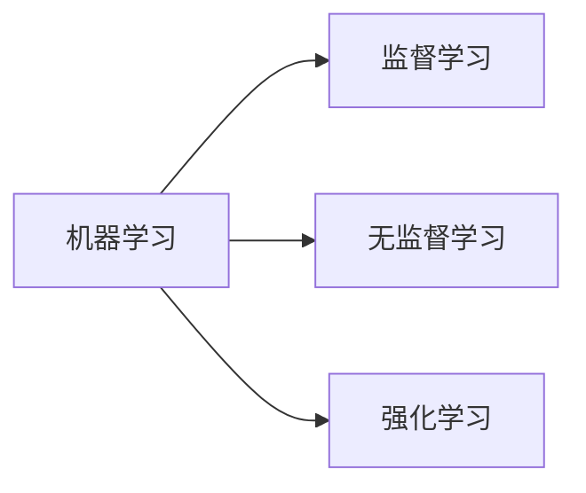
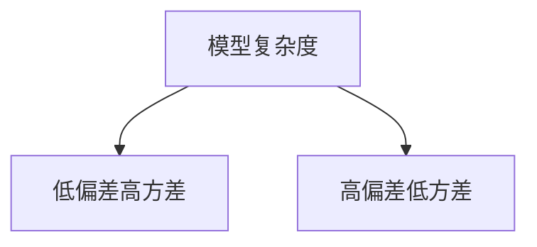

# 机器学习(Machine Learning) - 原理与代码实例讲解

## 1. 背景介绍

### 1.1 什么是机器学习

机器学习(Machine Learning，简称ML)是人工智能(Artificial Intelligence, AI)的一个分支。它是一门专注于研究如何通过数据来改善计算机程序性能的学科。与传统的程序设计方法不同，机器学习不需要显式地编写程序逻辑，而是通过给计算机程序"喂"大量的数据，让程序自己从数据中学习规律，生成模型，然后利用学习到的模型对新的数据进行预测或分类。

### 1.2 机器学习的发展历程

机器学习的概念最早由IBM的Arthur Samuel在1959年提出。之后，随着计算机技术的发展，机器学习也不断进步。上世纪80年代，神经网络的兴起给机器学习带来了新的活力。90年代，支持向量机(SVM)、Boosting等经典算法相继被提出。进入21世纪，互联网的普及产生了海量数据，为机器学习的发展提供了更广阔的空间。2006年，深度学习开始崭露头角，并在语音识别、图像识别等领域取得了突破性进展。如今，机器学习已广泛应用于各行各业，成为人工智能发展的核心驱动力。

### 1.3 机器学习的应用场景

机器学习在实际生活中有着广泛的应用，下面列举一些常见的应用场景：

- 图像识别：人脸识别、医学影像分析、无人驾驶等
- 自然语言处理：语音识别、机器翻译、情感分析等  
- 推荐系统：电商推荐、个性化新闻推送、视频推荐等
- 金融领域：信用评分、金融风控、股票预测等
- 工业领域：设备故障预测、产品质量检测等
- 安全领域：垃圾邮件检测、网络入侵检测等

可以看到，机器学习几乎渗透到了人类生活的方方面面。随着数据量的不断增长和算法的持续创新，机器学习必将在未来发挥更大的作用。

## 2. 核心概念与联系

### 2.1 监督学习、无监督学习和强化学习

根据训练数据是否有标签，机器学习主要分为以下三大类：

1. 监督学习(Supervised Learning)：训练数据由输入和期望输出(标签)组成，目标是学习一个函数，可以对新的输入给出正确的输出。常见的监督学习任务包括分类和回归。

2. 无监督学习(Unsupervised Learning)：训练数据只有输入，没有标签。目标是在数据中寻找隐藏的结构和关系。常见的无监督学习任务包括聚类、降维和异常检测等。

3. 强化学习(Reinforcement Learning)：通过智能体(Agent)与环境的交互来学习最优策略。智能体根据环境反馈的奖励或惩罚来不断调整行为。代表算法有Q-Learning、策略梯度等。

下图展示了这三种学习范式之间的关系：



### 2.2 过拟合与欠拟合

在机器学习中，我们希望学习到的模型不仅能很好地拟合训练数据，还能很好地泛化到新数据。但有时模型会出现过拟合或欠拟合的问题。

- 过拟合(Overfitting)：模型过于复杂，把训练数据的噪声也学习进去了，导致在训练集上表现很好，但在测试集上表现较差。
- 欠拟合(Underfitting)：模型过于简单，无法很好地拟合训练数据，在训练集和测试集上的表现都较差。

为了避免过拟合和欠拟合，我们可以采取以下措施：
- 增大训练集，提供更多的训练样本
- 使用正则化技术，如L1/L2正则化，dropout等
- 进行交叉验证，用验证集选择复杂度合适的模型
- 采集更多特征，增强模型的表达能力

### 2.3 偏差与方差

偏差(Bias)和方差(Variance)是评估模型泛化能力的两个重要指标。

- 偏差：描述了模型的预测值与真实值之间的差异。偏差越大，欠拟合的可能性越大。
- 方差：描述了模型对不同训练集的敏感程度。方差越大，过拟合的可能性越大。

我们希望找到一个偏差和方差都较小的模型，即能够很好地拟合数据，又不会过于敏感。下图形象地展示了偏差和方差的关系：



## 3. 核心算法原理具体操作步骤

本节将详细介绍几种常见的机器学习算法，包括线性回归、逻辑回归、决策树、支持向量机和神经网络。

### 3.1 线性回归

线性回归是一种简单但非常实用的算法，用于拟合连续型变量之间的线性关系。给定一组训练样本 $\{(x_1,y_1), (x_2,y_2), ..., (x_n,y_n)\}$，线性回归的目标是学习一个线性函数：

$$h_\theta(x) = \theta_0 + \theta_1x_1 + ... + \theta_nx_n$$

使得预测值 $h_\theta(x)$ 与真实值 $y$ 之间的均方误差最小化：

$$J(\theta) = \frac{1}{2m}\sum_{i=1}^m(h_\theta(x^{(i)})-y^{(i)})^2$$

其中 $m$ 为样本数量，$\theta$ 为待学习的参数。我们可以使用梯度下降法来最小化损失函数 $J(\theta)$，更新参数 $\theta$：

$$\theta_j := \theta_j - \alpha\frac{1}{m}\sum_{i=1}^m(h_\theta(x^{(i)})-y^{(i)})x_j^{(i)}$$

其中 $\alpha$ 为学习率。重复迭代直到收敛，就可以得到最优的参数 $\theta$。

### 3.2 逻辑回归 

逻辑回归用于二分类问题，虽然名字里有"回归"，但它实际上是一种分类算法。逻辑回归的核心是 Sigmoid 函数：

$$g(z) = \frac{1}{1+e^{-z}}$$

它可以将实数映射到 (0,1) 区间内，我们可以将其输出解释为属于正类的概率。假设

$$z = \theta_0 + \theta_1x_1 + ... + \theta_nx_n$$

则逻辑回归模型可以表示为：

$$h_\theta(x) = g(z) = \frac{1}{1+e^{-(\theta_0 + \theta_1x_1 + ... + \theta_nx_n)}}$$

对于给定的样本 $(x,y)$，其中 $y\in\{0,1\}$，逻辑回归的损失函数为：

$$J(\theta) = -\frac{1}{m}\sum_{i=1}^m[y^{(i)}\log h_\theta(x^{(i)})+(1-y^{(i)})\log(1-h_\theta(x^{(i)}))]$$

我们仍然可以使用梯度下降法来最小化损失函数，求解出最优参数。

### 3.3 决策树

决策树是一种树形结构的分类器，可以看作是if-then规则的集合。决策树由结点和有向边组成，内部结点表示一个特征或属性，叶结点表示一个类别。

决策树的生成过程通常采用自顶向下的递归方法，基本步骤如下：

1. 如果当前结点包含的样本全属于同一类别，则将该结点标记为叶结点，并将该类别作为结点的类标记，返回。

2. 否则，根据某种评价指标(如信息增益、基尼指数等)选择一个最优划分属性，根据该属性的取值将样本划分为若干子集，构建子结点。

3. 对每个子结点递归地调用步骤1、2，直到所有子结点都是叶结点或满足预定的停止条件。

决策树的优点是模型具有可解释性，分类速度快。缺点是容易过拟合，对噪声敏感。常见的决策树算法有ID3、C4.5和CART等。

### 3.4 支持向量机

支持向量机(Support Vector Machine, SVM)是一种二分类模型，其基本思想是在特征空间中寻找一个最大间隔超平面，将不同类别的样本划分到超平面的两侧。

在线性可分的情况下，SVM的目标是最大化超平面两侧的函数间隔，即

$$\max_{\mathbf{w},b} \frac{2}{\|\mathbf{w}\|} \quad s.t. \quad y_i(\mathbf{w}^T\mathbf{x}_i+b) \geq 1, \quad i=1,2,...,m$$

其中 $\mathbf{w}$ 为超平面的法向量，$b$ 为偏置项，$(\mathbf{x}_i,y_i)$ 为训练样本。

对于线性不可分的情况，可以引入松弛变量 $\xi_i$，允许少量样本被错误分类。同时，在目标函数中引入惩罚项，得到如下优化问题：

$$\min_{\mathbf{w},b,\xi} \frac{1}{2}\|\mathbf{w}\|^2 + C\sum_{i=1}^m\xi_i \quad s.t. \quad y_i(\mathbf{w}^T\mathbf{x}_i+b) \geq 1-\xi_i, \quad \xi_i \geq 0, \quad i=1,2,...,m$$

其中 $C$ 为惩罚系数，用于控制间隔大小和错分样本数量之间的平衡。

对于非线性问题，可以通过核技巧将样本映射到高维空间，在高维空间中构建最优超平面。常用的核函数有多项式核、高斯核(RBF)等。

SVM的优点是泛化能力强，适合高维数据。缺点是对参数敏感，训练开销大。

### 3.5 神经网络

神经网络(Neural Network)是一种模拟生物神经系统结构和功能的计算模型，由大量的神经元(结点)互联而成。每个神经元接收一些输入，通过激活函数产生输出。神经元之间通过带权重的连接(边)传递信号。

一个典型的前馈神经网络由输入层、隐藏层和输出层组成。以一个L层的网络为例，假设第 $l$ 层有 $n_l$ 个神经元，第 $l+1$ 层有 $n_{l+1}$ 个神经元，则第 $l+1$ 层第 $i$ 个神经元的输入为

$$z_i^{(l+1)} = \sum_{j=1}^{n_l} W_{ij}^{(l)}a_j^{(l)} + b_i^{(l+1)}$$

其中 $W_{ij}^{(l)}$ 为第 $l$ 层第 $j$ 个神经元到第 $l+1$ 层第 $i$ 个神经元的权重，$b_i^{(l+1)}$ 为第 $l+1$ 层第 $i$ 个神经元的偏置项，$a_j^{(l)}$ 为第 $l$ 层第 $j$ 个神经元的输出，它由激活函数 $\sigma$ 作用于 $z_j^{(l)}$ 得到：

$$a_j^{(l)} = \sigma(z_j^{(l)})$$

常见的激活函数有 Sigmoid、tanh、ReLU 等。

神经网络的训练过程通常使用反向传播算法，即先进行前向传播计算输出，然后反向传播计算每一层的误差项，并更新权重和偏置。

神经网络的优点是可以拟合复杂的非线性关系，具有很强的表达能力。缺点是训练时间长，调参复杂，可解释性差。

下图展示了一个简单的三层神经网络结构：

```mermaid
graph LR
subgraph 输入层
x1[x1] --> h1[h1]
x1 --> h2[h2]
x2[x2] --> h1
x2 --> h2
end
subgraph 隐藏层
h1 --> o1[o1]
h1 --> o2[o2]
h2 --> o1
h2 --> o2
end
subgraph 输出层