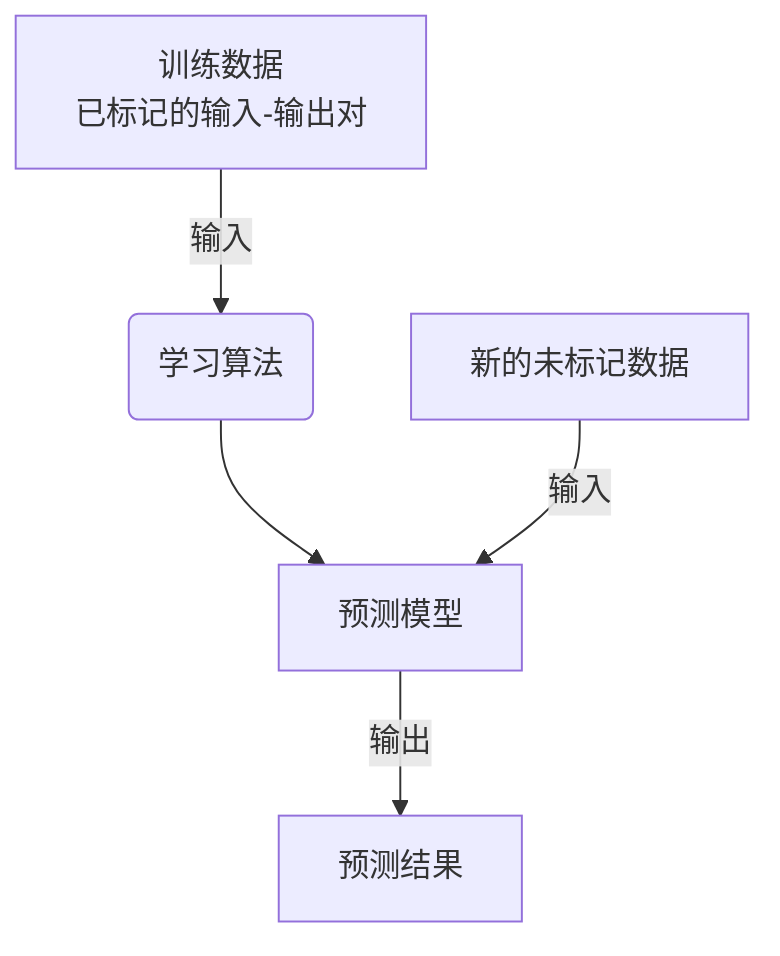
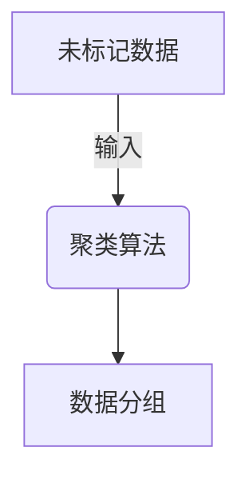
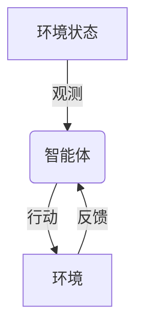
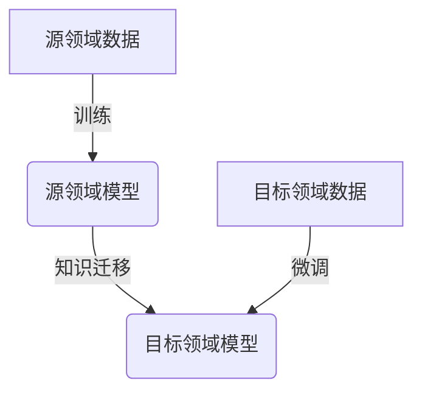

# 机器学习与医疗健康的结合:了解机器学习在医疗健康领域的应用

## 1.背景介绍

### 1.1 医疗健康领域的挑战

医疗健康领域一直面临着诸多挑战,例如疾病诊断的复杂性、治疗方案的个体化需求、医疗资源的有限性等。传统的医疗模式很难完全满足日益增长的医疗需求,因此迫切需要创新的解决方案来提高医疗服务的质量和效率。

### 1.2 机器学习的兴起

近年来,机器学习技术的快速发展为解决医疗健康领域的挑战提供了新的契机。机器学习是一种从数据中自动分析并建模的方法,能够从大量数据中发现隐藏的模式和规律,并对新的数据进行预测和决策。

### 1.3 机器学习在医疗健康领域的应用前景

机器学习在医疗健康领域具有广阔的应用前景,包括疾病预测、医疗影像分析、药物发现、个性化治疗方案等。通过利用海量的医疗数据,机器学习算法可以提高诊断的准确性、优化治疗方案、发现新的药物靶点,从而提高医疗服务的质量和效率。

## 2.核心概念与联系

### 2.1 监督学习

监督学习是机器学习中最常见的一种范式,其目标是从已标记的训练数据中学习一个映射函数,以预测新的未标记数据的输出。在医疗健康领域,监督学习可应用于疾病诊断、预后预测等任务。

### 2.2 无监督学习

无监督学习旨在从未标记的数据中发现潜在的模式和结构。在医疗健康领域,无监督学习可用于患者分组、异常检测等任务。

### 2.3 强化学习

强化学习是一种基于环境反馈的学习范式,其目标是通过试错来学习一个最优策略,以最大化预期的累积奖励。在医疗健康领域,强化学习可应用于个性化治疗方案的优化、医疗资源的合理分配等任务。

### 2.4 迁移学习

迁移学习旨在将在一个领域学习到的知识迁移到另一个相关但不同的领域,从而提高新领域的学习效率。在医疗健康领域,迁移学习可用于跨机构、跨模态的模型迁移,提高模型的泛化能力。

## 3.核心算法原理具体操作步骤

在医疗健康领域,常见的机器学习算法包括逻辑回归、支持向量机、决策树、随机森林、神经网络等。这些算法的具体原理和操作步骤如下:

### 3.1 逻辑回归

逻辑回归是一种广泛应用于二分类问题的监督学习算法,它通过建立输入特征与输出标签之间的对数几率关系来进行预测。

1. **数据预处理**:对输入特征进行标准化或归一化,处理缺失值等。
2. **模型训练**:使用梯度下降或其他优化算法,最小化逻辑损失函数,求解模型参数。
3. **模型评估**:使用准确率、精确率、召回率等指标评估模型性能。
4. **模型预测**:将新的输入数据代入训练好的模型,获得预测概率或类别标签。

### 3.2 支持向量机

支持向量机是一种有监督的非概率二分类模型,其核心思想是在高维空间中寻找一个最大间隔超平面,将不同类别的数据分开。

1. **数据预处理**:对输入特征进行标准化或归一化,处理缺失值等。
2. **核函数选择**:选择合适的核函数,如线性核、多项式核、高斯核等。
3. **模型训练**:使用序列最小优化算法或其他优化算法,最小化结构风险,求解模型参数。
4. **模型评估**:使用准确率、精确率、召回率等指标评估模型性能。
5. **模型预测**:将新的输入数据代入训练好的模型,获得预测类别标签。

### 3.3 决策树

决策树是一种基于树形结构的监督学习算法,它通过递归地构建决策树,将输入空间划分为多个区域,每个区域对应一个输出值。

1. **数据预处理**:对输入特征进行标准化或归一化,处理缺失值等。
2. **特征选择**:根据信息增益或其他指标,选择最优特征作为决策节点。
3. **树的生成**:递归地构建决策树,直到满足停止条件。
4. **树的修剪**:对已生成的决策树进行修剪,防止过拟合。
5. **模型评估**:使用准确率、精确率、召回率等指标评估模型性能。
6. **模型预测**:将新的输入数据按照决策树的路径进行预测。

### 3.4 随机森林

随机森林是一种基于集成学习的算法,它通过构建多个决策树,并将它们的预测结果进行组合,从而提高预测性能。

1. **数据预处理**:对输入特征进行标准化或归一化,处理缺失值等。
2. **bootstrap采样**:对原始数据进行有放回的bootstrap采样,获得多个子数据集。
3. **决策树生成**:对每个子数据集,使用决策树算法构建一个决策树。
4. **模型集成**:将多个决策树的预测结果进行组合,如投票或平均等。
5. **模型评估**:使用准确率、精确率、召回率等指标评估模型性能。
6. **模型预测**:将新的输入数据输入到随机森林模型,获得预测结果。

### 3.5 神经网络

神经网络是一种仿生的机器学习模型,它通过构建多层神经元网络,对输入数据进行非线性变换,从而学习复杂的映射关系。

1. **数据预处理**:对输入特征进行标准化或归一化,处理缺失值等。
2. **网络结构设计**:确定网络的层数、每层神经元数量、激活函数等。
3. **模型初始化**:初始化网络权重和偏置参数。
4. **模型训练**:使用反向传播算法和优化算法(如梯度下降),最小化损失函数,更新网络参数。
5. **模型评估**:使用准确率、精确率、召回率等指标评估模型性能。
6. **模型预测**:将新的输入数据输入到训练好的神经网络,获得预测结果。

## 4.数学模型和公式详细讲解举例说明

在医疗健康领域的机器学习应用中,常见的数学模型和公式包括:

### 4.1 线性回归

线性回归是一种常用的监督学习算法,它试图找到一个最佳拟合的线性方程,将输入特征映射到连续的输出值。线性回归的数学模型如下:

$$y = \theta_0 + \theta_1x_1 + \theta_2x_2 + ... + \theta_nx_n$$

其中,y是预测的输出值,x是输入特征向量,θ是待估计的参数向量。

线性回归的目标是最小化预测值与实际值之间的均方误差:

$$J(\theta) = \frac{1}{2m}\sum_{i=1}^m(h_\theta(x^{(i)}) - y^{(i)})^2$$

其中,m是训练样本数量,h_θ(x)是线性回归模型的预测函数。

通过梯度下降等优化算法,可以求解出最优参数θ,从而获得最佳拟合的线性模型。

### 4.2 逻辑回归

逻辑回归是一种常用的二分类算法,它通过建立输入特征与输出标签之间的对数几率关系来进行预测。逻辑回归的数学模型如下:

$$h_\theta(x) = \frac{1}{1 + e^{-\theta^Tx}}$$

其中,h_θ(x)是预测的概率值,θ是待估计的参数向量。

逻辑回归的目标是最小化交叉熵损失函数:

$$J(\theta) = -\frac{1}{m}\sum_{i=1}^m[y^{(i)}\log h_\theta(x^{(i)}) + (1 - y^{(i)})\log(1 - h_\theta(x^{(i)}))]$$

通过梯度下降等优化算法,可以求解出最优参数θ,从而获得最佳拟合的逻辑回归模型。

### 4.3 支持向量机

支持向量机是一种常用的二分类算法,它通过寻找一个最大间隔超平面将不同类别的数据分开。支持向量机的数学模型如下:

$$\min_{w,b,\xi} \frac{1}{2}||w||^2 + C\sum_{i=1}^m\xi_i$$
$$\text{subject to } y^{(i)}(w^Tx^{(i)} + b) \geq 1 - \xi_i, \xi_i \geq 0$$

其中,w是超平面的法向量,b是超平面的偏移量,ξ是松弛变量,C是惩罚参数。

通过引入核函数K(x,y),支持向量机可以在高维空间中寻找最优超平面,从而实现非线性分类。常用的核函数包括线性核、多项式核、高斯核等。

### 4.4 决策树

决策树是一种常用的分类和回归算法,它通过递归地构建决策树,将输入空间划分为多个区域,每个区域对应一个输出值。决策树的构建过程可以使用信息增益或基尼系数等指标来选择最优特征作为决策节点。

对于分类问题,信息增益的计算公式如下:

$$\text{Gain}(D, a) = \text{Entropy}(D) - \sum_{v=1}^V\frac{|D^v|}{|D|}\text{Entropy}(D^v)$$

其中,D是当前数据集,a是特征,V是特征a的可取值集合,D^v是特征a取值为v的子数据集,Entropy是信息熵。

对于回归问题,常用的指标是均方差:

$$\text{Var}(D) = \frac{1}{|D|}\sum_{x\in D}(y - \bar{y})^2$$

其中,y是实际值,\bar{y}是平均值。

### 4.5 神经网络

神经网络是一种强大的机器学习模型,它通过构建多层神经元网络,对输入数据进行非线性变换,从而学习复杂的映射关系。神经网络的数学模型如下:

$$y = f(W^{(L)}a^{(L-1)} + b^{(L)})$$
$$a^{(l)} = g(W^{(l)}a^{(l-1)} + b^{(l)})$$

其中,y是输出值,a^(l)是第l层的激活值,W^(l)是第l层的权重矩阵,b^(l)是第l层的偏置向量,f和g是激活函数,如sigmoid、ReLU等。

神经网络的目标是最小化损失函数,如均方误差损失函数:

$$J(W, b) = \frac{1}{m}\sum_{i=1}^m\frac{1}{2}||h_{W,b}(x^{(i)}) - y^{(i)}||^2$$

通过反向传播算法和优化算法(如梯度下降),可以更新网络的权重和偏置参数,从而获得最佳拟合的神经网络模型。

## 5.项目实践:代码实例和详细解释说明

在本节中,我们将通过一个实际项目案例,展示如何使用Python中的机器学习库(如scikit-learn、TensorFlow、Keras等)来构建和训练机器学习模型,并