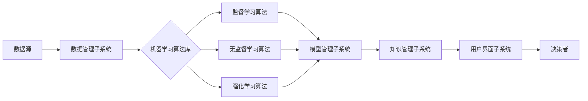

# 机器学习算法在决策支持系统领域的应用

## 1. 背景介绍
### 1.1 决策支持系统的定义与发展
决策支持系统（Decision Support System，DSS）是一种交互式的计算机信息系统，它可以帮助决策者利用数据和模型来解决非结构化和半结构化的决策问题。DSS 的概念最早由 Scott Morton 在 20 世纪 60 年代提出，经过半个多世纪的发展，DSS 已经成为管理信息系统领域的重要分支，广泛应用于企业管理、金融投资、医疗诊断等诸多领域。

### 1.2 机器学习的兴起及其与 DSS 的结合
近年来，以深度学习为代表的机器学习技术取得了突破性进展，在图像识别、自然语言处理等领域展现出了超越人类的性能。机器学习具有从海量数据中自动提取特征和规律的能力，可以极大地提升 DSS 的智能化水平。将机器学习算法引入 DSS，可以实现从数据驱动到知识驱动的飞跃，使得 DSS 能够自主学习和优化，更好地辅助人类进行复杂决策。

## 2. 核心概念与联系
### 2.1 机器学习的分类与原理
机器学习主要分为监督学习、无监督学习和强化学习三大类。监督学习是指在已知标签的训练数据上学习一个模型，然后用该模型对新数据进行预测；无监督学习则是在没有标签的数据上寻找内在的结构和规律；强化学习是指智能体通过与环境的交互，学习最优的行为策略以获得最大的累积奖励。不同类型的机器学习算法在 DSS 中有着不同的应用场景。

### 2.2 DSS 的构成要素与架构
一个完整的 DSS 通常由数据管理子系统、模型管理子系统、知识管理子系统、用户界面子系统和用户构成。其中，数据管理子系统负责数据的采集、存储和预处理；模型管理子系统包含各种数学模型和优化算法；知识管理子系统存储领域知识和经验规则；用户界面子系统提供人机交互的渠道。机器学习算法主要应用于模型管理和知识管理子系统，通过数据驱动的方式构建和优化决策模型。

### 2.3 机器学习与 DSS 的融合框架
下图展示了一个将机器学习算法集成到 DSS 中的典型框架：



在该框架中，来自各种渠道的原始数据首先经过数据管理子系统的 ETL 处理，转换为适合机器学习的格式。然后，根据具体的业务需求和数据特点，选择合适的机器学习算法（监督、无监督或强化）对数据进行训练，得到决策模型。这些模型被组织和存储在模型管理子系统中，并转化为知识规则，供知识管理子系统调用。最后，用户通过界面子系统提出决策需求，系统调用相关的模型和知识，产生决策建议，辅助决策者完成决策过程。

## 3. 核心算法原理与具体操作步骤
本节选取决策树、聚类和强化学习三种典型的机器学习算法，阐述其基本原理和在 DSS 中的应用步骤。

### 3.1 决策树算法
决策树是一种监督学习算法，它以树形结构表示决策过程，内部节点表示属性测试，叶节点表示决策结果。决策树算法通过递归地选择最优划分属性，将数据集分割成越来越小的子集，直到所有实例都属于同一类或满足其他停止条件。

构建决策树的具体步骤如下：
1. 选择最优划分属性。常用的指标有信息增益、增益率和基尼指数等。
2. 根据选定的属性划分数据集。对每个可能的属性值，创建一个分支。 
3. 递归地在每个分支上重复步骤 1 和 2，直到满足停止条件。
4. 对应于数据集的每个子集，创建一个叶节点，并将其标记为该子集中占主导地位的类。

决策树算法易于理解和实现，可解释性强，是 DSS 中常用的分类和预测方法。但它也容易过拟合，需要进行剪枝等优化。

### 3.2 聚类算法
聚类是一种无监督学习算法，它将相似的对象归为一组，构成一个个的簇。聚类算法可以帮助 DSS 发现数据内在的分布结构，辅助进行客户细分、异常检测等任务。常见的聚类算法包括 K-means、层次聚类和基于密度的 DBSCAN 等。

以 K-means 为例，其基本步骤如下：  
1. 随机选取 K 个初始聚类中心。
2. 计算每个数据点到各个聚类中心的距离，将其分配到距离最近的簇。
3. 更新每个簇的聚类中心为该簇内所有点的均值。
4. 重复步骤 2 和 3，直到聚类中心不再发生明显变化或达到最大迭代次数。

聚类结果可以用于可视化分析、异常点检测等，为决策者提供数据全局视角。但聚类算法的性能依赖于初始值选择和相似度度量，需要进行反复试验和调优。

### 3.3 强化学习算法
强化学习是一种通过试错与环境交互来学习最优决策的方法。它由智能体、环境、状态、行为和奖励构成。智能体根据当前状态采取行为，环境根据行为给出新的状态和即时奖励，智能体的目标是学习一个最优策略以获得最大的累积奖励。强化学习在 DSS 中可用于求解动态优化问题，如库存管理、动态定价等。

Q-learning 是一种典型的强化学习算法，其核心是价值函数的迭代更新：
$$
Q(s_t,a_t) \leftarrow Q(s_t,a_t) + \alpha [r_{t+1} + \gamma \max_a Q(s_{t+1},a) - Q(s_t,a_t)]
$$

其中，$s_t$ 和 $a_t$ 分别表示 $t$ 时刻的状态和行为，$r_{t+1}$ 是采取行为后获得的即时奖励，$\alpha$ 是学习率，$\gamma$ 是折扣因子。Q-learning 的具体步骤如下：

1. 初始化 Q 值表 $Q(s,a)$。
2. 重复以下步骤直到收敛：
   1. 根据 $\epsilon$-贪婪策略选择一个行为 $a_t$。
   2. 执行行为 $a_t$，观察奖励 $r_{t+1}$ 和新状态 $s_{t+1}$。 
   3. 根据上面的公式更新 $Q(s_t,a_t)$。
   4. $s_t \leftarrow s_{t+1}$。

强化学习的优点是可以在线学习和优化策略，适用于动态环境下的决策问题。但它通常需要大量的试错和迭代，收敛速度较慢，且容易陷入局部最优。

## 4. 数学模型和公式详细讲解举例说明
本节以逻辑回归模型为例，详细讲解其数学原理，并给出具体的计算示例。

### 4.1 逻辑回归模型的定义
逻辑回归是一种常用的分类模型，它利用 Sigmoid 函数将线性回归的输出映射到 (0,1) 区间，得到样本属于正类的概率。设输入为 $\boldsymbol{x} = (x_1,x_2,\cdots,x_n)$，权重向量为 $\boldsymbol{w} = (w_1,w_2,\cdots,w_n)$，偏置项为 $b$，则逻辑回归模型定义为：

$$
P(y=1|\boldsymbol{x}) = \frac{1}{1+e^{-(\boldsymbol{w}^T\boldsymbol{x}+b)}}
$$

其中，$y \in \{0,1\}$ 表示二分类的类别标签。如果 $P(y=1|\boldsymbol{x}) > 0.5$，则预测为正类，否则预测为负类。

### 4.2 逻辑回归的参数估计
逻辑回归的参数 $\boldsymbol{w}$ 和 $b$ 通过极大似然估计方法求得。给定训练集 $\{(\boldsymbol{x}_i,y_i)\}_{i=1}^m$，似然函数定义为：

$$
L(\boldsymbol{w},b) = \prod_{i=1}^m P(y_i|\boldsymbol{x}_i;\boldsymbol{w},b)
$$

为了便于求解，通常对似然函数取对数，得到对数似然函数：

$$
\ell(\boldsymbol{w},b) = \log L(\boldsymbol{w},b) = \sum_{i=1}^m [y_i \log P(y_i|\boldsymbol{x}_i) + (1-y_i) \log (1-P(y_i|\boldsymbol{x}_i))]
$$

通过最小化负对数似然函数（即最大化对数似然函数）来估计参数：

$$
\min_{\boldsymbol{w},b} \  -\ell(\boldsymbol{w},b) = \min_{\boldsymbol{w},b} \  -\sum_{i=1}^m [y_i (\boldsymbol{w}^T\boldsymbol{x}_i+b) - \log (1+e^{\boldsymbol{w}^T\boldsymbol{x}_i+b})]
$$

上式可以通过梯度下降法进行优化求解。

### 4.3 计算示例
考虑一个简单的二维数据集，其中正类样本为 $\{(1,2),(2,3),(3,3)\}$，负类样本为 $\{(2,1),(3,2)\}$。我们使用逻辑回归模型对其进行分类。

首先初始化参数，令 $\boldsymbol{w}=(0,0), b=0$。然后迭代执行以下步骤直到收敛：
1. 计算当前参数下每个样本的概率估计值和对数似然函数值。
2. 计算负对数似然函数关于 $\boldsymbol{w}$ 和 $b$ 的梯度。
3. 根据梯度下降公式更新 $\boldsymbol{w}$ 和 $b$。

假设学习率为 0.1，经过 5 轮迭代后，得到 $\boldsymbol{w}=(1.02, 1.27), b=-4.34$。将这些参数代入逻辑回归模型，可以得到决策边界为：
$$
1.02x_1 + 1.27x_2 - 4.34 = 0
$$

此时对数似然函数值为 -0.52，分类准确率为 100%。可以看出，逻辑回归模型通过学习得到了一个能够很好地划分正负类样本的线性决策边界。

## 5. 项目实践：代码实例和详细解释说明
本节以 Python 语言为例，演示如何使用 scikit-learn 库实现逻辑回归模型，并应用于实际的数据集。

### 5.1 数据集准备
我们使用著名的鸢尾花（Iris）数据集，该数据集包含 150 个样本，每个样本有 4 个特征（花萼长度、花萼宽度、花瓣长度、花瓣宽度）和 1 个类别标签（Setosa、Versicolour 或 Virginica）。为了将其转化为二分类问题，我们只选取 Setosa 和 Versicolour 两个类别的样本。

```python
from sklearn.datasets import load_iris
from sklearn.model_selection import train_test_split

iris = load_iris()
X = iris.data[:100, :2]  # 取前两个特征
y = iris.target[:100]    # 取前两个类别
X_train, X_test, y_train, y_test = train_test_split(X, y, test_size=0.2, random_state=42)
```

### 5.2 模型训练与评估
使用 scikit-learn 提供的 LogisticRegression 类来训练逻辑回归模型，