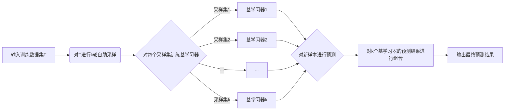
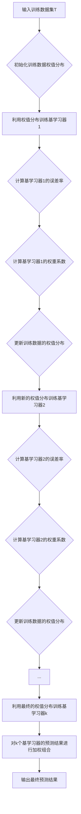

# 机器学习算法解析:Bagging与Boosting

## 1.背景介绍

### 1.1 机器学习中的集成学习

机器学习是人工智能的一个重要分支,其目标是通过算法让计算机从数据中学习,从而具备智能。在机器学习领域,集成学习(Ensemble Learning)是一种重要的策略,通过构建并结合多个学习器来完成学习任务,常常可以获得比单一学习器显著优越的泛化性能。

### 1.2 Bagging与Boosting的诞生

Bagging和Boosting是集成学习的两个经典代表。1996年,Breiman提出了Bagging(Bootstrap Aggregating)方法;1997年,Freund和Schapire提出了Boosting方法。这两种集成学习方法都获得了巨大的成功,在理论研究和实际应用中都取得了很好的效果。

### 1.3 本文的主要内容

本文将深入探讨Bagging和Boosting的原理、特点、异同点以及代表性算法,并通过数学推导、代码实例、应用场景等方面加以阐述,帮助读者全面理解这两种重要的集成学习方法。

## 2.核心概念与联系

### 2.1 集成学习的基本思想

集成学习的基本思想是由多个学习器组合成一个性能更好的学习器。通过训练多个个体学习器,然后将它们结合起来进行预测或决策。个体学习器可以是同质的(如Bagging),也可以是异质的(如Stacking)。

### 2.2 Bagging的核心思想

Bagging即Bootstrap Aggregating,其核心思想是通过自助采样法(bootstrap)对原始数据集进行采样,生成多个不同的训练集,再基于每个训练集训练出一个基学习器,然后将这些基学习器进行结合。Bagging通过降低基学习器的方差,可以有效地提高泛化性能。

### 2.3 Boosting的核心思想

Boosting的核心思想是通过迭代地改变训练数据的权重分布,即根据基学习器的表现调整训练样本权重,使得先前基学习器做错的训练样本在后续受到更多关注,逐步提高弱学习器的性能,最终将多个弱学习器组合成一个强学习器。Boosting主要关注降低基学习器的偏差。

### 2.4 Bagging与Boosting的联系与区别

Bagging和Boosting都是通过构建多个基学习器来完成学习任务,但二者的训练方式不同:
- Bagging采用自助采样法产生多个训练集,各个基学习器的训练过程相互独立。
- Boosting每轮训练集不变,但每轮根据基学习器表现调整训练样本权重,基学习器间存在依赖。

此外,Bagging的基学习器可以并行生成,而Boosting的基学习器只能串行生成。Bagging主要降低方差,Boosting主要降低偏差。

## 3.核心算法原理具体操作步骤

### 3.1 Bagging算法

#### 3.1.1 Bagging算法流程



Bagging算法的主要步骤如下:
1. 从原始训练集T中进行k轮自助采样,得到k个采样集 $T_1,T_2,...,T_k$,每个采样集的样本数量与T相同。
2. 基于每个采样集训练出一个基学习器,得到k个基学习器 $h_1,h_2,...,h_k$。
3. 对新样本进行预测时,将k个基学习器的预测结果进行组合(如投票)作为最终预测结果。

#### 3.1.2 自助采样(Bootstrap Sampling)

自助采样是一种有放回的采样方法,从原始数据集T中随机抽取m个样本(m等于T的样本数)构成采样集。每个样本被抽取的概率相等,都是$\frac{1}{m}$。自助采样使得每个采样集与原数据集T的分布相近,且不同采样集之间差异较大。

### 3.2 Boosting算法

#### 3.2.1 Boosting算法流程



Boosting算法的主要步骤如下:
1. 初始化训练数据的权值分布,对于n个样本,初始化每个样本的权值为$\frac{1}{n}$。
2. 利用当前的权值分布训练出一个基学习器。
3. 计算该基学习器的误差率。
4. 根据误差率计算该基学习器的权重系数。
5. 更新训练数据的权值分布,提高被错分类样本的权值,降低被正确分类样本的权值。
6. 重复步骤2-5,直到训练出预定数量的基学习器。
7. 对新样本进行预测时,将各个基学习器的预测结果根据其权重系数进行加权组合。

#### 3.2.2 样本权值的更新

Boosting的核心是通过迭代调整训练样本的权值分布,使得先前基学习器错分的样本在后续受到更多关注。假设第 $t$ 轮的权值分布为 $D_t$,基学习器 $h_t$ 在 $D_t$ 下的误差率为:

$$
\epsilon_t=\sum_{i=1}^m P(h_t(x_i)\neq y_i)
$$

则 $h_t$ 的权重系数为:

$$
\alpha_t=\frac{1}{2} \ln \frac{1-\epsilon_t}{\epsilon_t}
$$

权值分布 $D_{t+1}$ 的更新规则为:

$$
D_{t+1}(x_i)=\frac{D_t(x_i)}{Z_t} \times 
\begin{cases}
e^{-\alpha_t}, & h_t(x_i)=y_i \\
e^{\alpha_t}, & h_t(x_i) \neq y_i
\end{cases}
$$

其中 $Z_t$ 是规范化因子,使 $D_{t+1}$ 成为一个概率分布。

## 4.数学模型和公式详细讲解举例说明

### 4.1 Bagging的数学模型

假设基分类器的错误率为 $\epsilon$,Bagging集成后的错误率 $E$ 为:

$$
E=\sum_{i=0}^{\lfloor T/2 \rfloor} \dbinom{T}{i} (1-\epsilon)^i \epsilon^{T-i}
$$

其中 $T$ 为基分类器个数。当 $\epsilon=0.3$, $T=11$ 时,Bagging集成后的错误率约为0.056,远低于单个基分类器的错误率。这说明Bagging能够显著提高泛化性能。

### 4.2 AdaBoost的数学模型

AdaBoost是Boosting家族中最著名的代表。假设训练数据集为 $T=\{(x_1,y_1),(x_2,y_2),...,(x_m,y_m)\}$,AdaBoost的数学模型如下:

1. 初始化训练数据的权值分布:

$$
D_1=(w_{11},w_{12},...,w_{1m}), \quad w_{1i}=\frac{1}{m}, \quad i=1,2,...,m
$$

2. 对 $t=1,2,...,T$:
   (a) 使用权值分布 $D_t$ 训练基分类器 $h_t:X \rightarrow \{-1,+1\}$
   (b) 计算 $h_t$ 在训练数据集上的分类误差率:
   
   $$
   \epsilon_t=\sum_{i=1}^m P(h_t(x_i) \neq y_i)=\sum_{i=1}^m w_{ti}I(h_t(x_i) \neq y_i)
   $$
   
   (c) 计算 $h_t$ 的系数:
   
   $$
   \alpha_t=\frac{1}{2} \ln \frac{1-\epsilon_t}{\epsilon_t}
   $$
   
   (d) 更新训练数据的权值分布:
   
   $$
   D_{t+1}=(w_{t+1,1},w_{t+1,2},...,w_{t+1,m}) \\
   w_{t+1,i}=\frac{w_{t,i}}{Z_t} \times 
   \begin{cases}
   e^{-\alpha_t}, & h_t(x_i)=y_i \\
   e^{\alpha_t}, & h_t(x_i) \neq y_i
   \end{cases}, \quad i=1,2,...,m
   $$
   
   其中 $Z_t=\sum_{i=1}^m w_{t,i} \exp (-\alpha_t y_i h_t(x_i))$ 为规范化因子。

3. 构建基分类器的线性组合:

$$
H(x)=\text{sign} \left( \sum_{t=1}^T \alpha_t h_t(x) \right)
$$

AdaBoost每轮关注被前一轮基分类器错分的样本,不断提高被错分样本的权值,使后续基分类器更关注这些样本。同时,AdaBoost采取加权表决的方式组合基分类器,分类误差率小的基分类器在表决中起更大的作用。

## 5.项目实践:代码实例和详细解释说明

下面以Python为例,展示Bagging和AdaBoost的代码实现。

### 5.1 Bagging代码实例

```python
import numpy as np
from sklearn.tree import DecisionTreeClassifier
from sklearn.ensemble import BaggingClassifier
from sklearn.datasets import make_classification
from sklearn.model_selection import train_test_split
from sklearn.metrics import accuracy_score

# 生成随机分类数据集
X, y = make_classification(n_samples=1000, n_classes=2, n_features=10, random_state=42)
X_train, X_test, y_train, y_test = train_test_split(X, y, test_size=0.3, random_state=42)

# 定义决策树分类器作为基学习器
base_estimator = DecisionTreeClassifier(max_depth=3)

# 定义Bagging分类器
bagging = BaggingClassifier(base_estimator=base_estimator, n_estimators=10, max_samples=0.8, 
                            max_features=0.8, bootstrap=True, random_state=42)

# 训练Bagging分类器
bagging.fit(X_train, y_train)

# 在测试集上评估性能
y_pred = bagging.predict(X_test)
accuracy = accuracy_score(y_test, y_pred)
print("Bagging Accuracy: {:.3f}".format(accuracy))
```

代码说明:
1. 首先生成一个随机分类数据集,并划分为训练集和测试集。
2. 定义决策树分类器作为Bagging的基学习器。
3. 定义Bagging分类器,设置基学习器个数为10,每个采样集的样本数和特征数均为原数据集的80%,采用自助采样。
4. 训练Bagging分类器,并在测试集上评估性能。

### 5.2 AdaBoost代码实例

```python
import numpy as np
from sklearn.tree import DecisionTreeClassifier
from sklearn.ensemble import AdaBoostClassifier
from sklearn.datasets import make_classification
from sklearn.model_selection import train_test_split
from sklearn.metrics import accuracy_score

# 生成随机分类数据集
X, y = make_classification(n_samples=1000, n_classes=2, n_features=10, random_state=42)
X_train, X_test, y_train, y_test = train_test_split(X, y, test_size=0.3, random_state=42)

# 定义决策树分类器作为基学习器
base_estimator = DecisionTreeClassifier(max_depth=1)

# 定义AdaBoost分类器
adaboost = AdaBoostClassifier(base_estimator=base_estimator, n_estimators=50, learning_rate=1.0, random