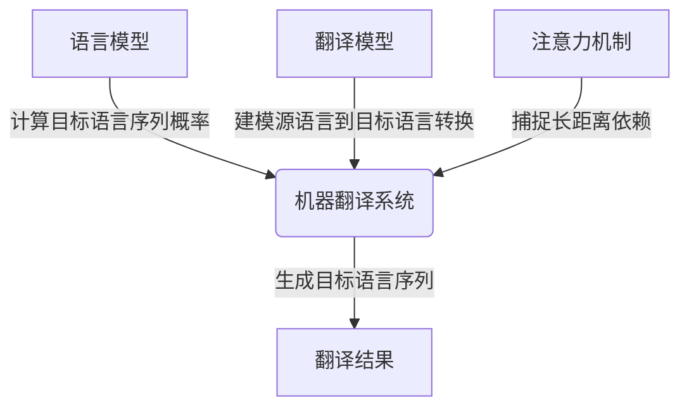
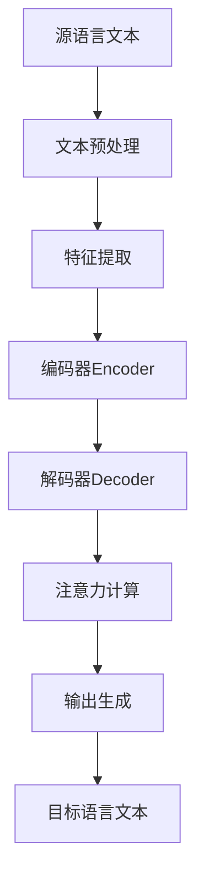

# 机器翻译(Machine Translation) - 原理与代码实例讲解

## 1. 背景介绍

机器翻译(Machine Translation, MT)是一个旨在使用计算机软件将一种自然语言(source language)转换为另一种自然语言(target language)的技术领域。它是自然语言处理(Natural Language Processing, NLP)的一个重要分支。

随着全球化进程的加快和跨国交流的日益频繁,机器翻译技术在商业、科技、教育、政府等多个领域发挥着越来越重要的作用。相比于人工翻译,机器翻译具有高效、低成本的优势,能够快速处理大量文本。

### 1.1 机器翻译发展历程

机器翻译的理论可以追溯到20世纪40年代。1954年,IBM与乔治城大学合作,开发出了世界上第一个机器翻译系统。此后,机器翻译经历了基于规则(Rule-Based Machine Translation, RBMT)、基于统计(Statistical Machine Translation, SMT)和基于神经网络(Neural Machine Translation, NMT)等不同发展阶段。

### 1.2 机器翻译挑战

尽管取得了长足进步,机器翻译仍然面临诸多挑战:

- 语义歧义:同一个词或短语在不同上下文中可能有不同的含义。
- 语法复杂性:不同语言的语法结构差异很大,难以直接对应。
- 领域专业性:对于特定领域的专业术语和语境,通用翻译系统的效果往往不佳。
- 文化差异:不同文化背景下,相同的表达可能有不同的内涵。

## 2. 核心概念与联系

机器翻译涉及多个关键概念,包括语言模型(Language Model)、翻译模型(Translation Model)、注意力机制(Attention Mechanism)等。这些概念相互关联,共同推动了机器翻译技术的发展。

### 2.1 语言模型

语言模型用于计算目标语言序列的概率,即给定前面的词,预测下一个词出现的可能性。高质量的语言模型有助于生成通顺、符合语法的目标语言序列。

常见的语言模型包括N-gram语言模型、神经网络语言模型等。其中,基于transformer的自注意力语言模型(如BERT、GPT等)在多个NLP任务中表现出色。

### 2.2 翻译模型

翻译模型的目标是找到源语言序列与目标语言序列之间的最优映射关系。统计机器翻译主要依赖翻译模型和语言模型的联合概率,而神经机器翻译则是使用序列到序列(Sequence-to-Sequence, Seq2Seq)模型直接建模源语言到目标语言的转换。

### 2.3 注意力机制

注意力机制是神经机器翻译中的关键创新,它允许模型在生成目标语言序列时,对源语言序列的不同部分赋予不同的权重,从而更好地捕捉长距离依赖关系。

自注意力机制(Self-Attention)进一步提高了模型的表现力,使得每个位置的表示不仅依赖于其他位置,还依赖于该位置本身,从而更好地编码序列信息。



## 3. 核心算法原理具体操作步骤

机器翻译系统通常包括以下核心步骤:

1. **文本预处理**:对输入的源语言文本进行分词、词性标注、命名实体识别等预处理操作,为后续的翻译做准备。

2. **特征提取**:将预处理后的文本转换为模型可以理解的数值表示,如one-hot编码、Word2Vec、BERT等embedding方法。

3. **编码(Encoder)**:将源语言序列编码为语义向量表示,捕捉序列中的上下文信息。

4. **解码(Decoder)**:根据编码器的输出,生成目标语言序列。在每个时间步,解码器会参考之前生成的输出和注意力权重,预测下一个词。

5. **注意力计算**:计算源语言序列中每个位置对当前目标语言位置的注意力权重,赋予不同的关注程度。

6. **输出生成**:根据解码器的输出概率分布,采用贪婪搜索或beam search等策略,生成最终的目标语言序列。

以Transformer模型为例,编码器和解码器都采用多头自注意力机制和位置编码,以捕捉长距离依赖关系和位置信息。



## 4. 数学模型和公式详细讲解举例说明

机器翻译系统中涉及多个核心数学模型,如语言模型、翻译模型、注意力机制等。下面将详细介绍其中的数学原理。

### 4.1 语言模型

语言模型的目标是计算目标语言序列 $Y = (y_1, y_2, \dots, y_T)$ 的概率 $P(Y)$。根据链式法则,可以分解为:

$$P(Y) = \prod_{t=1}^{T}P(y_t|y_1, \dots, y_{t-1})$$

其中 $P(y_t|y_1, \dots, y_{t-1})$ 表示在给定前 $t-1$ 个词的情况下,预测第 $t$ 个词的条件概率。

N-gram语言模型是一种常见的语言模型,它基于马尔可夫假设,即一个词的概率只与前面的 $n-1$ 个词相关:

$$P(y_t|y_1, \dots, y_{t-1}) \approx P(y_t|y_{t-n+1}, \dots, y_{t-1})$$

神经网络语言模型则使用神经网络直接对序列建模,无需马尔可夫假设。常见的模型包括循环神经网络(RNN)、长短期记忆网络(LSTM)和transformer等。

### 4.2 翻译模型

翻译模型的目标是找到源语言序列 $X = (x_1, x_2, \dots, x_S)$ 到目标语言序列 $Y$ 的最优映射,即最大化条件概率 $P(Y|X)$。

在统计机器翻译中,通过贝叶斯公式将其分解为:

$$P(Y|X) = \frac{P(X|Y)P(Y)}{P(X)}$$

其中,

- $P(X|Y)$ 是翻译模型,表示目标语言序列生成源语言序列的概率;
- $P(Y)$ 是语言模型,表示目标语言序列的概率;
- $P(X)$ 是源语言序列的边缘概率,在给定 $X$ 时是常数,可忽略。

在神经机器翻译中,则直接使用序列到序列(Seq2Seq)模型对 $P(Y|X)$ 建模。编码器将源语言序列编码为上下文向量,解码器根据上下文向量和注意力权重生成目标语言序列。

### 4.3 注意力机制

注意力机制的作用是在生成目标语言序列时,赋予源语言序列中不同位置的不同权重,捕捉长距离依赖关系。

假设解码器在时间步 $t$ 的隐藏状态为 $h_t$,源语言序列的编码为 $(s_1, s_2, \dots, s_S)$,则注意力权重 $\alpha_{t,i}$ 表示 $h_t$ 对源语言第 $i$ 个位置 $s_i$ 的注意力程度,可通过以下公式计算:

$$\alpha_{t,i} = \frac{\exp(f(h_t, s_i))}{\sum_{j=1}^{S}\exp(f(h_t, s_j))}$$

其中 $f$ 是一个评分函数,常见的有加性注意力、点积注意力等。

接下来,注意力权重 $\alpha_{t,i}$ 会与源语言编码 $s_i$ 相结合,得到注意力向量 $c_t$:

$$c_t = \sum_{i=1}^{S}\alpha_{t,i}s_i$$

注意力向量 $c_t$ 将与解码器的隐藏状态 $h_t$ 一起,用于预测下一个目标语言词 $y_{t+1}$。

自注意力机制是注意力机制的一种变体,它允许每个位置不仅关注其他位置,还关注该位置本身,从而更好地编码序列信息。

## 5. 项目实践:代码实例和详细解释说明

下面将使用PyTorch框架,通过一个实例项目详细解释机器翻译系统的实现细节。我们将构建一个基于Transformer模型的英语到法语的翻译系统。

### 5.1 数据准备

我们将使用常见的英法语料库 [WMT'14 English-French dataset](http://statmt.org/wmt14/translation-task.html)。该数据集包含约348万个句对,我们将其划分为训练集、验证集和测试集。

```python
import torch
from torchtext.datasets import Multi30k
from torchtext.data import Field, BucketIterator

# 定义字段
SRC = Field(tokenize='spacy', tokenizer_language='en_core_web_sm', init_token='<sos>', eos_token='<eos>', lower=True)
TRG = Field(tokenize='spacy', tokenizer_language='fr_core_news_sm', init_token='<sos>', eos_token='<eos>', lower=True)

# 加载数据集
train_data, valid_data, test_data = Multi30k.splits(exts=('.en', '.fr'), fields=(SRC, TRG))

# 构建词表
SRC.build_vocab(train_data, min_freq=2)
TRG.build_vocab(train_data, min_freq=2)

# 构建迭代器
train_iter, valid_iter, test_iter = BucketIterator.splits(
    (train_data, valid_data, test_data), 
    batch_size=128, device=device)
```

### 5.2 模型定义

我们将定义Transformer模型的编码器(Encoder)和解码器(Decoder)。

```python
import torch.nn as nn

class Encoder(nn.Module):
    def __init__(self, input_dim, hid_dim, n_layers, n_heads, pf_dim, dropout, device, max_length=100):
        super().__init__()
        
        # 省略具体实现...

    def forward(self, src, src_mask):
        
        # 省略具体实现...
        
        return src

class Decoder(nn.Module):
    def __init__(self, output_dim, hid_dim, n_layers, n_heads, pf_dim, dropout, device, max_length=100):
        super().__init__()
        
        # 省略具体实现...

    def forward(self, trg, enc_src, trg_mask, src_mask):
        
        # 省略具体实现...
        
        return output, attention

class Seq2Seq(nn.Module):
    def __init__(self, encoder, decoder, src_pad_idx, trg_pad_idx, device):
        super().__init__()
        
        self.encoder = encoder
        self.decoder = decoder
        self.src_pad_idx = src_pad_idx
        self.trg_pad_idx = trg_pad_idx
        self.device = device
        
    def make_src_mask(self, src):
        
        # 省略具体实现...

    def make_trg_mask(self, trg):
        
        # 省略具体实现...

    def forward(self, src, trg):
        
        # 省略具体实现...
        
        return output
```

### 5.3 训练和评估

接下来,我们将定义训练和评估函数,并进行模型训练。

```python
import torch.optim as optim
import math

def train(model, iterator, optimizer, criterion, clip):
    
    # 省略具体实现...

def evaluate(model, iterator, criterion):
    
    # 省略具体实现...

def epoch_time(start_time, end_time):
    elapsed_time = end_time - start_time
    elapsed_mins = int(elapsed_time / 60)
    elapsed_secs = int(elapsed_time - (elapsed_mins * 60))
    return elapsed_mins, elapsed_secs

N_EPOCHS = 10
CLIP = 1

best_valid_loss = float('inf')

for epoch in range(N_EPOCHS):
    
    start_time = time.time()
    
    train_loss = train(model, train_iter, optimizer, criterion, CLIP)
    valid_loss = evaluate(model, valid_iter, criterion)
    
    end_time = time.time()
    
    epoch_mins, epoch_secs = epoch_time(start_time, end_time)
    
    