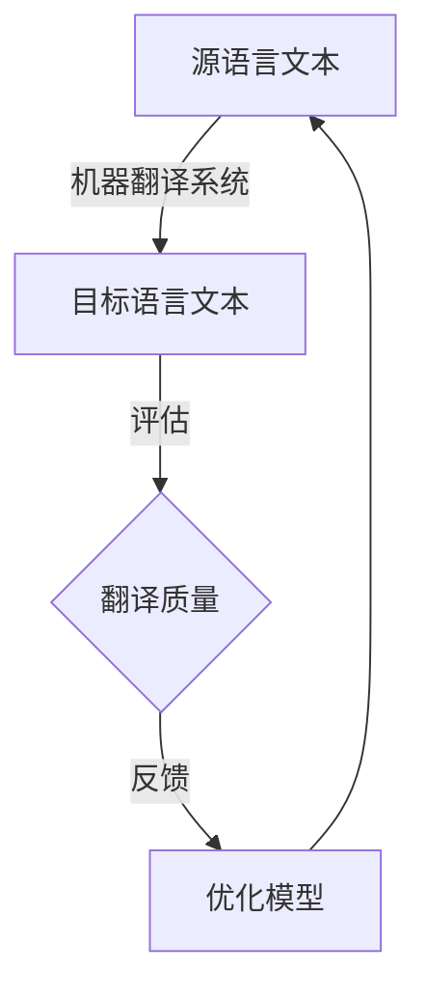
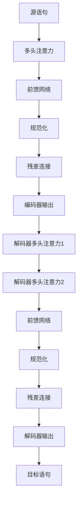

# 机器翻译的物流语言研究与优化

## 1.背景介绍

在全球化时代,物流行业已成为支撑世界经济运转的重要命脉。有效的物流管理对于企业的成本控制和客户服务质量至关重要。然而,由于物流操作涉及多个环节和多种语言,语言障碍成为了物流效率的一大瓶颈。机器翻译技术在物流语言处理中的应用,为解决这一难题提供了新的思路。

### 1.1 物流语言的多样性挑战

物流活动通常跨越国界,涉及多种语言。供应商、承运商、货主等参与方使用不同的语言进行沟通和信息交换,如装箱单、提单、发票等物流文件。语言的多样性给高效的信息流转带来了巨大挑战。

### 1.2 传统翻译方式的局限性

传统的人工翻译方式成本高、效率低、质量参差不齐。即使采用语言服务外包,也难以完全满足物流行业对及时性和准确性的迫切需求。

### 1.3 机器翻译在物流领域的应用前景

机器翻译技术通过自动化的语言转换,可以高效、低成本地支持物流多语种文本处理,提高物流效率。近年来,机器翻译算法的突破性进展,为其在物流领域的应用奠定了基础。

## 2.核心概念与联系

### 2.1 机器翻译概述

机器翻译(Machine Translation,MT)是利用计算机对自然语言进行自动翻译的技术。它通过建模源语言和目标语言的语义和语法规则,将一种自然语言转换为另一种自然语言。



### 2.2 机器翻译在物流中的作用

机器翻译在物流领域可以应用于以下场景:

1. 物流文件翻译:快速准确地翻译装箱单、提单、发票等关键物流文件。
2. 跨语种沟通:支持物流参与方之间的多语种沟通和信息交换。
3. 物流网站/APP本地化:将物流平台的内容翻译成多种语言,方便全球用户使用。
4. 物流机器人多语种交互:实现与物流机器人的多语种语音/文本交互。

通过机器翻译,物流企业可以突破语言壁垒,提高运营效率,拓展全球业务。

## 3.核心算法原理具体操作步骤  

机器翻译系统的核心是翻译模型,其算法原理和具体操作步骤如下:

### 3.1 统计机器翻译

统计机器翻译(Statistical Machine Translation,SMT)是较早的一种翻译范式,它基于统计学习方法从大量的平行语料中建模翻译规则。

#### 3.1.1 算法原理

SMT系统将翻译问题建模为给定源语句 $f$,求条件概率最大的目标语句 $\hat{e}$:

$$\hat{e}=\underset{e}{\operatorname{argmax}}P(e|f)$$

根据贝叶斯公式,上式可分解为:

$$\hat{e}=\underset{e}{\operatorname{argmax}}P(e)\cdot P(f|e)$$

其中,$P(e)$为语言模型,描述目标语句的流畅程度;$P(f|e)$为翻译模型,描述源语句与目标语句的对应关系。

#### 3.1.2 具体步骤

1. **语料预处理**:对平行语料进行分词、词性标注等预处理。
2. **训练语言模型**:使用目标语言语料训练 n-gram 语言模型,估计 $P(e)$。
3. **训练翻译模型**:使用平行语料训练翻译模型,估计 $P(f|e)$。
4. **解码**:对给定的源语句,搜索目标语句 $\hat{e}$ 使上式概率最大。

### 3.2 神经机器翻译

神经机器翻译(Neural Machine Translation,NMT)是近年来兴起的一种全新的翻译范式,它基于神经网络对语言的端到端建模,取得了突破性的进展。

#### 3.2.1 算法原理

NMT系统将整个翻译过程建模为单个大型神经网络,输入为源语句,输出为目标语句。主要由编码器(Encoder)和解码器(Decoder)两部分组成。

<div align=center>

</div>

1. **编码器**:读取源语句,将其编码为语义上下文向量表示。
2. **解码器**:根据上下文向量生成目标语句的翻译。

编码器和解码器通常采用循环神经网络(RNN)或transformer等架构,通过端到端训练实现翻译。

#### 3.2.2 具体步骤

1. **数据预处理**:对平行语料进行分词、词典构建等预处理。
2. **模型训练**:使用预处理的平行语料,对NMT模型(编码器和解码器)进行端到端训练。
3. **模型推理**:对输入的源语句,使用训练好的NMT模型生成目标语言翻译。

### 3.3 机器翻译评估

机器翻译输出的质量评估对于模型优化至关重要。常用的评估指标包括:

- **BLEU**:通过统计机器翻译结果与参考翻译之间的 n-gram 重叠程度进行评估。
- **TER**:计算使机器翻译结果与参考翻译完全匹配所需的最小编辑距离。
- **人工评估**:由人工评估者根据流畅度和准确度等多个维度对翻译结果进行主观评分。

通过评估反馈,可以持续优化和迭代机器翻译系统,提高翻译质量。

## 4.数学模型和公式详细讲解举例说明

在机器翻译系统中,数学模型和公式扮演着重要角色,我们将详细讲解其中的关键模型。

### 4.1 n-gram语言模型

n-gram语言模型是统计机器翻译中常用的语言模型,用于估计目标语句的概率分布$P(e)$。它的核心思想是利用n-1个历史词来预测当前词的概率:

$$P(e)=\prod_{i=1}^{m}P(e_i|e_{i-n+1}^{i-1})$$

其中,$e=e_1e_2...e_m$为目标语句,$e_{i-n+1}^{i-1}$为$e_i$的历史 n-1 个词。

例如,对于句子"我爱编程",在trigram(3-gram)模型下:

$$\begin{aligned}
P(e)&=P(我|<s>)<s>P(爱|<s>我)\\
&\quad\cdot P(编|我爱)P(程|爱编)P(</s>|编程)
\end{aligned}$$

其中,$<s>$和$</s>$分别为句子的起始和终止符号。

n-gram模型通过计数平滑等技术从大规模语料中估计概率,是早期统计机器翻译的核心组件。

### 4.2 注意力机制

注意力机制(Attention Mechanism)是神经机器翻译中的关键技术,它赋予模型对输入序列中不同位置的元素赋予不同的注意力权重,从而更好地建模长距离依赖关系。

在 Seq2Seq 模型的解码器中,注意力机制被用于计算上下文向量 $c_t$:

$$c_t=\sum_{j=1}^{T_x}\alpha_{tj}h_j$$

其中,$h_j$为编码器在位置$j$的隐层状态,$\alpha_{tj}$为注意力权重,表示解码时刻$t$对编码器 $j$ 位置的关注程度。

注意力权重通过注意力评分函数计算得到:

$$\alpha_{tj}=\frac{\exp(e_{tj})}{\sum_{k=1}^{T_x}\exp(e_{tk})},\quad e_{tj}=a(s_{t-1},h_j)$$

其中,$a$为注意力评分函数,可以是加性形式、点积形式等。

通过注意力机制,解码器可以灵活地关注输入序列中与当前译文相关的部分,极大提高了翻译质量。

### 4.3 Transformer

Transformer是目前神经机器翻译领域的主流模型,它完全基于注意力机制,摒弃了RNN结构,显著提升了并行计算能力。

<div align=center>

</div>

Transformer的encoder-decoder架构中,编码器由多个相同的层组成,每一层是多头自注意力机制和前馈网络的组合;解码器也由多个相同层组成,在自注意力的基础上,增加了对编码器输出的注意力子层。

Transformer通过自注意力机制直接对输入序列中任意两个位置之间的依赖关系建模,极大提高了并行能力,成为了当前神经机器翻译的主流模型。

## 5.项目实践:代码实例和详细解释说明

为了帮助读者更好地理解机器翻译系统的实现细节,我们将提供一个基于Python和TensorFlow的神经机器翻译项目实践。

### 5.1 数据预处理

```python
import re
import unicodedata
from utils import preprocess_sentence, load_data

# 加载语料
en_sentences, cn_sentences = load_data('data/en-cn.pkl')

# 数据预处理
en_sentences_pre = [preprocess_sentence(sentence) for sentence in en_sentences]
cn_sentences_pre = [preprocess_sentence(sentence) for sentence in cn_sentences]

# 构建词典
en_word2idx, en_idx2word = build_vocab(en_sentences_pre)
cn_word2idx, cn_idx2word = build_vocab(cn_sentences_pre)
```

上述代码加载平行语料,并进行数据预处理和词典构建。`preprocess_sentence`函数用于对句子进行分词、去除非法字符和大小写转换等预处理。`build_vocab`函数构建单词到索引的映射词典。

### 5.2 模型定义

```python
from model import Encoder, Decoder, Transformer

# 超参数设置
vocab_size_en = len(en_word2idx)
vocab_size_cn = len(cn_word2idx)
num_layers = 4
num_heads = 8
...

# 定义模型
encoder = Encoder(vocab_size_en, embed_size, num_layers, num_heads, ffn_size)
decoder = Decoder(vocab_size_cn, embed_size, num_layers, num_heads, ffn_size)
transformer = Transformer(encoder, decoder, pad_idx)
```

上述代码定义了Transformer模型的编码器、解码器和完整的Transformer模型。`Encoder`和`Decoder`类分别实现了编码器和解码器的具体架构,包括词嵌入层、多头注意力层、前馈网络层等。`Transformer`类将编码器和解码器组合,实现了完整的机器翻译模型。

### 5.3 模型训练

```python
from utils import batch_iter

# 模型训练
for epoch in range(num_epochs):
    batches = batch_iter(en_sentences_pre, cn_sentences_pre, batch_size)
    for batch in batches:
        en_inputs, cn_inputs, cn_outputs = batch
        
        # 前向传播
        enc_outputs = encoder(en_inputs)
        dec_outputs = decoder(cn_inputs, enc_outputs)
        
        # 计算损失
        loss = transformer.calculate_loss(dec_outputs, cn_outputs)
        
        # 反向传播
        loss.backward()
        optimizer.step()
        
    # 评估模型
    bleu_score = evaluate_bleu(transformer, test_en, test_cn)
    print(f'Epoch {epoch+1}, BLEU score: {bleu_score}')
```

上述代码实现了Transformer模型的训练过程。在每个epoch中,通过`batch_iter`函数对数据进行小批量采样,并进行前向传播、损失计算和反向传播,优化模型参数。在每个epoch结束时,使用BLEU指标在测试集