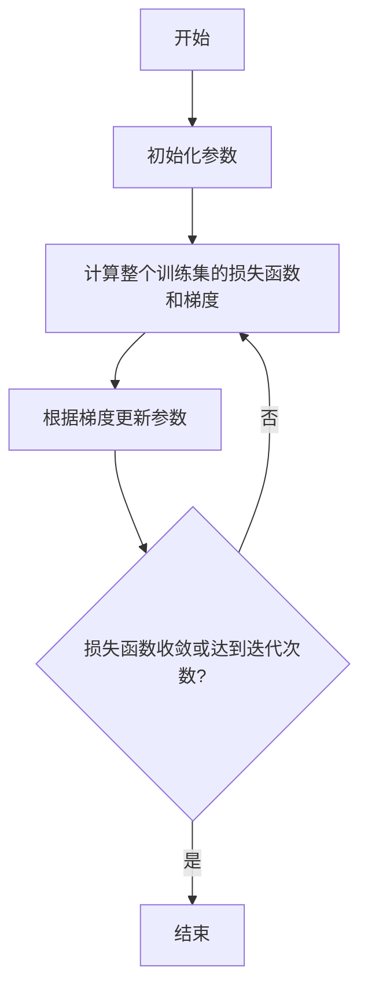
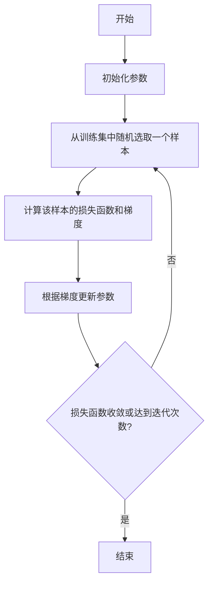
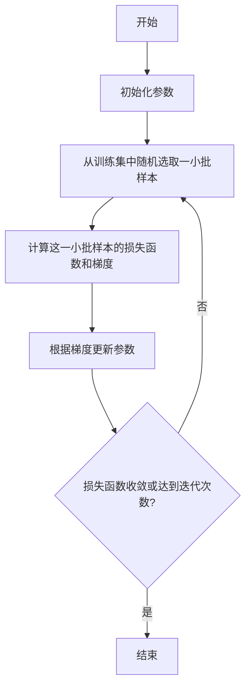

# 梯度下降(Gradient Descent) - 原理与代码实例讲解

## 1.背景介绍

### 1.1 什么是梯度下降

梯度下降(Gradient Descent)是一种用于求解机器学习和深度学习中优化问题的常用算法。在训练模型时,我们需要找到一组最优参数值,使得模型在训练数据上的损失函数(Loss Function)最小。梯度下降通过不断迭代,沿着损失函数梯度的反方向更新参数值,逐渐逼近损失函数的最小值。

### 1.2 梯度下降在机器学习中的重要性

梯度下降是机器学习和深度学习算法中最常用的优化算法之一。它广泛应用于线性回归、逻辑回归、神经网络等模型的训练过程中。梯度下降的快速收敛性和简单易懂的原理使其成为优化算法的首选。

## 2.核心概念与联系

### 2.1 损失函数(Loss Function)

在机器学习中,我们通常使用损失函数来衡量模型的预测值与真实值之间的差距。损失函数值越小,表示模型的预测效果越好。常见的损失函数包括均方误差(Mean Squared Error)、交叉熵损失(Cross-Entropy Loss)等。

### 2.2 梯度(Gradient)

梯度是一个向量,表示损失函数在当前参数值处的变化率。梯度的方向指向损失函数增长最快的方向,而梯度的大小表示损失函数在该方向上的变化率。

### 2.3 学习率(Learning Rate)

学习率决定了梯度下降每次迭代时参数更新的步长。合适的学习率可以加快算法收敛,但过大或过小的学习率都会影响算法的收敛性能。

## 3.核心算法原理具体操作步骤

梯度下降算法的核心思想是沿着损失函数梯度的反方向更新参数值,使得损失函数值不断减小,直到达到最小值。具体操作步骤如下:

1. 初始化模型参数,通常使用小的随机值。
2. 计算当前参数值下的损失函数值和梯度。
3. 根据梯度的反方向,更新参数值:

$$\theta_{new} = \theta_{old} - \eta \cdot \nabla_\theta J(\theta)$$

其中,$\theta$表示模型参数,$\eta$表示学习率,$J(\theta)$表示损失函数。

4. 重复步骤2和3,直到损失函数值收敛或达到预设的迭代次数。

### 3.1 批量梯度下降(Batch Gradient Descent)

批量梯度下降在每次迭代时使用整个训练数据集来计算梯度和更新参数。它的优点是每次迭代能够获得准确的梯度方向,但计算量大,对于大型数据集效率较低。



### 3.2 随机梯度下降(Stochastic Gradient Descent)

随机梯度下降在每次迭代时只使用一个训练样本来计算梯度和更新参数。它的优点是计算量小,适合大型数据集,但由于梯度估计存在噪声,收敛路径波动较大。



### 3.3 小批量梯度下降(Mini-Batch Gradient Descent)

小批量梯度下降是一种折中方案,在每次迭代时使用一小批训练样本来计算梯度和更新参数。它兼顾了批量梯度下降的稳定性和随机梯度下降的高效性,是最常用的梯度下降变体。



## 4.数学模型和公式详细讲解举例说明

### 4.1 梯度下降数学模型

假设我们有一个机器学习模型$f(x;\theta)$,其中$x$是输入数据,$\theta$是模型参数。我们的目标是找到最优参数$\theta^*$,使得在训练数据集$D=\{(x_1,y_1),(x_2,y_2),...,(x_n,y_n)\}$上的损失函数$J(\theta)$最小:

$$\theta^* = \arg\min_\theta J(\theta)$$

其中,损失函数$J(\theta)$可以是均方误差、交叉熵损失等。

梯度下降算法通过不断迭代,沿着损失函数梯度的反方向更新参数值:

$$\theta_{t+1} = \theta_t - \eta \cdot \nabla_\theta J(\theta_t)$$

其中,$\eta$是学习率,控制每次迭代的步长,$\nabla_\theta J(\theta_t)$是损失函数关于参数$\theta$的梯度。

### 4.2 梯度计算

对于不同的模型和损失函数,梯度的计算方式也不同。以线性回归为例,假设我们有一个简单的线性模型$f(x;\theta) = \theta_0 + \theta_1x$,损失函数为均方误差:

$$J(\theta) = \frac{1}{2n}\sum_{i=1}^n(y_i - f(x_i;\theta))^2$$

则损失函数关于$\theta_0$和$\theta_1$的梯度为:

$$\begin{aligned}
\frac{\partial J}{\partial \theta_0} &= \frac{1}{n}\sum_{i=1}^n(f(x_i;\theta) - y_i) \\
\frac{\partial J}{\partial \theta_1} &= \frac{1}{n}\sum_{i=1}^n(f(x_i;\theta) - y_i)x_i
\end{aligned}$$

对于更复杂的模型,如深度神经网络,梯度的计算通常使用反向传播算法(Backpropagation)来实现。

### 4.3 学习率选择

学习率的选择对梯度下降算法的收敛性能有很大影响。过大的学习率可能导致算法发散,而过小的学习率则会使算法收敛缓慢。常见的学习率选择策略包括:

- 固定学习率:在整个训练过程中保持不变。
- 动态学习率:根据迭代次数或损失函数值动态调整学习率。
- 自适应学习率:根据参数的更新情况自适应调整每个参数的学习率。

## 5.项目实践:代码实例和详细解释说明

以下是一个使用Python实现线性回归的梯度下降算法的示例:

```python
import numpy as np

# 生成模拟数据
X = np.array([1, 2, 3, 4, 5])
y = 2 * X + 1 + np.random.randn(5)  # y = 2x + 1 + 噪声

# 初始化参数
theta0 = 0
theta1 = 0
alpha = 0.01  # 学习率
epochs = 1000  # 迭代次数

# 梯度下降
for epoch in range(epochs):
    y_pred = theta0 + theta1 * X  # 预测值
    error = y_pred - y  # 残差
    
    # 计算梯度
    grad0 = np.mean(error)
    grad1 = np.mean(error * X)
    
    # 更新参数
    theta0 -= alpha * grad0
    theta1 -= alpha * grad1

print(f"theta0: {theta0}, theta1: {theta1}")
```

上述代码实现了批量梯度下降算法,用于训练一个简单的线性回归模型。具体解释如下:

1. 首先生成了一个模拟的线性数据集,其中`y = 2x + 1 + 噪声`。
2. 初始化模型参数`theta0`和`theta1`,以及学习率`alpha`和迭代次数`epochs`。
3. 在每次迭代中,首先计算当前参数下的预测值`y_pred`和残差`error`。
4. 根据残差计算损失函数关于`theta0`和`theta1`的梯度`grad0`和`grad1`。
5. 根据梯度的反方向,更新参数`theta0`和`theta1`。
6. 重复步骤3-5,直到达到预设的迭代次数。
7. 最后输出训练后的参数值。

该示例使用了批量梯度下降,在每次迭代时使用整个训练数据集计算梯度。对于大型数据集,可以使用小批量梯度下降来提高计算效率。

## 6.实际应用场景

梯度下降算法在机器学习和深度学习中有广泛的应用,包括但不限于以下场景:

1. **线性回归和逻辑回归**: 梯度下降是训练线性回归和逻辑回归模型的常用优化算法。
2. **神经网络训练**: 深度神经网络的训练过程中,通常使用梯度下降算法来优化网络参数。
3. **推荐系统**: 协同过滤算法中的矩阵分解问题可以使用梯度下降进行优化。
4. **自然语言处理**: 在文本分类、情感分析等任务中,梯度下降常用于训练模型。
5. **计算机视觉**: 图像分类、目标检测等任务中,梯度下降用于优化卷积神经网络的参数。

## 7.工具和资源推荐

以下是一些与梯度下降算法相关的工具和资源:

1. **Python库**:
   - NumPy: 提供了基础的数值计算功能。
   - scikit-learn: 包含了梯度下降算法的实现,适用于各种机器学习任务。
   - TensorFlow/PyTorch: 深度学习框架,内置了自动微分和梯度下降优化器。

2. **在线课程**:
   - 吴恩达的"机器学习"课程(Coursera)
   - Andrew Ng的"深度学习专项课程"(Coursera)
   - 斯坦福大学的"机器学习"课程(Coursera)

3. **书籍**:
   - "模式识别与机器学习"(Christopher M. Bishop)
   - "深度学习"(Ian Goodfellow, Yoshua Bengio, Aaron Courville)
   - "Python机器学习基础教程"(Sebastian Raschka, Vahid Mirjalili)

4. **博客和论坛**:
   - 机器学习掘金社区
   - 机器学习开源社区
   - Kaggle竞赛和讨论区

## 8.总结:未来发展趋势与挑战

梯度下降算法虽然简单高效,但也存在一些局限性和挑战:

1. **局部最优陷阱**: 梯度下降容易陷入局部最优解,无法找到全局最优解。
2. **高维空间困难**: 在高维空间中,梯度下降的收敛性能会下降。
3. **参数初始化敏感**: 不同的参数初始化可能导致收敛到不同的局部最优解。
4. **鞍点问题**: 在鞍点处,梯度接近于零,导致算法难以继续前进。

为了克服这些挑战,研究人员提出了一些改进的优化算法,如动量梯度下降、RMSProp、Adam等。这些算法通过引入动量项或自适应学习率,提高了收敛速度和鲁棒性。

另一个发展趋势是将梯度下降与其他优化技术相结合,如模拟退火、粒子群优化等,形成混合优化算法。这些算法可以在全局和局部搜索之间寻求平衡,提高优化效果。

总的来说,梯度下降算法仍将是机器学习和深度学习中不可或缺的优化工具。未来的研究重点将集中在提高算法的收敛速度、鲁棒性和可扩展性,以及将其与其他优化技术相结合,以解决更加复杂的优化问题。

## 9.附录:常见问题与解答

1. **梯度下降为什么能够找到损失函数的最小