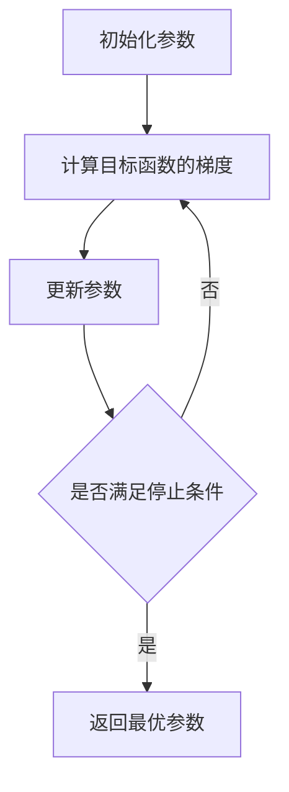

# 梯度下降在图像处理中的应用

## 1. 背景介绍

### 1.1 图像处理概述

图像处理是计算机视觉和人工智能领域的重要分支,旨在通过计算机算法对图像进行分析、处理和理解。它广泛应用于医学成像、遥感图像分析、人脸识别、自动驾驶等领域。图像处理涉及图像的采集、预处理、分割、特征提取、分类等多个步骤。

### 1.2 优化算法在图像处理中的重要性

在图像处理的各个环节中,都需要用到优化算法来寻找最优解。比如在图像去噪、图像分割、图像配准等任务中,都可以将问题建模为一个优化问题,通过最小化某个损失函数来求解。梯度下降作为最经典、应用最广泛的优化算法之一,在图像处理中扮演着极其重要的角色。

### 1.3 梯度下降算法简介

梯度下降(Gradient Descent)是一种一阶最优化算法,通过迭代的方式寻找目标函数的局部最小值。它的基本思想是:每次迭代时,朝着目标函数梯度的反方向更新参数,以此来降低目标函数的值,直到达到局部最优解。

梯度下降有多种变体形式,如批量梯度下降(BGD)、随机梯度下降(SGD)、小批量梯度下降(MBGD)等。在处理大规模数据集和复杂模型时,SGD和MBGD往往比BGD更加高效。

## 2. 核心概念与联系

### 2.1 目标函数

在图像处理任务中,我们通常会定义一个目标函数(Objective Function)来衡量图像处理的效果。目标函数一般由两部分组成:数据误差项和正则化项。数据误差项衡量了处理后的图像与真实图像之间的差异,正则化项则是为了防止过拟合而加入的先验知识。

常见的数据误差项有均方误差(MSE)、平均绝对误差(MAE)、交叉熵误差(Cross Entropy)等。常见的正则化项有L1范数、L2范数等。

### 2.2 梯度

梯度(Gradient)是多元函数中每个自变量方向上的斜率。对于目标函数$J(θ)$,其梯度$\nabla J(θ)$是一个向量,第i个元素表示$J(θ)$在$θ_i$处的偏导数:

$$\nabla J(θ) = \begin{bmatrix} 
\frac{∂J(θ)}{∂θ_1}\\
\frac{∂J(θ)}{∂θ_2}\\
\vdots \\
\frac{∂J(θ)}{∂θ_n}
\end{bmatrix}$$

梯度的方向指出了目标函数上升最快的方向,梯度的模长反映了目标函数在该方向上的变化率。

### 2.3 学习率

学习率(Learning Rate)是梯度下降算法中的一个重要超参数,用$η$表示。它决定了每次迭代更新参数的步长。学习率太小会导致收敛速度慢,学习率太大又可能会导致算法发散而不能收敛。

### 2.4 梯度下降的参数更新公式

假设我们的目标是最小化目标函数$J(θ)$,梯度下降的参数更新公式为:

$$θ^{(t+1)} = θ^{(t)} - η\nabla J(θ^{(t)})$$

其中$θ^{(t)}$表示第t次迭代的参数值,$η$为学习率。这个公式表明,每次迭代都在当前参数的基础上,朝着梯度的反方向更新参数,以降低目标函数的值。

## 3. 核心算法原理具体操作步骤

梯度下降算法可以分为以下几个步骤:

### 3.1 初始化参数

随机初始化待优化的参数$θ$。

### 3.2 计算目标函数的梯度

对目标函数$J(θ)$关于当前参数$θ^{(t)}$求梯度$\nabla J(θ^{(t)})$。

### 3.3 更新参数

根据参数更新公式,利用当前梯度更新参数:

$$θ^{(t+1)} = θ^{(t)} - η\nabla J(θ^{(t)})$$

### 3.4 重复迭代

重复步骤2-3,直到满足停止条件(如达到预设的迭代次数、目标函数值的变化小于某个阈值等)。

### 3.5 返回结果

输出优化后的参数$θ^*$。

梯度下降的整体流程可以用下面的Mermaid流程图表示:



## 4. 数学模型和公式详细讲解举例说明

下面以图像去噪任务为例,详细讲解梯度下降的数学模型和公式。

### 4.1 图像去噪问题建模

假设我们有一个噪声图像$y$,它是原始干净图像$x$和噪声$n$的叠加:

$$y = x + n$$

其中噪声$n$通常假设为均值为0的高斯白噪声。图像去噪的目标就是从噪声图像$y$中恢复出干净图像$x$。

### 4.2 构建目标函数

我们可以将图像去噪看作是一个优化问题,通过最小化如下的目标函数来求解:

$$J(x) = \frac{1}{2}||y - x||_2^2 + \lambda R(x)$$

其中第一项是数据误差项,用L2范数衡量了重建图像与噪声图像之间的差异;第二项是正则化项,用于引入先验知识,常用的有总变差(TV)正则化、稀疏正则化等;$λ$为平衡两项的权重参数。

### 4.3 求解梯度

为了使用梯度下降优化目标函数,我们需要求出目标函数的梯度。对于数据误差项,其梯度为:

$$\nabla \frac{1}{2}||y - x||_2^2 = x - y$$

对于正则化项,以TV正则化为例,其梯度为:

$$\nabla R(x) = -\nabla \cdot \left(\frac{\nabla x}{|\nabla x|}\right)$$

其中$\nabla$表示梯度算子,$\nabla \cdot$表示散度算子,$|\cdot|$表示模长。

### 4.4 迭代优化

根据梯度下降的参数更新公式,我们可以得到图像去噪问题的迭代优化公式:

$$x^{(t+1)} = x^{(t)} - η\left(x^{(t)} - y - λ\nabla \cdot \left(\frac{\nabla x^{(t)}}{|\nabla x^{(t)}|}\right)\right)$$

通过不断迭代更新$x$,直到满足停止条件,就可以得到去噪后的图像。

## 5. 项目实践：代码实例和详细解释说明

下面是一个用PyTorch实现图像去噪的简单示例代码:

```python
import torch
import torch.nn as nn
import torchvision.transforms as transforms
from PIL import Image

# 定义去噪模型
class Denoiser(nn.Module):
    def __init__(self):
        super(Denoiser, self).__init__()
        self.conv1 = nn.Conv2d(3, 32, 3, padding=1)
        self.conv2 = nn.Conv2d(32, 3, 3, padding=1)
        self.relu = nn.ReLU(inplace=True)
        
    def forward(self, x):
        x = self.relu(self.conv1(x))
        x = self.conv2(x)
        return x

# 加载噪声图像
noisy_img = Image.open('noisy_image.jpg')
transform = transforms.Compose([
    transforms.ToTensor(),
])
noisy_tensor = transform(noisy_img).unsqueeze(0)

# 初始化模型和优化器
model = Denoiser()
criterion = nn.MSELoss()
optimizer = torch.optim.Adam(model.parameters(), lr=0.01)

# 迭代优化
num_epochs = 100
for epoch in range(num_epochs):
    optimizer.zero_grad()
    denoised_tensor = model(noisy_tensor)
    loss = criterion(denoised_tensor, noisy_tensor)
    loss.backward()
    optimizer.step()
    
    if (epoch+1) % 10 == 0:
        print(f'Epoch [{epoch+1}/{num_epochs}], Loss: {loss.item():.4f}')

# 保存去噪后的图像        
denoised_img = transforms.ToPILImage()(denoised_tensor.squeeze(0))
denoised_img.save('denoised_image.jpg')
```

这个示例代码主要分为以下几个部分:

1. 定义去噪模型:这里使用了一个简单的两层卷积网络作为去噪模型,激活函数为ReLU。

2. 加载噪声图像:使用PIL库读取噪声图像,并转换为PyTorch中的张量格式。

3. 初始化模型和优化器:实例化去噪模型和Adam优化器,学习率设为0.01。

4. 迭代优化:使用梯度下降算法优化模型,每次迭代先将梯度清零,然后前向传播计算重建图像,接着计算MSE损失函数,反向传播计算梯度,最后更新模型参数。每隔10个epoch打印一次损失函数值。

5. 保存去噪后的图像:将训练好的模型在噪声图像上进行推理,得到去噪后的图像,并保存到本地。

这个示例代码虽然简单,但体现了用PyTorch实现梯度下降优化的基本流程。在实际应用中,我们可以采用更加复杂的网络结构和损失函数,以获得更好的去噪效果。

## 6. 实际应用场景

梯度下降在图像处理领域有着广泛的应用,下面列举几个常见的应用场景:

### 6.1 图像去噪

图像去噪是指从含有噪声的图像中恢复出干净的图像。基于梯度下降的去噪方法通过最小化重建图像与噪声图像之间的差异以及正则化项,可以有效去除高斯噪声、椒盐噪声等。

### 6.2 图像超分辨率

图像超分辨率是指从低分辨率图像恢复出高分辨率图像。基于梯度下降的超分辨率方法通过最小化重建图像与真实高分辨率图像之间的差异,可以恢复出细节清晰的高分辨率图像。

### 6.3 图像修复

图像修复是指对图像中的缺失区域进行填充,恢复出完整的图像。基于梯度下降的修复方法通过最小化修复区域与周围区域的差异,可以实现自然、无缝的修复效果。

### 6.4 图像分割

图像分割是指将图像划分为若干个语义区域。基于梯度下降的分割方法通过最小化分割结果与真实标签之间的差异,可以实现精准的语义分割。

### 6.5 图像配准

图像配准是指将两幅或多幅图像进行几何对齐。基于梯度下降的配准方法通过最小化配准后图像之间的差异,可以实现亚像素级的精准配准。

## 7. 工具和资源推荐

下面推荐一些用于图像处理的常用工具库和学习资源:

### 7.1 工具库

- OpenCV: 功能强大的开源计算机视觉库,支持C++、Python、Java等多种语言。
- scikit-image: 基于Python的图像处理库,提供了大量图像处理算法。
- PIL (Python Imaging Library): Python图像处理标准库,支持多种图像格式。
- MATLAB Image Processing Toolbox: MATLAB的图像处理工具箱,提供了丰富的图像处理函数。

### 7.2 学习资源

- 《Digital Image Processing》(第四版) by Gonzalez and Woods: 图像处理领域的经典教材。
- 《Computer Vision: Algorithms and Applications》by Szeliski: 计算机视觉算法与应用的综合性教材。
- CS231n: Convolutional Neural Networks for Visual Recognition: 斯坦福大学的计算机视觉课程,对卷积神经网络有深入讲解。
- PyTorch官方教程: PyTorch的官方教程,包括图像分类、语义分割、风格迁移等项目。

## 8. 总结：未来发展趋势与挑战

### 8.1 未来发展趋势

随着深度学习的兴