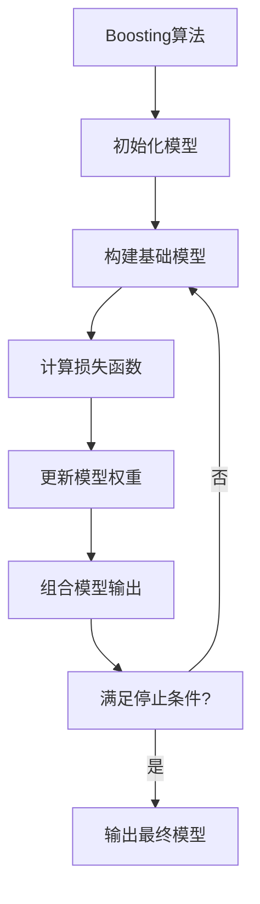
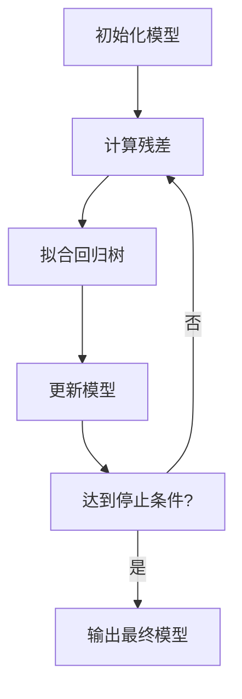

# 梯度提升决策树GBDT原理与代码实例讲解

## 1.背景介绍

### 1.1 机器学习发展历程

机器学习是人工智能领域的一个重要分支,旨在使计算机具备学习和改进自身性能的能力。随着大数据时代的到来,海量的数据为机器学习算法提供了广阔的应用空间。在过去几十年中,机器学习经历了从简单的线性模型到复杂的深度学习模型的飞跃发展。

### 1.2 集成学习的兴起

然而,单一的机器学习模型往往存在偏差或方差较大的问题,难以很好地拟合复杂的数据分布。为了提高模型的泛化能力,集成学习(Ensemble Learning)应运而生。集成学习的核心思想是将多个基础模型进行组合,从而获得比单一模型更强大的预测能力。

### 1.3 Boosting算法家族

Boosting算法是集成学习中的一个重要分支,它通过迭代地构建基础模型,并根据前一轮模型的预测结果来调整后续模型的权重,从而不断减小模型的偏差和方差。其中,梯度提升决策树(Gradient Boosting Decision Tree,GBDT)是Boosting算法家族中的杰出代表,它以决策树作为基础模型,通过梯度下降的方式优化损失函数,展现出了卓越的性能。

## 2.核心概念与联系

### 2.1 决策树

决策树是一种树形结构的监督学习模型,它通过递归地对特征空间进行分割,将样本数据划分到不同的叶节点,从而实现对目标变量的预测。决策树具有可解释性强、可视化直观等优点,但同时也容易出现过拟合的问题。

### 2.2 Boosting算法

Boosting算法的核心思想是通过迭代地构建一系列弱学习器(如决策树桩),并根据前一轮模型的预测结果来调整后续模型的权重,从而不断减小模型的偏差和方差。常见的Boosting算法包括AdaBoost、GBM(Gradient Boosting Machine)等。



### 2.3 梯度提升决策树

梯度提升决策树(GBDT)是一种基于决策树的Boosting算法,它将决策树作为基础模型,并通过梯度下降的方式优化损失函数。GBDT具有以下特点:

1. 使用决策树作为弱学习器,具有可解释性强、处理特征交互等优点。
2. 通过梯度下降优化损失函数,可以处理不同的任务类型(回归、分类等)。
3. 支持并行化训练,提高计算效率。
4. 具有防止过拟合的策略,如树的最大深度限制、叶节点样本数量限制等。

## 3.核心算法原理具体操作步骤

GBDT算法的核心思想是通过迭代地构建一系列决策树,每一棵树都是为了拟合上一轮模型的残差(即真实值与预测值之间的差值)。具体的操作步骤如下:

1. **初始化模型**

初始化一个常数模型 $F_0(x)$,通常取训练数据的标签均值或中位数。

2. **迭代构建决策树**

对于第 $m$ 轮迭代:

   a. 计算当前模型 $F_{m-1}(x)$ 对于每个训练样本的残差:

   $$r_{mi} = y_i - F_{m-1}(x_i)$$

   b. 拟合一棵回归树,使其残差平方和最小化:

   $$\min_T \sum_{i=1}^n (r_{mi} - T(x_i))^2$$

   c. 将拟合的回归树乘以一个学习率 $\eta$,作为本轮的决策树 $h_m(x)$:

   $$h_m(x) = \eta T(x)$$

   d. 更新当前模型:

   $$F_m(x) = F_{m-1}(x) + h_m(x)$$

3. **模型组合输出**

重复步骤2,直到达到最大迭代次数或满足其他停止条件。最终模型为:

$$F(x) = F_M(x) = \sum_{m=1}^M h_m(x)$$

其中,M为最大迭代次数,每一轮迭代的决策树 $h_m(x)$ 都是为了拟合上一轮模型的残差。



## 4.数学模型和公式详细讲解举例说明

### 4.1 损失函数

GBDT算法可以处理不同的任务类型,如回归、分类等,只需要选择合适的损失函数即可。常见的损失函数包括:

1. **均方误差(Mean Squared Error,MSE)**: 用于回归任务,公式如下:

$$\text{MSE} = \frac{1}{n} \sum_{i=1}^n (y_i - \hat{y}_i)^2$$

2. **对数似然损失(Logistic Loss)**: 用于二分类任务,公式如下:

$$\text{Logistic Loss} = -\frac{1}{n} \sum_{i=1}^n [y_i \log(\hat{y}_i) + (1-y_i) \log(1-\hat{y}_i)]$$

3. **多分类对数似然损失(Multinomial Logistic Loss)**: 用于多分类任务,公式如下:

$$\text{Multinomial Logistic Loss} = -\frac{1}{n} \sum_{i=1}^n \sum_{k=1}^K y_{ik} \log(\hat{y}_{ik})$$

其中,n为样本数量,$y_i$为真实标签,$\hat{y}_i$为预测值,K为类别数量。

### 4.2 梯度下降优化

GBDT算法通过梯度下降的方式优化损失函数,具体步骤如下:

1. 计算当前模型对于每个训练样本的残差(即损失函数对预测值的负梯度):

$$r_{mi} = -\left[\frac{\partial L(y_i, F_{m-1}(x_i))}{\partial F_{m-1}(x_i)}\right]$$

2. 拟合一棵回归树,使残差平方和最小化:

$$\min_T \sum_{i=1}^n (r_{mi} - T(x_i))^2$$

3. 将拟合的回归树乘以学习率 $\eta$,作为本轮的决策树 $h_m(x)$:

$$h_m(x) = \eta T(x)$$

4. 更新当前模型:

$$F_m(x) = F_{m-1}(x) + h_m(x)$$

通过不断迭代上述步骤,GBDT算法可以逐步减小损失函数的值,从而提高模型的预测精度。

### 4.3 数学公式举例说明

以二分类任务为例,假设我们使用对数似然损失函数,并且采用逻辑回归作为基础模型,则在第m轮迭代时,对于第i个样本的残差计算如下:

$$r_{mi} = -\left[\frac{\partial L(y_i, F_{m-1}(x_i))}{\partial F_{m-1}(x_i)}\right] = y_i - \frac{1}{1 + e^{-F_{m-1}(x_i)}}$$

接下来,我们需要拟合一棵回归树,使残差平方和最小化:

$$\min_T \sum_{i=1}^n \left(r_{mi} - T(x_i)\right)^2$$

假设拟合得到的回归树为 $T(x)$,则本轮的决策树为:

$$h_m(x) = \eta T(x)$$

最后,更新当前模型:

$$F_m(x) = F_{m-1}(x) + \eta T(x)$$

通过不断迭代上述过程,GBDT算法可以逐步优化对数似然损失函数,从而提高二分类任务的预测精度。

## 5.项目实践:代码实例和详细解释说明

为了更好地理解GBDT算法的实现,我们将使用Python中的scikit-learn库来构建一个简单的GBDT模型,并对其进行详细的解释说明。

### 5.1 导入所需库

```python
from sklearn.ensemble import GradientBoostingClassifier
from sklearn.datasets import make_blobs
from sklearn.model_selection import train_test_split
import matplotlib.pyplot as plt
import numpy as np
```

### 5.2 生成示例数据

```python
# 生成示例数据
X, y = make_blobs(n_samples=1000, centers=2, n_features=2, random_state=42)

# 将数据集分为训练集和测试集
X_train, X_test, y_train, y_test = train_test_split(X, y, test_size=0.2, random_state=42)
```

### 5.3 构建GBDT模型

```python
# 初始化GBDT模型
gbdt = GradientBoostingClassifier(
    n_estimators=100,  # 决策树的数量
    learning_rate=0.1, # 学习率
    max_depth=3,       # 决策树的最大深度
    random_state=42    # 随机种子
)

# 训练模型
gbdt.fit(X_train, y_train)

# 在测试集上评估模型
accuracy = gbdt.score(X_test, y_test)
print(f"Accuracy: {accuracy:.2f}")
```

在上述代码中,我们首先导入了所需的库,然后生成了一个简单的二分类数据集。接下来,我们初始化了一个GBDT模型,设置了相关的超参数,如决策树的数量、学习率和最大深度等。最后,我们在训练集上训练了模型,并在测试集上评估了模型的准确率。

### 5.4 可视化决策边界

为了更直观地理解GBDT模型的工作原理,我们可以绘制决策边界。

```python
# 绘制决策边界
def plot_decision_boundary(model, X, y):
    x_min, x_max = X[:, 0].min() - 0.5, X[:, 0].max() + 0.5
    y_min, y_max = X[:, 1].min() - 0.5, X[:, 1].max() + 0.5
    xx, yy = np.meshgrid(np.arange(x_min, x_max, 0.01), np.arange(y_min, y_max, 0.01))
    Z = model.predict(np.c_[xx.ravel(), yy.ravel()])
    Z = Z.reshape(xx.shape)
    plt.contourf(xx, yy, Z, alpha=0.4)
    plt.scatter(X[:, 0], X[:, 1], c=y, alpha=0.8)
    plt.show()

# 绘制决策边界
plot_decision_boundary(gbdt, X_test, y_test)
```

上述代码定义了一个 `plot_decision_boundary` 函数,用于绘制GBDT模型在测试集上的决策边界。在绘制过程中,我们首先生成了一个网格,然后使用 `model.predict` 方法对网格上的每个点进行预测,得到一个二维数组 `Z`。接下来,我们使用 `plt.contourf` 函数绘制决策边界,并使用 `plt.scatter` 函数绘制测试集的散点图。

通过可视化决策边界,我们可以直观地观察到GBDT模型是如何将数据集划分为不同的类别。

## 6.实际应用场景

GBDT算法由于其出色的性能和可解释性,在各个领域都有广泛的应用。以下是一些典型的应用场景:

1. **金融风险评估**: 在信用评分、欺诈检测等金融风险评估任务中,GBDT算法可以有效地利用客户的历史数据和行为特征,构建高精度的风险预测模型。

2. **推荐系统**: 在电子商务、社交网络等领域,GBDT算法可以根据用户的浏览历史、购买记录等特征,为用户推荐感兴趣的商品或内容。

3. **计算机视觉**: GBDT算法可以用于图像分类、目标检测等计算机视觉任务,通过提取图像的低级特征和高级特征,构建强大的视觉模型。

4. **自然语言处理**: 在文本分类、情感分析等自然语言处理任务中,GBDT算法可以利用文本的词袋模型、T