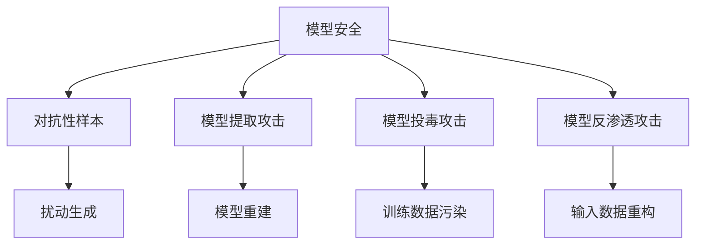

# 模型安全：人工智能与安全

## 1.背景介绍

随着人工智能(AI)技术的不断发展和广泛应用,确保AI系统的安全性和可靠性变得越来越重要。AI模型安全是一个新兴的研究领域,旨在保护AI模型免受各种攻击和操纵,确保其在部署和使用过程中的安全性和健壮性。

在过去几年中,AI模型已经被广泛应用于各个领域,如计算机视觉、自然语言处理、推荐系统等。然而,研究人员发现这些模型存在多种安全漏洞,可能会被恶意攻击者利用。攻击者可以通过对训练数据进行微小的perturbation(扰动)或直接对模型进行操纵,从而使模型产生错误的输出,这可能会导致严重的后果。

因此,确保AI模型的安全性对于保护隐私、防止欺诈、维护系统完整性等方面至关重要。模型安全研究旨在开发有效的防御机制,使AI模型能够抵御各种攻击,并在遭受攻击时保持健壮性。

## 2.核心概念与联系

### 2.1 对抗性样本(Adversarial Examples)

对抗性样本是指通过对输入数据进行人工构造的微小扰动,从而使AI模型产生错误预测的样本。这种扰动通常是人眼无法察觉的,但却能够欺骗模型。对抗性样本展示了AI模型存在的脆弱性,攻击者可能会利用这一点进行恶意攻击。

```math
\begin{aligned}
x' &= x + \delta \\
\text{s.t.} \quad f(x') &\neq f(x) \\
\|\delta\|_p &\leq \epsilon
\end{aligned}
```

其中:
- $x$是原始输入样本
- $x'$是对抗性样本
- $\delta$是添加的扰动
- $f(x)$是模型对$x$的预测输出
- $\|\delta\|_p \leq \epsilon$表示扰动的大小受到限制,以确保扰动是人眼无法察觉的

### 2.2 模型提取攻击(Model Extraction Attacks)

模型提取攻击是指通过查询黑盒模型并分析其输出,攻击者试图重建或窃取模型的知识。这种攻击可能会导致模型知识产权被盗用,或者被用于生成对抗性样本进行进一步攻击。

```math
\begin{aligned}
\min_{\theta'} \mathbb{E}_{x \sim \mathcal{D}} \big[L(f_\theta(x), f_{\theta'}(x))\big]
\end{aligned}
```

其中:
- $\theta$是被攻击模型的参数
- $\theta'$是攻击者试图学习的模型参数
- $\mathcal{D}$是输入数据的分布
- $L$是衡量两个模型输出之间差异的损失函数

### 2.3 模型投毒攻击(Model Poisoning Attacks)

模型投毒攻击是指在模型的训练过程中,攻击者故意向训练数据注入一些被污染的样本,从而影响模型的学习过程,使其在特定输入下产生错误的输出。这种攻击可能会导致模型在部署时存在安全隐患。

```math
\begin{aligned}
\min_{\theta} \mathbb{E}_{(x, y) \sim \mathcal{D}} \big[L(f_\theta(x), y)\big] + \lambda \cdot g(\theta)
\end{aligned}
```

其中:
- $(x, y)$是训练数据及其标签
- $\mathcal{D}$是训练数据的分布
- $L$是训练损失函数
- $g(\theta)$是攻击者添加的有针对性的损失项,用于引导模型学习错误的知识

### 2.4 模型反渗透攻击(Model Inversion Attacks)

模型反渗透攻击是指攻击者试图从模型的输出中重构出部分或全部的输入数据。这种攻击可能会导致隐私泄露,尤其是在处理敏感数据(如医疗数据、金融数据等)时。

```math
\begin{aligned}
\min_{\hat{x}} \mathbb{E}_{x \sim \mathcal{D}} \big[L(f_\theta(\hat{x}), f_\theta(x))\big]
\end{aligned}
```

其中:
- $x$是原始输入数据
- $\hat{x}$是攻击者试图重构的输入数据
- $f_\theta$是被攻击的模型
- $L$是衡量模型输出之间差异的损失函数

### 2.5 Mermaid流程图



## 3.核心算法原理具体操作步骤

### 3.1 对抗性样本生成算法

#### 3.1.1 快速梯度符号法(Fast Gradient Sign Method, FGSM)

FGSM是一种简单而有效的对抗性样本生成算法,它通过沿着损失函数梯度的方向对输入数据进行扰动,从而生成对抗性样本。具体步骤如下:

1. 计算输入样本$x$对损失函数$J(\theta, x, y)$的梯度:

$$
\nabla_x J(\theta, x, y)
$$

2. 计算扰动$\eta$:

$$
\eta = \epsilon \cdot \text{sign}(\nabla_x J(\theta, x, y))
$$

其中$\epsilon$是扰动的大小,通常取一个较小的值。

3. 生成对抗性样本$x'$:

$$
x' = x + \eta
$$

#### 3.1.2 投射梯度下降法(Projected Gradient Descent, PGD)

PGD是一种更强大的对抗性样本生成算法,它通过多次迭代,逐步调整扰动的大小和方向,从而生成更加强大的对抗性样本。具体步骤如下:

1. 初始化对抗性样本$x'_0 = x$。
2. 对于每一步迭代$i=1, 2, \ldots, n$:
    1. 计算梯度:
    
    $$
    g_i = \nabla_x J(\theta, x'_{i-1}, y)
    $$
    
    2. 更新对抗性样本:
    
    $$
    x'_i = \Pi_{x+\epsilon}(x'_{i-1} + \alpha \cdot \text{sign}(g_i))
    $$
    
    其中$\Pi_{x+\epsilon}$是一个投影操作,用于将$x'_i$限制在$x$的$\epsilon$邻域内。
    
3. 输出最终的对抗性样本$x' = x'_n$。

### 3.2 模型提取算法

#### 3.2.1 基于合成数据的模型提取

这种方法的基本思路是:首先生成一个合成数据集,然后使用这个数据集训练一个替代模型,最后通过比较替代模型和目标模型在合成数据上的输出,不断优化替代模型的参数,使其逼近目标模型。具体步骤如下:

1. 生成合成数据集$\mathcal{D}_\text{syn} = \{x_1, x_2, \ldots, x_n\}$。
2. 初始化替代模型$f_{\theta'}$的参数$\theta'$。
3. 对于每一个样本$x_i \in \mathcal{D}_\text{syn}$:
    1. 查询目标模型$f_\theta$获取输出$y_i = f_\theta(x_i)$。
    2. 计算替代模型的输出$y'_i = f_{\theta'}(x_i)$。
    3. 计算损失$\ell(y_i, y'_i)$。
4. 更新替代模型参数$\theta'$,使损失最小化:

$$
\theta' \leftarrow \theta' - \eta \cdot \nabla_{\theta'} \sum_{i=1}^n \ell(y_i, y'_i)
$$

5. 重复步骤3和4,直到收敛或达到最大迭代次数。

#### 3.2.2 基于知识蒸馏的模型提取

知识蒸馏是一种模型压缩和知识迁移的技术,它可以将一个大型模型(教师模型)的知识迁移到一个小型模型(学生模型)中。攻击者可以利用这种技术来提取目标模型的知识。具体步骤如下:

1. 初始化学生模型$f_{\theta'}$的参数$\theta'$。
2. 对于每一个输入样本$x$:
    1. 查询目标模型$f_\theta$获取输出$y = f_\theta(x)$。
    2. 计算学生模型的输出$y' = f_{\theta'}(x)$。
    3. 计算知识蒸馏损失$\ell_\text{KD}(y, y')$。
3. 更新学生模型参数$\theta'$,使知识蒸馏损失最小化:

$$
\theta' \leftarrow \theta' - \eta \cdot \nabla_{\theta'} \ell_\text{KD}(y, y')
$$

4. 重复步骤2和3,直到收敛或达到最大迭代次数。

### 3.3 模型投毒算法

#### 3.3.1 基于特征污染的模型投毒

这种方法的基本思路是:在训练数据中注入一些被污染的样本,这些样本被设计成在特定的特征上具有特殊的模式,从而引导模型学习到这种特殊的模式,在遇到具有相似特征的输入时产生错误的输出。具体步骤如下:

1. 选择一个特征$j$作为污染目标。
2. 生成一个污染触发器$\delta$,例如对于图像数据,可以选择一个特殊的小图案作为触发器。
3. 对于每一个训练样本$(x, y)$:
    1. 以概率$p$决定是否污染该样本。
    2. 如果决定污染,则生成被污染的样本$x' = x + \delta_j$,其中$\delta_j$是将$\delta$添加到$x$的第$j$个特征上。
    3. 用被污染的样本$(x', y_\text{target})$替换原始样本$(x, y)$,其中$y_\text{target}$是攻击者期望的错误标签。
4. 使用被污染的训练数据集训练模型。

#### 3.3.2 基于损失函数污染的模型投毒

这种方法的基本思路是:在模型的训练过程中,攻击者添加一个特殊的损失项,这个损失项被设计成能够引导模型学习到攻击者期望的错误知识。具体步骤如下:

1. 定义一个污染触发器$\delta$,例如对于图像数据,可以选择一个特殊的小图案作为触发器。
2. 定义一个污染损失函数$\ell_\text{poison}(\theta, x, y, y_\text{target})$,它衡量了当输入样本$x$被添加了触发器$\delta$时,模型输出与攻击者期望的错误标签$y_\text{target}$之间的差异。
3. 在模型的训练过程中,将污染损失函数作为正则项添加到总损失函数中:

$$
\mathcal{L}(\theta) = \mathbb{E}_{(x, y) \sim \mathcal{D}} \big[L(f_\theta(x), y)\big] + \lambda \cdot \mathbb{E}_{(x, y) \sim \mathcal{D}} \big[\ell_\text{poison}(\theta, x, y, y_\text{target})\big]
$$

其中$\lambda$是一个权重系数,用于平衡两个损失项的重要性。

4. 使用上述总损失函数训练模型,从而使模型学习到攻击者期望的错误知识。

### 3.4 模型反渗透算法

#### 3.4.1 基于编码器-解码器的模型反渗透

这种方法的基本思路是:训练一个编码器-解码器模型,使其能够从目标模型的输出中重构出原始输入数据。具体步骤如下:

1. 收集一个包含原始输入数据$x$和目标模型输出$y = f_\theta(x)$的数据集$\mathcal{D} = \{(x_1, y_1), (x_2, y_2), \ldots, (x_n, y_n)\}$。
2. 定义一个编码器模型$E$和一个解码器模型$D$。
3. 训练编码器-解码