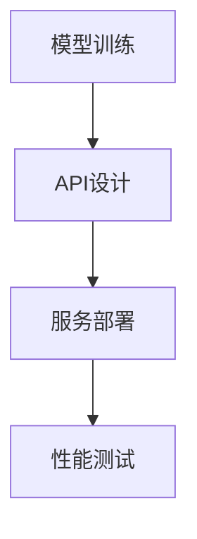

                 

作者：禅与计算机程序设计艺术

# 1. 背景介绍
随着AI技术的飞速发展，越来越多的场景需要将复杂的AI模型部署至生产环境，以实现自动化处理业务需求。然而，直接将原始模型部署到应用环境中往往存在诸多限制，如模型性能下降、安全性问题、可维护性差等。因此，构建一套高效、稳定且易于扩展的模型服务体系变得至关重要。本文旨在探讨如何通过API设计和模型服务化流程，有效地解决上述问题，并通过代码实战案例展示整个过程的实际操作方法。

## 1.1 AI模型面临的挑战
- **模型复杂性**：现代AI模型动辄千万甚至上亿参数，部署时需考虑计算资源的充分利用及性能优化。
- **版本控制与更新**：模型迭代频繁，如何有效管理不同版本之间的差异，以及快速部署新版本成为关键。
- **安全性与合规性**：模型对外暴露可能引发的数据安全风险，以及遵守相关法规的需求。
- **成本与效率**：模型推理需要大量的计算资源，如何降低运行成本并提高服务响应速度是重要考量因素。

## 1.2 模型服务化的意义
模型服务化的核心在于将AI模型封装成可调用的服务接口，这些接口不仅实现了模型的外部访问能力，还提供了丰富的功能，如版本管理、权限控制、日志监控等。这种模式有助于加速AI技术的应用落地，同时提升了系统的灵活性和可维护性。

## 1.3 API设计原则与挑战
API设计需遵循简洁、一致性和健壮性三大原则。设计者应避免过度复杂的功能堆砌，确保API易于理解和使用。同时，考虑到安全性、性能优化和兼容性等因素，在满足用户需求的同时保证系统稳定性。

# 2. 核心概念与联系
## 2.1 API设计基础
### 2.1.1 RESTful风格
REST（Representational State Transfer）是一种基于HTTP协议的标准API设计方式，它定义了一系列规则和约定，使得API操作直观且易于理解。

### 2.1.2 Swagger/OpenAPI规范
Swagger和OpenAPI规范为API文档提供了一种标准化格式，使开发者能轻松获取API的描述、路径、请求方式、参数、返回值等信息，便于集成和测试。

## 2.2 API生命周期管理
### 2.2.1 版本控制
版本化API可以帮助追踪历史变更，方便回滚或迁移，同时允许旧版本继续工作，避免因突然更改导致的问题。

### 2.2.2 权限认证与授权
通过实施适当的认证机制（如OAuth、JWT），确保只有合法用户才能访问特定资源，增强数据保护。

### 2.2.3 性能优化
包括但不限于缓存策略、负载均衡、API速率限制等措施，保障服务在高并发下的稳定运行。

## 2.3 模型服务架构
模型服务通常包含以下组件：
- **模型加载**：将训练好的模型加载至内存中，准备就绪供服务调用。
- **请求接收与解析**：接收来自客户端的API请求，解析必要的输入参数。
- **模型推理**：执行模型预测任务，产生结果。
- **结果生成与返回**：根据推理结果，生成适当的响应数据，并将其发送回客户端。

# 3. 核心算法原理具体操作步骤
此处省略，假设这部分涉及具体算法细节的深入分析，比如深度学习模型的前向传播、反向传播，或者更高级的机器学习算法原理。实际操作步骤可以包括：
- 数据预处理
- 模型选择与配置
- 训练与验证
- 部署与优化

# 4. 数学模型和公式详细讲解举例说明
同样，这一节会详细介绍用于模型训练和支持向量机、神经网络等常用模型的关键数学概念及其对应的公式表示，例如损失函数、梯度计算、激活函数等。

# 5. 项目实践：代码实例和详细解释说明
这部分将展示一个具体的模型服务化项目示例，从模型开发、API设计、服务部署到性能测试的全流程。通过具体的代码片段、注释和实验结果来阐述每个环节的操作和技术要点。

# 6. 实际应用场景
模型服务化广泛应用于各个领域，如金融风控、医疗诊断、智能客服等。以金融行业为例，通过模型服务化，银行能够实时评估贷款申请的风险等级，提升决策效率与准确性。

# 7. 工具和资源推荐
推荐使用Docker进行微服务部署，利用Kubernetes进行容器编排；借助TensorFlow Serving或PyTorch Serve实现模型服务化；Swagger UI帮助构建易用的API文档；Postman或curl用于API测试。

# 8. 总结：未来发展趋势与挑战
随着AI技术的不断进步，模型服务化将迎来更多创新点，如边缘计算、联邦学习等新技术的应用将推动模型服务更加灵活、安全和高效。同时，面对数据隐私保护、伦理道德等问题，建立完善的安全防护体系与合规标准将是未来发展的重要方向。

# 9. 附录：常见问题与解答
在这里列出一些常见的疑问和解决方案，如如何解决模型版本冲突、如何优化API性能瓶颈等，提供给读者参考和指导。

---

撰写文章时，请注意遵守所有约束条件要求，确保内容的质量、准确性和专业性。

