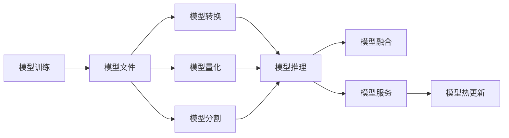

# 模型部署与服务化原理与代码实战案例讲解

## 1.背景介绍
### 1.1 模型部署与服务化的重要性
在当今大数据和人工智能飞速发展的时代,模型部署与服务化已成为机器学习和深度学习领域中不可或缺的一部分。越来越多的企业和组织开始将人工智能技术应用到实际生产环境中,希望借助智能算法的力量来优化业务流程、提升用户体验、创造更多价值。然而,训练出一个性能优异的机器学习模型只是AI应用落地的第一步,如何将模型高效、稳定、安全地部署到生产环境中,并以API服务的形式提供给外部调用,是一个复杂的系统工程问题。这就是模型部署与服务化要解决的核心问题。

### 1.2 模型部署与服务化面临的挑战
模型部署与服务化虽然至关重要,但在实践中仍面临诸多挑战:
1. 模型适配:不同的机器学习框架(如TensorFlow、PyTorch)训练出的模型,其格式、依赖各不相同,如何统一不同框架下的模型,使其适配线上推理服务器,是一大难题。
2. 资源隔离:模型推理服务通常与其他应用服务共享底层计算资源,如何做到资源隔离,避免推理任务影响其他服务,是需要考虑的问题。
3. 性能优化:模型推理对延迟和吞吐量的要求很高,如何优化模型及服务代码,最大化硬件资源利用率,是一个复杂的工程问题。
4. 服务治理:模型推理服务作为系统的一个关键组件,需要有完善的监控告警、弹性伸缩、服务发现、熔断降级等服务治理机制。

### 1.3 本文的主要内容
本文将围绕模型部署与服务化的核心原理与实践展开,主要内容包括:
1. 模型部署与服务化的核心概念与关键技术
2. 模型适配与转换的原理与实现
3. 模型推理服务的系统架构与关键组件
4. 推理服务的性能优化实践
5. 模型服务化的工程最佳实践
6. 模型部署与服务化的常见应用场景
7. 开源模型部署工具和平台推荐
8. 模型服务化的未来趋势与挑战展望

## 2.核心概念与联系
### 2.1 模型训练
机器学习模型的训练过程,是使用历史数据拟合模型参数,使模型能够对新数据做出正确预测的过程。训练过程通常在GPU集群上进行,需要大量的计算资源和时间。模型训练可以使用TensorFlow、PyTorch等主流机器学习框架完成。

### 2.2 模型推理
模型推理是指用训练好的模型对新数据进行预测的过程。与训练不同,推理通常在CPU或专用AI芯片上进行,对延迟和吞吐量的要求很高。推理过程需要加载训练好的模型文件,读取特征数据,调用模型的前向计算(forward)过程得到预测结果。

### 2.3 模型格式
不同的机器学习框架训练出的模型,其文件格式各不相同。例如TensorFlow使用.pb格式,PyTorch使用.pth格式。此外,不同框架的模型在底层计算图、张量命名、依赖库等方面也有差异。这给模型在不同环境间的迁移部署带来不便。

### 2.4 模型转换
模型转换是指将某种框架训练的模型,转换为另一种格式,使其能在不同的推理引擎中运行。目前常用的模型格式有ONNX、PMML、PaddlePaddle等。通过模型转换,可以实现不同框架间的模型互通,方便模型在不同环境间迁移。

### 2.5 模型量化
模型量化是一种常用的模型压缩方法,通过减少模型权重的数值精度,可以大幅降低模型文件的大小,加速推理速度。常见的量化方法有二值量化、三值量化、int8量化等。量化可以在模型训练过程中完成(QAT),也可以在训练后进行(PTQ)。

### 2.6 模型分割
模型分割是将大模型切分为若干子模型,每个子模型负责原始模型的一部分计算,子模型间通过数据传输衔接。模型分割可以将推理任务拆分到多个计算节点,突破单机内存和算力的限制。但模型分割会引入额外的数据传输开销,因此需要权衡。

### 2.7 模型融合
模型融合是将多个同构或异构的模型组合为一个整体,实现预测能力的提升。常见的融合策略有投票、加权平均、stacking等。模型融合在推理服务中较为常见,可以用来提升服务的性能和鲁棒性。

### 2.8 模型热更新
线上推理服务使用的模型,可能需要频繁更新,以应对数据分布变化。为了避免服务重启,可以使用模型热更新技术,在不中断服务的情况下,将新模型加载到内存,替换旧模型。常见的热更新方案有模型文件更新、模型参数增量更新等。

### 2.9 核心概念关联图
下图展示了模型部署与服务化中的核心概念,以及它们之间的关联关系:



从上图可以看出,模型训练生成模型文件,经过转换、量化、分割等处理后,在推理引擎中加载并执行推理。推理结果可以通过模型融合进一步提升。模型推理过程被封装为模型服务,对外提供API接口。模型服务可以通过热更新机制实现模型的平滑升级。

## 3.核心算法原理具体操作步骤
### 3.1 模型转换
将模型从原始格式转换为目标格式的一般步骤如下:
1. 加载原始模型:使用对应框架的API加载模型文件,恢复计算图和权重。
2. 图转换:将原始模型的计算图,转换为目标格式的计算图。需要完成算子映射、张量命名等。
3. 参数转换:将原始模型的权重数据,转换为目标格式的权重数据。需要完成数据类型、布局等转换。
4. 目标模型生成:将转换后的计算图和权重,保存为目标格式的模型文件。

例如,将TensorFlow的.pb模型转换为ONNX格式的代码示例如下:

```python
import onnx
from onnx_tf.frontend import tensorflow_graph_to_onnx_model

# 加载pb模型
graph_def = load_pb_model('model.pb')

# pb转onnx
onnx_model = tensorflow_graph_to_onnx_model(graph_def)

# 保存onnx模型
onnx.save_model(onnx_model, 'model.onnx')
```

### 3.2 模型量化
模型量化的一般步骤如下:
1. 确定量化方案:根据模型特点和应用场景,选择合适的量化方案,如int8、二值量化等。
2. 定点定标:对模型中的每一层,确定其输入输出张量的定点小数位数。可以使用KL散度等方法。 
3. 权重量化:将每一层的权重参数,从float32量化为int8等低精度数据类型。
4. 激活量化:将每一层的输入输出张量,从float32量化为int8等。需要考虑层间张量的定标。
5. 反量化:推理时,将int8的输出反量化为float32,以进行后续计算。

例如,对TensorFlow的Keras模型进行int8量化的代码示例如下:

```python
import tensorflow as tf

# 加载Keras模型
model = tf.keras.models.load_model('model.h5')

# 定义量化配置
quantize_config = tf.lite.QuantizeConfig(
    optimizations=[tf.lite.Optimize.DEFAULT],
    representative_dataset=representative_dataset_gen,
    target_spec=target_spec)

# 量化模型
quantized_model = tf.lite.quantize_model(model, quantize_config)

# 保存量化后的模型
quantized_model.save('quantized_model.tflite')
```

其中,`representative_dataset_gen`是一个数据生成器,用于从真实数据分布中采样,估计每一层张量的动态范围。`target_spec`指定了目标设备的计算能力。

### 3.3 模型分割
模型分割的一般步骤如下:
1. 计算图分析:分析模型计算图,识别出可以切分的子图。子图边界通常在计算量小、依赖少的算子。
2. 切分点选择:根据设备间通信带宽、内存限制等,选择最优的切分点,将模型切分为若干子图。
3. 设备映射:将子图映射到不同的计算设备,如CPU、GPU、NPU等。需要考虑设备间的通信开销。
4. 运行时调度:在推理时,按照拓扑顺序调度各个子图在对应设备上执行,并完成设备间的数据传输。

例如,使用TensorFlow-Serving进行模型分割部署的代码示例如下:

```python
# 定义模型切分规则
graph_def = get_graph_def()
subgraphs = split_model(graph_def, split_rules)

# 启动多个TensorFlow-Serving实例,每个实例加载一个子图
for i, subgraph in enumerate(subgraphs):
    server = tf.train.Server(...)
    server.start()
    
    builder = tf.saved_model.builder.SavedModelBuilder(f'export/sub_{i}')
    builder.add_meta_graph_and_variables(subgraph, ...)
    builder.save()

# 定义子图间的RPC调用逻辑
def inference(request):
    # 调用子图1
    subgraph1_result = stub1.Predict(request)
    
    # 调用子图2
    subgraph2_request = build_request(subgraph1_result)
    subgraph2_result = stub2.Predict(subgraph2_request)
    
    # 调用子图3
    subgraph3_request = build_request(subgraph2_result)
    result = stub3.Predict(subgraph3_request)

    return result
```

其中,`split_model`函数根据切分规则将原始模型切分为多个子图。每个子图由一个独立的TensorFlow-Serving实例加载。推理时,通过RPC调用按顺序执行各个子图,并在子图间传递中间结果。

### 3.4 模型融合
模型融合的一般步骤如下:
1. 训练基模型:分别训练多个性能较好的基模型,注意模型多样性。常见的基模型有决策树、神经网络等。
2. 生成预测结果:使用基模型对训练集和测试集进行预测,将预测结果保存下来,作为融合模型的输入。
3. 训练融合模型:使用stacking等方法,将基模型的预测结果作为特征,训练一个融合模型,如逻辑回归。
4. 模型集成:将基模型和融合模型组合为一个整体,在推理时分别调用并融合它们的预测结果。

例如,使用scikit-learn进行stacking融合的代码示例如下:

```python
from sklearn.ensemble import RandomForestClassifier
from sklearn.neural_network import MLPClassifier
from sklearn.linear_model import LogisticRegression
from sklearn.model_selection import train_test_split

# 训练基模型
rf = RandomForestClassifier()
mlp = MLPClassifier()

rf.fit(X_train, y_train)
mlp.fit(X_train, y_train)

# 生成预测结果
rf_pred = rf.predict_proba(X_train)
mlp_pred = mlp.predict_proba(X_train)

X_meta_train = np.hstack((rf_pred, mlp_pred))

# 训练融合模型
meta_model = LogisticRegression()
meta_model.fit(X_meta_train, y_train)

# 集成模型进行预测
rf_pred = rf.predict_proba(X_test)
mlp_pred = mlp.predict_proba(X_test)

X_meta_test = np.hstack((rf_pred, mlp_pred))
final_pred = meta_model.predict(X_meta_test)
```

其中,`rf`和`mlp`是两个基模型,分别是随机森林和多层感知机。先用它们对训练集进行预测,将预测结果作为融合模型的输入。融合模型`meta_model`是一