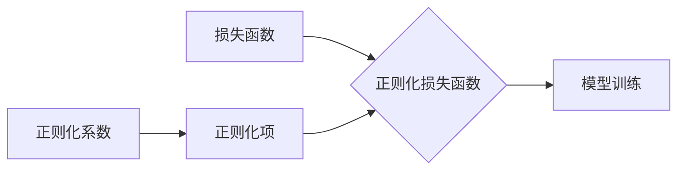

# 正则化 (Regularization)

## 1.背景介绍
### 1.1 机器学习中的过拟合问题
在机器学习中,我们经常会遇到一个问题,叫做过拟合(Overfitting)。过拟合是指模型在训练数据上表现得非常好,但在新的、未见过的数据上表现较差的现象。这通常是由于模型过于复杂,学习了训练数据中的噪声和特异性,而没有很好地捕捉数据的一般特征。
### 1.2 正则化的提出
为了解决过拟合问题,人们提出了正则化(Regularization)的概念。正则化是一种常用的降低模型复杂度、防止过拟合的方法。它通过在损失函数中加入一个正则化项,来限制模型的参数大小,从而使模型更加简单,泛化能力更强。
## 2.核心概念与联系
### 2.1 损失函数
在机器学习中,损失函数(Loss Function)用来衡量模型的预测值与真实值之间的差异。常见的损失函数有均方误差(MSE)、交叉熵(Cross Entropy)等。模型训练的目标就是最小化损失函数。
### 2.2 正则化项
正则化项(Regularization Term)是在损失函数中额外添加的一项,用来限制模型参数的大小。常见的正则化项有L1正则化和L2正则化。
- L1正则化:也叫Lasso正则化,正则化项为参数的绝对值之和,即$\sum_{i=1}^{n} |\theta_i|$。
- L2正则化:也叫Ridge正则化,正则化项为参数的平方和,即$\sum_{i=1}^{n} \theta_i^2$。

### 2.3 正则化系数
正则化系数(Regularization Coefficient),$\lambda$,用来控制正则化的强度。$\lambda$越大,正则化的效果越强,模型就越简单;$\lambda$越小,正则化的效果越弱,模型就越复杂。

下图展示了损失函数、正则化项和正则化系数之间的关系:



## 3.核心算法原理具体操作步骤
### 3.1 线性回归中的正则化
以线性回归为例,假设我们有$m$个训练样本,每个样本有$n$个特征。我们的目标是学习一个线性模型:

$$h_\theta(x) = \theta_0 + \theta_1x_1 + \theta_2x_2 + ... + \theta_nx_n$$

其中,$\theta_0,\theta_1,...,\theta_n$是模型的参数。

不加正则化时,我们的损失函数为:

$$J(\theta) = \frac{1}{2m}\sum_{i=1}^{m}(h_\theta(x^{(i)}) - y^{(i)})^2$$

加入L2正则化后,损失函数变为:

$$J(\theta) = \frac{1}{2m}\sum_{i=1}^{m}(h_\theta(x^{(i)}) - y^{(i)})^2 + \frac{\lambda}{2m}\sum_{j=1}^{n}\theta_j^2$$

其中,$\lambda$是正则化系数。

### 3.2 梯度下降算法
我们可以使用梯度下降算法来最小化正则化后的损失函数。梯度下降的更新规则为:

$$\theta_j := \theta_j - \alpha \frac{\partial}{\partial \theta_j} J(\theta)$$

其中,$\alpha$是学习率。

对于L2正则化,梯度项为:

$$\frac{\partial}{\partial \theta_j} J(\theta) = \frac{1}{m}\sum_{i=1}^{m}(h_\theta(x^{(i)}) - y^{(i)})x_j^{(i)} + \frac{\lambda}{m}\theta_j$$

### 3.3 正则化的效果
通过加入正则化项,我们可以使模型的参数变小,从而降低模型的复杂度。这有助于减少过拟合,提高模型在新数据上的泛化能力。

## 4.数学模型和公式详细讲解举例说明
### 4.1 Lasso回归
Lasso回归使用L1正则化,其损失函数为:

$$J(\theta) = \frac{1}{2m}\sum_{i=1}^{m}(h_\theta(x^{(i)}) - y^{(i)})^2 + \frac{\lambda}{m}\sum_{j=1}^{n}|\theta_j|$$

L1正则化的一个特点是它倾向于使一些参数变为0,从而产生一个稀疏的模型。这在特征选择中很有用。

### 4.2 Ridge回归
Ridge回归使用L2正则化,其损失函数为:

$$J(\theta) = \frac{1}{2m}\sum_{i=1}^{m}(h_\theta(x^{(i)}) - y^{(i)})^2 + \frac{\lambda}{2m}\sum_{j=1}^{n}\theta_j^2$$

L2正则化倾向于使参数变小,但不会使它们变为0。这在处理多重共线性问题时很有用。

### 4.3 Elastic Net
Elastic Net是L1和L2正则化的组合,其损失函数为:

$$J(\theta) = \frac{1}{2m}\sum_{i=1}^{m}(h_\theta(x^{(i)}) - y^{(i)})^2 + \frac{\lambda_1}{m}\sum_{j=1}^{n}|\theta_j| + \frac{\lambda_2}{2m}\sum_{j=1}^{n}\theta_j^2$$

其中,$\lambda_1$和$\lambda_2$分别控制L1和L2正则化的强度。Elastic Net结合了Lasso和Ridge的优点。

## 5.项目实践:代码实例和详细解释说明
下面我们用Python实现一个带L2正则化的线性回归。

```python
import numpy as np

class LinearRegression:
    def __init__(self, alpha=0.01, lambda_=0.01, n_iter=1000):
        self.alpha = alpha  # 学习率
        self.lambda_ = lambda_  # 正则化系数
        self.n_iter = n_iter  # 迭代次数
        self.theta = None  # 模型参数
        
    def fit(self, X, y):
        m, n = X.shape
        self.theta = np.zeros(n+1)
        
        X = np.concatenate([np.ones((m, 1)), X], axis=1)
        
        for _ in range(self.n_iter):
            h = np.dot(X, self.theta)
            J = 1/(2*m) * np.sum(np.square(h - y)) + self.lambda_/(2*m) * np.sum(np.square(self.theta[1:]))
            
            grad = 1/m * np.dot(X.T, h - y) + self.lambda_/m * np.concatenate([np.array([0]), self.theta[1:]])
            
            self.theta -= self.alpha * grad
            
    def predict(self, X):
        m = X.shape[0]
        X = np.concatenate([np.ones((m, 1)), X], axis=1)
        return np.dot(X, self.theta)
```

在这个实现中:
- `__init__`方法初始化了学习率、正则化系数、迭代次数等超参数。
- `fit`方法用梯度下降算法训练模型。在计算损失函数和梯度时,都加入了L2正则化项。注意,我们不对偏置项$\theta_0$进行正则化。
- `predict`方法用训练好的模型进行预测。

我们可以这样使用这个类:

```python
from sklearn.datasets import load_boston
from sklearn.model_selection import train_test_split

boston = load_boston()
X_train, X_test, y_train, y_test = train_test_split(boston.data, boston.target, test_size=0.2, random_state=42)

reg = LinearRegression(alpha=0.01, lambda_=0.1, n_iter=1000)
reg.fit(X_train, y_train)

y_pred = reg.predict(X_test)
```

这里我们使用波士顿房价数据集,将数据分为训练集和测试集,然后用训练集训练模型,在测试集上进行预测。

## 6.实际应用场景
正则化在许多机器学习应用中都有广泛的应用,例如:
- 图像分类:在训练图像分类器时,使用正则化可以防止模型过度拟合训练图像,提高在新图像上的分类准确率。
- 文本分类:在文本分类任务中,特征维度通常很高(词汇量大),使用正则化可以有效地降低模型复杂度,提高泛化能力。
- 推荐系统:在基于矩阵分解的推荐系统中,使用正则化可以防止过拟合,提高推荐的质量。
- 生物信息学:在分析基因表达数据时,使用Lasso正则化可以同时进行特征选择和模型训练,找出与疾病相关的关键基因。

## 7.工具和资源推荐
- Scikit-learn:Python机器学习库,提供了多种正则化方法,如Lasso、Ridge、Elastic Net等。
- Glmnet:R语言的正则化线性模型包,支持Lasso、Ridge、Elastic Net等。
- Regularization Paths:一个交互式可视化工具,用于探索不同正则化参数对模型的影响。
- Coursera的机器学习课程:由Andrew Ng讲授,深入介绍了正则化的原理和应用。

## 8.总结:未来发展趋势与挑战
正则化技术在过去几十年中取得了巨大的进展,极大地提高了机器学习模型的泛化能力。未来,正则化技术可能会在以下几个方面有进一步的发展:
- 自适应正则化:根据数据的特点自动选择最优的正则化方法和参数。
- 结构化正则化:利用数据的结构信息(如图结构、时间序列结构)设计更有效的正则化方法。
- 深度学习中的正则化:探索更适合深度神经网络的正则化技术,如Dropout、Early Stopping等。

同时,正则化技术也面临一些挑战:
- 超参数选择:如何高效地选择正则化系数等超参数仍是一个难题。
- 理论分析:对正则化方法的理论性质(如收敛性、统计一致性)进行更深入的分析。
- 可解释性:正则化模型的可解释性通常较差,如何设计可解释的正则化方法是一个重要的研究方向。

## 9.附录:常见问题与解答
### 9.1 为什么L1正则化可以产生稀疏解?
L1正则化的数学性质决定了它倾向于产生稀疏解。直观地说,L1正则化在损失函数的等高线和正则化项的等高线(菱形)相交处更可能产生零值参数。

### 9.2 正则化系数如何选择?
正则化系数控制了正则化的强度,选择合适的正则化系数对模型性能至关重要。常用的选择方法有:
- 网格搜索:预先指定一组候选值,对每个值训练模型,选择性能最好的一个。
- 随机搜索:在指定的范围内随机采样正则化系数,选择性能最好的一个。
- 贝叶斯优化:用贝叶斯优化方法自动搜索最优的正则化系数。

在实践中,我们通常用交叉验证来评估模型性能,以此为标准选择最优的正则化系数。

### 9.3 正则化可以应用于哪些损失函数?
正则化的思想可以应用于几乎所有的损失函数,如均方误差、交叉熵、铰链损失等。只需在原始损失函数上加上正则化项即可。

### 9.4 正则化和Bagging、Boosting的关系是什么?
Bagging和Boosting是集成学习的两种主要方法,它们通过组合多个基学习器来提高模型的泛化性能。正则化主要用于单个模型的训练,通过限制模型复杂度来提高泛化能力。因此,正则化和Bagging、Boosting是提高模型泛化性能的两种不同但互补的方法。在实践中,我们可以将正则化应用于Bagging和Boosting的基学习器,以进一步提高集成模型的性能。

作者:禅与计算机程序设计艺术 / Zen and the Art of Computer Programming