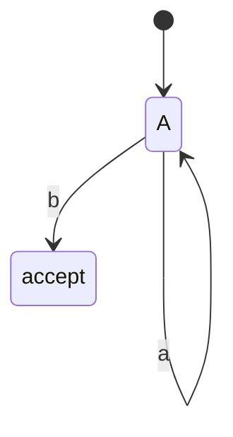

# 正则化技术原理与代码实战案例讲解

## 1.背景介绍

### 1.1 什么是正则表达式

正则表达式(Regular Expression)是一种用于匹配字符串模式的强大工具。它们是一种描述字符序列的紧凑语法,可用于执行复杂的搜索和文本操作。正则表达式广泛应用于文本处理、数据验证、模式匹配等各种场景。

### 1.2 正则表达式的重要性

随着数据量的激增和数据类型的多样化,对数据进行高效处理和分析变得至关重要。正则表达式作为一种通用的模式匹配工具,可以帮助我们快速、灵活地处理各种格式的数据,提高开发效率和代码质量。掌握正则表达式不仅是一个优秀程序员所必需的技能,也是提高工作效率的关键。

### 1.3 正则表达式的应用场景

- 数据验证:验证用户输入的格式是否符合要求,如电子邮件地址、IP地址等。
- 文本搜索和替换:在文本文件或网页中搜索和替换特定模式的文本。
- 数据提取:从结构化或半结构化数据(如日志文件、XML、HTML等)中提取特定信息。
- 数据清理:去除文本中的无用字符或格式化数据。
- 语言处理:对自然语言进行分词、词形还原等处理。

## 2.核心概念与联系

### 2.1 正则表达式语法

正则表达式使用一系列特殊字符和元字符来描述字符模式。常用的元字符包括:

- `.` 匹配任意单个字符(除了换行符)
- `\d` 匹配数字字符
- `\w` 匹配单词字符(字母、数字或下划线)
- `\s` 匹配空白字符
- `[]` 匹配括号内的任意单个字符
- `[^]` 匹配不在括号内的任意单个字符
- `*` 匹配前一个字符0次或多次
- `+` 匹配前一个字符1次或多次
- `?` 匹配前一个字符0次或1次
- `|` 或运算符,匹配模式的一部分
- `()` 捕获分组,将模式的一部分捕获为单独组

### 2.2 正则表达式引擎

正则表达式引擎是一种软件组件,用于解释和执行正则表达式模式。不同的编程语言和环境通常都内置了正则表达式引擎,如Java的`java.util.regex`包、Python的`re`模块、JavaScript的`RegExp`对象等。

正则表达式引擎通常采用有限状态自动机(Finite State Automaton)或反向最长匹配(Backward Longest Match)等算法来实现模式匹配。不同的引擎在性能、功能和语法上可能存在差异,因此在使用正则表达式时需要注意所使用语言或环境的具体实现。

### 2.3 贪婪匹配与非贪婪匹配

正则表达式引擎在进行模式匹配时,默认采用贪婪匹配(Greedy Match)策略。这意味着当有多个可能的匹配时,引擎会尽可能匹配最长的字符序列。

例如,对于模式`a.*b`,字符串`axxxbxxb`将匹配`axxxbxxb`而不是`axxxb`。

如果需要非贪婪匹配(Non-Greedy Match),可以在量词后加上`?`符号,如`.*?`、`+?`、`??`等。这将使引擎尽可能匹配最短的字符序列。

### 2.4 反向引用

反向引用(Back Reference)允许在正则表达式中重用已经匹配的子模式。通过在模式中使用`\n`(其中`n`是一个正整数),可以引用之前用括号`()`捕获的第`n`个分组。

例如,模式`\b(\w+)\s+\1\b`可以匹配重复的单词,如"hello hello"。其中`\1`引用了第一个捕获分组`(\w+)`中匹配的单词。

反向引用在查找重复模式、替换文本等场景中非常有用。

### 2.5 正则表达式与有限状态自动机

正则表达式与有限状态自动机(Finite State Automaton,FSA)密切相关。事实上,任何一个正则表达式都可以转换为一个等价的有限状态自动机,反之亦然。

有限状态自动机是一种数学模型,由有限个状态和转移规则组成。它可以接受一个字符串输入,并根据转移规则在状态之间进行转移,最终判断该字符串是否被接受。

正则表达式引擎通常会将正则表达式编译成有限状态自动机,然后使用该自动机进行模式匹配。这种方式不仅可以提高匹配效率,还可以处理一些复杂的模式匹配问题。

## 3.核心算法原理具体操作步骤

### 3.1 正则表达式的编译过程

正则表达式引擎在执行模式匹配之前,需要先将正则表达式编译成内部表示形式。这个过程通常包括以下几个步骤:

1. **词法分析(Lexical Analysis)**: 将正则表达式字符串分解成一个个token,如字符、元字符、量词等。

2. **语法分析(Syntax Analysis)**: 根据正则表达式的语法规则,构建语法树(Parse Tree)或抽象语法树(Abstract Syntax Tree,AST)。

3. **构建有限状态自动机(FSA)**: 根据语法树或AST,构建等价的非确定有限状态自动机(Non-deterministic Finite Automaton,NFA)。

4. **NFA到DFA的转换**: 将NFA转换为等价的确定有限状态自动机(Deterministic Finite Automaton,DFA),以提高匹配效率。

5. **优化DFA**: 对DFA进行优化,如状态合并、转移表压缩等,以减小内存占用和提高匹配速度。

经过上述步骤,正则表达式就被编译成了高效的内部表示形式,可以用于实际的模式匹配操作。

### 3.2 模式匹配算法

模式匹配是正则表达式引擎的核心功能。常见的模式匹配算法包括:

1. **NFA模拟**: 使用非确定有限状态自动机(NFA)进行模拟,对输入字符串进行状态转移,判断是否能到达接受状态。这种方法简单直观,但效率较低。

2. **DFA模拟**: 使用确定有限状态自动机(DFA)进行模拟,对输入字符串进行状态转移,判断是否能到达接受状态。DFA具有更高的效率,但构建和存储DFA需要更多内存。

3. **反向最长匹配(Backward Longest Match)**: 从输入字符串的末尾开始匹配,每次尝试匹配最长的可能模式。这种算法在处理贪婪匹配时非常高效。

4. **位并行模式匹配(Bit-Parallel Pattern Matching)**: 利用位运算的并行性,将模式和输入字符串编码为位向量,通过位运算实现高效匹配。这种算法在处理简单模式时表现出色。

不同的正则表达式引擎可能采用不同的算法组合,或者针对特定模式进行算法优化,以平衡匹配效率和内存占用。

### 3.3 回溯机制

在进行模式匹配时,正则表达式引擎可能需要进行回溯(Backtracking)操作。回溯是一种通过暂时放弃部分匹配结果,然后尝试其他可能的匹配路径,最终找到完全匹配的过程。

回溯通常发生在以下情况:

1. **模式包含选择分支**: 当模式包含`|`(或)运算符时,引擎需要尝试不同的分支。

2. **模式包含量词**: 当模式包含`*`、`+`或`?`等量词时,引擎需要尝试不同的重复次数。

3. **模式包含捕获分组**: 当模式包含捕获分组`()`时,引擎需要尝试不同的分组匹配。

4. **模式包含反向引用**: 当模式包含反向引用`\n`时,引擎需要确保引用的分组能够正确匹配。

回溯机制可以保证正则表达式引擎能够找到所有可能的匹配结果,但代价是会增加匹配时间和内存占用。因此,在编写复杂的正则表达式时,应该注意避免过度回溯,以提高匹配效率。

## 4.数学模型和公式详细讲解举例说明

正则表达式可以用形式语言理论中的数学模型来描述和分析。常见的数学模型包括有限状态自动机(Finite State Automaton,FSA)、正则语言(Regular Language)和正则表达式(Regular Expression)等。

### 4.1 有限状态自动机

有限状态自动机(FSA)是一种数学模型,由有限个状态和转移规则组成。它可以接受一个字符串输入,并根据转移规则在状态之间进行转移,最终判断该字符串是否被接受。

FSA可以分为两种类型:

1. **非确定有限状态自动机(Non-deterministic Finite Automaton,NFA)**: 在某些状态下,对于同一个输入符号,可能有多个转移规则。

2. **确定有限状态自动机(Deterministic Finite Automaton,DFA)**: 在任何状态下,对于同一个输入符号,只有一个转移规则。

一个NFA可以被转换为一个等价的DFA,反之亦然。DFA具有更高的匹配效率,因此正则表达式引擎通常会将正则表达式编译成DFA进行模式匹配。

FSA可以用一个五元组来表示:

$$
M = (Q, \Sigma, \delta, q_0, F)
$$

其中:

- $Q$ 是一个有限的状态集合
- $\Sigma$ 是一个有限的输入符号集合
- $\delta$ 是一个转移函数,定义了在给定状态和输入符号下,自动机将转移到哪个状态
- $q_0$ 是初始状态
- $F$ 是一个接受状态集合

FSA的工作原理如下:

1. 从初始状态 $q_0$ 开始
2. 读取输入字符串的第一个符号
3. 根据当前状态和输入符号,通过转移函数 $\delta$ 转移到下一个状态
4. 重复步骤2和3,直到输入字符串被读取完毕
5. 如果最终状态属于接受状态集合 $F$,则该字符串被接受;否则被拒绝

FSA可以用状态转移图(State Transition Diagram)来可视化表示。每个状态用圆圈表示,初始状态用一个指向它的箭头表示,接受状态用双圆圈表示。转移规则用带有输入符号的箭头表示。

例如,下面是一个匹配模式 `a*b` 的DFA状态转移图:

在这个DFA中,状态集合为 $Q = \{A, B\}$,输入符号集合为 $\Sigma = \{a, b\}$,初始状态为 $q_0 = A$,接受状态集合为 $F = \{B\}$。转移函数 $\delta$ 定义了从状态 A 读取 a 时保持在状态 A,读取 b 时转移到状态 B。只有当输入字符串以 b 结尾时,才会到达接受状态 B。

### 4.2 正则语言

正则语言(Regular Language)是一种形式语言,它可以被有限状态自动机识别和生成。换句话说,一个语言是正则语言,当且仅当存在一个有限状态自动机能够识别该语言中的所有字符串。

正则语言具有以下性质:

1. **闭包性质**: 正则语言对并集、连接和克林闭合(Kleene Closure)运算都是闭合的。
2. **泵浦引理(Pumping Lemma)**: 任何无限长的正则语言中,都存在一个足够长的字符串,可以被分解为由可重复部分和非重复部分组成的形式。

正则语言可以用正则表达式来描述和生成。事实上,正则表达式就是一种紧凑的正则语言表示形式。

### 4.3 正则表达式

正则表达式(Regular Expression)是一种用于描述字符串模式的紧凑语法。它们可以用来定义