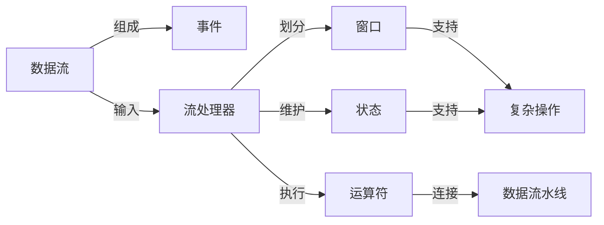

# 流处理 原理与代码实例讲解

## 1. 背景介绍

### 1.1 什么是流处理?

在当今数据密集型应用程序中,数据通常以连续不断的流形式到达,需要实时地进行处理和分析。传统的批处理系统无法满足这种实时性和低延迟的要求,因此流处理应运而生。流处理(Stream Processing)是一种软件paradigm,旨在持续、连续地处理无界数据流。

与批处理系统不同,流处理系统在接收到数据时立即对其进行处理,而无需等待整个数据集到达。这种实时处理能力对于诸如网络监控、物联网(IoT)设备数据分析、金融交易处理等应用场景至关重要。

### 1.2 流处理的特点

流处理系统具有以下几个关键特征:

1. **连续处理**: 数据被视为无界流,系统持续不断地接收和处理数据。
2. **实时性**: 数据在到达时立即进行处理,确保低延迟。
3. **有状态**: 流处理系统通常需要维护状态,以便对流数据进行复杂的操作。
4. **容错性**: 面对数据源故障、机器故障等异常情况,系统需要具备容错能力,确保数据处理的可靠性。
5. **可扩展性**: 随着数据量和吞吐量的增加,系统应该能够方便地进行扩展。

### 1.3 流处理与批处理的区别

与批处理系统相比,流处理系统具有以下主要区别:

1. **处理模型**: 批处理以有界数据集为输入,流处理以无界数据流为输入。
2. **延迟要求**: 批处理系统关注吞吐量,而流处理系统则需要实时低延迟处理。
3. **状态管理**: 批处理通常是无状态的,而流处理需要维护状态以支持复杂操作。
4. **容错机制**: 批处理可以通过重新运行作业来恢复,而流处理需要更复杂的容错机制。
5. **编程模型**: 批处理使用Map-Reduce等模型,流处理则采用窗口、增量迭代等模型。

## 2. 核心概念与联系

### 2.1 数据流

在流处理系统中,数据被视为一个无界的、连续的数据流(Data Stream)。每个数据流由一系列称为事件(Event)的数据记录组成。事件可以是各种格式,如日志条目、传感器读数、网络包等。

数据流具有以下几个关键特性:

1. **无界性(Unbounded)**: 数据流是无界的,理论上可以无限延续下去。
2. **连续性(Continuous)**: 数据流是连续不断的,新事件持续到达。
3. **有序性(Ordered)**: 大多数数据流是有序的,事件按照发生的时间顺序到达。

### 2.2 流处理器

流处理器(Stream Processor)是流处理系统的核心组件,负责对数据流进行转换和处理。流处理器通常由一个或多个运算符(Operator)组成,每个运算符执行特定的处理逻辑,如过滤、投影、聚合等。

运算符可以按照特定的拓扑结构连接在一起,形成数据流水线(Data Flow Pipeline)。事件在流水线中按顺序经过各个运算符的处理,最终生成期望的输出结果。

### 2.3 窗口

由于数据流是无界的,因此通常需要将其划分为有限的、可处理的块,这就是窗口(Window)的概念。窗口定义了一个有界的数据集,流处理器可以在这个数据集上执行计算操作。

常见的窗口类型包括:

1. **时间窗口(Time Window)**: 根据事件的时间戳划分窗口,如每5秒一个窗口。
2. **计数窗口(Count Window)**: 根据事件的数量划分窗口,如每1000个事件一个窗口。
3. **会话窗口(Session Window)**: 根据事件之间的间隔时间划分窗口,用于捕获会话式的活动。

窗口可以是固定大小的滚动窗口(Tumbling Window),也可以是重叠的滑动窗口(Sliding Window)。

### 2.4 状态管理

由于流处理系统需要处理无界数据流,因此通常需要维护状态(State)。状态可以是窗口聚合的中间结果、连接查询的哈希表等,用于支持复杂的流处理操作。

状态管理是流处理系统的一个关键挑战,需要确保状态的一致性、容错性和可扩展性。常见的状态管理策略包括:

1. **内存状态(In-Memory State)**: 将状态存储在内存中,提供最佳的性能,但面临容量和容错的挑战。
2. **外部状态(External State)**: 将状态存储在外部存储系统(如数据库)中,提高了容错能力和可扩展性,但牺牲了一定的性能。
3. **检查点(Checkpoint)**: 定期将状态持久化到存储系统,用于故障恢复。

### 2.5 核心概念关系

上述核心概念之间的关系如下所示:

数据流由一系列事件组成,作为流处理器的输入。流处理器通过划分窗口和维护状态,支持对数据流执行复杂的操作。这些操作由一系列连接的运算符组成的数据流水线来执行。

## 3. 核心算法原理具体操作步骤

### 3.1 流处理器执行流程

流处理器的核心执行流程如下:

1. **接收事件**: 流处理器从数据源(如消息队列、Kafka等)持续接收事件。
2. **分发事件**: 将接收到的事件分发到相应的运算符实例。
3. **执行运算符逻辑**: 每个运算符实例执行自身的处理逻辑,如过滤、投影、聚合等。
4. **传递结果**: 运算符实例将处理结果传递给下游运算符实例或输出系统。
5. **管理状态**: 根据需要,运算符实例维护和更新相关的状态。
6. **容错恢复**: 在发生故障时,流处理器利用检查点和重播机制进行恢复。

### 3.2 窗口操作算法

窗口操作是流处理系统中的一个核心算法,用于将无界数据流划分为有限的数据集,以便进行聚合、连接等操作。常见的窗口操作算法包括:

1. **滚动窗口(Tumbling Window)算法**:
   - 将数据流划分为固定大小、不重叠的窗口。
   - 每个窗口包含一定时间段或事件数量的数据。
   - 适用于需要对固定时间段或事件数量进行聚合的场景。

2. **滑动窗口(Sliding Window)算法**:
   - 将数据流划分为固定大小、重叠的窗口。
   - 窗口按照固定的时间或事件数量滑动。
   - 适用于需要对连续时间段或事件进行聚合的场景。

3. **会话窗口(Session Window)算法**:
   - 根据事件之间的时间间隔划分窗口。
   - 如果两个事件之间的时间间隔超过阈值,则属于不同的会话窗口。
   - 适用于需要捕获会话式活动的场景,如用户浏览网站。

这些算法通常由流处理器的运算符实现,并与状态管理机制结合使用,以支持高效的窗口操作。

### 3.3 状态管理算法

由于流处理系统需要处理无界数据流,因此通常需要维护状态。常见的状态管理算法包括:

1. **键控状态(Keyed State)算法**:
   - 将状态划分为多个键控状态实例。
   - 每个键控状态实例与一个键(Key)相关联,用于存储该键对应的状态数据。
   - 适用于需要对不同键维护不同状态的场景,如窗口聚合、连接查询等。

2. **增量迭代(Incremental Iteration)算法**:
   - 将状态视为一系列增量更新的结果。
   - 每次接收到新事件时,根据事件更新状态。
   - 适用于需要持续更新状态的场景,如机器学习模型训练、图计算等。

3. **检查点(Checkpoint)算法**:
   - 定期将状态持久化到外部存储系统中。
   - 在发生故障时,可以从最近的检查点恢复状态。
   - 适用于需要确保状态一致性和容错性的场景。

这些算法通常由流处理器的运行时系统实现,并与窗口操作算法结合使用,以支持高效、可靠的流处理。

## 4. 数学模型和公式详细讲解举例说明

在流处理系统中,常常需要对数据流进行聚合和统计操作。这些操作通常可以用数学模型和公式来描述和计算。以下是一些常见的数学模型和公式,以及它们在流处理中的应用。

### 4.1 滑动窗口聚合

滑动窗口聚合是流处理中一种常见的操作,用于对最近的一段时间或一定数量的事件进行聚合计算。例如,计算过去5分钟内的点击量。

设定一个大小为 $n$ 的滑动窗口,窗口中包含最近的 $n$ 个事件 $\{e_1, e_2, \ldots, e_n\}$。对于一个聚合函数 $f$,滑动窗口聚合的计算公式为:

$$
y_t = f(e_{t-n+1}, e_{t-n+2}, \ldots, e_t)
$$

其中 $y_t$ 是时间 $t$ 时的聚合结果。

常见的聚合函数包括求和、计数、平均值等。例如,对于求和聚合,函数 $f$ 可以定义为:

$$
f(e_1, e_2, \ldots, e_n) = \sum_{i=1}^{n} v_i
$$

其中 $v_i$ 是事件 $e_i$ 的值。

### 4.2 会话窗口聚合

会话窗口聚合用于捕获会话式的活动,例如用户浏览网站的行为。会话窗口根据事件之间的时间间隔来划分,如果两个事件之间的时间间隔超过一个阈值,则认为属于不同的会话。

设定一个时间间隔阈值 $\delta$,对于一个事件序列 $\{e_1, e_2, \ldots, e_n\}$,如果 $t(e_{i+1}) - t(e_i) \leq \delta$,则 $e_i$ 和 $e_{i+1}$ 属于同一个会话窗口。

对于一个会话窗口 $W = \{e_j, e_{j+1}, \ldots, e_k\}$,聚合函数 $f$ 的计算公式为:

$$
y_W = f(e_j, e_{j+1}, \ldots, e_k)
$$

其中 $y_W$ 是会话窗口 $W$ 的聚合结果。

### 4.3 连接查询

连接查询是流处理中另一种常见的操作,用于将两个数据流进行关联。例如,将用户浏览记录与用户信息进行关联,以获取更多上下文信息。

设有两个数据流 $S_1$ 和 $S_2$,它们分别包含事件序列 $\{e_1^1, e_2^1, \ldots\}$ 和 $\{e_1^2, e_2^2, \ldots\}$。连接查询的目标是找到满足连接条件 $\theta$ 的事件对 $(e_i^1, e_j^2)$。

对于一个连接条件 $\theta$,连接查询的结果可以表示为:

$$
R = \{(e_i^1, e_j^2) | e_i^1 \in S_1, e_j^2 \in S_2, \theta(e_i^1, e_j^2)\}
$$

其中 $R$ 是满足连接条件的事件对集合。

常见的连接条件包括相等连接、时间窗口连接等。例如,对于时间窗口连接,条件 $\theta$ 可以定义为