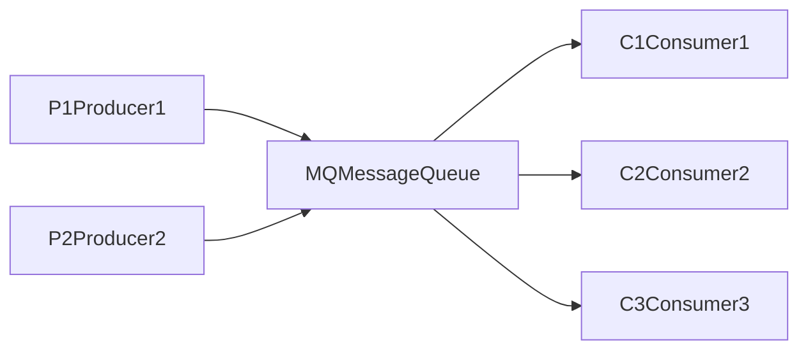

# 消息队列 原理与代码实例讲解

## 1. 背景介绍

### 1.1 消息队列概述

消息队列(Message Queue)，简称MQ，是一种在分布式系统中广泛使用的异步通信机制。它充当消息的中间件，允许发送方将消息发送到队列中，接收方从队列中获取消息并进行处理。这种模式可以解耦发送方和接收方，提高系统的可伸缩性、可靠性和性能。

### 1.2 消息队列的应用场景

消息队列在现代软件系统中有着广泛的应用，常见的场景包括：

1. 异步处理：将耗时的任务放入消息队列，实现异步处理，提高系统响应速度。
2. 应用解耦：通过消息队列将不同的应用组件解耦，降低系统的耦合度。
3. 流量削峰：在高并发场景下，使用消息队列缓冲请求，避免系统过载。
4. 日志处理：将日志消息发送到消息队列，实现日志的集中处理和存储。
5. 事件通知：通过消息队列实现事件的发布和订阅，实现系统间的通信。

### 1.3 常见的消息队列产品

目前市面上有许多成熟的消息队列产品，包括：

- Apache Kafka：分布式的发布-订阅消息系统，具有高吞吐量和可扩展性。
- RabbitMQ：基于AMQP协议的开源消息队列系统，支持多种消息路由方式。
- Apache ActiveMQ：基于JMS规范的开源消息队列，提供可靠的消息传递。
- Amazon SQS：亚马逊提供的完全托管的消息队列服务，具有高可用性和可扩展性。
- Redis：虽然Redis主要用作缓存和数据存储，但也可以用作简单的消息队列。

## 2. 核心概念与联系

### 2.1 生产者(Producer)

生产者是消息的发送方，负责将消息发送到消息队列中。生产者通过与消息队列建立连接，然后将消息发送到指定的队列或主题(Topic)中。

### 2.2 消费者(Consumer)

消费者是消息的接收方，负责从消息队列中获取消息并进行处理。消费者通过与消息队列建立连接，然后订阅感兴趣的队列或主题，并不断地从队列中获取消息进行消费。

### 2.3 消息(Message)

消息是在生产者和消费者之间传递的数据单元。消息通常包含一些元数据，如消息ID、时间戳等，以及实际的消息内容。消息内容可以是任意的数据格式，如文本、JSON、二进制等。

### 2.4 队列(Queue)

队列是消息的容器，用于存储生产者发送的消息，直到消费者获取并处理这些消息。队列通常遵循先进先出(FIFO)的原则，即先发送的消息会先被消费。

### 2.5 主题(Topic)

主题是一种消息的分类机制，允许生产者将消息发送到特定的主题，而消费者可以订阅感兴趣的主题并接收相应的消息。主题支持一对多的消息分发，即一个生产者发送的消息可以被多个消费者接收。

### 2.6 消息持久化

消息持久化是指将消息存储到磁盘或其他持久化存储中，以确保在系统故障或重启时消息不会丢失。消息队列通常支持不同级别的持久化，如内存存储、磁盘存储等，以满足不同的可靠性要求。

### 2.7 消息确认(Acknowledgement)

消息确认是消费者在成功处理完消息后向消息队列发送确认的机制。这样可以确保消息被正确地处理，避免消息的重复消费或丢失。常见的确认模式有自动确认和手动确认。

### 2.8 消息队列的架构

下面是一个简单的消息队列架构示意图，展示了生产者、消费者和消息队列之间的关系：



在这个架构中，多个生产者将消息发送到消息队列，消息队列将消息存储并分发给多个消费者进行处理。

## 3. 核心算法原理具体操作步骤

### 3.1 生产者发送消息

1. 生产者与消息队列建立连接。
2. 生产者创建消息，并设置消息的属性，如消息体、消息头等。
3. 生产者将消息发送到指定的队列或主题。
4. 消息队列接收消息并将其存储。
5. 生产者关闭与消息队列的连接。

### 3.2 消费者消费消息

1. 消费者与消息队列建立连接。
2. 消费者订阅感兴趣的队列或主题。
3. 消费者从消息队列中获取消息。
4. 消费者处理接收到的消息。
5. 消费者向消息队列发送消息确认(如果需要)。
6. 消费者关闭与消息队列的连接。

### 3.3 消息队列的调度和分发

1. 消息队列接收生产者发送的消息。
2. 消息队列将消息存储到相应的队列或主题中。
3. 消息队列根据消费者的订阅关系，将消息分发给相应的消费者。
4. 消息队列等待消费者的消息确认(如果需要)。
5. 消息队列在收到消费者的确认后，将消息标记为已消费或删除。

## 4. 数学模型和公式详细讲解举例说明

### 4.1 生产者发送消息的数学模型

假设生产者以固定的速率 $\lambda$ 发送消息，那么在时间 $t$ 内发送的消息数量 $N(t)$ 可以用泊松分布来建模：

$$P(N(t)=k) = \frac{(\lambda t)^k e^{-\lambda t}}{k!}$$

其中，$k$ 表示在时间 $t$ 内发送的消息数量。

举例说明：如果生产者每秒发送 10 条消息($\lambda=10$)，那么在 1 秒内发送 5 条消息的概率为：

$$P(N(1)=5) = \frac{(10 \times 1)^5 e^{-10 \times 1}}{5!} \approx 0.0378$$

### 4.2 消息队列的排队模型

消息队列可以看作是一个排队系统，可以用排队论中的 M/M/1 模型来建模。在该模型中，消息到达率为 $\lambda$，服务率为 $\mu$，那么系统的平均队列长度 $L$ 可以表示为：

$$L = \frac{\rho}{1-\rho}$$

其中，$\rho = \frac{\lambda}{\mu}$ 表示系统的利用率。

举例说明：如果消息到达率为 10 条/秒($\lambda=10$)，服务率为 20 条/秒($\mu=20$)，那么系统的平均队列长度为：

$$L = \frac{10/20}{1-10/20} = 1$$

这意味着在稳定状态下，消息队列中平均有 1 条消息在等待处理。

## 5. 项目实践：代码实例和详细解释说明

下面是一个使用 Python 和 RabbitMQ 实现简单消息队列的代码示例：

### 5.1 生产者代码

```python
import pika

# 建立与RabbitMQ的连接
connection = pika.BlockingConnection(pika.ConnectionParameters('localhost'))
channel = connection.channel()

# 声明一个名为 "hello" 的队列
channel.queue_declare(queue='hello')

# 发送消息到队列
channel.basic_publish(exchange='', routing_key='hello', body='Hello, World!')
print(" [x] Sent 'Hello, World!'")

# 关闭连接
connection.close()
```

代码解释：
1. 导入 `pika` 库，用于与 RabbitMQ 进行交互。
2. 使用 `pika.BlockingConnection` 建立与 RabbitMQ 的连接。
3. 通过 `connection.channel()` 创建一个信道(Channel)。
4. 使用 `channel.queue_declare` 声明一个名为 "hello" 的队列。
5. 使用 `channel.basic_publish` 将消息发送到 "hello" 队列。
6. 关闭与 RabbitMQ 的连接。

### 5.2 消费者代码

```python
import pika

# 建立与RabbitMQ的连接
connection = pika.BlockingConnection(pika.ConnectionParameters('localhost'))
channel = connection.channel()

# 声明一个名为 "hello" 的队列
channel.queue_declare(queue='hello')

# 定义回调函数，用于处理接收到的消息
def callback(ch, method, properties, body):
    print(" [x] Received %r" % body)

# 设置消费者订阅 "hello" 队列，并指定回调函数
channel.basic_consume(queue='hello', on_message_callback=callback, auto_ack=True)

print(' [*] Waiting for messages. To exit press CTRL+C')

# 开始消费消息
channel.start_consuming()
```

代码解释：
1. 导入 `pika` 库，用于与 RabbitMQ 进行交互。
2. 使用 `pika.BlockingConnection` 建立与 RabbitMQ 的连接。
3. 通过 `connection.channel()` 创建一个信道(Channel)。
4. 使用 `channel.queue_declare` 声明一个名为 "hello" 的队列。
5. 定义回调函数 `callback`，用于处理接收到的消息。
6. 使用 `channel.basic_consume` 设置消费者订阅 "hello" 队列，并指定回调函数。
7. 使用 `channel.start_consuming()` 开始消费消息。

通过运行生产者代码，可以将消息发送到 RabbitMQ 的 "hello" 队列中。然后运行消费者代码，消费者会从 "hello" 队列中获取消息并使用回调函数进行处理。

## 6. 实际应用场景

消息队列在实际应用中有着广泛的应用场景，下面列举几个常见的例子：

### 6.1 电商系统中的订单处理

在电商系统中，当用户下单后，可以将订单信息发送到消息队列中。然后，不同的服务（如库存服务、支付服务、物流服务等）可以从消息队列中获取订单信息并进行相应的处理。这样可以实现订单的异步处理，提高系统的响应速度和可扩展性。

### 6.2 日志收集和分析

在分布式系统中，可以将不同服务产生的日志消息发送到消息队列中。然后，专门的日志处理服务可以从消息队列中获取日志消息，对其进行集中的存储和分析。这样可以方便地进行日志的收集、查询和监控。

### 6.3 社交网络中的消息推送

在社交网络应用中，当用户发布新的动态或消息时，可以将这些消息发送到消息队列中。然后，其他用户的客户端可以从消息队列中获取这些消息，并实时地推送给用户，实现实时的消息同步和交互。

### 6.4 分布式任务调度

在分布式系统中，可以将任务信息发送到消息队列中，然后由不同的工作节点从消息队列中获取任务并执行。这样可以实现任务的分布式调度和负载均衡，提高系统的并发处理能力和可伸缩性。

## 7. 工具和资源推荐

以下是一些常用的消息队列相关的工具和资源：

1. RabbitMQ：开源的消息队列系统，支持多种消息路由方式和可靠性保证。
   官网：https://www.rabbitmq.com/

2. Apache Kafka：分布式的发布-订阅消息系统，具有高吞吐量和可扩展性。
   官网：https://kafka.apache.org/

3. Apache ActiveMQ：基于 JMS 规范的开源消息队列，提供可靠的消息传递。
   官网：https://activemq.apache.org/

4. Amazon SQS：亚马逊提供的完全托管的消息队列服务，具有高可用性和可扩展性。
   官网：https://aws.amazon.com/sqs/

5. Redis：虽然 Redis 主要用作缓存和数据存储，但也可以用作简单的消息队列。
   官网：https://redis.io/

6. ZeroMQ：轻量级的消息队列库，提供了多种消息传递模式和语言绑定。
   官网：https://zeromq.